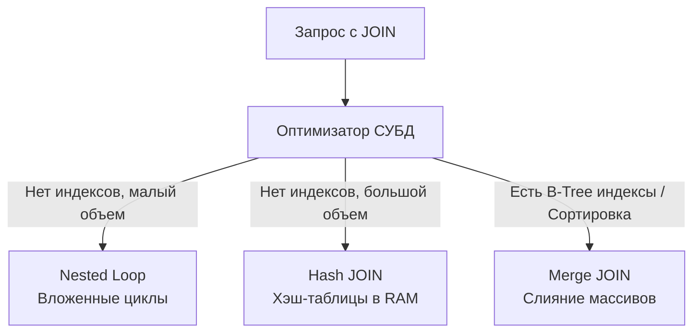

## Декартово проклятие: Почему базы данных нормализуют

В идеальном мире мы хранили бы все данные приложения в одной гигантской таблице. Но из-за аномалий изменения данных и избыточного расхода дискового пространства мы разбиваем данные на изолированные сущности (об этом мы подробнее поговорим в подразделе про нормализацию). 

**JOIN (Соединение)** — это операция реляционной алгебры, которая собирает разорванные нормализацией данные обратно воедино, чтобы отдать их бэкенду. 

> [!info] Под капотом: Декартово произведение (Cartesian Product)
> Фундаментально любой `JOIN` начинается с `CROSS JOIN` (Декартова произведения). Если в таблице A 1000 строк, а в таблице B 2000 строк, их математическое произведение — это таблица на 2 000 000 строк, где каждая строка A соединена с каждой строкой B. 
> Операция `ON` (предикат соединения) — это просто фильтр `WHERE`, который применяется к этому двухмиллионному виртуальному монстру, отсекая все строки, где ключи не совпали. Конечно, оптимизаторы СУБД достаточно умны, чтобы не материализовать все 2 миллиона строк в памяти, но понимание этой математической природы крайне важно для оценки сложности.

---

## Анатомия соединений: INNER, LEFT и RIGHT

В интернете часто объясняют JOIN'ы через диаграммы Эйлера-Венна (пересекающиеся круги). Для бэкенд-инженера это **вредная аналогия**, так как она описывает операции над множествами (`UNION`, `INTERSECT`), а не умножение кортежей. Мысля кругами, невозможно понять дублирование строк при связях «Один ко многим» (One-to-Many).

### 1. INNER JOIN (Внутреннее соединение)
Оставляет только те строки, для которых нашлась пара в обеих таблицах. Если у пользователя нет заказов, он исчезнет из итоговой выборки.

```sql
SELECT u.id, u.email, o.amount
FROM users u
INNER JOIN orders o ON u.id = o.user_id;
```

### 2. LEFT JOIN (Левое внешнее соединение)
Гарантирует, что **все** строки из «левой» таблицы (той, что указана первой после `FROM`) попадут в результат. Если для строки слева не нашлось пары справа, база данных всё равно вернет левую строку, а на месте колонок правой таблицы подставит `NULL`.

```sql
SELECT u.id, u.email, o.amount
FROM users u
LEFT JOIN orders o ON u.id = o.user_id;
```

> [!tip] Собеседование: RIGHT JOIN
> **Вопрос:** В чем разница между `LEFT JOIN` и `RIGHT JOIN` и когда следует использовать второй?
> **Ответ:** Разницы в механике выполнения нет никакой. `A RIGHT JOIN B` — это абсолютно то же самое, что `B LEFT JOIN A`. Оптимизатор СУБД строит для них идентичные планы выполнения. В production-коде (Idiomatic SQL) использование `RIGHT JOIN` считается дурным тоном, так как оно ломает привычный порядок чтения запроса слева направо. Используйте только `LEFT JOIN`.

---

## Mechanical Sympathy: Алгоритмы выполнения JOIN

Когда оптимизатор базы данных видит JOIN, он должен решить, **как физически** процессор будет искать совпадения. Это критически важное знание, которое мы расширим в статье [[14. Оптимизация JOIN]], но базу нужно заложить здесь.



### 1. Nested Loop (Вложенные циклы)
Самый примитивный алгоритм. СУБД берет первую строку из левой таблицы и сканирует всю правую таблицу в поисках совпадений. Затем берет вторую строку и снова сканирует правую. 
Сложность: **O(N * M)**. Без индексов это убьет процессор БД (CPU Bound).
*Исключение:* **Index Nested Loop**. Если на правой таблице есть индекс по колонке соединения (например, `o.user_id`), сложность падает до **O(N * log M)**, что является самым быстрым способом соединения небольших выборок.

### 2. Hash Join (Хеширование)
Если СУБД нужно соединить две большие таблицы без индексов, Nested Loop займет годы. Вместо этого база данных берет меньшую таблицу и строит в оперативной памяти (в `work_mem`) хеш-таблицу, где ключ — это колонка соединения (`user_id`). Затем она сканирует большую таблицу один раз, за `O(1)` проверяя каждую строку в хеш-таблице.
Сложность: **O(N + M)**. Выигрываем CPU, жертвуем RAM.

### 3. Merge Join (Слияние)
Если обе таблицы уже отсортированы по колонке соединения (например, СУБД читает их напрямую из B-Tree индексов), процессор может просто идти по двум спискам параллельно, как при застегивании молнии.
Сложность: **O(N + M)**, практически без затрат RAM. Самый эффективный алгоритм для огромных объемов данных.

---

## Фатальные ловушки разработчиков (Gotchas)

### Ловушка 1: Непреднамеренный INNER JOIN
Это самая частая ошибка, из-за которой падают баги на проде. Разработчик хочет получить всех пользователей с их активными заказами.

**❌ Ошибка: Условие в WHERE**
```sql
SELECT u.email, o.amount 
FROM users u
LEFT JOIN orders o ON u.id = o.user_id
WHERE o.status = 'active'; 
```
*Что произойдет:* Если у пользователя нет заказов, `LEFT JOIN` сгенерирует для `o.status` значение `NULL`. Фаза `WHERE` выполняется **после** фазы соединения. Проверка `NULL = 'active'` выдаст `UNKNOWN` (по правилам трехзначной логики, см. [[12. Работа с NULL в SQL]]), и строка пользователя будет отброшена. Ваш `LEFT JOIN` деградировал в `INNER JOIN`.

**✅ Правильно: Условие в ON**
```sql
SELECT u.email, o.amount 
FROM users u
LEFT JOIN orders o ON u.id = o.user_id AND o.status = 'active';
```
Условие в `ON` фильтрует только правую таблицу *до* или *в момент* присоединения. Пользователи без активных заказов останутся в выборке, а их заказные колонки будут `NULL`.

---

### Ловушка 2: Дублирование данных (Data Bloat) и Сеть

Если вы делаете связь `1:M` (Один ко многим), где у одного пользователя 1000 заказов:

```sql
SELECT u.id, u.email, u.avatar_url, o.id, o.amount
FROM users u
INNER JOIN orders o ON u.id = o.user_id;
```

СУБД возвращает плоскую таблицу (flat tabular data). Данные пользователя (`email`, тяжелый `avatar_url`) будут **продублированы по сети 1000 раз** для каждого заказа. 
Вы забиваете пропускную способность сети (Network IO) и заставляете рантайм Go аллоцировать мегабайты избыточных строк в куче (Heap), нагружая Garbage Collector. В высоконагруженных системах часто выгоднее сделать два отдельных запроса (один для пользователей, второй для заказов через `IN (...)`), чем тянуть раздутый JOIN.

---

## JOIN в контексте Go

Драйвер `database/sql` не умеет автоматически складывать плоские SQL-ответы во вложенные Go-структуры. Вы должны агрегировать их вручную в памяти.

```go
// Структуры
type Order struct { ID int64; Amount float64 }
type User struct { 
    ID     int64
    Email  string
    Orders []Order // Вложенность
}

// Запрос вернет дублирующихся пользователей
query := `
    SELECT u.id, u.email, o.id, o.amount
    FROM users u
    LEFT JOIN orders o ON u.id = o.user_id
`
rows, _ := db.QueryContext(ctx, query)
defer rows.Close()

// Мапа для агрегации "Один ко многим"
usersMap := make(map[int64]*User)

for rows.Next() {
    var uID int64
    var uEmail string
    // Используем sql.NullInt64, так как из-за LEFT JOIN заказа может не быть
    var oID sql.NullInt64 
    var oAmount sql.NullFloat64

    _ = rows.Scan(&uID, &uEmail, &oID, &oAmount)

    user, exists := usersMap[uID]
    if !exists {
        user = &User{ID: uID, Email: uEmail, Orders: make([]Order, 0)}
        usersMap[uID] = user
    }

    // Если заказ есть, добавляем в срез
    if oID.Valid {
        user.Orders = append(user.Orders, Order{
            ID:     oID.Int64, 
            Amount: oAmount.Float64,
        })
    }
}
```

> [!info] Под капотом: ORM и N+1
> Большинство ORM (например, GORM в Go) пытаются скрыть от вас эту рутину. Однако, если неправильно настроить подгрузку связей (Eager Loading), ORM вместо одного JOIN сгенерирует 1 запрос для получения пользователей, а затем N дополнительных запросов в цикле для получения заказов каждого пользователя. Это убивает производительность на уровне Network IO и известно как [[13. N+1 проблема]].

## Итог

1. **JOIN** — это механизм рекомбинации нормализованных данных, основанный на Декартовом произведении.
2. Используйте `INNER` для строгого пересечения и `LEFT` для сохранения ведущей сущности. `RIGHT JOIN` следует избегать для чистоты кода.
3. Понимание того, как БД выполняет соединение (Nested Loop, Hash, Merge), критично для написания производительных запросов. Индекс по `Foreign Key` — абсолютная необходимость.
4. Остерегайтесь переноса условий из `ON` в `WHERE` при `LEFT JOIN`.
5. Помните про сетевой оверхед (дублирование данных родительской строки) при JOIN'е связи "Один ко Многим".

Иногда нам не нужно вытаскивать все строки связанных таблиц на бэкенд. Часто нас интересует только сумма заказов или их количество. В таком случае работу по агрегации нужно делегировать самой базе данных. О том, как это работает, мы поговорим в следующей статье: [[7. GROUP BY и агрегатные функции]].