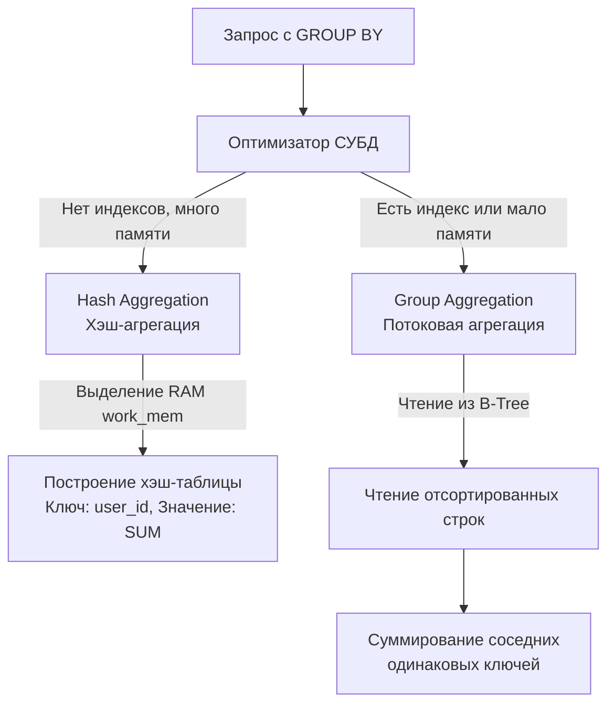

## Редукция данных: Почему мы не считаем суммы в цикле

В предыдущих статьях мы извлекали сырые кортежи данных. Однако бизнесу редко нужны сырые логи всех транзакций — ему нужны метрики: общая выручка за день, количество активных пользователей, средний чек.

С точки зрения начинающего разработчика, логично сделать `SELECT amount FROM orders WHERE status = 'paid'`, загрузить миллион строк в слайс `[]float64` на бэкенде в Go и просуммировать их в цикле `for`. 

**Mechanical Sympathy:** Это архитектурное преступление.
1. **Network I/O:** Вы сериализуете, передаете по TCP и десериализуете сотни мегабайт данных вместо восьми байт (одного `int64` или `float64`).
2. **Memory & GC:** Рантайм Go вынужден аллоцировать гигантский слайс в куче (Heap). После суммирования эти данные становятся мусором, провоцируя тяжелые циклы Garbage Collector (Stop-The-World паузы или высокую нагрузку на CPU в фазе Mark).

Реляционные базы данных математически спроектированы для агрегации. Операции **редукции (свертки)** множества строк в одно скалярное значение должны выполняться максимально близко к диску — на сервере СУБД.

## Базовые агрегатные функции

SQL предоставляет набор стандартных функций для редукции:
* `COUNT()` — подсчет количества строк.
* `SUM()` — сумма значений.
* `AVG()` — среднее арифметическое.
* `MIN()` / `MAX()` — минимальное и максимальное значения.

> [!warning] Ловушка / Gotcha: COUNT(*) vs COUNT(column)
> На Middle-собеседованиях часто просят объяснить разницу между `COUNT(*)` и `COUNT(email)`.
> * `COUNT(*)` (или `COUNT(1)`) подсчитывает **физическое количество строк** в таблице или группе, которые подошли под условие `WHERE`.
> * `COUNT(email)` подсчитывает количество строк, в которых колонка `email` **НЕ РАВНА `NULL`**. 
> Если вы хотите узнать общее количество пользователей, используйте `COUNT(*)`. Использование `COUNT(id)` (даже если `id` это Primary Key) заставляет некоторые СУБД лишний раз проверять значение на `NULL`, что может немного (хоть и не критично в современных оптимизаторах) замедлить выполнение.

## Механика GROUP BY

Агрегатные функции сами по себе сворачивают всю таблицу в одну строку. Если нам нужна агрегация по категориям (например, "сумма заказов по каждому пользователю"), используется оператор `GROUP BY`.

```sql
SELECT 
    user_id, 
    COUNT(*) AS orders_count,
    SUM(amount) AS total_spent
FROM orders
WHERE status = 'paid'
GROUP BY user_id;
```

### Железное правило SQL
Любая колонка, указанная в блоке `SELECT`, должна либо находиться внутри агрегатной функции (`SUM`, `MAX`), либо быть явно перечислена в блоке `GROUP BY`. 

СУБД физически не может вернуть колонку `created_at` в запросе выше, так как в одну группу (один `user_id`) свернуто 10 разных заказов с 10 разными датами. База не знает, какую именно из 10 дат вам отдать. 
*(Историческая справка: старые версии MySQL позволяли нарушать это правило, возвращая случайную дату из группы, что приводило к катастрофическим плавающим багам. Сейчас это запрещено флагом `ONLY_FULL_GROUP_BY`).*

---

## Под капотом: Алгоритмы агрегации (HashAgg vs SortAgg)

Когда оптимизатор (см. [[11. Cost based optimizer]]) видит конструкцию `GROUP BY`, он должен выбрать физический алгоритм группировки. Понимание этих алгоритмов критично для чтения [[10. План выполнения запроса. EXPLAIN]].



### 1. Hash Aggregation (Хэш-агрегация)
СУБД читает строки (Sequential Scan) и строит в оперативной памяти хэш-таблицу. Ключом выступает колонка из `GROUP BY` (например, `user_id`), а значением — промежуточный аккумулятор (текущая сумма и счетчик).
* **Плюсы:** Работает за `O(N)`. Очень быстро для несортированных данных.
* **Минусы:** Требует много оперативной памяти. Если количество уникальных групп (Cardinality) огромно и хэш-таблица не влезает в `work_mem`, СУБД начнет сбрасывать куски хэш-таблицы на медленный диск (Spill to Disk), что убьет производительность.

### 2. Stream / Group Aggregation (Потоковая агрегация с сортировкой)
Если данные уже отсортированы по колонке группировки (например, мы читаем их через B-Tree индекс) или если СУБД решает предварительно их отсортировать, применяется потоковая агрегация.
СУБД читает строки одну за другой. Пока идет один и тот же `user_id`, она суммирует `amount`. Как только `user_id` меняется, база отдает готовую сумму и сбрасывает счетчик для нового пользователя.
* **Плюсы:** Потребляет константное `O(1)` количество оперативной памяти.
* **Минусы:** Если данные не отсортированы (нет индекса), предварительная сортировка займет `O(N log N)`, что может быть дороже построения хэш-таблицы.

---

## Go Idioms: Опасность пустого SUM()

При маппинге результатов агрегации в Go разработчики часто попадают в ловушку трехзначной логики и `NULL`.

Рассмотрим функцию получения общей суммы трат пользователя:

```go
func GetTotalSpent(ctx context.Context, db *sql.DB, userID int64) (float64, error) {
    query := `SELECT SUM(amount) FROM orders WHERE user_id = $1 AND status = 'paid'`
    
    var total float64
    err := db.QueryRowContext(ctx, query, userID).Scan(&total)
    // ... обработка ошибок
}
```

> [!warning] Ловушка / Gotcha: SUM() над пустым множеством
> Если у пользователя **нет** оплаченных заказов, условие `WHERE` отфильтрует все строки. Что вернет агрегатная функция `SUM()` по пустому множеству?
> Многие думают, что вернется `0`. **Нет, SQL вернет `NULL`.**
> В Go попытка выполнить `.Scan(&total)` (где `total` это `float64`) для значения `NULL` приведет к ошибке: `sql: Scan error on column index 0, name "sum": converting NULL to float64 is unsupported`.

**✅ Как решать (Два подхода):**

1. **Решение на стороне БД (Рекомендуемое):** Использовать функцию `COALESCE`, которая вернет первый не-NULL аргумент. Это перекладывает логику дефолтных значений на СУБД.
   ```sql
   SELECT COALESCE(SUM(amount), 0) FROM orders WHERE user_id = $1;
   ```
2. **Решение на стороне Go:** Использовать типы, поддерживающие `NULL` из пакета `database/sql`.
   ```go
   var total sql.NullFloat64
   err := db.QueryRowContext(ctx, query, userID).Scan(&total)
   if err != nil { return 0, err }
   if total.Valid { return total.Float64, nil }
   return 0, nil // Если NULL, возвращаем 0
   ```
Подробнее работу с неизвестными состояниями мы разберем в статье [[12. Работа с NULL в SQL]].

## Итог

1. **Агрегация** спасает Network I/O и память бэкенда. Никогда не гоняйте сырые данные по сети, чтобы посчитать сумму или среднее в Go.
2. `COUNT(*)` считает строки физически, `COUNT(col)` игнорирует `NULL` значения в колонке.
3. Понимание разницы между **HashAgg** и **GroupAgg** помогает проектировать индексы. Если `work_mem` на сервере БД мал, а групп много, HashAgg деградирует в дисковые операции.
4. Помните, что `SUM()` и `AVG()` над пустыми результатами возвращают `NULL`, что требует явной обработки через `COALESCE` или `sql.NullFloat64` в Go.

Агрегация сворачивает данные в группы, но что если нам нужно отфильтровать уже сгруппированные результаты? (Например, найти только тех пользователей, у которых `SUM(amount) > 1000`). `WHERE` здесь не поможет, так как он выполняется *до* агрегации. Для этого существует специальный оператор, который мы разберем в следующей статье: [[8. HAVING]].