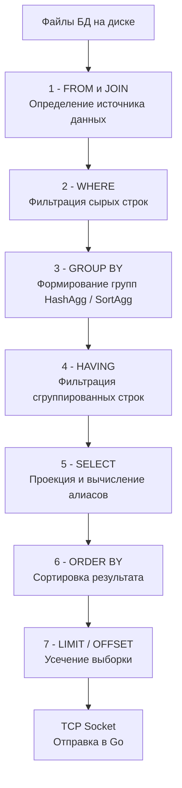

## Парадокс фильтрации: Как отсеять то, чего еще нет

В статье [[7. GROUP BY и агрегатные функции]] мы научились сворачивать миллионы строк в компактные агрегаты. Но что, если бизнес-задача звучит так: *"Найди всех пользователей, у которых общая сумма оплаченных заказов превышает 100 000 рублей"*?

Первая мысль начинающего разработчика — использовать знакомый оператор из статьи [[3. WHERE и фильтрация]]:
```sql
-- ❌ ОШИБКА: СУБД вернет синтаксическую ошибку
SELECT user_id, SUM(amount)
FROM orders
WHERE SUM(amount) > 100000
GROUP BY user_id;
```

Эта ошибка обнажает фундаментальный принцип работы реляционных БД: **Порядок выполнения (Order of Execution)**. СУБД физически не может отфильтровать строки по `SUM(amount)` на этапе `WHERE`, потому что в этот момент сумма еще не вычислена! Агрегация происходит *после* первичной фильтрации.

Для решения этой проблемы стандарт SQL вводит оператор `HAVING` — фильтр, который применяется к уже сгруппированным данным.

```sql
-- ✅ ВЕРНО
SELECT user_id, SUM(amount) AS total_spent
FROM orders
WHERE status = 'paid'
GROUP BY user_id
HAVING SUM(amount) > 100000;
```

---

## Жизненный цикл запроса: Конвейер СУБД

Чтобы писать предсказуемый и быстрый код, вы обязаны понимать, в каком порядке база данных обрабатывает узлы AST (синтаксического дерева). Это классический вопрос на Middle+/Senior собеседованиях.

Порядок написания запроса (Lexical Order) отличается от порядка его физического выполнения (Logical Order).



### Почему нельзя использовать алиасы в HAVING?

> [!warning] Ловушка / Gotcha: Алиасы
> В запросе выше мы создали алиас `total_spent`. Интуитивно хочется написать `HAVING total_spent > 100000`. 
> В строгом стандарте SQL это **запрещено**, и PostgreSQL (в классическом режиме) выдаст ошибку `column "total_spent" does not exist`. 
> *Почему?* Посмотрите на конвейер выше. Фаза `HAVING` (шаг 4) выполняется **до** фазы `SELECT` (шаг 5), где этот алиас физически инициализируется. СУБД на этапе `HAVING` еще не знает о существовании имени `total_spent`. 
> *Исключение:* Некоторые диалекты (например, MySQL) ради удобства разработчиков нарушают стандарт и позволяют использовать алиасы в `HAVING`, неявно подставляя оригинальное выражение под капотом. Но для переносимого production-кода всегда дублируйте агрегатную функцию в `HAVING`.

---

## Mechanical Sympathy: WHERE vs HAVING

Разница между `WHERE` и `HAVING` — это не просто синтаксис, это вопрос потребления CPU и RAM (памяти) на сервере БД.

Представим запрос: *"Вывести ID категорий товаров, в которых есть больше 10 активных товаров"*.

**❌ Плохо (Фильтрация поздним HAVING):**
```sql
SELECT category_id, COUNT(*) 
FROM products 
GROUP BY category_id 
HAVING status = 'active' AND COUNT(*) > 10;
```
*Что произойдет под капотом:* СУБД поднимет с диска **всю** таблицу `products`, включая удаленные, скрытые и неактивные товары. Она аллоцирует гигантскую хэш-таблицу (HashAgg) в оперативной памяти (`work_mem`), потратит процессорное время на подсчет абсолютно всех товаров по всем категориям. И только потом, на этапе `HAVING`, выбросит 90% проделанной работы, потому что статус оказался не `active`. 

**✅ Хорошо (Раннее отсечение через WHERE):**
```sql
SELECT category_id, COUNT(*) 
FROM products 
WHERE status = 'active' 
GROUP BY category_id 
HAVING COUNT(*) > 10;
```
*Что произойдет под капотом:* СУБД на этапе `WHERE` через Index Scan мгновенно отсеет все неактивные товары. В хэш-таблицу для группировки попадет в 10 раз меньше данных. Потребление RAM радикально снизится, предотвращая сброс на медленный диск (Spill to Disk). `HAVING` отфильтрует только результат агрегации `COUNT(*)`.

> [!tip] Собеседование
> **Вопрос:** Можно ли использовать `HAVING` без `GROUP BY`?
> **Ответ:** Да, в большинстве СУБД это валидный SQL. Если `GROUP BY` отсутствует, СУБД рассматривает всю таблицу (или то, что осталось после `WHERE`) как **одну глобальную группу**. 
> Например: `SELECT SUM(amount) FROM orders HAVING SUM(amount) > 100;`. Если общая сумма больше 100, вернется одна строка с суммой. Если меньше — вернется 0 строк. На практике такой паттерн используется крайне редко, но технически он возможен.

---

## Архитектура: Бэкенд на Go и агрегация

Когда мы переносим логику `HAVING` на бэкенд (написанный на Go), мы совершаем архитектурную ошибку, приводящую к деградации производительности.

Представим антипаттерн, когда разработчик решил отфильтровать группы в памяти Go-сервиса:

```go
// ❌ Антипаттерн: Делаем работу HAVING в рантайме Go
rows, _ := db.QueryContext(ctx, `SELECT user_id, SUM(amount) FROM orders GROUP BY user_id`)
defer rows.Close()

var premiumUsers []int64
for rows.Next() {
    var userID int64
    var totalAmount float64
    _ = rows.Scan(&userID, &totalAmount)
    
    // Эмуляция HAVING в памяти приложения
    if totalAmount > 100000 {
        // Мы аллоцируем память под срез, который будет постоянно расти (growslice)
        premiumUsers = append(premiumUsers, userID)
    }
}
```

Почему это плохо с точки зрения **Mechanical Sympathy**?
1. **Network IO:** Вы заставили базу данных сериализовать в TCP-сокет тысячи строк пользователей с суммой `< 100000`. Вы забили сетевой канал сервера БД бесполезными байтами.
2. **Go Runtime:** Драйвер `database/sql` вынужден десериализовать все эти строки. Метод `Scan` использует рефлексию (`reflect`). Вы нагружаете процессор бэкенда парсингом байтов.
3. **Garbage Collector:** Срезы, выделенные под промежуточные данные, после выхода из функции превратятся в мусор, заставляя GC Go запускать фазы Mark & Sweep, крадя такты CPU у полезной бизнес-логики.

Правильное использование `HAVING` на стороне БД решает эту проблему радикально. База данных отправляет по сети ровно 5 нужных `user_id`, драйвер Go аллоцирует микроскопический объем памяти, и GC практически не нагружается. Для подтверждения эффективности всегда используйте [[10. План выполнения запроса. EXPLAIN]].

## Итог

1. **Конвейер выполнения:** `WHERE` работает **до** агрегации (фильтрует сырые строки), а `HAVING` — **после** (фильтрует группы).
2. Никогда не помещайте в `HAVING` условия, которые можно проверить по сырым колонкам (например, `status = 'active'`). Это убивает производительность RAM и CPU базы данных. Оставляйте `HAVING` строго для вычисленных агрегатных метрик (`SUM`, `COUNT`, `AVG`).
3. Попытка эмулировать `HAVING` на стороне Go-приложения — это верный путь к исчерпанию сетевой пропускной способности и перегрузке Garbage Collector-а.
4. Помните про запрет использования алиасов из `SELECT` в блоке `HAVING` (согласно стандарту SQL).

Мы рассмотрели практически весь базовый арсенал фильтрации и группировки. Но иногда одного запроса недостаточно, и нам нужно использовать результат одного запроса как вводные данные для другого. О том, как встраивать SQL в SQL, мы поговорим в следующей статье: [[9. Подзапросы]].