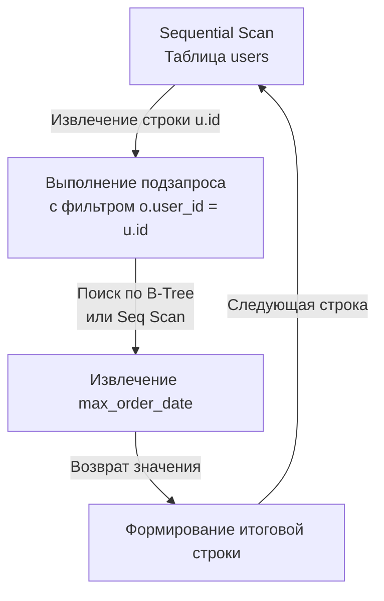

## Композитная природа SQL: Запрос внутри запроса

Реляционная алгебра обладает свойством **замкнутости (closure)**. Это означает, что результатом любой операции над таблицами (отношениями) всегда является новая таблица (отношение). 
Именно это математическое свойство позволяет нам использовать SQL как конструктор Lego: мы можем взять результат одного запроса и подставить его в другой запрос туда, где ожидается таблица или скалярное значение. Это и есть **Подзапрос (Subquery)**.

С точки зрения бэкенд-инженера, подзапросы — это мощный инструмент делегирования бизнес-логики на сторону СУБД, позволяющий избежать вытягивания лишних данных по сети (Network IO) и проблемы [[13. N+1 проблема]] в Go-приложениях.

## Типология подзапросов

Понимать типы подзапросов важно, так как от них зависит, как именно парсер и оптимизатор СУБД будут строить план выполнения.

### 1. Скалярные подзапросы (Scalar Subqueries)
Это подзапрос, который гарантированно возвращает **одну строку и одну колонку** (одно значение). База данных обращается с ним так же, как с обычной переменной (числом или строкой). Их можно использовать в `SELECT` или `WHERE`.

```sql
-- Пример в WHERE: Найти товары, цена которых выше средней
SELECT name, price 
FROM products 
WHERE price > (SELECT AVG(price) FROM products);
```

> [!warning] Ловушка / Gotcha: Run-time ошибка скалярного запроса
> Если ваш скалярный подзапрос внезапно вернет более одной строки, СУБД не попытается взять первую. Она прервет выполнение всего запроса и выкинет жесткую ошибку (например, `more than one row returned by a subquery used as an expression`). Если вы не уверены в уникальности данных, всегда явно ограничивайте подзапрос через `LIMIT 1`.

### 2. Табличные подзапросы в FROM (Derived Tables)
Если подзапрос возвращает множество строк и колонок, его можно подставить в секцию `FROM`, создав виртуальную таблицу на лету.

```sql
-- Пример в FROM: Агрегация перед соединением
SELECT u.email, stat.total_spent
FROM users u
JOIN (
    SELECT user_id, SUM(amount) as total_spent 
    FROM orders 
    GROUP BY user_id
) stat ON u.id = stat.user_id;
```
*Важно:* Табличному подзапросу во `FROM` **обязательно** нужно задавать алиас (в примере это `stat`), иначе СУБД выдаст синтаксическую ошибку.

В современных СУБД использование подзапросов во `FROM` часто заменяют на более читаемые [[1. CTE. WITH выражения]], но под капотом они часто работают идентично.

---

## Производительность: Некоррелированные vs Коррелированные

Это самый важный концепт для прохождения хардовых секций по базам данных. Разница между ними — это разница между запросом, выполняющимся 10 миллисекунд, и запросом, "кладущим" production-сервер.

### Некоррелированный подзапрос (Uncorrelated)
Подзапрос **не зависит** от внешнего (родительского) запроса. Он автономен.
В примере с `(SELECT AVG(price) FROM products)` подзапрос никак не ссылается на внешний запрос. 

**Mechanical Sympathy:** Оптимизатор СУБД выполнит такой подзапрос **ровно один раз**, закэширует его результат в оперативной памяти (RAM) и подставит это скалярное значение во внешний запрос. Сложность: `O(N + M)`.

### Коррелированный подзапрос (Correlated)
Подзапрос **зависит** от значений внешнего запроса. Он использует колонки из внешней таблицы.

```sql
-- Вывести пользователей и дату их самого дорогого заказа
SELECT 
    u.email,
    (
        SELECT o.created_at 
        FROM orders o 
        WHERE o.user_id = u.id -- КРИТИЧЕСКАЯ СТРОКА: связь с внешним запросом
        ORDER BY o.amount DESC 
        LIMIT 1
    ) AS max_order_date
FROM users u;
```

**Mechanical Sympathy:** Коррелированный подзапрос ведет себя как вложенный цикл `for` в Go. База данных вынуждена выполнять этот подзапрос **для каждой строки** внешнего запроса. 
Если во внешней таблице `users` 100 000 строк, СУБД выполнит внутренний `SELECT ... FROM orders` 100 000 раз! Сложность взлетает до `O(N * M)` (или `O(N * log M)` при наличии индекса). Это классический алгоритм `Nested Loop` (см. [[6. JOIN. INNER, LEFT, RIGHT]]).



---

## Subquery Flattening: Магия оптимизатора

Может показаться, что коррелированных подзапросов нужно избегать любой ценой. И до ~2010 года это было правдой. Но современные СУБД (PostgreSQL, MySQL 8+) обладают мощным математическим аппаратом в оптимизаторе (см. [[11. Cost based optimizer]]).

Когда вы пишете подзапрос с `IN` или `EXISTS`, оптимизатор часто производит **Развертывание подзапроса (Subquery Unnesting / Flattening)**. Он берет ваше дерево AST с коррелированным подзапросом и переписывает его на этапе компиляции в обычный `Hash JOIN` или `Merge JOIN`.

Для базы данных нет разницы между:
```sql
-- Подзапрос
SELECT * FROM users WHERE id IN (SELECT user_id FROM orders);

-- Джоин
SELECT DISTINCT u.* FROM users u JOIN orders o ON u.id = o.user_id;
```
В 95% случаев планировщик построит для них **абсолютно идентичный план выполнения**.

> [!info] Под капотом: Когда Flattening не работает
> Оптимизатор пасует и оставляет медленный Nested Loop, если в коррелированном подзапросе есть сложные агрегации (`GROUP BY`), функции окна или нетривиальные `LIMIT/OFFSET`, которые математически невозможно безопасно превратить в `JOIN`. В таких случаях разработчик должен сам переписать запрос, обычно вынося агрегацию в `FROM` или `CTE`.

---

## Go Idioms: Подзапросы спасают Network IO

Рассмотрим типичную ошибку начинающего Go-разработчика. Задача: заблокировать всех пользователей, у которых нет ни одного заказа за последний год.

**❌ Антипаттерн (Логика в Go, сжигание сети):**
```go
// 1. Тянем всех пользователей в память Go
rows, _ := db.Query("SELECT id FROM users")
// ... сканируем в users []int64

for _, id := range users {
    // 2. Делаем запрос для КАЖДОГО пользователя (N+1 проблема)
    var count int
    db.QueryRow("SELECT COUNT(*) FROM orders WHERE user_id = $1 AND created_at > ...", id).Scan(&count)
    
    if count == 0 {
        // 3. Делаем UPDATE
        db.Exec("UPDATE users SET status = 'blocked' WHERE id = $1", id)
    }
}
```
Этот код сгенерирует сотни тысяч сетевых TCP-пакетов, убьет пул соединений и заставит GC Go работать на износ.

**✅ Idiomatic Backend (Делегирование через подзапрос):**
```go
// Отправляем ОДИН запрос. Вся работа происходит внутри сервера БД, 
// без гоняния данных по сети (Zero Network I/O overhead).
query := `
    UPDATE users 
    SET status = 'blocked'
    WHERE id NOT IN (
        SELECT user_id 
        FROM orders 
        WHERE created_at > NOW() - INTERVAL '1 year'
    )
`
res, err := db.ExecContext(ctx, query)
// ... проверяем res.RowsAffected()
```

## Итог

1. **Подзапросы** делают SQL мощным декларативным языком, позволяя использовать результаты одних вычислений как вводные для других.
2. Скалярные подзапросы должны строго возвращать 1 строку и 1 колонку. Табличные во `FROM` требуют обязательного алиаса.
3. Различайте **некоррелированные** (выполняются 1 раз, быстро) и **коррелированные** (выполняются для каждой внешней строки, могут быть `O(N*M)`).
4. Современные оптимизаторы умеют "разворачивать" многие подзапросы в обычные `JOIN`, но сложные конструкции все еще требуют ручного тюнинга.
5. Для бэкенд-инженера один тяжелый SQL-запрос с подзапросами в 99% случаев лучше, чем циклы и `SELECT` внутри `for` на стороне Go-приложения (защита от Network I/O latency).

Мы часто упоминали операторы `IN` и `EXISTS` при работе с подзапросами. Это настолько важная и глубокая тема, таящая в себе особенности работы B-Tree индексов и логики "короткого замыкания" (Short-circuit), что мы посвятим ей отдельную статью. Переходим к: [[10. EXISTS и IN]].