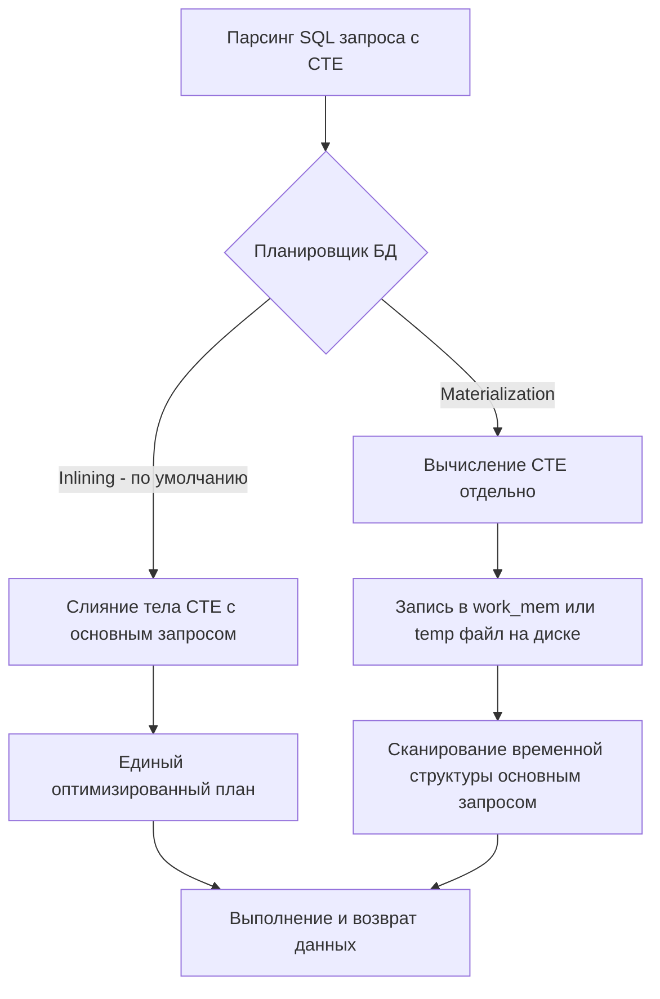

## Что такое CTE и зачем отказываться от подзапросов?

Когда вы пишете сложные аналитические запросы или выгружаете данные для отчетов, SQL-код быстро превращается в нечитаемую кашу из вложенных `SELECT`. В классических языках программирования мы разбиваем логику на функции и переменные, но в SQL до появления CTE единственным способом переиспользования промежуточных выборок были подзапросы (Subqueries) или временные таблицы.

**CTE (Common Table Expression)** — это именованный временный набор результатов, который существует только в рамках выполнения одного запроса `SELECT`, `INSERT`, `UPDATE` или `DELETE`. Синтаксически CTE вводится с помощью ключевого слова `WITH`.

### Эволюция: от подзапросов к CTE

Рассмотрим типичную задачу: найти пользователей, чьи заказы в сумме превышают средний чек по всем пользователям.

**На подзапросах (Ad-hoc subqueries):**
```sql
SELECT u.id, u.name, o_total.sum
FROM users u
JOIN (
    SELECT user_id, SUM(amount) as sum
    FROM orders
    GROUP BY user_id
) o_total ON u.id = o_total.user_id
WHERE o_total.sum > (
    SELECT AVG(total_sum) FROM (
        SELECT SUM(amount) as total_sum
        FROM orders
        GROUP BY user_id
    ) avg_query
);
```
Этот код тяжело читается, так как логика читается "изнутри наружу". Кроме того, СУБД может выполнить один и тот же подзапрос несколько раз, если планировщик не сможет его "схлопнуть".

**На CTE:**
```sql
WITH user_totals AS (
    SELECT user_id, SUM(amount) as total_sum
    FROM orders
    GROUP BY user_id
),
avg_order AS (
    SELECT AVG(total_sum) as avg_sum
    FROM user_totals
)
SELECT u.id, u.name, ut.total_sum
FROM users u
JOIN user_totals ut ON u.id = ut.user_id
JOIN avg_order ao ON ut.total_sum > ao.avg_sum;
```

Код стал линейным и декларативным: мы определяем вспомогательные сущности (`user_totals`, `avg_order`) до того, как использовать их в основном запросе.

---

## Под капотом: Как СУБД исполняет CTE

Для бэкенд-разработчика критически важно понимать, как CTE транслируется в физическое исполнение. В отличие от временных таблиц (`CREATE TEMP TABLE`), CTE — это не материализованная таблица на диске. Это синтаксическая конструкция, которую видит парсер и которую должен обработать планировщик запросов.

### Inlining vs Materialization

Существуют два фундаментальных подхода к исполнению CTE, и разные базы данных (и даже их версии) ведут себя по-разному:

1. **Inlining (Подстановка / Слияние)**: Планировщик "разворачивает" CTE, подставляя его тело прямо в основной запрос, как макрос. В этом случае CTE — это просто синтаксический сахар, и выполнение не отличается от подзапроса. Планировщик может свободно проталкивать условия фильтрации (`WHERE`) внутрь CTE и выбирать оптимальные методы джойнов.
2. **Materialization (Материализация)**: СУБД сначала вычисляет результат CTE, сохраняет его во временной структуре (в оперативной памяти `work_mem` или сбрасывая на диск во временные файлы), а затем основной запрос сканирует эту структуру. Это изолирует выполнение CTE от основного запроса.

> [!info] Под капотом
> В PostgreSQL до версии 12 CTE **всегда** были оптимизационным забором (Optimization Fence). Они гарантированно материализовывались. Это было и плюсом (можно было заставить СУБД вычислить дорогой подзапрос один раз), и минусом (планировщик не мог протолкнуть индексный доступ внутрь CTE).
> 
> Начиная с PostgreSQL 12, CTE по умолчанию **инлайнятся** (подставляются). Материализация происходит только если:
> - CTE рекурсивное (ключевое слово `RECURSIVE`, подробнее в [[2. Рекурсивные запросы]]).
> - CTE используется в основном запросе более одного раза.
> - В CTE есть побочные эффекты (например, `INSERT ... RETURNING` или вызовы волатильных функций вроде `random()`).
> - Явно указано `AS MATERIALIZED`.



### Mechanical Sympathy: Материализация и IO

Если CTE материализуется, а результат не помещается в выделенный `work_mem` (в PostgreSQL), СУБД начнет сбрасывать данные во временные файлы на диске (`temp_files`).

С точки зрения ОС и железа:
- **Выделение памяти**: `work_mem` аллоцируется процессом PostgreSQL (что вызовет `mmap` или `brk` syscall).
- **Превышение лимита**: Сброс на диск инициирует системные вызовы `write()`. Данные попадают в Page Cache ОС, а затем (если не хватает RAM) физический диск сбросит данные через `fsync` или фоновый сброс.
- **Чтение**: При сканировании материализованного CTE из временного файла возникнут syscall `read()`, что убьет кэш-линии CPU и приведет к Latency из-за ожидания IO.

Поэтому слепо полагаться на то, что "CTE вычислится один раз и будет быстрым" — ошибка. Без индексов на материализованном CTE (а их там нет) сканирование будет Nested Loop с полным перебором строк во временной структуре.

> [!warning] Ловушка / Gotcha
> Если вы привыкли к поведению старых версий PostgreSQL (или других СУБД, где CTE всегда материализуются), вы можете использовать CTE для "кэширования" тяжелых вычислений, которые затем фильтруются слабым условием в основном запросе. В новых версиях PG CTE будет проинлайнено, условие `WHERE` протолкнется внутрь, и тяжелое вычисление выполнится только для нужных строк. Но если вы по привычке напишете `AS MATERIALIZED`, вы лишите планировщик этой возможности, заставив СУБД вычислить CTE для *всех* строк, прежде чем отфильтровать их. Это может замедлить запрос в сотни раз.

---

## CTE с побочными эффектами (DML в CTE)

Одно из мощнейших применений CTE в продакшене — совмещение модификации данных и их чтения в одном атомарном запросе. Это позволяет избавиться от раундов между приложением и БД.

Пример: нужно обновить статус пользователя и тут же получить его обновленные данные.
```sql
WITH updated_user AS (
    UPDATE users
    SET status = 'ACTIVE', updated_at = NOW()
    WHERE id = 123
    RETURNING id, status, updated_at
)
SELECT u.id, u.status, o.id as order_id
FROM updated_user u
LEFT JOIN orders o ON u.id = o.user_id;
```

Такой запрос выполнится атомарно (в рамках одной неявной транзакции), и СУБД гарантированно материализует CTE `updated_user`, так как внутри него есть `UPDATE` (побочный эффект).

---

## Работа с CTE в Go

При написании кода на Go, особенно при работе с `database/sql`, CTE вызывают боль из-за позиционных аргументов (`$1`, `$2`). Когда SQL-запрос разрастается на 50 строк с несколькими CTE, отслеживание порядка аргументов становится пыткой.

### Подход 1: database/sql (Ванильный Go)

Ванильный подход требует ручного контроля порядка переменных. Ошибиться невероятно легко.

```go
package repository

import (
	"context"
	"database/sql"
	"fmt"
)

// Структуры для маппинга данных
type UserOrderSummary struct {
	UserID    int64
	UserName  string
	TotalSpent float64
}

const complexCteQuery = `
WITH user_totals AS (
    SELECT user_id, SUM(amount) AS total_sum
    FROM orders
    WHERE created_at > $1 -- Первый аргумент
    GROUP BY user_id
),
filtered_users AS (
    SELECT id, name
    FROM users
    WHERE status = $2 -- Второй аргумент
)
SELECT u.id, u.name, ut.total_sum
FROM filtered_users u
JOIN user_totals ut ON u.id = ut.user_id
WHERE ut.total_sum > $3 -- Третий аргумент
`

// GetHighRollers демонстрирует выполнение CTE запроса через database/sql
func GetHighRollers(ctx context.Context, db *sql.DB, since string, status string, minAmount float64) ([]UserOrderSummary, error) {
	rows, err := db.QueryContext(ctx, complexCteQuery, since, status, minAmount)
	if err != nil {
		return nil, fmt.Errorf("failed to execute CTE query: %w", err)
	}
	defer rows.Close()

	var results []UserOrderSummary
	for rows.Next() {
		var u UserOrderSummary
		if err := rows.Scan(&u.UserID, &u.UserName, &u.TotalSpent); err != nil {
			return nil, fmt.Errorf("failed to scan row: %w", err)
		}
		results = append(results, u)
	}
	if err := rows.Err(); err != nil {
		return nil, fmt.Errorf("rows iteration error: %w", err)
	}
	return results, nil
}
```

### Подход 2: Кодогенерация (sqlc)

Для сложного SQL (а CTE — это всегда сложный SQL) идиоматичным и инженерно правильным подходом в Go является использование `sqlc`. Вы пишете чистый SQL с CTE, а `sqlc` генерирует типобезопасный Go-код, автоматически вычисляя типы возвращаемых колонок (даже если они вычисляются внутри CTE).

```sql
-- name: GetHighRollers :many
WITH user_totals AS (
    SELECT user_id, SUM(amount) AS total_sum
    FROM orders
    WHERE created_at > @since
    GROUP BY user_id
),
filtered_users AS (
    SELECT id, name
    FROM users
    WHERE status = @status
)
SELECT u.id, u.name, ut.total_sum
FROM filtered_users u
JOIN user_totals ut ON u.id = ut.user_id
WHERE ut.total_sum > @min_amount;
```

`sqlc` сгенерирует структуру `GetHighRollersRow` и метод, в котором аргументы передаются по имени через структуру `GetHighRollersParams`, полностью устраняя проблему позиционных аргументов.

---

## Сравнение с другими подходами

| Характеристика | Вложенные подзапросы (Subqueries) | Временные таблицы (Temp Tables) | CTE |
| :--- | :--- | :--- | :--- |
| **Читаемость** | Плохая (наоборот читается) | Хорошая (линейная) | Отличная (линейная) |
| **Изоляция плана** | Нет (планировщик всё видит) | Да (отдельная таблица с индексами) | Зависит от СУБД (Inlining vs Materialization) |
| **Переиспользование** | Требует дублирования кода | Да, можно использовать в разных запросах | Только в рамках одного запроса |
| **Индексы** | Используются из основных таблиц | Можно создавать индексы на temp таблице | Нет индексов (если материализуется, то полный скан) |
| **Жизненный цикл** | Время запроса | Время сессии/транзакции | Время запроса |

> [!tip] Собеседование
> **Вопрос:** В чем разница между CTE и подзапросом в PostgreSQL 15? Что будет, если написать `WITH cte AS MATERIALIZED ...`?
> **Ответ:** В современных версиях PostgreSQL разницы в производительности может не быть, так как CTE инлайнятся и подставляются в основной запрос точно так же, как и подзапросы. Однако CTE кардинально повышает читаемость и позволяют ссылаться на один и тот же подзапрос несколько раз без дублирования кода. Если указать `AS MATERIALIZED`, PostgreSQL создаст оптимизационный барьер: сначала вычислит CTE, сохранит результат во временной области (работе или диске), и только потом основной запрос будет сканировать этот результат. Без индексов на материализованном CTE сканирование будет медленным, поэтому `MATERIALIZED` следует использовать с осторожностью, когда нужно намеренно изолировать тяжелую часть запроса.

## Итог

1. **CTE (`WITH`)** — это способ писать линейный, читаемый SQL вместо спагетти из подзапросов.
2. Под капотом CTE может **инлайниться** (подставляться) или **материализоваться** (сохраняться во временной структуре). Понимание того, как ваша СУБД обрабатывает CTE, критично для производительности.
3. **Материализация** в современных СУБД происходит не всегда. Если CTE используется 1 раз и не имеет побочных эффектов, СУБД, скорее всего, сделает Inlining.
4. При работе в Go с длинными CTE используйте кодогенерацию (`sqlc`), чтобы избежать кошмара позиционных аргументов (`$1`, `$2`) и ручного маппинга.

Мы рассмотрели CTE как инструмент структурирования запросов, но настоящая мощь `WITH` раскрывается, когда к нему добавляется ключевое слово `RECURSIVE`. В следующей статье мы разберем, как с помощью рекурсивных CTE обходить графы и деревья прямо на стороне базы данных: [[2. Рекурсивные запросы]].
