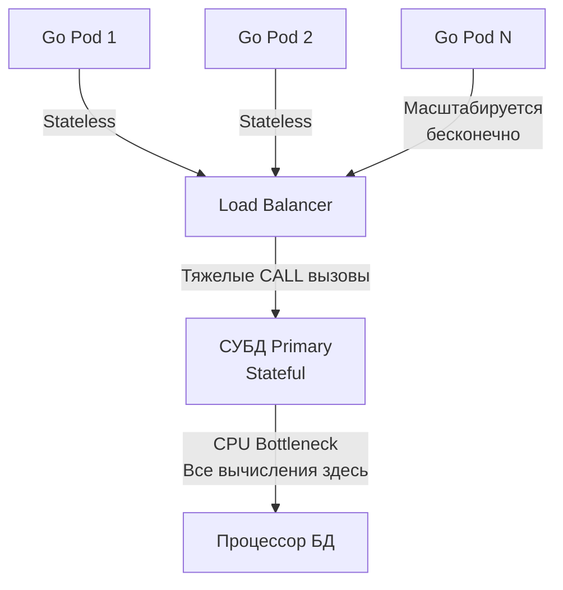

## Парадигма Code-to-Data: Когда логика переезжает в СУБД

Исторически и архитектурно мы привыкли к парадигме **Data-to-Code**. Мы берем данные из базы (через `SELECT`), передаем их по сети (Network IO) в память нашего Go-приложения, выполняем бизнес-логику на процессоре бэкенда и, если нужно, отправляем мутации обратно (через `UPDATE` или `INSERT`).

Но что, если бизнес-логика требует выгрузки 500 000 строк для сложного финансового расчета, результатом которого будет обновление всего 5 строк? Передача такого объема сырых данных по сети убьет пропускную способность, а десериализация заставит Garbage Collector в Go страдать от миллионов временных аллокаций.

В таких случаях применяется парадигма **Code-to-Data**. Мы пишем код прямо внутри базы данных. База сама читает данные из своего Buffer Pool, обрабатывает их в регистрах своего CPU и возвращает нам только компактный финальный результат.

Для реализации этой концепции используются **Хранимые функции (User-Defined Functions, UDF)** и **Хранимые процедуры (Stored Procedures)**. Часто для их написания используется не чистый SQL (так как он декларативен и тьюринг-неполон), а процедурные расширения: PL/pgSQL в PostgreSQL, T-SQL в MS SQL, PL/SQL в Oracle.

---

## Хранимые функции (UDF)

Функция — это подпрограмма, которая принимает аргументы, выполняет вычисления и **всегда возвращает значение** (скаляр, массив или таблицу). Функции можно использовать прямо внутри SQL-запросов (в `SELECT`, `WHERE`, `JOIN`).

Пример функции на PL/pgSQL, вычисляющей скидку:

```sql
CREATE OR REPLACE FUNCTION calculate_discount(price NUMERIC, user_tier TEXT)
RETURNS NUMERIC AS $$
DECLARE
    discount NUMERIC := 0;
BEGIN
    IF user_tier = 'VIP' THEN
        discount := 0.20;
    ELSIF user_tier = 'PREMIUM' THEN
        discount := 0.10;
    END IF;
    
    RETURN price - (price * discount);
END;
$$ LANGUAGE plpgsql;
```

Вызов из Go (через обычный запрос):
```sql
SELECT id, calculate_discount(amount, tier) FROM orders;
```

### Mechanical Sympathy: Категории изменчивости (Volatility)

Это критически важный концепт для производительности. В PostgreSQL каждая функция имеет категорию "чистоты" (Volatility). Если вы не укажете её, СУБД по умолчанию назначит самую пессимистичную — `VOLATILE`.

1. **VOLATILE (Изменчивая):** Функция может вернуть разные результаты при одинаковых аргументах (например, `random()` или `now()`) или имеет сайд-эффекты (делает `UPDATE`). Оптимизатор **не имеет права** кэшировать её результат. В запросе `SELECT func() FROM table` функция будет физически вызываться для каждой строки.
2. **STABLE (Стабильная):** Гарантирует, что в рамках **одного запроса** при одинаковых аргументах результат будет идентичным (но может меняться между разными запросами). Оптимизатор может вызвать её один раз для группы строк и переиспользовать результат.
3. **IMMUTABLE (Неизменяемая):** Абсолютно чистая функция. Результат всегда одинаков для одних и тех же аргументов (`2 + 2 = 4`). Оптимизатор может вычислить её еще на этапе компиляции плана запроса! 

> [!warning] Ловушка / Gotcha: Индексы по функциям
> Вы можете создать индекс по результату функции: `CREATE INDEX idx_discount ON orders (calculate_discount(amount, tier));`. Но СУБД разрешит это сделать **только** если функция помечена как `IMMUTABLE`. Если вы ошибетесь и пометите `VOLATILE` функцию как `IMMUTABLE`, вы получите сломанный индекс и повреждение данных (Data Corruption).

---

## Хранимые процедуры

Долгое время в PostgreSQL были только функции. Полноценные хранимые процедуры (`PROCEDURE`) появились только в PostgreSQL 11. 

> [!tip] Собеседование
> **Вопрос:** В чем фундаментальная разница между функцией и хранимой процедурой в SQL?
> **Ответ:** > 1. **Контекст транзакций:** Функция всегда выполняется строго внутри внешней транзакции. Она не может сделать `COMMIT` или `ROLLBACK` части своей работы. Процедура может управлять транзакциями (коммитить промежуточные результаты).
> 2. **Возврат значения:** Функция обязана вернуть значение (или `VOID`). Процедура не возвращает результат (используются `INOUT` параметры).
> 3. **Способ вызова:** Функции вызываются внутри `SELECT`. Процедуры вызываются отдельной командой `CALL`.

Пример процедуры с управлением транзакциями (периодическая очистка логов):

```sql
CREATE OR REPLACE PROCEDURE archive_old_logs()
LANGUAGE plpgsql
AS $$
DECLARE
    batch_size INT := 1000;
    deleted_count INT;
BEGIN
    LOOP
        -- Удаляем пачками по 1000, чтобы не блокировать таблицу целиком
        DELETE FROM logs WHERE created_at < NOW() - INTERVAL '1 year' 
        AND id IN (SELECT id FROM logs WHERE created_at < NOW() - INTERVAL '1 year' LIMIT batch_size);
        
        GET DIAGNOSTICS deleted_count = ROW_COUNT;
        
        -- Коммитим транзакцию! Освобождаем блокировки. Функция так не умеет.
        COMMIT;
        
        EXIT WHEN deleted_count = 0;
    END LOOP;
END;
$$;
```

Вызов из Go:
```go
// Для вызова процедур всегда используем ExecContext
_, err := db.ExecContext(ctx, "CALL archive_old_logs()")
```

---

## Архитектурный холивар: Backend vs Database

Среди Principal-инженеров и системных архитекторов идет вечный спор: где должна жить бизнес-логика? 

### Плюсы логики в СУБД (Почему это любят DBA)
1. **Zero Network IO:** Данные не покидают сервер БД. Скорость обработки колоссальная.
2. **Безопасность и Инкапсуляция:** Приложению вообще не дают прав на `SELECT` или `UPDATE` таблиц. Выдают только права на выполнение (`EXECUTE`) конкретных процедур. Никакой [[21. SQL Injection]] невозможен в принципе.
3. **Единая точка истины:** Если у вас есть бэкенд на Go, аналитика на Python и легаси на PHP, логика скидок, написанная в БД, будет работать одинаково для всех.

### Минусы логики в СУБД (Почему это ненавидят Backend-разработчики)

Здесь мы включаем **Mechanical Sympathy** на уровне кластера:



1. **CPU Bottleneck:** База данных — это единая точка отказа (Stateful). Вы не можете просто добавить еще один сервер БД на запись. Если ваши хранимые процедуры начнут активно сжигать CPU, вся база "ляжет". Go-бэкенд (Stateless) масштабируется горизонтально за секунды в Kubernetes. Выносить тяжелые вычисления из бесплатного Go-контура в дорогую СУБД — архитектурное самоубийство для Highload.
2. **Developer Experience (DX):** В PL/pgSQL нет нормального линтера, юнит-тестирования (хотя есть pgTAP, но это боль), нет отладчика вроде `dlv`, сложный рефакторинг. 
3. **Версионирование:** Изменение функции требует написания миграции (команды `CREATE OR REPLACE`). Откатывать такие миграции сложно, если меняется сигнатура (аргументы).
4. **Vendor Lock-in:** Переписать Go-приложение с PostgreSQL на MySQL (если вы использовали чистый SQL) реально. Переписать 50 000 строк PL/pgSQL на T-SQL — задача на годы.

---

## Go Idioms: Интеграция с UDF

Если архитектурно решено использовать процедуру, в Go нужно учитывать особенности `database/sql` при работе с возвращаемыми наборами данных.

Часто функции возвращают не одно значение, а набор строк (`RETURNS TABLE` или `RETURNS SETOF`).

```sql
CREATE OR REPLACE FUNCTION get_active_users(min_score INT)
RETURNS TABLE (id INT, email TEXT) AS $$
    SELECT id, email FROM users WHERE score >= min_score AND status = 'active';
$$ LANGUAGE sql STABLE;
```

В Go мы работаем с ней точно так же, как с обычной таблицей:

```go
func GetActiveUsers(ctx context.Context, db *sql.DB, minScore int) ([]User, error) {
    // Вызываем функцию как источник данных во FROM
    query := `SELECT id, email FROM get_active_users($1)`
    
    rows, err := db.QueryContext(ctx, query, minScore)
    if err != nil {
        return nil, err
    }
    defer rows.Close() // Защита от утечки соединений
    
    // ... стандартный скан
}
```

## Итог

1. **Парадигма Code-to-Data:** Процедуры и функции позволяют исполнять код прямо рядом с данными, минимизируя Network IO.
2. **Функции** вызываются в `SELECT` и обязаны возвращать результат. **Процедуры** вызываются через `CALL` и могут управлять транзакциями (`COMMIT/ROLLBACK`).
3. Для функций критически важно правильно указывать **Volatility** (`IMMUTABLE`, `STABLE`, `VOLATILE`), чтобы оптимизатор мог кэшировать вычисления.
4. **Архитектурный компромисс:** Хранимки обеспечивают жесткую инкапсуляцию и скорость, но перегружают самый ценный ресурс системы — процессор базы данных (CPU). В современном Highload бэкенде предпочтение отдается выносу логики в масштабируемые Go-сервисы.

Процедуры и функции нужно вызывать явно. Но есть особый вид логики в СУБД, который срабатывает *неявно*, как реакция на события (вставку, обновление, удаление). Это темная магия баз данных, которая вызывает больше всего проблем с непредсказуемым поведением. Переходим к следующей статье: [[11. Триггеры]].