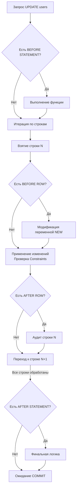

## Невидимая магия: Событийно-ориентированная база данных

В статье [[10. Хранимые процедуры и функции]] мы рассматривали **явный** вызов кода внутри базы данных. Мы отправляли команду, и СУБД её выполняла. 

**Триггеры (Triggers)** — это принципиально иной подход. Это реализация паттерна Observer (Наблюдатель) прямо на уровне дисковой подсистемы. Триггер — это хранимая функция, которая вызывается **неявно и автоматически** ядром СУБД в ответ на определенные DML-операции (`INSERT`, `UPDATE`, `DELETE`, а иногда и `TRUNCATE`).

Для бэкенд-инженера триггеры — это обоюдоострый меч. С одной стороны, они гарантируют железобетонную консистентность на уровне данных. С другой — они создают ту самую "невидимую магию" (Spooky Action at a Distance), которую так ненавидят Go-разработчики, привыкшие к явному и прозрачному потоку выполнения программы (Control Flow).

---

## Анатомия триггера: Векторы выполнения

В большинстве современных реляционных баз данных (например, PostgreSQL) триггер определяется тремя ключевыми параметрами: **Событие**, **Время** и **Уровень**.

### 1. Время срабатывания (BEFORE vs AFTER)
* **`BEFORE` (До):** Триггер срабатывает *до* того, как СУБД попытается физически записать изменения в страницу памяти и WAL. 
    * *Механика:* Внутри `BEFORE` триггера вы имеете доступ к специальной переменной `NEW` (новая строка, которую пытаются вставить). Вы можете перехватить её, изменить (например, проставить `updated_at = NOW()`) или вообще отменить операцию (вернув `NULL`).
* **`AFTER` (После):** Триггер срабатывает *после* того, как строка уже применена и все ограничения (Constraints) проверены. 
    * *Механика:* Изменять `NEW` здесь уже бесполезно — поезд ушел. Зато это идеальное место для логирования, создания записей аудита или каскадных изменений в других таблицах.

### 2. Уровень срабатывания (ROW vs STATEMENT)
Это критический момент для понимания производительности (Mechanical Sympathy).
* **`FOR EACH ROW` (Строковый уровень):** Функция будет вызываться для **каждой** затронутой строки. Если ваш `UPDATE` затронул 10 000 строк, функция выполнится 10 000 раз.
* **`FOR EACH STATEMENT` (Уровень запроса):** Функция выполнится ровно **один раз** для всего SQL-запроса, независимо от того, сколько строк было обновлено (даже если 0). Полезно для записи самого факта выполнения запроса.



---

## Идиоматичный пример: Автоматический updated_at

Классический паттерн использования `BEFORE` триггера — автоматическое обновление колонки `updated_at`. Если мы возложим это на Go-приложение, кто-нибудь обязательно забудет добавить это поле в `UPDATE` запрос. Триггер делает это гарантированно.

```sql
-- 1. Сначала пишем саму функцию (PL/pgSQL)
CREATE OR REPLACE FUNCTION set_updated_at()
RETURNS TRIGGER AS $$
BEGIN
    -- Принудительно перезаписываем значение, переданное бэкендом
    NEW.updated_at = NOW();
    RETURN NEW; -- Обязаны вернуть NEW для продолжения цепочки
END;
$$ LANGUAGE plpgsql;

-- 2. Привязываем функцию к событию таблицы
CREATE TRIGGER trigger_users_updated_at
BEFORE UPDATE ON users
FOR EACH ROW
EXECUTE FUNCTION set_updated_at();
```

> [!info] Под капотом: Переменные NEW и OLD
> В оперативной памяти СУБД (на уровне Executor-а) переменные `NEW` и `OLD` — это не физические строки на диске. Это кэшированные в памяти кортежи (Tuples). Чтение из них и запись в них внутри триггера происходят мгновенно (в регистрах CPU / L1 кэше) без дополнительных системных вызовов к диску.
> * `INSERT` имеет только `NEW`.
> * `DELETE` имеет только `OLD`.
> * `UPDATE` имеет обе переменные (до и после изменения).

---

## Архитектурные ловушки и Gotchas

### Ловушка 1: Каскадная рекурсия (Infinite Loops)
Представьте, что триггер на `UPDATE` таблицы `orders` пересчитывает скидку и делает еще один `UPDATE` той же таблицы `orders`. Это вызовет новый триггер, который вызовет новый `UPDATE`. 
СУБД имеет предохранитель (в PostgreSQL есть проверка глубины стека), но ваш запрос гарантированно упадет с ошибкой переполнения, обрушив транзакцию бизнес-логики.
*Правило:* Никогда не мутируйте в триггере ту же таблицу, на которую он повешен, если это не `BEFORE ROW` (где вы просто меняете переменную `NEW` без вызова отдельного `UPDATE`).

### Ловушка 2: Убийство Bulk Inserts (Деградация CPU)
Когда вы вставляете 10 000 строк из Go через пакетный запрос (`INSERT INTO ... VALUES (1), (2), ... (10000)`), база работает с максимальной пропускной способностью (Sequential IO). 
Если на таблице висит триггер `FOR EACH ROW`, СУБД вынуждена **прерывать конвейер** для каждой из 10 000 строк, переключать контекст, инициализировать виртуальную машину PL/pgSQL и выполнять функцию. Процессор (CPU) базы данных взлетает до 100%, а скорость вставки падает в десятки раз.

> [!tip] Собеседование: Триггеры и транзакции
> **Вопрос:** Если внутри `AFTER` триггера происходит логирование в таблицу `audit_logs`, а после триггера транзакция на бэкенде откатывается (Rollback), останется ли запись в `audit_logs`?
> **Ответ:** Нет. Триггеры **всегда** выполняются в рамках той же транзакции, что и вызвавшая их операция. Если транзакция откатывается, откатываются и все сайд-эффекты триггеров. У этого есть и обратная сторона: если ваш тяжелый аудит-триггер упадет (например, закончится место), он отменит успешный `UPDATE` бизнес-сущности.

---

## Архитектура: Triggers vs Domain Events (Go Backend)

В современном System Design наблюдается жесткий тренд на отказ от сложной бизнес-логики в триггерах. 

**Пример проблемы:** Когда создается новый `user`, нам нужно начислить ему приветственные баллы в таблицу `wallets`. 

**Если сделать это триггером:**
1. Код в Go делает только `INSERT INTO users`.
2. В коде Go *нет ни единого упоминания* о таблице `wallets`.
3. Новый разработчик смотрит в репозиторий Go и не понимает, откуда берутся баллы. "Магия".
4. Если нам нужно отправить приветственное письмо (Email), триггер БД этого сделать не может (базе нечего делать в HTTP-запросах или Kafka).

**Как делают в Highload (Go Idioms):**
Мы отказываемся от триггеров в пользу явных транзакций в Go или паттерна **Outbox**. Бэкенд управляет процессом:
```go
// Логика прозрачна и читаема прямо в коде приложения
tx, _ := db.BeginTx(ctx, nil)
defer tx.Rollback()

// 1. Создаем пользователя
_, err = tx.ExecContext(ctx, "INSERT INTO users ...")

// 2. Явно начисляем баллы
_, err = tx.ExecContext(ctx, "INSERT INTO wallets ...")

// 3. Отправляем событие в Outbox для асинхронной отправки Email (Kafka)
// (Подробнее это разбирается в архитектурном разделе базы)
_, err = tx.ExecContext(ctx, "INSERT INTO outbox_events ...")

tx.Commit()
```

### Когда триггеры ДЕЙСТВИТЕЛЬНО нужны?
Несмотря на нелюбовь бэкендеров, триггеры незаменимы в следующих сценариях:
1. **Строгий технический аудит (History Tables):** Логирование `OLD` и `NEW` состояний критичных таблиц (например, финансовых проводок) на уровне ядра БД, чтобы даже DBA с прямым доступом к консоли не мог изменить данные без следа.
2. **Сложные технические Constraints:** Когда бизнес-правило слишком сложное для простого `CHECK` (например, проверка пересечения интервалов времени с обращениями в другие таблицы).
3. **Поддержание денормализованных данных:** Если у нас есть счетчик `total_comments` в таблице `articles`, триггер на `INSERT/DELETE` в таблице `comments` обновит его атомарно и надежно. (Хотя при сверхвысокой нагрузке это приведет к конкурентным блокировкам).

## Итог

1. **Триггеры** реализуют неявное, событийно-ориентированное выполнение логики на стороне СУБД.
2. Триггеры `BEFORE` идеальны для валидации и изменения входящих данных (`NEW`). Триггеры `AFTER` — для аудита и поддержания консистентности связанных таблиц.
3. Помните о **Mechanical Sympathy**: триггеры `FOR EACH ROW` разрушают производительность массовых вставок (Bulk Inserts) из-за накладных расходов на переключение контекста.
4. **Транзакционность:** Триггер — часть вызывающей транзакции. Падение триггера означает падение всего запроса бэкенда.
5. Избегайте "Размытия бизнес-логики". В микросервисной архитектуре на Go предпочтение отдается явному коду и паттерну [[11. Outbox pattern]] (из раздела архитектуры), оставляя триггерам только инфраструктурные задачи базы данных.

Мы разобрались со скрытой логикой и вычислениями "под капотом" БД. Следующий шаг — научиться скрывать сложные SQL-запросы за красивыми и простыми фасадами, создавая виртуальные интерфейсы поверх физических таблиц. Этому посвящена следующая статья: [[12. Представления и materialized views]].