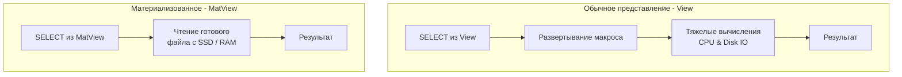

## Виртуализация данных: Абстракция над таблицами

По мере роста проекта и нормализации схемы (до 3NF и выше), структура базы данных неизбежно усложняется. Чтобы получить профиль пользователя со всеми его ролями, балансом и последним заказом, разработчику приходится писать `SELECT` с 5-7 `JOIN`. 

Дублировать такие запросы в Go-коде (или SQL-файлах) — значит нарушать принцип DRY (Don't Repeat Yourself). Изменение схемы БД потребует рефакторинга десятков микросервисов. 

Для решения этой архитектурной проблемы реляционные базы данных предоставляют механизм **Представлений (Views)** — возможность создать виртуальную таблицу, которая скрывает под собой всю сложность реальных физических связей.

## Представления (Views): Проекции без хранения

**View (Обычное представление)** — это именованный сохраненный SQL-запрос. 

Синтаксис создания предельно прост:
```sql
CREATE OR REPLACE VIEW user_profiles AS
SELECT 
    u.id,
    u.email,
    r.name AS role,
    COALESCE(w.balance, 0) AS balance
FROM users u
JOIN roles r ON u.role_id = r.id
LEFT JOIN wallets w ON u.id = w.user_id;
```

Теперь бэкенд на Go может обращаться к этому представлению так, будто это обычная плоская таблица:
```sql
SELECT email, balance FROM user_profiles WHERE id = 42;
```

### Под капотом: Макросы и AST-деревья

Главное заблуждение начинающих разработчиков: *"Если я оберну медленный запрос в View, он станет работать быстрее, потому что база его закэширует"*.

**Это фатальная ошибка.** Обычное представление **не хранит данные на диске**. Оно не потребляет ни байта в файловой системе (кроме метаданных в системном каталоге).

С точки зрения **Mechanical Sympathy**, View работает как макрос (Macro Expansion) на этапе парсинга запроса:
1. Вы отправляете `SELECT * FROM user_profiles WHERE id = 42`.
2. Подсистема СУБД (в PostgreSQL это `Rule System` / `Query Rewriter`) видит, что `user_profiles` — это View.
3. Она берет сохраненное абстрактное синтаксическое дерево (AST) этого View и прозрачно "вклеивает" его в ваш запрос.
4. Оптимизатор строит план выполнения для итогового гигантского запроса.

Запрос к View будет работать **ровно столько же времени**, сколько сырой запрос с `JOIN`-ами, сжигая те же такты CPU и генерируя те же Disk IO.

> [!warning] Ловушка / Gotcha: Обновляемые представления (Updatable Views)
> Можно ли сделать `INSERT INTO user_profiles`? 
> По умолчанию, если View содержит `JOIN`, агрегации (`GROUP BY`) или `LIMIT`, СУБД запретит мутацию, так как математически непонятно, в какую из физических таблиц писать данные. 
> Для решения этой проблемы используются триггеры типа `INSTEAD OF` (срабатывающие *вместо* операции). Разработчик пишет функцию, которая перехватывает `INSERT` во View и вручную раскладывает данные по нужным таблицам `users` и `wallets`.

---

## Материализованные представления (Materialized Views)

Если обычные View нужны для инкапсуляции и удобства, то **Materialized Views (MatViews)** нужны для экстремального повышения производительности (ценой места на диске и свежести данных).

Представим тяжелый аналитический запрос (OLAP): *"Собрать ежедневный отчет по выручке с группировкой по категориям"*. Запрос выполняется 10 секунд, сканируя 50 миллионов строк. Если 100 менеджеров откроют дашборд одновременно, база "ляжет" из-за исчерпания CPU.

```sql
CREATE MATERIALIZED VIEW daily_revenue AS
SELECT 
    DATE(created_at) AS report_date,
    category_id,
    SUM(amount) AS total_revenue
FROM orders
WHERE status = 'paid'
GROUP BY 1, 2;
```

### Под капотом: Физическое хранение

В отличие от обычного View, **MatView — это физическая таблица на диске**. 
Когда вы выполняете команду `CREATE MATERIALIZED VIEW`, СУБД:
1. Выполняет тяжелый SQL-запрос.
2. Аллоцирует страницы (Pages) на SSD.
3. Физически записывает результат выполнения (сгруппированные строки) в эти страницы.

При последующих `SELECT * FROM daily_revenue` база данных **вообще не обращается к таблице `orders`**. Она читает готовые, предрассчитанные данные прямо с диска (или из Buffer Pool). Запрос, который шел 10 секунд, теперь выполняется за 2 миллисекунды.

Более того, так как это физическая таблица, **на MatView можно и нужно вешать индексы!**
```sql
CREATE UNIQUE INDEX idx_daily_revenue_date_cat ON daily_revenue (report_date, category_id);
```



---

## Проблема инвалидации: Механика REFRESH

Главный компромисс MatView — данные в нем устаревают. Если поступил новый заказ, в `daily_revenue` он магическим образом не появится. Данные нужно обновлять явно.

```sql
REFRESH MATERIALIZED VIEW daily_revenue;
```

> [!warning] Ловушка / Gotcha: Блокировки при REFRESH
> Обычная команда `REFRESH` в PostgreSQL берет эксклюзивную блокировку (`AccessExclusiveLock`) на таблицу MatView. Она удаляет старые данные и заново выполняет тяжелый запрос. **В этот момент все `SELECT` к дашборду зависнут в ожидании**, пока обновление не завершится (те самые 10 секунд). Для production-систем это недопустимо.

**✅ Правильный подход: CONCURRENTLY**
```sql
REFRESH MATERIALIZED VIEW CONCURRENTLY daily_revenue;
```
Эта команда выполняет обновление в фоне. Она создает скрытую временную таблицу, вычисляет новые данные, а затем сравнивает их со старыми (дифф) и точечно обновляет строки. `SELECT` запросы при этом **не блокируются** и продолжают читать старую версию данных, пока не применится новая. 
*(Обязательное условие: для работы `CONCURRENTLY` на MatView должен существовать как минимум один `UNIQUE` индекс).*

---

## Архитектура: Go Cache vs MatView

Частый вопрос на проектировании (System Design): *"Зачем мне MatView, если я могу написать крон (cron) на Go, который раз в час будет считать статистику и складывать её в Redis?"*

**Преимущества MatView перед Redis / App-level Cache:**
1. **Реляционная сила:** Вы можете использовать `JOIN` между MatView и обычными таблицами. С Redis это невозможно (придется тянуть данные в Go и джоинить в памяти).
2. **Нулевой Network IO при обновлении:** База вычисляет и сохраняет агрегаты внутри себя. В случае с Go-кроном вам придется вытянуть миллионы строк по сети в память бэкенда, агрегировать их и отправить обратно в кэш.
3. **Единая транзакционная модель:** Инфраструктура упрощается. Не нужно следить за падениями Redis и рассинхроном данных.

**Как управлять MatView из Go:**
Обычно бэкенд берет на себя роль оркестратора. В Go запускается фоновый воркер (например, через библиотеку `robfig/cron`), который дергает СУБД:

```go
func RefreshRevenueWorker(ctx context.Context, db *sql.DB) {
    ticker := time.NewTicker(1 * time.Hour)
    defer ticker.Stop()

    for {
        select {
        case <-ctx.Done():
            return
        case <-ticker.C:
            // Асинхронное обновление без блокировки чтений
            _, err := db.ExecContext(ctx, "REFRESH MATERIALIZED VIEW CONCURRENTLY daily_revenue")
            if err != nil {
                log.Printf("Failed to refresh matview: %v", err)
                // Отправляем метрику или алерт в Sentry
            }
        }
    }
}
```

---

## Инкапсуляция и безопасность (Security Layer)

Еще один мощный паттерн использования обычных View — безопасность (Row/Column-Level Security).

Бэкенд на Go часто делит БД с другими потребителями (аналитики, BI-системы, подрядчики). Мы не можем дать аналитикам прямой доступ к таблице `users`, так как там хранятся пароли (`password_hash`) и PII (персональные данные).

Мы создаем View:
```sql
CREATE VIEW public_users AS
SELECT id, username, created_at 
FROM users 
WHERE is_banned = false;
```
И выдаем права аналитикам `GRANT SELECT ON public_users TO analytics_role;`. Они физически не смогут запросить хэши паролей или увидеть забаненных пользователей, так как база данных подменит их запрос нашим безопасным AST-деревом.

## Итог

1. **Представления (Views)** — это синтаксический сахар, макросы, скрывающие сложность SQL-запросов. Они не улучшают производительность, так как выполняются в реальном времени при каждом обращении.
2. **Материализованные представления (MatViews)** — это физические таблицы на диске, хранящие предвычисленный результат. Они радикально ускоряют аналитические запросы (OLAP) за счет использования места на диске.
3. Для Production-систем обновление MatView всегда должно происходить с флагом `CONCURRENTLY`, чтобы избежать эксклюзивных блокировок таблицы и простоя бэкенда. (Необходим `UNIQUE` индекс).
4. На уровне системного дизайна MatViews являются нативной альтернативой внешним кэшам (вроде Redis) для сложных реляционных вычислений, экономя Network IO и память Go-приложений.

Мы изучили практически весь арсенал языка SQL: от простых выборок до процедур и представлений. Но всё это не имеет смысла, если запросы выполняются секунды, а CPU базы данных "кипит". Мы переходим к самому важному разделу для инженера уровня Middle+/Senior — к тому, как базы данных физически ищут информацию. Открываем новый раздел статьей: [[1. Что такое индекс и зачем он нужен]].