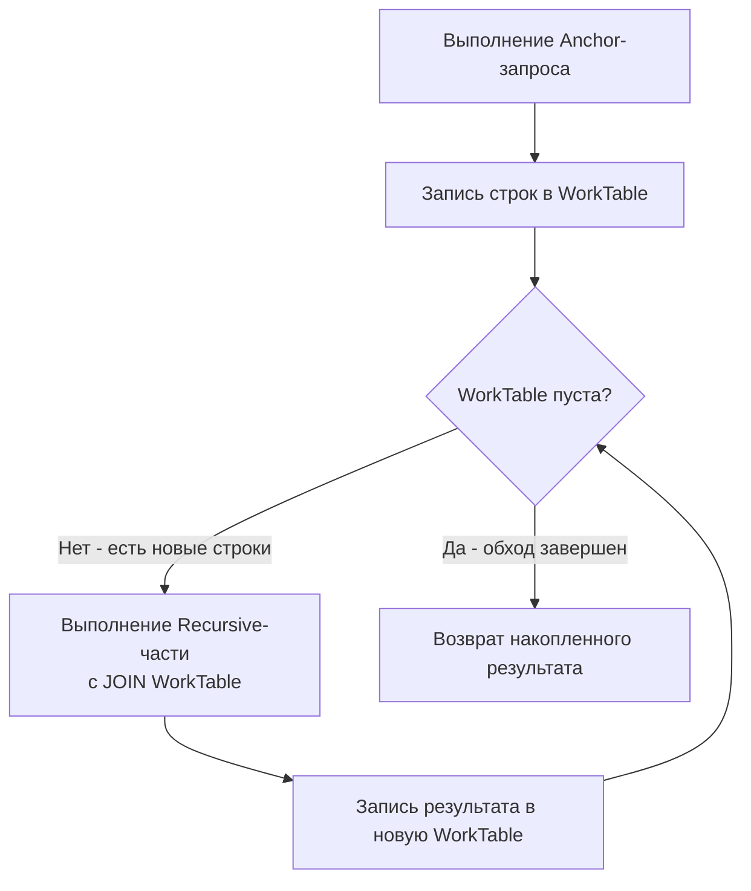

## Рекурсивные запросы: Обход деревьев и графов средствами SQL

В предыдущей статье [[1. CTE. WITH выражения]] мы рассмотрели CTE как инструмент структурирования кода и изоляции вычислений. Но настоящая мощь `WITH` раскрывается, когда к нему добавляется ключевое слово `RECURSIVE`. 

Реляционные базы данных изначально проектировались для работы с плоскими таблицами и множествами. Иерархические данные (деревья комментариев, организационные структуры каталогов) всегда были болью SQL. В классических ООП-языках (C#, Java) вы бы просто прошли по графу объектов через ссылки. В SQL для этого приходилось писать хранимые процедуры или выгружать данные в приложение. 

Рекурсивные CTE позволяют обходить графы и деревья прямо на стороне базы данных, оставляя сервер приложений свободным от ресурсоемких вычислений.

---

## Анатомия рекурсивного CTE

Рекурсивное CTE состоит из двух обязательных частей, объединенных через `UNION ALL`:

1. **Anchor Member (Базовый запрос)**: Нерекурсивная часть, которая задает стартовую точку (корни дерева). Выполняется один раз.
2. **Recursive Member (Рекурсивная часть)**: Ссылается на само CTE. Выполняется итеративно, пока возвращает хотя бы одну строку.

```sql
WITH RECURSIVE tree AS (
    -- 1. Anchor: находим корневые элементы
    SELECT id, parent_id, name, 1 AS depth
    FROM categories
    WHERE parent_id IS NULL

    UNION ALL

    -- 2. Recursive: присоединяем дочерние элементы к уже найденным
    SELECT c.id, c.parent_id, c.name, t.depth + 1
    FROM categories c
    JOIN tree t ON c.parent_id = t.id
)
SELECT * FROM tree;
```

### Пошаговое исполнение под капотом

Слово "рекурсивный" здесь — это логическая абстракция. СУБД не вызывает саму себя в стеке, как это происходит в языках программирования (где каждый вызов создает новый фрейм на стеке потока). Реляционные движки работают с множествами, поэтому исполнение **итеративно**.

> [!info] Под капотом
> В PostgreSQL для исполнения рекурсивного CTE используется концепция **WorkTable** (Рабочей таблицы).
> 1. Планировщик выполняет Anchor-запрос и помещает результат в WorkTable. Этот результат также становится первой порцией финальной выборки.
> 2. Движок входит в цикл: выполняется Recursive-запрос, где вместо `tree` подставляется текущее содержимое WorkTable.
> 3. Результат Recursive-запроса записывается в *новую* временную WorkTable, заменяя старую.
> 4. Если новая WorkTable пуста (не найдено новых дочерних строк), цикл прерывается. Иначе — возврат к шагу 2.
> 5. Все порции данных, накопленные в финальной выборке, возвращаются пользователю.



---

## Mechanical Sympathy: Память, Диск и IO

Раз мы понимаем, что СУБД использует промежуточные WorkTable, возникает вопрос: где они хранятся?

- **В лучшем случае**: Вся иерархия помещается в выделенный `work_mem`. Тогда WorkTable — это просто структуры в оперативной памяти (хэш-таблицы или tuples в памяти процесса), и итерации происходят молниеносно.
- **В худшем случае**: Если дерево огромное (миллионы узлов на уровень), промежуточный результат превысит `work_mem`. В этот момент PostgreSQL начнет сбрасывать WorkTable на диск во временные файлы (spill to disk). Каждая итерация рекурсии будет сопровождаться системными вызовами `write` и `read`, физическими IO-операциями и блокировками. Запрос, который должен был выполниться за миллисекунды, будет выполняться минутами, положив дисковую подсистему.

> [!warning] Ловушка / Gotcha
> В отличие от обычных CTE, рекурсивные CTE в PostgreSQL **всегда материализуются** (являются Optimization Fence). Планировщик не может "протолкнуть" условие `WHERE` из внешнего запроса внутрь рекурсивной части. Если вы пишете `SELECT * FROM tree WHERE depth = 5`, СУБД всё равно вычислит *всё* дерево до 5-го уровня, сохранит его в WorkTable, и только потом отфильтрует. 

---

## Практика: Построение пути (Materialized Path)

Часто при обходе дерева нам нужно не только знать глубину, но и иметь полный путь от корня до текущего узла (например, `Электроника / Смартфоны / Apple`).

```sql
WITH RECURSIVE category_path AS (
    SELECT id, parent_id, name, name::TEXT AS path
    FROM categories
    WHERE parent_id IS NULL

    UNION ALL

    SELECT c.id, c.parent_id, c.name, (cp.path || ' / ' || c.name)::TEXT
    FROM categories c
    JOIN category_path cp ON c.parent_id = cp.id
)
SELECT id, name, path FROM category_path;
```
Обратите внимание на конкатенацию строк. В PostgreSQL конкатенация больших текстов на глубоких уровнях рекурсии может быть затратной, так как на каждой итерации создается новый объект строки в памяти. Для гигантских деревьев предпочтительнее использовать массивы (например, `cp.path || c.id`), так как добавление элемента в конец массива эффективнее склеивания длинных строк.

---

## Защита от циклов (Cyclic Graphs)

Классические деревья не имеют циклов. Но что, если вы работаете с графом (например, социальная сеть, маршруты транспорта), и в данных образовался цикл (A -> B -> C -> A)? 

В этом случае рекурсивное CTE уйдет в бесконечный цикл. WorkTable никогда не станет пустой, процесс забьет CPU и память, пока не упадет по таймауту.

В PostgreSQL 13+ появилось элегантное решение — клауза `CYCLE`:
```sql
WITH RECURSIVE graph AS (
    SELECT id, parent_id, name
    FROM nodes
    WHERE id = 1

    UNION ALL

    SELECT n.id, n.parent_id, n.name
    FROM nodes n
    JOIN graph g ON n.parent_id = g.id
)
CYCLE id SET is_cycle TO true DEFAULT false USING path
SELECT * FROM graph WHERE NOT is_cycle;
```
Под капотом PG добавляет служебные колонки `is_cycle` и `path` (массив пройденных ID). На каждой итерации движок проверяет, есть ли текущий `id` в массиве `path`. Это избавляет от необходимости писать ручную проверку через массивы, как это делали ранее.

---

## Взаимодействие с Go: Сборка дерева в памяти

Главная проблема, с которой сталкиваются Go-разработчики: SQL возвращает **плоский** результат (табличный), а бизнес-логике нужно **дерево** (вложенные структуры). 

Существует два архитектурных подхода к решению этой задачи.

### Подход 1: Рекурсивный CTE + Сборка в Go (Рекомендуемый)

Мы делаем один запрос к БД с использованием `WITH RECURSIVE`, получаем плоский список с указанием `parent_id` (или уровня `depth`), и собираем дерево в памяти приложения.

Плюсы: Минимальная нагрузка на CPU базы данных (БД лучше делает джойны, чем агрегации и JSON-генерацию). Легко кэшировать структуру в Redis.

```go
package model

// Category представляет плоскую строку из БД
type Category struct {
	ID       int64  `db:"id"`
	ParentID *int64 `db:"parent_id"` // NULL для корней
	Name     string `db:"name"`
	Depth    int    `db:"depth"`
}

// CategoryTree представляет собранное дерево
type CategoryTree struct {
	Category
	Children []*CategoryTree
}
```

```go
package repository

import (
	"context"
	"database/sql"
	"fmt"

	"github.com/jmoiron/sqlx"
)

const recursiveTreeSQL = `
WITH RECURSIVE tree AS (
    SELECT id, parent_id, name, 1 AS depth
    FROM categories
    WHERE parent_id IS NULL

    UNION ALL

    SELECT c.id, c.parent_id, c.name, t.depth + 1
    FROM categories c
    JOIN tree t ON c.parent_id = t.id
)
SELECT id, parent_id, name, depth FROM tree ORDER BY depth, name
`

// FetchCategoryTree получает плоский список и собирает дерево
func FetchCategoryTree(ctx context.Context, db *sqlx.DB) ([]*model.CategoryTree, error) {
	var flatList []model.Category
	err := sqlx.SelectContext(ctx, db, &flatList, recursiveTreeSQL)
	if err != nil {
		return nil, fmt.Errorf("failed to fetch recursive tree: %w", err)
	}

	// Мапа для быстрого поиска узлов за O(1)
	nodeMap := make(map[int64]*model.CategoryTree, len(flatList))
	// Слайс корневых элементов
	var roots []*model.CategoryTree

	// Первый проход: маппинг всех узлов
	for _, item := range flatList {
		nodeMap[item.ID] = &model.CategoryTree{
			Category: item,
		}
	}

	// Второй проход: линковка родителей и детей
	for _, item := range flatList {
		if item.ParentID == nil {
			// Если нет родителя - это корень
			roots = append(roots, nodeMap[item.ID])
		} else {
			// Находим родителя в мапе и добавляем текущий узел в его детей
			parentNode, exists := nodeMap[*item.ParentID]
			if exists {
				parentNode.Children = append(parentNode.Children, nodeMap[item.ID])
			}
		}
	}

	return roots, nil
}
```

> [!info] Под капотом (Go)
> Обратите внимание на сборку дерева через мапу (`nodeMap`). Это классический алгоритм со сложностью O(N). Если бы мы искали детей через вложенные циклы (для каждого родителя сканировать массив), сложность была бы O(N^2), что при 10 000 категорий привело бы к 100 миллионам итераций и аллокациям, заставив Garbage Collector Go работать на износ.

### Подход 2: JSON-агрегация на стороне БД

PostgreSQL позволяет внутри рекурсивного CTE (или после него) агрегировать детей в JSON с помощью функций `jsonb_agg`.

```sql
-- Упрощенный пример агрегации
WITH RECURSIVE tree AS ( ... )
SELECT jsonb_agg(to_jsonb(t))
FROM tree t;
```

Минусы: СУБД выполняет тяжелые процессорные вычисления по конструированию JSON. При высоких RPS это может стать узким местом (CPU bottleneck на сервере БД). Кроме того, сгенерированный JSON может быть огромным, что приведет к колоссальным аллокациям в куче (Heap) при десериализации через `json.Unmarshal` в Go.

---

> [!tip] Собеседование
> **Вопрос:** Что будет, если в рекурсивном CTE использовать `UNION` вместо `UNION ALL`?
> **Ответ:** `UNION` удаляет дубликаты строк. На каждой итерации СУБД будет вынуждена выполнять сортировку или хеширование всего набора данных, чтобы найти и удалить дубликаты. Это не только убьет производительность (сортировка миллионов строк — это всегда spill to disk и тяжелые IO-операции), но и **сломает логику обхода графов с циклами**: `UNION` отбросит повторные посещения узлов, что может стать неожиданным способом предотвращения бесконечных циклов, но ценой катастрофической просадки скорости. Всегда используйте `UNION ALL` в рекурсивных CTE.

## Итог

1. **Рекурсивные CTE** — это мощный инструмент для обхода иерархий, но он требует понимания того, как СУБД исполняет запросы итеративно через WorkTable.
2. В PostgreSQL рекурсивные CTE **всегда материализуются**. Используйте их для вычислений, а не для фильтрации.
3. Следите за объемами данных: превышение `work_mem` вызовет сброс на диск и деградацию производительности из-за IO.
4. Защищайтесь от циклов в графах с помощью `CYCLE` (PG 13+) или ручного отслеживания пути.
5. В Go правильнее использовать плоские выборки из CTE с последующей O(N) сборкой дерева в памяти через хэш-мапу.

Рекурсивные запросы идеально подходят для работы со структурами данных, где важен порядок обхода. В следующей статье мы перейдем к еще более мощному инструменту анализа данных, который работает с окнами строк — [[3. Оконные функции. OVER]].
