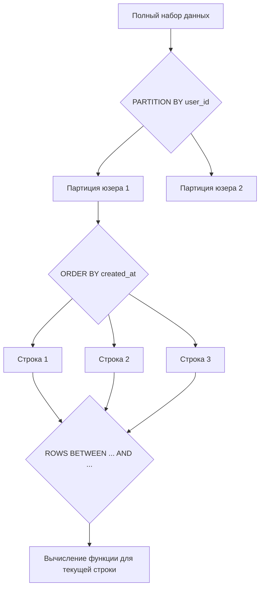

## Оконные функции: Аналитика без потери строк

В классическом SQL агрегатные функции (`SUM`, `COUNT`, `AVG`) неразрывно связаны с оператором `GROUP BY`. Их главный побочный эффект — **схлопывание** строк. Если вы считаете сумму заказов по пользователям, вы теряете информацию о каждом конкретном заказе. 

Что, если нужно показать список заказов и рядом — общую сумму заказов этого пользователя? До появления оконных функций это решалось коррелирующими подзапросами (которые выполнялись на каждую строку, убивая производительность) или джойнами с агрегациями.

**Оконные функции (Window Functions)** позволяют выполнять вычисления по набору строк, связанных с текущей строкой, но при этом **не схлопывать** результат в одну строку. Каждая строка в результирующем наборе сохраняет свою индивидуальность, обогащаясь результатом вычисления "по соседним строкам".

---

## Анатомия: Ключевое слово OVER

Любая оконная функция вызывается с добавлением синтаксической конструкции `OVER()`. Именно она превращает обычную агрегатную функцию в оконную.

```sql
SELECT 
    order_id,
    user_id,
    amount,
    -- Обычная агрегация: схлопнет все строки в одну
    SUM(amount) AS total_amount,
    -- Оконная функция: добавит колонку к каждой строке
    SUM(amount) OVER () AS total_amount_window
FROM orders;
```

Конструкция `OVER()` определяет "окно", в котором работает функция. Оно состоит из трех компонентов:
1. **PARTITION BY** — делит набор строк на разделы (партиции), аналогично `GROUP BY`, но без схлопывания.
2. **ORDER BY** — задает порядок строк внутри партиции (критично для функций ранжирования и нарастающих итогов).
3. **ROWS/RANGE** (Frame) — определяет границы подмножества строк внутри партиции (скользящее окно).



---

## Под капотом: Как СУБД исполняет оконные функции

Понимание того, как планировщик обрабатывает оконные функции, — ключ к написанию производительных запросов.

Когда СУБД встречает `OVER()`, она не может просто отдать данные сразу, как при простом `SELECT`. Ей необходимо увидеть **весь** набор данных, чтобы отсортировать его и разбить на партиции. 

### План выполнения (EXPLAIN)

Если вы выполните `EXPLAIN` запроса с оконной функцией, вы увидите узел **WindowAgg** (в PostgreSQL) или похожий в других СУБД.

Шаги выполнения под капотом:
1. СУБД выполняет всё, что идет до `SELECT` (`FROM`, `JOIN`, `WHERE`, `GROUP BY`, `HAVING`), формируя промежуточный набор данных.
2. Данные сортируются по ключам из `PARTITION BY` и `ORDER BY`. Если в запросе несколько разных `OVER()` с разными условиями сортировки, СУБД придется отсортировать данные несколько раз (часто через неявные Sort-узлы или неэффективные параллельные хэш-джойны). 
3. Узел `WindowAgg` сканирует отсортированные данные. Как только значение в колонке `PARTITION BY` меняется, СУБД "закрывает" текущую партицию и начинает обрабатывать новую.

> [!info] Под капотом
> В PostgreSQL узел `WindowAgg` работает только с одной партицией за раз. Это крайне важно для потребления памяти. Если партиция небольшая (например, заказы одного пользователя), она целиком помещается в `work_mem`, и вычисления летают. Но если партиция огромна (например, `PARTITION BY date`, где на один день приходится миллион строк), и внутри нее требуется `ORDER BY`, то для сортировки этой партиции может не хватить `work_mem`, и СУБД начнет сбрасывать данные на диск (spill to disk).

### Mechanical Sympathy: Цена сортировки

Оконные функции практически всегда требуют сортировки. Сортировка — это $O(N \log N)$. 
На уровне CPU это означает интенсивную работу с кэш-линиями. Алгоритмы сортировки (например, Timsort или Quicksort, используемые в Postgres) постоянно сравнивают элементы, находящиеся далеко друг от друга в памяти. Это вызывает Cache Misses, процессор простаивает, ожидая подгрузки данных из RAM.

Если данные льются на диск, ситуация становится катастрофической: множественные случайные IO-операции блокируют поток выполнения (в контексте Go — горутину, делающую запрос к БД, если драйвер не использует асинхронный IO).

---

## Границы окна (Frame Clause): Нарастающие итоги

Если вы укажете только `ORDER BY` в `OVER()`, поведение по умолчанию изменится. Функция будет считать результат не по всей партиции, а **от первой строки партиции до текущей строки включительно**. Это идеальный инструмент для нарастающих итогов (Running Total).

```sql
SELECT 
    order_id,
    user_id,
    amount,
    -- Сумма от первого заказа юзера до текущего
    SUM(amount) OVER (PARTITION BY user_id ORDER BY created_at) AS running_total
FROM orders;
```

Если вам нужно, чтобы `SUM` считалась по *всей* партиции, несмотря на `ORDER BY`, нужно явно задать границы окна:

```sql
SUM(amount) OVER (
    PARTITION BY user_id 
    ORDER BY created_at 
    ROWS BETWEEN UNBOUNDED PRECEDING AND UNBOUNDED FOLLOWING
)
```

> [!warning] Ловушка / Gotcha
> Разница между `ROWS` и `RANGE` в границах окна — излюбленный вопрос на собеседованиях и источник багов.
> - `ROWS` работает с физическими строками. Если у вас две строки с одинаковым `created_at`, `ROWS` остановится строго на текущей физической строке.
> - `RANGE` (по умолчанию) работает с логическими значениями. Если у вас дубликаты в `ORDER BY`, `RANGE` включит в окно *все* строки с таким же значением. Это может привести к неверному нарастающему итогу, если вы ожидали строгой последовательности.

---

## Порядок выполнения SQL и оконные функции

Это критический момент, на котором обжигаются все новички.

Оконные функции выполняются **ПОСЛЕ** `WHERE`, `GROUP BY` и `HAVING`, но **ДО** `ORDER BY` и `DISTINCT`.

Это означает, что вы **не можете** использовать оконную функцию в секции `WHERE`. 

```sql
-- ЭТО НЕ СРАБОТАЕТ
SELECT order_id, user_id, amount, 
       ROW_NUMBER() OVER (PARTITION BY user_id ORDER BY amount DESC) as rn
FROM orders
WHERE rn = 1; -- ОШИБКА: колонка rn не существует
```

Чтобы отфильтровать по результатам оконной функции, необходимо обернуть запрос в CTE или подзапрос (подробнее в [[1. CTE. WITH выражения]]):

```sql
WITH ranked_orders AS (
    SELECT order_id, user_id, amount, 
           ROW_NUMBER() OVER (PARTITION BY user_id ORDER BY amount DESC) as rn
    FROM orders
)
SELECT * FROM ranked_orders WHERE rn = 1;
```

---

## Интеграция с Go: Обработка скользящих окон

Поскольку оконные функции не уменьшают количество строк (если только вы не фильтруете их через CTE), вы должны быть осторожны при сканировании результатов в Go. 

Если вы вытягиваете миллион заказов с нарастающим итогом, вы должны убедиться, что ваш код не аллоцирует в куче (Heap) избыточные структуры. 

```go
package repository

import (
	"context"
	"database/sql"
	"fmt"

	"github.com/jmoiron/sqlx"
)

// OrderStats отражает строку с результатами оконной функции
type OrderStats struct {
	OrderID      int64   `db:"order_id"`
	UserID       int64   `db:"user_id"`
	Amount       float64 `db:"amount"`
	RunningTotal float64 `db:"running_total"` // Результат оконной функции
}

const runningTotalSQL = `
SELECT 
    order_id, 
    user_id, 
    amount, 
    SUM(amount) OVER (PARTITION BY user_id ORDER BY created_at) AS running_total
FROM orders
WHERE created_at > $1
`

// GetRunningTotals использует sqlx для маппинга сканируемого ряда
func GetRunningTotals(ctx context.Context, db *sqlx.DB, since string) ([]OrderStats, error) {
	rows, err := db.QueryxContext(ctx, runningTotalSQL, since)
	if err != nil {
		return nil, fmt.Errorf("failed to query running totals: %w", err)
	}
	defer rows.Close()

	// Предварительно аллоцируем слайс, если знаем примерный размер,
	// чтобы избежать частых реаллокаций и давления на GC.
	// Предположим, ожидаем около 1000 записей.
	results := make([]OrderStats, 0, 1000) 

	for rows.Next() {
		var stat OrderStats
		// StructScan использует рефлексию. Для узких мест в hot path
		// лучше использовать ручной rows.Scan(), чтобы избежать оверхеда reflect.
		if err := rows.StructScan(&stat); err != nil {
			return nil, fmt.Errorf("failed to scan row: %w", err)
		}
		results = append(results, stat)
	}

	if err := rows.Err(); err != nil {
		return nil, fmt.Errorf("rows iteration error: %w", err)
	}

	return results, nil
}
```

> [!tip] Собеседование
> **Вопрос:** В чем разница между `GROUP BY` и оконными функциями с `PARTITION BY`? Что будет быстрее?
> **Ответ:** `GROUP BY` схлопывает строки, возвращая по одной строке на группу. `PARTITION BY` сохраняет все исходные строки, добавляя к ним вычисленные агрегаты. С точки зрения производительности, `GROUP BY` обычно быстрее, так как СУБД может использовать Hash Aggregate (хэширование и сброс промежуточных результатов), тогда как оконные функции требуют сортировки (Sort) всего набора данных и часто потребляют больше `work_mem`, так как не могут отдавать результаты "на лету", пока партиция не будет полностью обработана. Оконные функции следует использовать только тогда, когда нужна детализация строк.

## Итог

1. **Оконные функции** добавляют агрегированные данные к строкам, не схлопывая сам набор данных.
2. Конструкция `OVER (PARTITION BY ... ORDER BY ...)` определяет, как данные группируются и сортируются для вычисления.
3. **Под капотом:** Оконные функции требуют сортировки, что может привести к дорогостоящим IO-операциям при превышении `work_mem` (spill to disk).
4. Оконные функции выполняются после `WHERE` и `GROUP BY`. Для фильтрации по их результатам обязательно используйте CTE или подзапросы.
5. В Go будьте внимательны к объему возвращаемых данных: оконные функции могут вернуть огромные датасеты, которые вызовут сильное давление на аллокатор и GC.

Оконные функции — это не только агрегации. Их самая популярная категория — функции ранжирования, позволяющие присваивать строкам номера мест. Именно их мы разберем в следующей статье: [[4. ROW_NUMBER, RANK, DENSE_RANK]].
