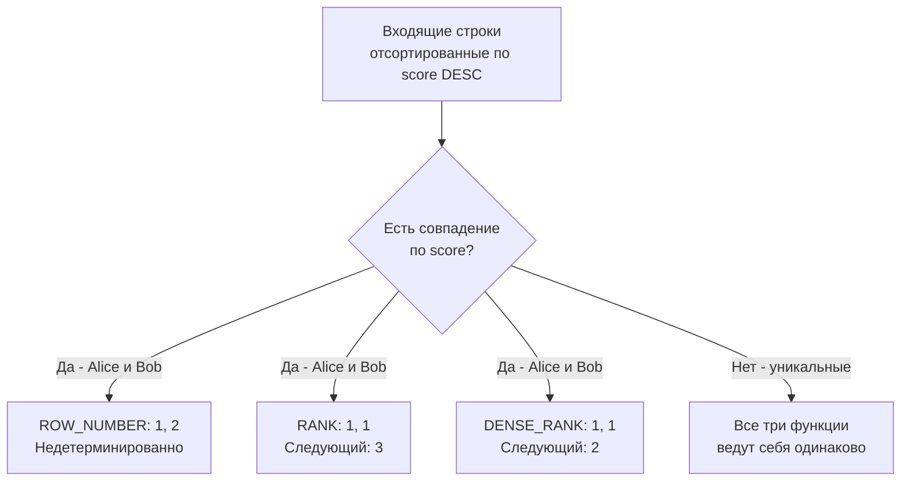

## Функции ранжирования: ROW_NUMBER, RANK, DENSE_RANK

В предыдущей статье [[3. Оконные функции. OVER]] мы познакомились с концепцией окон и тем, как СУБД исполняет их под капотом. Теперь мы переходим к самому популярному классу оконных функций — **функциям ранжирования**.

Если вам нужно пронумеровать строки, составить лидерборд или выбрать самую свежую запись в каждой группе, без этих функций не обойтись. На собеседованиях знание разницы между ними и умение применять их для решения задачи "Top-N per group" — это маркер уровня Middle+.

---

## Тройка лидеров: В чем разница?

Все три функции возвращают числовое значение (ранг) для каждой строки внутри партиции. Разница заключается в том, как они обрабатывают "ничьи" — строки, имеющие одинаковые значения в `ORDER BY`.

Для наглядности возьмем таблицу игроков и их очков:

| player | score |
|--------|-------|
| Alice  | 100   |
| Bob    | 100   |
| Charlie| 90    |
| Dave   | 80    |

### 1. ROW_NUMBER()
Просто нумерует строки по порядку: 1, 2, 3, 4. Если строки имеют одинаковые значения в `ORDER BY` (Alice и Bob), `ROW_NUMBER` всё равно выдаст им уникальные номера (1 и 2). Кто получит 1, а кто 2 — **не детерминировано**, если в `ORDER BY` нет дополнительных уникальных колонок.

```sql
SELECT player, score,
       ROW_NUMBER() OVER (ORDER BY score DESC) as rn
FROM players;
```
*Результат: Alice (1), Bob (2), Charlie (3), Dave (4). Или Bob (1), Alice (2)...*

### 2. RANK()
Присваивает одинаковый ранг строкам с одинаковыми значениями. При этом следующий ранг "перепрыгивает" через количество совпадений.
```sql
SELECT player, score,
       RANK() OVER (ORDER BY score DESC) as rnk
FROM players;
```
*Результат: Alice (1), Bob (1), Charlie (3), Dave (4).* 
Третье место пропущено, потому что два человека поделили первое.

### 3. DENSE_RANK()
Работает как `RANK`, но не пропускает ранги после совпадений. "Плотная" нумерация.
```sql
SELECT player, score,
       DENSE_RANK() OVER (ORDER BY score DESC) as drnk
FROM players;
```
*Результат: Alice (1), Bob (1), Charlie (2), Dave (3).*



---

## Под капотом: Peer Groups и Детерминизм

В рантайме СУБД (например, узел `WindowAgg` в PostgreSQL) при обработке оконной функции с `ORDER BY` вводит концепцию **Peer Groups (группы равных)**. Строки, имеющие одинаковые значения во всех выражениях `ORDER BY` окна, образуют peer group.

- `RANK` и `DENSE_RANK` опираются именно на peer groups. Всем строкам в одной группе присваивается один и тот же ранг (равный рангу первой строки в группе).
- `ROW_NUMBER` игнорирует peer groups и просто инкрементирует внутренний счетчик для каждой строки.

> [!warning] Ловушка / Gotcha
> **Недетерминированность `ROW_NUMBER`** — причина множества багов в продакшене. Если вы используете `ROW_NUMBER() OVER (PARTITION BY user_id ORDER BY created_at DESC)` для выбора последней записи, а у пользователя есть две записи с точностью до секунды (одинаковый `created_at`), СУБД может вернуть любую из них. Результат будет зависеть от физического расположения строк на диске и может меняться между запусками или после `VACUUM`.
> **Решение:** Всегда добавляйте в `ORDER BY` уникальный tie-breaker (разрешитель ничьей), например, первичный ключ: `ORDER BY created_at DESC, id DESC`.

### Mechanical Sympathy: Параллельное исполнение

В современных СУБД (PostgreSQL 11+) оконные функции могут выполняться параллельно. Узел `Gather Merge` собирает отсортированные данные от нескольких воркеров.
Если вы используете `ROW_NUMBER()` без уникального `ORDER BY`, параллельное исполнение приведет к тому, что ранги будут "прыгать" при каждом выполнении запроса, так как порядок возвращения строк от разных CPU-ядров (воркеров) не гарантирован. Это особенно критично при пагинации на основе `ROW_NUMBER`.

---

## Паттерн "Top-N per Group" в Go

Самая частая задача для `ROW_NUMBER` — выбрать N последних (или самых дорогих) записей для каждой группы. Например, получить 3 последних заказа каждого пользователя.

В классическом SQL это решается через CTE (см. [[1. CTE. WITH выражения]]) и фильтрацию по `ROW_NUMBER`.

```sql
WITH ranked_orders AS (
    SELECT 
        user_id,
        order_id,
        amount,
        created_at,
        ROW_NUMBER() OVER (PARTITION BY user_id ORDER BY created_at DESC, order_id DESC) as rn
    FROM orders
    WHERE status = 'COMPLETED'
)
SELECT user_id, order_id, amount, created_at
FROM ranked_orders
WHERE rn <= 3;
```

### Работа с результатом в Go

Главная ошибка — пытаться собрать иерархию (User -> []Orders) прямо при сканировании строк из такого запроса. Поскольку результат всё еще плоский (строки с `rn=1, 2, 3` идут подряд для каждого юзера), эффективнее использовать подход с преаллоцированными слайсами и мапами.

```go
package repository

import (
	"context"
	"database/sql"
	"fmt"

	"github.com/jmoiron/sqlx"
)

// UserLatestOrders содержит юзера и его последние заказы
type UserLatestOrders struct {
	UserID   int64
	Orders   []Order
}

type Order struct {
	ID        int64
	Amount    float64
	CreatedAt string
}

const topNPerUserSQL = `
WITH ranked_orders AS (
    SELECT 
        user_id, order_id, amount, created_at,
        ROW_NUMBER() OVER (PARTITION BY user_id ORDER BY created_at DESC, order_id DESC) as rn
    FROM orders
    WHERE status = $1
)
SELECT user_id, order_id, amount, created_at
FROM ranked_orders
WHERE rn <= 3
`

// GetTop3OrdersPerUser извлекает плоский набор и группирует в Go
func GetTop3OrdersPerUser(ctx context.Context, db *sqlx.DB, status string) (map[int64]*UserLatestOrders, error) {
	rows, err := db.QueryxContext(ctx, topNPerUserSQL, status)
	if err != nil {
		return nil, fmt.Errorf("failed to query top N orders: %w", err)
	}
	defer rows.Close()

	// Мапа для агрегации. Используем указатель на структуру,
	// чтобы не копировать данные при добавлении заказов.
	result := make(map[int64]*UserLatestOrders)

	for rows.Next() {
		var (
			userID    int64
			orderID   int64
			amount    float64
			createdAt string
		)

		if err := rows.Scan(&userID, &orderID, &amount, &createdAt); err != nil {
			return nil, fmt.Errorf("failed to scan row: %w", err)
		}

		// Если юзера еще нет в мапе — создаем
		userData, exists := result[userID]
		if !exists {
			userData = &UserLatestOrders{
				UserID: userID,
				// Мы знаем, что заказов будет не более 3, преаллоцируем слайс
				Orders: make([]Order, 0, 3),
			}
			result[userID] = userData
		}

		// Добавляем заказ
		userData.Orders = append(userData.Orders, Order{
			ID:        orderID,
			Amount:    amount,
			CreatedAt: createdAt,
		})
	}

	if err := rows.Err(); err != nil {
		return nil, fmt.Errorf("rows iteration error: %w", err)
	}

	return result, nil
}
```

> [!info] Под капотом (Go)
> В коде выше мы используем мапу `map[int64]*UserLatestOrders` и преаллоцируем слайс `make([]Order, 0, 3)`. Это критично для производительности. 
> Если бы мы использовали `map[int64]UserLatestOrders` (без указателя), при каждом `append` к `Orders` Go пришлось бы копировать всю структуру `UserLatestOrders` в новое место в куче (Heap), так как слайсы хранят указатель на базовый массив. Это вызвало бы колоссальное давление на Garbage Collector при больших выборках.

---

## Удаление дубликатов через ROW_NUMBER

В Go-бэкенде часто возникает задача очистки данных: оставить только самую актуальную версию записи, а старые дубликаты удалить. 

С помощью `ROW_NUMBER` это делается в два шага:
1. Находим ID строк, которые нужно оставить (`rn = 1`).
2. Удаляем всё остальное.

```sql
DELETE FROM events
WHERE id NOT IN (
    SELECT id
    FROM (
        SELECT id,
               ROW_NUMBER() OVER (PARTITION BY user_id, event_type ORDER BY created_at DESC) as rn
        FROM events
    ) t
    WHERE t.rn = 1
);
```
*Примечание:* На огромных таблицах такой `DELETE` заблокирует множество строк и создаст нагрузку на WAL/IO. В высоконагруженных системах часто предпочитают переносить нужные данные в новую таблицу (CTAS - Create Table As Select), а затем делать `TRUNCATE` старой.

---

> [!tip] Собеседование
> **Вопрос:** В чем разница между `RANK()` и `DENSE_RANK()`? Приведите пример, когда использование `ROW_NUMBER()` приведет к багу.
> **Ответ:** `RANK()` оставляет "дыры" в нумерации после одинаковых значений (1, 1, 3), а `DENSE_RANK()` нумерует плотно (1, 1, 2). Использование `ROW_NUMBER()` приведет к багу при пагинации или выборе "Top-1" записи, если в `ORDER BY` оконной функции есть неуникальные значения (ничьи). `ROW_NUMBER` присвоит случайный порядок таким строкам, и при перезапросе (например, переходе на вторую страницу) порядок может измениться, и пользователь увидит одну и ту же строку дважды или пропустит её.

## Итог

1. `ROW_NUMBER` — уникальный номер строки. Требует детерминированного `ORDER BY` (с tie-breaker), иначе результат случаен.
2. `RANK` и `DENSE_RANK` — ранжирование с учетом "ничьих" (peer groups). `RANK` пропускает номера, `DENSE_RANK` — нет.
3. Под капотом ранжирование опирается на сортировку партиций. При превышении `work_mem` сортировка льется на диск.
4. В Go для паттерна "Top-N per group" используйте плоскую выборку с `ROW_NUMBER` с последующей группировкой через мапы указателей, чтобы минимизировать аллокации в куче и снизить нагрузку на GC.

Ранжирование — это работа со строками относительно друг друга. Но что, если нам нужно сравнить строку не с рангом, а с конкретным значением в соседней строке? Об этом в следующей статье: [[5. LEAD, LAG]].
