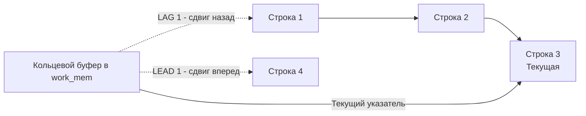

## Смещения во времени: LEAD и LAG

В предыдущей статье мы научились присваивать строкам номера и ранги с помощью [[4. ROW_NUMBER, RANK, DENSE_RANK]]. Но что, если нам нужно сравнить текущую строку не с абстрактным номером, а с реальными данными из предыдущей или следующей строки? 

В классическом SQL до появления оконных функций это приводило к кошмару из само-джойнов (Self-Joins). Вам приходилось делать `JOIN table t1 ON t1.id = t2.id - 1`, что не только приводило к ошибкам при наличии пропусков в ID, но и вызывало взрывной рост вычислительной сложности. 

Оконные функции **LEAD** и **LAG** решают эту проблему элегантно, позволяя "заглядывать" вперед или назад по набору данных без единого `JOIN`.

---

## Синтаксис и базовая логика

Обе функции работают по одному принципу: они берут выражение (обычно колонку) и возвращают его значение со смещением (offset) относительно текущей строки в рамках партиции.

- **LAG** — смещение **назад** (в прошлое). Заглядывает в строки, которые идут *до* текущей.
- **LEAD** — смещение **вперед** (в будущее). Заглядывает в строки, которые идут *после* текущей.

```sql
LAG  (expression, offset, default) OVER (...)
LEAD (expression, offset, default) OVER (...)
```

- `expression` — колонка или выражение, значение которой мы хотим получить.
- `offset` — на сколько строк сдвигаться. По умолчанию 1 (необязательный параметр).
- `default` — что вернуть, если строки по смещению не существует (например, для первой строки в `LAG`). По умолчанию `NULL` (необязательный параметр).

Пример: разница в днях между текущим и предыдущим заказом пользователя.
```sql
SELECT 
    user_id,
    order_id,
    created_at,
    -- Берем дату предыдущего заказа
    LAG(created_at, 1) OVER (PARTITION BY user_id ORDER BY created_at) AS prev_order_at
FROM orders;
```

---

## Под капотом: Sequential Scan и Spooling

Чтобы понять, почему `LAG` быстрее само-джойнов, нужно посмотреть на то, как СУБД исполняет эти функции на уровне оператора `WindowAgg`.

Для функций со смещением (positional window functions) СУБД не нужно держать в памяти всю партицию целиком, как это требуется для `RANK()` или `SUM()`. 

### Mechanical Sympathy: Доступ к памяти

Представьте, как работает само-джойн для вычисления предыдущего значения:
1. СУБД создает хэш-таблицу по ключу или сортирует таблицу.
2. Для каждой строки текущей таблицы она ищет строку в хэш-таблице. 
Это означает случайный доступ (Random Access) к памяти. На уровне CPU кэш-линии промахиваются (Cache Misses), процессор простаивает, ожидая данные из RAM, а не из L1/L2 кэша.

Как работает `LAG` в операторе `WindowAgg`:
1. Данные сортируются один раз.
2. СУБД читает данные **последовательно** (Sequential Scan).
3. Для `LAG(offset)` движок использует структуру данных типа "кольцевой буфер" (Circular Buffer) или очередь (FIFO) в памяти `work_mem`. 
4. Когда запрашивается `LAG(col, 1)`, оператор просто заглядывает на 1 позицию назад в этом буфере. Данные с вероятностью 99% все еще находятся в L1/L2 кэше процессора, так как были прочитаны только что.



> [!info] Под капотом
> В PostgreSQL механизм отложенного чтения для `LEAD` называется **Spooling** (перемотка). Поскольку СУБД читает данные последовательно, чтобы вычислить `LEAD(1)` для текущей строки, она должна уже "увидеть" следующую. 
> Внутри `WindowAgg` есть специальный режим `WINDOW_SEEK_CURRENT`. Движок при чтении строки N немедленно вычисляет `LAG`, но откладывает эмиссию строки наружу, пока не прочитает строку N+1 (чтобы вычислить `LEAD`). Затем он возвращается к строке N, заполняет все значения и отдает наверх. Это обеспечивает строгую потоковую обработку без полной материализации партиции.

---

## Практика: Сессионизация данных

Классическая задача для Senior-собеседования — **сессионизация логов**. У вас есть поток событий от пользователей (клики, просмотры). Вам нужно разбить эти события на "сессии": если между событиями прошло больше 30 минут, считается, что началась новая сессия.

Без `LAG` эта задача превращается в рекурсивные CTE или экзотические процедурные расширения. С `LAG` она решается в два шага.

```sql
WITH event_gaps AS (
    -- Шаг 1: Вычисляем временной зазор между текущим и предыдущим событием
    SELECT 
        user_id,
        event_time,
        event_time - LAG(event_time) OVER (PARTITION BY user_id ORDER BY event_time) AS time_diff
    FROM user_events
),
session_markers AS (
    -- Шаг 2: Если зазор больше 30 минут, ставим маркер новой сессии (1), иначе 0
    SELECT 
        user_id,
        event_time,
        CASE WHEN time_diff > INTERVAL '30 minutes' OR time_diff IS NULL THEN 1 ELSE 0 END AS is_new_session
    FROM event_gaps
)
-- Шаг 3: Суммируем маркеры нарастающим итогом, чтобы получить ID сессии
SELECT 
    user_id,
    event_time,
    SUM(is_new_session) OVER (PARTITION BY user_id ORDER BY event_time) AS session_id
FROM session_markers;
```
Этот запрос содержит сразу две оконные функции: `LAG` для поиска разрыва и `SUM() OVER()` для генерации идентификатора сессии. Никаких джойнов, полная потоковая обработка.

---

## Взаимодействие с Go: Проблема NULL

Главная ловушка при использовании `LAG` и `LEAD` в Go — возвращаемые ими значения `NULL`. Первая строка в партиции для `LAG` не имеет предыдущего значения. СУБД вернет `NULL`.

Если вы попытаетесь отсканировать это в обычный `time.Time` или `float64` в Go, `rows.Scan()` упадет с паникой или ошибкой: `sql: Scan error on column index 1: unsupported Scan, storing driver.Value type <nil> into type *time.Time`.

У вас есть два архитектурных пути решения.

### Путь 1: Обработка на уровне SQL (Рекомендуемый)

Всегда старайтесь избавляться от `NULL` на уровне SQL, используя третий аргумент `LAG/LEAD` или функцию `COALESCE`. Это делает маппинг в Go тривиальным и убирает необходимость аллокаций под обертки.

```sql
-- Если предыдущего значения нет, вернем текущее (зазор = 0)
LAG(created_at, 1, created_at) OVER (...) AS prev_order_at
```
В этом случае зазор `created_at - prev_order_at` для первой строки будет равен `0`, и в Go мы спокойно сканируем это в `time.Time`.

### Путь 2: Использование sql.Null* в Go

Если логика требует обязательного различия между "нулевым значением" и "отсутствием значения" (например, разница в 0 секунд и "это первый заказ"), в Go приходится использовать типы из пакета `database/sql`.

```go
package repository

import (
	"context"
	"database/sql"
	"fmt"
	"time"

	"github.com/jmoiron/sqlx"
)

// OrderWithLag отражает строку с потенциально NULL полем
type OrderWithLag struct {
	OrderID   int64
	CreatedAt time.Time
	PrevAt    sql.NullTime // Обертка для NULLable time
}

const lagQuery = `
SELECT 
    order_id, 
    created_at,
    LAG(created_at) OVER (PARTITION BY user_id ORDER BY created_at) AS prev_at
FROM orders
WHERE user_id = $1
`

// GetUserOrdersWithLag демонстрирует работу с sql.NullTime
func GetUserOrdersWithLag(ctx context.Context, db *sqlx.DB, userID int64) ([]OrderWithLag, error) {
	rows, err := db.QueryxContext(ctx, lagQuery, userID)
	if err != nil {
		return nil, fmt.Errorf("failed to query orders with lag: %w", err)
	}
	defer rows.Close()

	var results []OrderWithLag
	for rows.Next() {
		var o OrderWithLag
		if err := rows.Scan(&o.OrderID, &o.CreatedAt, &o.PrevAt); err != nil {
			return nil, fmt.Errorf("failed to scan row: %w", err)
		}

		// Обработка NullTime только если валидно
		if o.PrevAt.Valid {
			// Можно вычислить длительность между заказами
			duration := o.CreatedAt.Sub(o.PrevAt.Time)
			_ = duration // используем duration по бизнес-логике
		}

		results = append(results, o)
	}

	if err := rows.Err(); err != nil {
		return nil, fmt.Errorf("rows iteration error: %w", err)
	}

	return results, nil
}
```

> [!warning] Ловушка / Gotcha
> Использование `sql.NullTime`, `sql.NullString` и их аналогов влечет за собой микроаллокации в куче (Heap), если компилятор Go не сможет доказать, что переменная не "убегает" из функции (Escape Analysis). В высоконагруженных хэндлерах (десятки тысяч RPS) сканирование 10 колонок с `Null*` типами на каждую строку может заметно нагрузить Garbage Collector. По возможности, избегайте `NULL` в результатах SQL-запросов, приводя их к дефолтным значениям на уровне БД.

---

> [!tip] Собеседование
> **Вопрос:** Чем `LAG` лучше Self-Join для сравнения строк со смещением? Как это работает под капотом?
> **Ответ:** Self-Join требует соединения таблицы с самой собой (через Hash Join или Merge Join), что подразумевает случайный доступ к памяти (Cache Misses на уровне CPU) и алгоритмическую сложность как минимум $O(N \log N)$ или $O(N^2)$ в худшем случае. `LAG` использует оператор `WindowAgg`, который работает с данными последовательно (Sequential Scan). Для `LAG` движок использует кольцевой буфер (FIFO) в `work_mem`. Данные, которые были только что прочитаны, все еще лежат в L1/L2 кэше процессора, что делает доступ к предыдущей строке практически бесплатным на уровне тактов CPU.

## Итог

1. **LEAD и LAG** — функции позиционного смещения. Позволяют обращаться к другим строкам относительно текущей без дорогих само-джойнов.
2. Под капотом они используют **кольцевые буферы** и последовательное чтение, что делает их максимально дружественными к кэш-линиям CPU.
3. Для `LEAD` СУБД использует механизм **Spooling** (отложенная эмиссия), чтобы заглянуть на строку вперед.
4. Классический паттерн использования — **сессионизация логов** (поиск разрывов во времени между событиями).
5. В Go всегда помните, что `LAG/LEAD` возвращают `NULL` на границах партиций. Используйте третий аргумент функций для дефолтных значений, чтобы избежать аллокаций от `sql.Null*`.

Функции смещения часто комбинируются с классическими агрегатными функциями (`SUM`, `AVG`) внутри окон. В следующей статье мы детально разберем, как работает агрегация в контексте окон и как управлять скользящими окнами: [[6. Агрегация с оконными функциями]].
