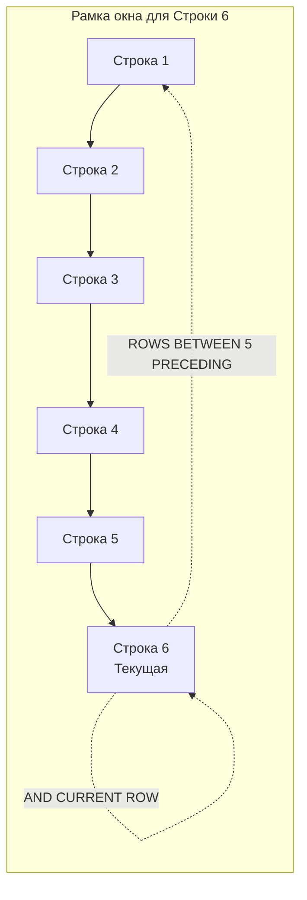

## Агрегация в окнах: Нарастающие итоги и скользящие средние

В предыдущих статьях мы изучили ранжирование ([[4. ROW_NUMBER, RANK, DENSE_RANK]]) и смещения ([[5. LEAD, LAG]]). Теперь мы подошли к той причине, по которой оконные функции вообще были добавлены в стандарт SQL-99 — к вычислению **агрегатных функций** (`SUM`, `AVG`, `COUNT`, `MIN`, `MAX`) без схлопывания строк.

Если вы используете `SUM() OVER (...)`, вы можете получить нарастающий итог (Running Total). Если добавите ограничение рамки — получите скользящее среднее (Moving Average). Но за этой гибкостью скрываются серьезные подводные камни производительности.

---

## Спецификация рамки окна (Frame Specification)

Когда вы пишете оконную функцию с `ORDER BY`, СУБД неявно вводит понятие **рамки (Frame)** — подмножества строк внутри текущей партиции, над которым считается агрегат. 

По стандарту SQL, если в `OVER()` указан `ORDER BY`, рамкой по умолчанию является:
`RANGE BETWEEN UNBOUNDED PRECEDING AND CURRENT ROW`

Это означает: "посчитай агрегат от начала партиции до текущей строки включительно". Это и дает нам нарастающий итог:

```sql
SELECT 
    transaction_id,
    amount,
    -- Нарастающий итог: сумма от первой строки до текущей
    SUM(amount) OVER (ORDER BY transaction_id) AS running_total
FROM transactions;
```

Если же `ORDER BY` в `OVER()` отсутствует, рамкой по умолчанию является вся партиция:
`RANGE BETWEEN UNBOUNDED PRECEDING AND UNBOUNDED FOLLOWING`

### Явное управление рамкой: Скользящее окно

Для аналитики (например, трейдинг, мониторинг метрик) часто нужно считать агрегат не с начала времен, а по "скользящему" окну — например, среднее за последние 7 дней.

Синтаксис рамки:
- `ROWS` — физическое смещение (по количеству строк).
- `RANGE` — логическое смещение (по значению выражения `ORDER BY`).
- `BETWEEN ... AND ...` — границы рамки.

```sql
SELECT 
    date,
    price,
    -- Скользящее среднее: текущая строка и 5 строк перед ней
    AVG(price) OVER (
        ORDER BY date 
        ROWS BETWEEN 5 PRECEDING AND CURRENT ROW
    ) AS moving_avg_5
FROM stock_prices;
```



---

## Под капотом: Инверсивные функции (Moving-Aggregate)

Наивная реализация скользящего окна в СУБД работала бы так: для каждой строки берется подмножество строк из рамки и агрегат считается с нуля. Сложность такого алгоритма — $O(N \cdot W)$, где $N$ — количество строк, а $W$ — размер рамки. Для рамки в 1000 строк это означало бы тысячекратное замедление.

> [!info] Под капотом
> В PostgreSQL (и других продвинутых СУБД) агрегатные функции имеют два внутренних представления:
> 1. **State Transition Function** (`sfunc`) — добавляет новое значение к текущему состоянию агрегата.
> 2. **Inverse Transition Function** (`invfunc`) — *вычитает* значение из состояния агрегата.
> 
> Когда движок `WindowAgg` сдвигает рамку на одну строку вниз (строка 7 становится текущей вместо 6), он:
> - Вызывает `invfunc`, чтобы вычесть значение строки 1 из суммы.
> - Вызывает `sfunc`, чтобы прибавить значение строки 7 к сумме.
> 
> Это превращает вычисление скользящего агрегата из $O(N \cdot W)$ в **$O(N)$**! СУБД просто инкрементально обновляет состояние в памяти (обычно это пара чисел: сумма и количество элементов для `AVG`).

Однако не все агрегаты имеют `invfunc`. Например, `MIN()` и `MAX()` не имеют инверсивной функции (вы не можете просто "вычесть" минимум, не просмотрев рамку заново). Для них PostgreSQL вынужден использовать более медленные алгоритмы, такие как поддержание отсортированного дерева (Tree) внутри рамки, что требует $O(N \log W)$ и дополнительной памяти.

### Mechanical Sympathy: Память и Диск

Если рамка велика (например, `ROWS BETWEEN 100000 PRECEDING AND CURRENT ROW`), движку `WindowAgg` нужно хранить эти 100 000 строк в памяти, чтобы иметь возможность вызвать `invfunc` при сдвиге. Состояние агрегата хранится в `work_mem`. Если рамка не помещается в память, Postgres начинает писать рамку во временные файлы на диске. Это сразу убивает всю производительность, превращая CPU-bound задачу в IO-bound.

---

## Ловушки ROWS vs RANGE

Разница между `ROWS` и `RANGE` — классический источник багов, который стоит денег бизнесу.

> [!warning] Ловушка / Gotcha
> По стандарту SQL, рамка по умолчанию при наличии `ORDER BY` — это `RANGE BETWEEN UNBOUNDED PRECEDING AND CURRENT ROW`.
> 
> Если в колонке `ORDER BY` есть дубликаты, `RANGE` включит в рамку **все** строки с таким же значением. 
> Пример: если у вас три транзакции с `created_at = '12:00'`, и текущая строка — вторая из них, `RANGE` посчитает сумму всех трех, потому что логически они все находятся в диапазоне "до текущего значения". 
> Если вы хотите строгий нарастающий итог по физическим строкам, **всегда явно указывайте `ROWS`**:
> `SUM(amount) OVER (ORDER BY created_at ROWS BETWEEN UNBOUNDED PRECEDING AND CURRENT ROW)`

---

## Взаимодействие с Go: Точность и типы данных

Когда вы вытаскиваете результаты аналитических запросов (особенно `AVG` или нарастающие `SUM`) в Go, вы сталкиваетесь с проблемой типов данных.

В БД `SUM(decimal)` возвращает `decimal`, а `AVG(integer)` может вернуть `numeric` (в PostgreSQL). Если вы попытаетесь отсканировать результат `AVG` в `float64` в Go, вы можете потерять точность или получить ошибку конвертации драйвера, так как драйвер БД может вернуть точное число как `string`.

Для финансовых и аналитических данных в Go **нельзя** использовать `float64`. Используйте библиотеки для точной арифметики, например `github.com/shopspring/decimal`.

```go
package repository

import (
	"context"
	"fmt"

	"github.com/jmoiron/sqlx"
	"github.com/shopspring/decimal"
)

// TransactionStats хранит результаты аналитики
type TransactionStats struct {
	TransactionID int64
	Amount        decimal.Decimal
	RunningTotal  decimal.Decimal
	MovingAvg     decimal.Decimal
}

const analyticsSQL = `
SELECT 
    transaction_id,
    amount,
    SUM(amount) OVER (
        ORDER BY created_at 
        ROWS BETWEEN UNBOUNDED PRECEDING AND CURRENT ROW
    ) AS running_total,
    AVG(amount) OVER (
        ORDER BY created_at 
        ROWS BETWEEN 6 PRECEDING AND CURRENT ROW
    ) AS moving_avg
FROM transactions
WHERE user_id = $1
ORDER BY created_at
`

// GetUserAnalytics демонстрирует безопасное сканирование денежных агрегатов
func GetUserAnalytics(ctx context.Context, db *sqlx.DB, userID int64) ([]TransactionStats, error) {
	rows, err := db.QueryxContext(ctx, analyticsSQL, userID)
	if err != nil {
		return nil, fmt.Errorf("failed to query user analytics: %w", err)
	}
	defer rows.Close()

	var results []TransactionStats

	for rows.Next() {
		var stat TransactionStats
		// sqlx может неуметь напрямую сканировать в decimal.Decimal.
		// Часто драйвер БД возвращает NUMERIC как string или float64.
		// Безопасный способ - сканировать в строку и парсить.
		var (
			txID      int64
			amountStr string
			totalStr  string
			avgStr    string
		)

		if err := rows.Scan(&txID, &amountStr, &totalStr, &avgStr); err != nil {
			return nil, fmt.Errorf("failed to scan analytics row: %w", err)
		}

		stat.TransactionID = txID
		// Игнорируем ошибки парсинга для краткости, в проде - обрабатывайте!
		stat.Amount, _ = decimal.NewFromString(amountStr)
		stat.RunningTotal, _ = decimal.NewFromString(totalStr)
		stat.MovingAvg, _ = decimal.NewFromString(avgStr)

		results = append(results, stat)
	}

	if err := rows.Err(); err != nil {
		return nil, fmt.Errorf("rows iteration error: %w", err)
	}

	return results, nil
}
```

> [!info] Под капотом (Go)
> Использование `decimal.Decimal` вместо `float64` имеет цену. Внутри `shopspring/decimal` хранит число как структуру с целочисленным коэффициентом и экспонентой. Каждая операция создает новый объект в куче (Heap). Если вы вытаскиваете нарастающий итог для 10 000 транзакций, вы сделаете 10 000 аллокаций для парсинга строк в `decimal`. В высоконагруженных системах (сотни тысяч RPS) это может заставить Garbage Collector Go работать на износ. Если абсолютная точность не нужна (например, это метрики серверов, а не деньги), используйте `float64`.

---

## Архитектурный выбор: БД vs Приложение

Частый спор на бэкенде: где считать нарастающие итоги — в БД (оконными функциями) или в Go-коде?

- **В БД (SQL):** Отлично подходит для moderate нагрузок. Вы получаете готовые данные одним запросом. Но помните, что это нагружает CPU базы данных. БД обычно масштабировать сложнее (вертикально), чем stateless-бэкенд на Go.
- **В Go:** Если у вас millions RPS, вы можете вытянуть плоские данные и посчитать running total в цикле в Go. Это сдвигает нагрузку с CPU БД на CPU бэкенда, которые легко масштабировать горизонтально. Скользящее среднее в Go можно эффективно считать с помощью кольцевого буфера (Circular Buffer), избегая аллокаций вообще.

---

> [!tip] Собеседование
> **Вопрос:** В чем разница между `ROWS` и `RANGE` в Frame Specification оконных функций? Как это влияет на `SUM() OVER (ORDER BY date)`?
> **Ответ:** `ROWS` работает с физическим положением строк (1, 2, 3...). `RANGE` работает с логическим значением в `ORDER BY`. По умолчанию используется `RANGE`. Если в колонке `date` есть дубликаты (несколько транзакций в один день), `RANGE` включит их *все* в рамку для каждой из этих строк, и `SUM` вернет одинаковый результат для всех строк этого дня (сумму за день), а не нарастающий итог внутри дня. Чтобы получить детерминированный нарастающий итог, нужно всегда явно писать `ROWS BETWEEN UNBOUNDED PRECEDING AND CURRENT ROW`.

## Итог

1. Агрегатные функции (`SUM`, `AVG`) в оконных выражениях позволяют вычислять нарастающие итоги и скользящие средние без `GROUP BY`.
2. Поведение рамки (Frame) по умолчанию зависит от наличия `ORDER BY`. Понимание разницы между `ROWS` и `RANGE` — ключ к отсутствию багов в финансах.
3. Под капотом СУБД используют **инверсивные функции** (`invfunc`) для вычисления рамок за $O(N)$, удаляя старые значения из состояния агрегата. Для `MIN`/`MAX` это не работает.
4. В Go сканирование агрессивных агрегатов требует внимательности к типам: используйте `decimal.Decimal` для денег, чтобы избежать потери точности, но помните о цене аллокаций для GC.

Оконные функции и CTE — это мощный инструментарий, но иногда данные нужно развернуть совершенно особым образом — превратить строки в колонки. Об этом мы поговорим в следующей статье: [[7. Pivot и аналитические запросы]].
