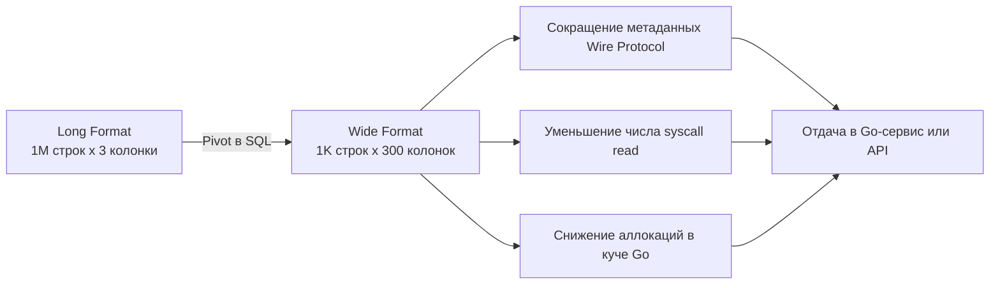

## Трансформация данных: Pivot (сводные таблицы) и аналитические запросы

В классическом OLTP-хранилище (см. [[3. Типы баз данных. OLTP vs OLAP]]) данные хранятся в "длинном" формате (Long Format) — одна строка представляет одно событие или одно свойство сущности. Это отлично подходит для транзакций и нормализации, но абсолютно нечитаемо для аналитиков и бизнес-юзеров.

Люди мыслят категориями "сводных таблиц" (Pivot Tables) — когда категории разворачиваются в колонки, а на пересечении строк и столбцов лежат агрегированные значения (Wide Format). В Excel это делается парой кликов, а в SQL — с помощью специальных техник.

---

## Ручной Pivot через агрегацию и FILTER

Исторически разворот строк в колонки делался через `CASE WHEN`:

```sql
SELECT 
    user_id,
    SUM(CASE WHEN product = 'A' THEN amount ELSE 0 END) AS product_a,
    SUM(CASE WHEN product = 'B' THEN amount ELSE 0 END) AS product_b
FROM orders
GROUP BY user_id;
```

Этот код работает, но он многословен и неэффективен. На каждую строку СУБД вычисляет все условия `CASE`, даже если `product = 'C'`.

Современный стандарт (поддерживаемый PostgreSQL) — использование клаузы **`FILTER`**:

```sql
SELECT 
    user_id,
    SUM(amount) FILTER (WHERE product = 'A') AS product_a,
    SUM(amount) FILTER (WHERE product = 'B') AS product_b,
    SUM(amount) FILTER (WHERE product = 'C') AS product_c
FROM orders
GROUP BY user_id;
```

> [!info] Под капотом
> Клауза `FILTER` работает быстрее `CASE WHEN` под капотом. Когда узел `Aggregate` в PostgreSQL встречает `FILTER`, он проверяет условие *до* того, как передать значение в функцию агрегации (State Transition Function). 
> Для `SUM(CASE WHEN ...)` СУБД вызывает функцию перехода для каждой строки, передавая 0. Для `SUM(...) FILTER (...)` СУБД просто пропускает строку, не вызывая функцию перехода вообще. Для сложных агрегатов (например, `array_agg` или пользовательских) это дает значительный прирост производительности и экономию памяти.

---

## Crosstab (tablefunc): Нативный Pivot в PostgreSQL

Если колонок много и они динамические, писать ручной `FILTER` утомительно. В PostgreSQL есть расширение `tablefunc`, предоставляющее функцию `crosstab`.

```sql
-- Сначала создаем расширение (один раз на БД)
CREATE EXTENSION IF NOT EXISTS tablefunc;

-- Использование
SELECT *
FROM crosstab(
    'SELECT user_id, product, amount FROM orders ORDER BY 1,2'
) AS ct(user_id INT, product_a INT, product_b INT, product_c INT);
```

> [!warning] Ловушка / Gotcha
> Функция `crosstab` имеет критический недостаток: вы **жестко кодируете** возвращаемые колонки в `AS ct(...)`. Если в данных появится новый продукт 'D', `crosstab` его проигнорирует, пока вы не перепишете SQL-запрос. 
> Кроме того, `crosstab` требует, чтобы исходный запрос был отсортирован (`ORDER BY 1,2`), и если для пользователя нет записи по одному из продуктов, колонки могут "съехать", если не использовать дополнительный запрос для полного набора категорий.

---

## Mechanical Sympathy: Широкие строки и Сеть

При проектировании аналитических API на Go вы должны учитывать физику передачи данных.

Длинная таблица (1 000 000 строк x 3 колонки) и широкая сводная таблица (1 000 строк x 300 колонок) содержат одно и то же количество "ячеек" данных. Но их транспортная стоимость кардинально различается:

1. **Протокол БД (PostgreSQL Wire Protocol):** Передача данных происходит построчно (Row-based). Каждая строка сопровождается метаданными (длина полей, OID типов). 1 000 000 коротких строк сгенерирует колоссальный оверхед по метаданным по сравнению с 1 000 длинных строк.
2. **Сетевой IO:** 1 000 000 строк означает 1 000 000 циклов чтения из сокета в Go-приложении. Это 1 000 000 аллокаций структур для маппинга. Pivot снижает количество строк, а значит — снижает количество syscall `read` и давление на Garbage Collector Go.
3. **CPU Cache Lines:** Широкие строки плохо укладываются в кэш-линии CPU (обычно 64 байта). Если вы считаете агрегацию по колонке в Go, процессор будет тянуть данные из RAM, минуя L1/L2 кэш. СУБД справляется с этим лучше, поэтому делайте Pivot на стороне БД, а не в приложении.



---

## Динамический Pivot в Go: Кошмар сканирования

Если колонки в Pivot неизвестны заранее (например, сводка по месяцам, а месяцы идут подряд), вы не можете создать типизированную Go-структуру. Стандартный `sqlx.StructScan` здесь бессилен.

Вам придется использовать динамическое сканирование через `sql.Rows.Columns()`.

```go
package repository

import (
	"context"
	"database/sql"
	"fmt"
	"strings"

	"github.com/jmoiron/sqlx"
)

// DynamicPivot возвращает мапу, где ключ - название колонки
type DynamicPivot = []map[string]any

// GetDynamicSalesReport генерирует и выполняет динамический Pivot
func GetDynamicSalesReport(ctx context.Context, db *sqlx.DB, year int) (DynamicPivot, error) {
	// Шаг 1: Получаем уникальные категории для колонок
	var categories []string
	catQuery := `SELECT DISTINCT product FROM orders ORDER BY product`
	if err := sqlx.SelectContext(ctx, db, &categories, catQuery); err != nil {
		return nil, fmt.Errorf("failed to get categories: %w", err)
	}

	// Шаг 2: Генерируем SQL с FILTER динамически
	pivotCols := make([]string, 0, len(categories))
	for _, cat := range categories {
		// ВАЖНО: В проде используйте sanitize или белые списки для имен колонок!
		// SQL injection через имена колонок невозможен, если они из БД, но синтаксические ошибки - легко.
		safeCat := strings.ReplaceAll(cat, "'", "''")
		pivotCols = append(pivotCols, fmt.Sprintf(
			`SUM(amount) FILTER (WHERE product = '%s') AS "%s"`, safeCat, cat,
		))
	}

	query := fmt.Sprintf(`
		SELECT user_id, %s 
		FROM orders 
		WHERE EXTRACT(YEAR FROM created_at) = $1
		GROUP BY user_id
	`, strings.Join(pivotCols, ", "))

	// Шаг 3: Выполняем запрос с динамическим набором колонок
	rows, err := db.QueryxContext(ctx, query, year)
	if err != nil {
		return nil, fmt.Errorf("failed to execute pivot query: %w", err)
	}
	defer rows.Close()

	// Получаем слайс имен колонок из результата запроса
	colNames, err := rows.Columns()
	if err != nil {
		return nil, fmt.Errorf("failed to get columns: %w", err)
	}

	var result DynamicPivot

	for rows.Next() {
		// Создаем слайс интерфейсов для сканирования неизвестного числа колонок
		values := make([]any, len(colNames))
		valuePtrs := make([]any, len(colNames))
		for i := range values {
			valuePtrs[i] = &values[i]
		}

		if err := rows.Scan(valuePtrs...); err != nil {
			return nil, fmt.Errorf("failed to scan dynamic row: %w", err)
		}

		// Маппим значения в map[string]any
		rowMap := make(map[string]any, len(colNames))
		for i, colName := range colNames {
			// PostgreSQL возвращает numeric/decimal как string в драйвере pq,
			// а в pgx - как pgtype.Numeric. Конвертируем NULL в nil.
			val := values[i]
			if b, ok := val.([]byte); ok {
				val = string(b) // Конвертируем []byte в string
			}
			rowMap[colName] = val
		}

		result = append(result, rowMap)
	}

	if err := rows.Err(); err != nil {
		return nil, fmt.Errorf("rows iteration error: %w", err)
	}

	return result, nil
}
```

> [!warning] Ловушка / Gotcha
> Динамическое сканирование в `any` — это антипаттерн для highload. Вы теряете типобезопасность, а каждая мапа `map[string]any` и каждый `string` внутри неё — это аллокация в куче (Heap). Если такой запрос возвращает 10 000 строк с 50 колонками, вы сделаете сотни тысяч аллокаций, которые заставят Garbage Collector Go работать на пределе, увеличивая latency обработчика. Если данные нужны для внутреннего API, возвращайте JSON напрямую из БД (об этом в [[8. JSON в SQL]]), избегая маппинга в Go вообще.

---

## Unpivot: Обратная операция

Иногда нужно сделать обратное — превратить широкую таблицу в длинную (например, для загрузки в колоночную БД ClickHouse или сужения индексов).

В PostgreSQL нет оператора `UNPIVOT` (как в SQL Server или Oracle). Классический способ — `UNION ALL`:

```sql
SELECT user_id, 'A' AS product, product_a AS amount FROM wide_table
UNION ALL
SELECT user_id, 'B' AS product, product_b AS amount FROM wide_table
UNION ALL
SELECT user_id, 'C' AS product, product_c AS amount FROM wide_table
```

Но это заставляет СУБД сканировать таблицу три раза. В PostgreSQL можно использовать более изящный подход через `LATERAL JOIN` и `unnest`:

```sql
SELECT 
    t.user_id, 
    v.product, 
    v.amount
FROM wide_table t,
LATERAL unnest(
    ARRAY['A', 'B', 'C'], 
    ARRAY[t.product_a, t.product_b, t.product_c]
) AS v(product, amount)
WHERE v.amount IS NOT NULL; -- Отсекаем нулевые значения
```

СУБД пройдется по таблице один раз, распаковывая массивы на лету.

---

> [!tip] Собеседование
> **Вопрос:** Как сделать Pivot-таблицу в SQL, если список разворачиваемых значений заранее неизвестен?
> **Ответ:** Чистый SQL не позволяет динамически генерировать колонки в `SELECT` на основе данных (это нарушает реляционную модель, где схема должна быть известна до выполнения). Есть два пути:
> 1. **На уровне БД:** Использовать хранимую процедуру (PL/pgSQL), которая формирует SQL-строку динамически и выполняет её через `EXECUTE`.
> 2. **На уровне приложения (Go):** Сделать предварительный запрос за уникальными значениями, сгенерировать SQL с `FILTER` в Go-коде, выполнить его и использовать динамическое сканирование `sql.Rows.Columns()`. Это более идиоматичный и безопасный подход для Go-бэкенда.

## Итог

1. **Pivot** разворачивает уникальные значения из строк в колонки, создавая "сводную таблицу".
2. Используйте `FILTER (WHERE ...)` вместо `CASE WHEN` для агрегатных функций — это чище и быстрее под капотом.
3. `crosstab` требует жесткой типизации колонок и часто не стоит потраченных усилий по сравнению с `FILTER`.
4. Динамический Pivot в Go требует сканирования в `[]any`, что порождает аллокации и давление на GC. По возможности избегайте этого, возвращая JSON напрямую.
5. Для **Unpivot** используйте `LATERAL JOIN` с `unnest` вместо множества `UNION ALL` для однократного сканирования таблицы.

Агрегация и трансформация строк — это аналитическая мощь, но всё больше современных приложений хранят в реляционных БД нереляционные структуры. В следующей статье мы разберем, как SQL работает с JSON: [[8. JSON в SQL]].
