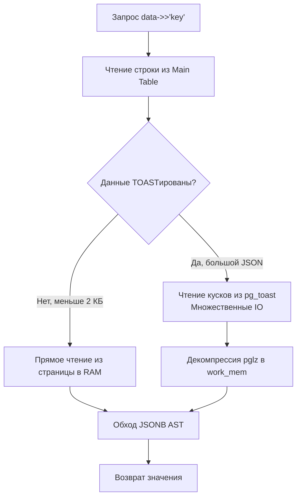

## JSON в SQL: Когда реляционности не хватает

Долгое время реляционные базы данных и NoSQL стояли по разные стороны баррикад. Реляционные гарантировали целостность и SQL, NoSQL — гибкость схем и работу с документами. Сегодня грань стерта. PostgreSQL, MySQL и другие СУБД научились хранить, индексировать и запрашивать JSON прямо внутри таблиц, превратившись в гибридные решения.

Для Go-бэкендера это особенно актуально: часто нужно сохранить "сырой" ответ от стороннего API или дать фронтенду возможность хранить произвольные метаданные, не меняя схему БД при каждом чихе. Но работа с JSON в SQL полна сюрпризов, если не понимать, как данные лежат на диске.

---

## JSON vs JSONB в PostgreSQL

В PostgreSQL существует два типа для хранения JSON: `json` и `jsonb`. Выбор между ними — это вопрос механики работы с памятью и CPU.

- **`json`**: Хранит точную копию входного текста. Каждый раз, когда вы делаете `SELECT data->>'key'`, СУБД вызывает парсер, который собирает из строки AST-дерево в памяти, извлекает значение и уничтожает дерево. Это убийца CPU при интенсивных чтениях.
- **`jsonb`**: Преобразует JSON в бинарный формат при записи. Парсинг происходит **один раз**. На диске лежит не строка, а структурированное бинарное дерево. Да, запись чуть медленнее (из-за парсинга и конвертации), но чтение и операции — на порядки быстрее. Кроме того, `jsonb` поддерживает индексы GIN.

> [!info] Под капотом
> Как устроен `jsonb` внутренне? Это вариация формата, похожей на BSON. Данные сериализуются в структуру `JEntry` (заголовок длины и типа) + само значение. Ключи объекта сортируются по алфавиту (для быстрого бинарного поиска), а пробелы и порядок ключей из оригинальной строки отбрасываются. Два JSON-документа с разным порядком ключей, но одинаковыми значениями, в `jsonb` будут идентичны побайтово.

---

## Mechanical Sympathy: TOAST и огромные документы

Стандартная страница в PostgreSQL — 8 КБ. Если строка таблицы вместе со всеми данными превышает 2 КБ (четверть страницы), вступает в игру механизм **TOAST (The Oversized-Attribute Storage Technique)**.

Если ваш JSONB-документ большой (например, JSON на 500 КБ с вложенными массивами), Postgres не положит его на страницу данных. Он сожмет его алгоритмом pglz (или LZ4 в новых версиях), разрежет на куски по 2 КБ и сложит в скрытую системную таблицу `pg_toast`. В основной же строке останется лишь указатель на эти куски.

**Что происходит при запросе `SELECT data->>'key' FROM users WHERE id = 1`:**
1. СУБД находит строку по индексу Primary Key.
2. Видит, что колонка `data` — TOAST-ирована.
3. Инициирует дополнительные системные вызовы для чтения кусков из `pg_toast` (Random IO на диске).
4. Разжимает данные в `work_mem` или в памяти процесса.
5. Обходит бинарное дерево `jsonb` в памяти для поиска `key`.

Если таких запросов много, вы убьете и дисковую подсистему (IO wait), и CPU (декомпрессия). Храните в колонках таблицы только те JSON-документы, которые реально нужны в бизнес-логике. Огромные сырые логи лучше скидывать в S3, а в БД класть только нужные поля.



---

## Операторы и индексация

Главное правило: операторы `->` и `->>` — это функции. Поиск по `data->>'status'` без индекса вызывает Full Table Scan с распаковкой каждого JSONB на каждой строке.

- `->` возвращает тип `jsonb` (сохраняет тип, можно чейнить: `data->'address'->'city'`).
- `->>` возвращает тип `text` (вытаскивает примитив как строку SQL).

Для индексации `jsonb` используется **GIN (Generalized Inverted Index)**. Инвертированный индекс хранит маппинг: "какой ключ/значение содержится в каких строках".

По умолчанию GIN индексирует все пары ключ-значение внутри JSON. Но обычно мы ищем по конкретным путям. Используйте `jsonb_path_ops` — он индексирует только полные пути (хеширует пары), что делает индекс значительно меньше и быстрее.

```sql
-- Создание оптимизированного GIN индекса
CREATE INDEX idx_orders_metadata ON orders USING GIN (metadata jsonb_path_ops);

-- Этот запрос ИСПОЛЬЗУЕТ индекс (оператор @> - содержит)
SELECT * FROM orders WHERE metadata @> '{"status": "paid"}';

-- Этот запрос НЕ ИСПОЛЬЗУЕТ GIN индекс (оператор ->> не поддерживается GIN)
SELECT * FROM orders WHERE metadata->>'status' = 'paid';
```

> [!warning] Ловушка / Gotcha
> Из-за особенностей GIN-индексов, запрос `metadata->>'status' = 'paid'` вызовет полный скан таблицы, а `metadata @> '{"status": "paid"}'` использует индекс. Всегда используйте оператор включения `@>` для поиска по JSONB, если у вас GIN-индекс. А если нужен поиск с приведением типов (например, возраст больше 18), используйте `jsonb_path_query` или B-tree индекс на вычисляемой колонке (Expression Index):
> `CREATE INDEX idx_user_age ON users (((data->>'age')::int));`

---

## Взаимодействие с Go: Проблема двойного парсинга

Когда Go-приложение работает с JSON в БД, возникает классическая архитектурная ловушка — **двойной парсинг** (Double Unmarshal).

СУБД хранит JSONB бинарником. Драйвер БД (например, `pgx`) вытаскивает его, конвертирует в строку (или `[]byte`) и отдает в Go. Go-приложение делает `json.Unmarshal`, парся текст в структуру. Если вы отдаете этот JSON дальше в HTTP-ответ, вы делаете `json.Marshal` обратно в строку!

Если ваша бизнес-логика не меняет этот JSON (например, вы просто прокидываете конфиг или профиль пользователя от БД к клиенту), парсить его в Go бессмысленно — это трата CPU и аллокации в куче.

### Паттерн 1: json.RawMessage (Сквозное прокидывание)

Если вам нужно отдать JSON как есть, используйте `json.RawMessage` (под капотом это просто `[]byte`). Драйвер заполнит слайс байтами из БД, а `http.Json` отдает их прямо в сокет, минуя `Unmarshal`.

```go
package repository

import (
	"context"
	"database/sql"
	"fmt"

	"github.com/jmoiron/sqlx"
)

// UserRaw представляет модель со сквозным JSON
type UserRaw struct {
	ID       int64             `db:"id" json:"id"`
	Profile  json.RawMessage   `db:"profile" json:"profile"` // Не аллоцирует структуру, хранит байты
}

const getUserSQL = `SELECT id, profile FROM users WHERE id = $1`

// GetUser сканирует JSON без полного парсинга в Go
func GetUser(ctx context.Context, db *sqlx.DB, userID int64) (*UserRaw, error) {
	var u UserRaw
	// Драйвер pgx запишет сырые байты JSON в u.Profile
	if err := db.GetContext(ctx, &u, getUserSQL, userID); err != nil {
		return nil, fmt.Errorf("failed to get user: %w", err)
	}
	return &u, nil
}
```

### Паттерн 2: Строгая типизация (Бизнес-логика)

Если вы работаете с полями JSON в Go (считаете сумму, меняете статус), **всегда** десериализуйте в строгую структуру. Работа с `map[string]any` в Go — это антипаттерн, который приводит к паникам на проде и множеству аллокаций.

```go
// Строгая структура для бизнес-логики
type UserProfile struct {
	Email string `json:"email"`
	Age   int    `json:"age"`
}

type UserStrict struct {
	ID      int64        `db:"id" json:"id"`
	Profile UserProfile  `db:"profile" json:"profile"`
}
```

### Паттерн 3: Частичное обновление (jsonb_set)

Частая ошибка — прочитать весь JSON в Go, изменить одно поле, сериализовать весь JSON обратно и отправить `UPDATE` на сервер. Это неэффективно и чревато потерями данных при конкурентных записях (Race Conditions).

Используйте встроенные функции БД для частичного обновления:

```sql
-- Обновляет только поле status, не трогая остальное
UPDATE orders 
SET metadata = jsonb_set(metadata, '{status}', '"shipped"'::jsonb)
WHERE id = $1;
```

> [!info] Под капотом
> В PostgreSQL `jsonb_set` не обновляет значение "на месте" (in-place). Так как `jsonb` — это древовидная структура (и MVCC требует создания новой версии строки при любом UPDATE), `jsonb_set` копирует старое дерево, подменяет в нем узел и записывает новый бинарник в новую строку. Тем не менее, это быстрее, чем гнать весь документ по сети в приложение и обратно.

---

> [!tip] Собеседование
> **Вопрос:** В чем разница между `json` и `jsonb` в PostgreSQL? Какой тип следует использовать и почему?
> **Ответ:** `json` хранит текст, парся его при каждом чтении. `jsonb` хранит предварительно разобранное бинарное дерево (декомпилированный JSON). `jsonb` занимает чуть больше места на диске (из-за заголовков структуры), но позволяет индексировать данные через GIN-индексы и мгновенно извлекать ключи без парсинга. В 99% случаев нужно использовать `jsonb`. `json` имеет смысл только если нужно сохранить оригинальное форматирование (пробелы, порядок ключей), что на бэкенде практически никогда не требуется.

## Итог

1. В PostgreSQL всегда используйте **`jsonb`** вместо `json` для получения приемлемой производительности чтения.
2. Большие JSONB-документы попадают в **TOAST**, что приводит к дополнительным IO-операциям и декомпрессии на каждый запрос. Не храните байты в БД без нужды.
3. Для поиска по JSONB используйте **GIN-индексы** и оператор `@>` (содержит), а не `->>` (равенство текста).
4. В Go избегайте "двойного парсинга". Если JSON не меняется, используйте `json.RawMessage` для сквозного прокидывания из БД в сеть без аллокаций в куче.
5. Для обновлений используйте `jsonb_set` на стороне БД, чтобы не гонять тяжелые документы по сети.

JSON часто соседствует с массивами — другой полуструктурной возможностью SQL. В следующей статье мы разберем, как СУБД работают с массивами и как их эффективно использовать: [[9. Работа с массивами]].
