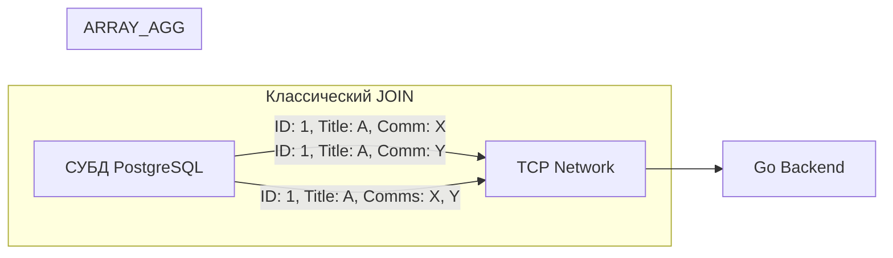

## Нарушая правила: Зачем массивы в реляционной БД

Классическая теория реляционных баз данных (в частности, [[10. Первая нормальная форма 1NF]]) гласит: значение в ячейке таблицы должно быть атомарным. Если у статьи есть несколько тегов, мы обязаны создать отдельную таблицу `article_tags` и связывать их через [[6. JOIN. INNER, LEFT, RIGHT]].

Однако в высоконагруженных системах строгая нормализация часто становится узким местом (Bottleneck). Каждый `JOIN` — это процессорное время СУБД, а передача денормализованных (продублированных) строк по сети съедает пропускную способность (Network IO). 

Современные СУБД (PostgreSQL, ClickHouse) предлагают мощную альтернативу — нативные типы массивов. Массивы позволяют хранить множества значений в одной ячейке, нарушая 1NF ради радикального снижения I/O и упрощения архитектуры.

> [!info] Под капотом: Массивы vs JSONB
> Начинающие разработчики часто путают массивы с [[8. JSON в SQL]]. 
> Массивы в PostgreSQL **строго типизированы** (например, `TEXT[]`, `INT[]`). Благодаря строгой типизации, массивы занимают меньше места на диске (отсутствуют ключи и метаданные типов JSON), парсятся быстрее (бинарный формат вместо текстового парсинга JSON) и эффективнее мапятся в срезы (slices) в Go. Если вам нужен просто список ID или строк — всегда выбирайте нативные массивы, а не `JSONB`.

---

## Базовый синтаксис и операторы (на примере PostgreSQL)

Объявление колонки с массивом выглядит интуитивно:

```sql
CREATE TABLE articles (
    id BIGSERIAL PRIMARY KEY,
    title TEXT NOT NULL,
    tags TEXT[] -- Массив строк
);
```

Вставка данных может происходить в двух форматах:
```sql
-- Формат конструктора ARRAY (предпочтительный, более читаемый)
INSERT INTO articles (title, tags) VALUES ('Golang GC', ARRAY['golang', 'runtime', 'gc']);

-- Формат строкового литерала (исторический)
INSERT INTO articles (title, tags) VALUES ('PostgreSQL Tuning', '{"sql", "postgres"}');
```

### Фильтрация и поиск

Для работы с массивами используются специальные операторы. Попытка искать через `LIKE` или `=` здесь не сработает эффективно.

```sql
-- Содержит ли массив конкретный тег? (Оператор ANY)
SELECT title FROM articles WHERE 'golang' = ANY(tags);

-- Содержит ли массив ВСЕ указанные теги? (Оператор @> - contains)
SELECT title FROM articles WHERE tags @> ARRAY['golang', 'runtime'];

-- Есть ли пересечение (хотя бы один общий тег)? (Оператор && - overlap)
SELECT title FROM articles WHERE tags && ARRAY['golang', 'java'];
```

---

## Индексирование массивов: GIN индекс

Если вы начнете фильтровать миллионную таблицу через `= ANY(tags)`, СУБД выполнит `Sequential Scan` (полное сканирование). Классический B-Tree индекс не умеет заглядывать внутрь массивов.

Для массивов и полнотекстового поиска используется **GIN (Generalized Inverted Index)** — инвертированный индекс.

```sql
-- Создание GIN индекса для массива
CREATE INDEX idx_articles_tags ON articles USING GIN (tags);
```

**Mechanical Sympathy:** Как работает GIN?
В отличие от B-Tree, который хранит одно значение — одну ссылку на строку, GIN "разворачивает" массив. Для каждого уникального элемента массива (например, тега 'golang') он создает ключ в B-дереве, а в листовом узле хранит сжатый список (Posting List) всех `ID` строк (TID), в которых этот тег встречается. Это радикально ускоряет операторы `@>` и `&&`.

> [!warning] Ловушка / Gotcha: GIN и цена записи
> GIN индекс очень дорого обновлять. Если вы вставляете строку с массивом из 10 элементов, СУБД должна обновить индекс в 10 разных местах. Для высокоинтенсивных на запись (Write-Heavy) таблиц GIN индекс может стать фатальным узким местом. Для смягчения этой проблемы в PostgreSQL GIN имеет свой внутренний буфер (Fast Update), который накапливает изменения и сливает их пачками, но чудес не бывает — запись просядет.

---

## Магия трансформаций: UNNEST и ARRAY_AGG

Две самые важные функции для бэкенд-инженера при работе с массивами — это операции взрыва (Explode) и свертки (Fold).

### UNNEST (Разворачивание)
Превращает элементы массива в отдельные физические строки. Это нужно, если вы хотите присоединить (`JOIN`) другую таблицу по элементам массива.

```sql
SELECT id, title, unnest(tags) AS tag 
FROM articles;
```
*Результат:* Если у статьи 3 тега, функция `unnest` сгенерирует 3 строки с одинаковыми `id` и `title`, но разными `tag`.

### ARRAY_AGG (Агрегация)
Это обратная операция. Она берет множество строк (обычно после `GROUP BY` или из `JOIN`) и сворачивает их в один массив.

**Это абсолютно ультимативный паттерн для решения проблемы [[13. N+1 проблема]] и экономии Network I/O.**

Представим связь `1:M` (Статья и Комментарии).

**❌ Плохой подход (Дублирование по сети):**
```sql
SELECT a.id, a.title, c.text
FROM articles a
LEFT JOIN comments c ON a.id = c.article_id;
```
Если у статьи 100 комментариев, СУБД отправит по сети 100 строк, где `id` и `title` (возможно, очень длинный текст) будут продублированы 100 раз.

**✅ Правильный подход (ARRAY_AGG):**
```sql
SELECT 
    a.id, 
    a.title, 
    array_agg(c.text) AS comments_array
FROM articles a
LEFT JOIN comments c ON a.id = c.article_id
GROUP BY a.id, a.title;
```


СУБД сжимает данные на своей стороне и отправляет по сети всего одну строку для каждой статьи. 

---

## Работа с массивами в Go

При использовании стандартного пакета `database/sql` драйвер не знает, как мапить бинарный формат массива PostgreSQL в `[]string` или `[]int64`. Для этого используется обертка драйвера (например, `pq.Array`).

```go
import (
    "context"
    "database/sql"
    "[github.com/lib/pq](https://github.com/lib/pq)"
)

type Article struct {
    ID    int64
    Title string
    Tags  []string
}

func GetArticle(ctx context.Context, db *sql.DB, id int64) (Article, error) {
    query := `SELECT id, title, tags FROM articles WHERE id = $1`
    
    var a Article
    // Оборачиваем наш срез в pq.Array для десериализации
    err := db.QueryRowContext(ctx, query, id).Scan(&a.ID, &a.Title, pq.Array(&a.Tags))
    if err != nil {
        return a, err
    }
    
    return a, nil
}
```

> [!tip] Собеседование: pgx vs lib/pq
> На собеседованиях часто спрашивают про выбор драйвера. Исторический `github.com/lib/pq` перешел в режим maintenance (поддержки). Современный стандарт де-факто — это `github.com/jackc/pgx`. 
> Драйвер `pgx` обладает нативной поддержкой типов PostgreSQL. Он позволяет передавать слайсы Go в запросы (как параметры `WHERE id = ANY($1)`) и читать массивы напрямую без дополнительных оберток типа `pq.Array`, напрямую парся бинарный протокол PostgreSQL, что снижает аллокации в куче (Heap) и разгружает Garbage Collector. Подробнее в [[1. Работа с БД в Go. database_sql]].

---

## TOAST: Цена больших массивов

Массивы позволяют хранить мегабайты данных в одной ячейке. Но как это ложится на архитектуру СУБД?

Страница данных (Page) в PostgreSQL имеет фиксированный размер — **8 Килобайт**. Строка (Tuple) не может превышать размер страницы. 
Если вы сложите в массив `TEXT[]` логи целого микросервиса на 50 КБ, СУБД задействует механизм **TOAST (The Oversized-Attribute Storage Technique)**.

База данных разобьет ваш огромный массив на чанки (chunks), сожмет их (компрессия PGLZ или LZ4) и сохранит в отдельную, скрытую системную таблицу TOAST. В оригинальной таблице `articles` останется только указатель (Oid) на эти данные.

**Mechanical Sympathy (Скрытый I/O):**
Когда вы делаете `SELECT * FROM articles`, база данных сначала читает основную страницу с диска, находит указатель TOAST, а затем делает **дополнительные случайные чтения с диска (Random I/O)**, чтобы вытащить и декомпрессировать куски вашего массива. 
Если в Go-коде этот массив вам на самом деле был не нужен (вы забыли убрать его из `SELECT`), вы молча убиваете производительность дисковой подсистемы сервера БД.

## Итог

1. **Массивы** — это осознанное нарушение 1NF, позволяющее радикально сократить количество `JOIN` и сэкономить Network I/O между бэкендом и базой.
2. Для поиска по элементам массива классический B-Tree не работает, необходимо создавать **GIN-индекс**. Но помните: GIN сильно замедляет `INSERT` и `UPDATE`.
3. Функция **`array_agg()`** — мощный инструмент агрегации, упаковывающий связанные строки в массив прямо на сервере БД, избавляя рантайм Go от работы с дубликатами.
4. В Go для работы с массивами используйте нативные возможности драйвера `pgx` для минимизации аллокаций.
5. Берегитесь **TOAST**: огромные массивы физически хранятся отдельно. Извлечение больших массивов вызывает декомпрессию и случайные чтения с диска.

Мы закончили блок продвинутых декларативных конструкций. До сих пор мы отправляли сырые SQL-строки с бэкенда в базу. Но иногда бизнес-логика становится настолько сложной и привязанной к данным, что гонять её по сети становится невыгодно. В таких случаях код переезжает жить прямо внутрь базы данных. Об этом мы поговорим в следующей статье: [[10. Хранимые процедуры и функции]].