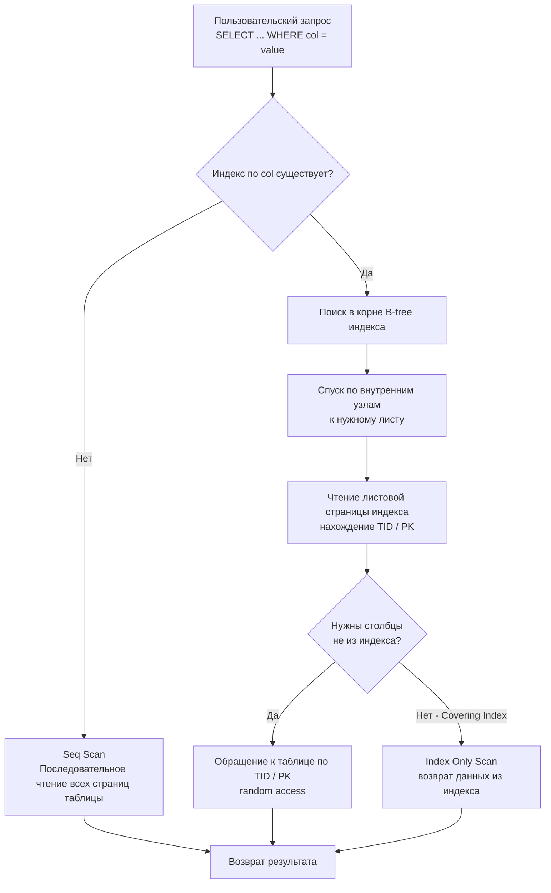

Когда вы впервые сталкиваетесь с базой данных, мир кажется простым: есть таблицы, в них строки, и мы пишем `SELECT * FROM users WHERE email = 'alice@example.com'`, чтобы получить нужную запись. На небольшом объёме в тысячу строк результат приходит мгновенно, и возникает иллюзия, что так будет всегда.

Но как только таблица вырастает до миллионов и миллиардов строк, тот же самый запрос начинает выполняться секундами или даже десятками секунд. Почему? Потому что база данных вынуждена прочитать *каждую* строку таблицы с диска, чтобы проверить условие `email = ...`. Это называется **Seq Scan** (последовательное сканирование), и его стоимость линейно зависит от размера таблицы.

**Индекс** — это вспомогательная структура данных, которая позволяет находить строки без полного перебора. Если продолжить аналогию с книгой: без индекса вы листаете всю книгу страницу за страницей в поисках нужного термина; с предметным указателем (индексом) вы мгновенно находите номера страниц, где этот термин упоминается.

### Что такое индекс

Индекс — это отдельная структура, физически хранимая на диске (и кэшируемая в памяти), которая содержит отсортированные значения одного или нескольких столбцов таблицы плюс указатели на сами строки. За счёт сортировки база данных может применять бинарный поиск или обходить листовые страницы индекса последовательно, радикально сокращая количество операций ввода-вывода и сравнений.

Основные цели индекса:

- Ускорить поиск строк по условиям `WHERE`, особенно по операторам `=`, `>`, `<`, `BETWEEN`, `IN`.
- Ускорить соединения (`JOIN`) по внешним ключам.
- Поддержать быструю сортировку (`ORDER BY`) и агрегацию (`GROUP BY`), если индекс уже содержит данные в нужном порядке.
- В некоторых случаях позволить вообще не обращаться к таблице — **Covering Index** (покрывающий индекс), когда все необходимые столбцы есть в самом индексе.

### Механическая аналогия: как бы мы сделали это в Go

В оперативной памяти разработчик на Go для быстрого поиска по ключу использует `map` — хеш-таблицу. Но хеш-таблица не сохраняет порядок ключей, поэтому запросы с диапазонами (`BETWEEN`, `>`) и сортировкой она не ускоряет. Альтернатива — держать отсортированный `slice` и применять бинарный поиск (`sort.Search`). Именно так устроен классический B-tree индекс, только адаптированный под блочное устройство хранения: вместо сплошного массива используется дерево страниц фиксированного размера (обычно 8 КБ), оптимизированное под чтение/запись блоками.

> [!info] Под капотом
> В реальности большинство реляционных БД (PostgreSQL, MySQL/InnoDB) используют B-tree или его варианты. Подробности мы разберём в статье [[2. B Tree индекс под капотом]], но уже сейчас важно понять: индекс — это не магия, а просто эффективная структура данных, живущая на диске и подчиняющаяся законам иерархии памяти (см. раздел "Архитектура компьютера").

### Как выглядит выполнение запроса с индексом и без

Разница в количестве прочитанных блоков колоссальна: при Seq Scan база данных читает **всю** таблицу; при Index Scan — единицы блоков индекса плюс, возможно, несколько блоков таблицы. На диске, где latency случайного чтения измеряется миллисекундами, экономия становится критичной.

### Первичный и вторичные индексы

- **Первичный индекс** — в PostgreSQL это неуникальный индекс, который создаётся автоматически для столбцов первичного ключа (`PRIMARY KEY`). В MySQL/InnoDB это **кластерный индекс**, где сами строки таблицы физически хранятся в листьях B-tree, упорядоченные по первичному ключу. То есть таблица *является* индексом.
- **Вторичные индексы** — все остальные индексы, создаваемые явно (`CREATE INDEX`). В PostgreSQL они хранят ключ и физический идентификатор строки (`ctid`). В InnoDB вторичный индекс хранит ключ и значение первичного ключа; чтобы прочитать полную строку, нужно выполнить дополнительный поиск по первичному индексу (так называемый **bookmark lookup**).

> [!warning] Ловушка / Gotcha
> В MySQL/InnoDB выборка через вторичный индекс без покрытия вызывает два обращения к B-tree: сначала по вторичному индексу за первичным ключом, затем по первичному за строкой. Это может быть значительно медленнее, чем кажется. В PostgreSQL такой двойной работы нет, но всё равно происходит случайный доступ к таблице по `ctid`.

### Индекс ускоряет не только WHERE

При сортировке (`ORDER BY col`) база данных может пройти по листовым страницам индекса `col` последовательно, получив сразу отсортированный результат без отдельной операции сортировки (файловой или в памяти). Аналогично `GROUP BY col` может использовать порядок индекса для агрегации без создания временной хеш-таблицы.

Соединения `JOIN` по внешнему ключу — ещё один классический сценарий. Без индекса на дочерней таблице база данных вынуждена для каждой строки родительской таблицы сканировать всю дочернюю (Nested Loop Join с Seq Scan внутри). Индекс превращает внутренний цикл в молниеносный поиск по ключу.

### Цена индекса: Mechanical Sympathy

Индекс никогда не бесплатен. Каждая вставка, обновление и удаление строки вынуждают базу данных обновлять *все* индексы на таблице. Это дополнительные операции записи, которые могут порождать случайный ввод-вывод, расщепление страниц (page split) и увеличение объёма WAL-логов (см. [[8. WAL. Write Ahead Log]]).

> [!tip] Собеседование
> **Вопрос:** Почему на таблице с интенсивной записью не стоит создавать много индексов?
> **Ответ:** Каждый лишний индекс увеличивает накладные расходы на вставку/обновление/удаление. Вам нужно балансировать скорость чтения и записи, ориентируясь на реальную нагрузку приложения. Иногда дешевле пожертвовать небольшим замедлением чтения, чем убить запись.

Также индекс занимает место на диске и в буферном кэше. Если индекс не используется, он напрасно вытесняет из памяти полезные данные, увеличивая количество промахов мимо кэша (cache miss) и физических чтений.

### Когда индекс бесполезен

- **Маленькая таблица.** Если таблица помещается в нескольких страницах, Seq Scan будет быстрее любых дополнительных структур.
- **Низкая селективность.** Столбец с малым числом уникальных значений (например, пол, тип boolean) даёт высокую долю строк в результате. Планировщик запросов (см. [[10. План выполнения запроса. EXPLAIN]]) часто предпочтёт Seq Scan, потому что прыжки по индексу и последующие random access к таблице обойдутся дороже.
- **Запрос без фильтров.** `SELECT * FROM table` всегда Seq Scan, если нет `ORDER BY` по подходящему индексу.
- **Неверный порядок столбцов в составном индексе.** Индекс `(a, b)` не поможет запросу с фильтром только по `b` (об этом — в [[5. Composite индексы]]).

### Индексы и Go-разработчик

При написании кода на Go, взаимодействующего с базой данных через `database/sql` или ORM, вы должны осознанно проектировать запросы и понимать, какие индексы им нужны. Простое добавление нового `WHERE` в динамически строящийся запрос может внезапно превратить быстрый Index Scan в ужасный Seq Scan на продуктиве.

Используйте `EXPLAIN` (или `EXPLAIN ANALYZE`) для проверки планов выполнения — это ваш главный инструмент. В Go-коде удобно оборачивать медленные запросы в специальный отладочный режим и логировать планы для последующего анализа.

> [!warning] Ловушка / Gotcha
> ORM-библиотеки могут генерировать запросы, которые вы не видите напрямую. Фильтрация по вычисляемому выражению или функции (`WHERE LOWER(email) = ?`) часто отключает использование индекса, если нет специализированного индекса (expression index). Будьте внимательны.

### Первый шаг к глубокому пониманию

Индексы — это краеугольный камень производительности любой реляционной БД. Без них невозможна работа с объёмами данных, характерными для современных бэкендов. Но чтобы эффективно их применять, нужно знать, что у них внутри. В следующей статье мы спустимся на уровень реализации: [[2. B Tree индекс под капотом]] — разберём, как именно B-tree организует страницы, как происходит поиск и вставка, и как это влияет на железо.
