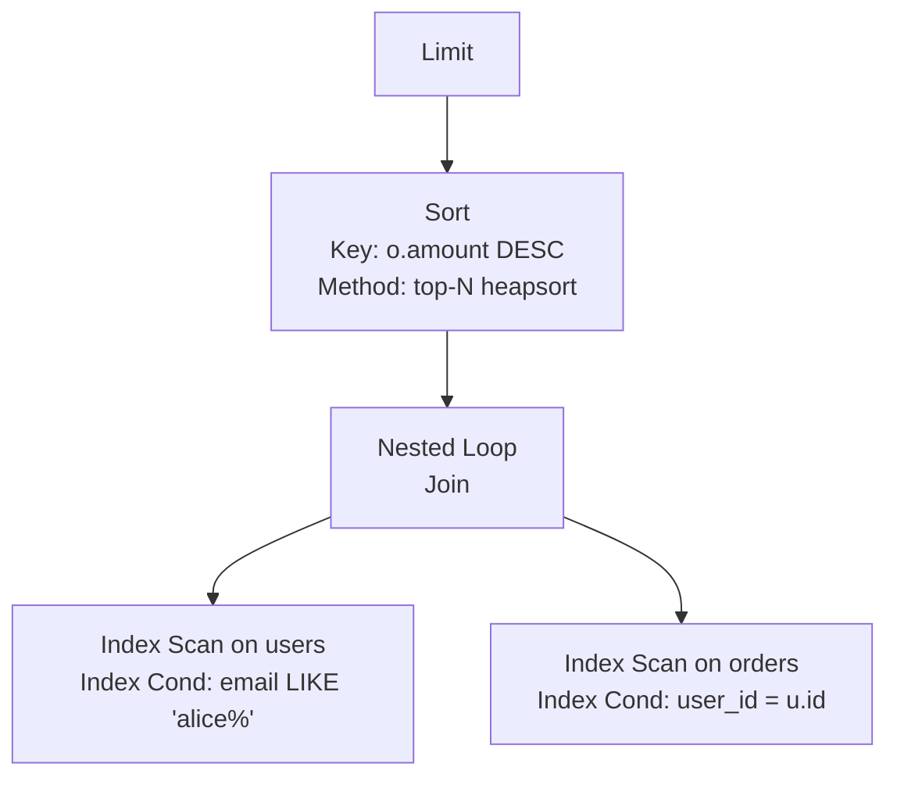

Понимание того, как база данных выполняет ваш запрос, — это навык, разделяющий разработчиков, которые гадают, и тех, кто точно знает. `EXPLAIN` — главный инструмент для этого: он показывает **план выполнения** — последовательность операций, которые СУБД совершит (или совершила) для получения результата. Без `EXPLAIN` вы не видите, используется ли индекс, где тратится время, и почему запрос внезапно стал медленным.

Для Go-разработчика, пишущего высоконагруженные сервисы, `EXPLAIN` — это такой же обязательный инструмент, как `pprof` для CPU или `trace` для горутин. Сегодня мы детально разберём, как читать планы, понимать их стоимость с точки зрения mechanical sympathy, и как встроить анализ планов в процесс разработки на Go.

### Как СУБД строит план

Когда вы отправляете SQL-запрос, СУБД проходит несколько этапов:

1. **Парсинг:** запрос превращается в дерево синтаксического разбора.
2. **Трансформация:** применяются правила переписывания (например, подзапросы могут превращаться в соединения, убираются избыточные условия).
3. **Оптимизация:** оптимизатор генерирует возможные планы (разные порядки соединений, методы доступа), оценивает их стоимость и выбирает самый дешёвый.
4. **Выполнение:** выбранный план передаётся исполнителю (executor), который рекурсивно вызывает операции.

Оптимизатор — сердце производительности. Он опирается на **статистику** о таблицах и индексах, собранную `ANALYZE`, и на **модель стоимости** (cost model), которая оценивает, сколько дисковых операций и CPU потребуется каждому плану. Подробнее об этом мы поговорим в статье [[11. Cost based optimizer]].

> [!info] Под капотом
> В PostgreSQL код оптимизатора находится в `src/backend/optimizer`. Основная функция `planner()` вызывает `subquery_planner()`, `grouping_planner()`, `query_planner()`. Генерация путей доступа (Path) для каждой таблицы и их соединений происходит в `make_one_rel()` и `add_paths_to_joinrel()`. Лучший путь превращается в итоговый `Plan` с узлами.

### EXPLAIN в PostgreSQL

Базовая команда `EXPLAIN` показывает план, но не выполняет запрос. С `EXPLAIN ANALYZE` запрос исполняется реально, и вместе с планом выводятся фактические времена и количество строк. Это наиболее ценно для отладки, но **осторожно**: на запросах, модифицирующих данные, `ANALYZE` выполнит изменения! Для таких случаев используйте `BEGIN; EXPLAIN ANALYZE ...; ROLLBACK;`.

Ключевые опции:

- `ANALYZE` — выполнить запрос и показать фактические метрики.
- `BUFFERS` — добавить информацию о буферах: сколько страниц прочитано из кэша (`shared hit`), сколько с диска (`read`), сколько записано (`dirtied`), сколько временных файлов и т.д. Это бесценно для оценки дискового ввода-вывода.
- `VERBOSE` — показать полный список выходных столбцов, список плановых узлов и дополнительную информацию, включая триггеры.
- `FORMAT` — формат вывода: `TEXT` (по умолчанию), `JSON`, `XML`, `YAML`. JSON-формат удобен для парсинга в Go.

Типовая команда для всестороннего анализа:

```sql
EXPLAIN (ANALYZE, BUFFERS, VERBOSE) SELECT ...;
```

### Чтение вывода EXPLAIN

План — это дерево, читаемое **изнутри наружу** (самый глубокий узел выполняется первым). Каждый узел описывает операцию и имеет:

- **cost=start..total** — оценочное время запуска и общее время (в условных единицах, обычно `seq_page_cost=1.0` означает чтение одной страницы с диска). `total` включает `start`.
- **rows** — оценочное количество строк, производимых узлом.
- **width** — средняя ширина строки в байтах.
- **actual time=start..total** (с `ANALYZE`) — реальное время в миллисекундах.
- **rows** (фактические) — реальное количество строк.
- **loops** — сколько раз выполнялся узел (если он находится внутри цикла, например, Nested Loop).

Также могут быть указаны:

- **Buffers: shared hit=N read=M** — чтения из кэша и с диска.
- **Sort Key / Sort Method** — если требуется сортировка.
- **Index Cond** — условие, применённое к индексу.
- **Filter** — условие, применённое уже после извлечения строк.

Пример вывода для `SELECT * FROM users WHERE email = 'alice@example.com'`:

```
Index Scan using idx_users_email on users  (cost=0.42..8.44 rows=1 width=64)
  Index Cond: ((email)::text = 'alice@example.com'::text)
Planning Time: 0.105 ms
Execution Time: 0.052 ms
```

Здесь стоимость 0.42 — время, через которое появится первая строка; 8.44 — общая стоимость. Ожидается 1 строка, средняя ширина 64 байта.

### Основные узлы плана (в контексте сканирования)

- **Seq Scan** — последовательное чтение всей таблицы. Высокая стоимость для больших таблиц, но дешёвая на маленьких.
- **Index Scan** — спуск по B-Tree и чтение листовых страниц, а затем — обращение к таблице для получения полей (heap fetch). Если индекс покрывающий, может быть **Index Only Scan**.
- **Bitmap Index Scan** + **Bitmap Heap Scan**: сначала индексы (возможно, несколько) дают битовые карты, затем они комбинируются, и по результирующей карте читается таблица. Часто эффективнее Index Scan при низкой селективности.
- **Nested Loop** — для каждой строки внешнего источника пробегается внутренний. Хорош, когда внешний источник мал, а у внутреннего есть индекс.
- **Hash Join** — строится хеш-таблица из одного источника (обычно меньшего), затем по ней проверяются строки другого. Без индексов обычно быстрее.
- **Merge Join** — оба источника предварительно сортируются по ключу соединения, затем сливаются. Требует данных в отсортированном виде (например, через индексы).
- **Sort** — явная сортировка, часто с использованием `quicksort` или `external merge` (дисковый файл). Дорогая операция.
- **Aggregate** — группировка, может быть с хешированием (HashAggregate) или сортировкой (GroupAggregate).

### Механическая симпатия: стоимость операций

Планировщик PostgreSQL использует стоимость `seq_page_cost` (чтение случайной страницы, по умолчанию 1.0) и `random_page_cost` (чтение случайной страницы, по умолчанию 4.0 для HDD, часто снижают до 1.1–1.5 для SSD). Процессорные операции (`cpu_tuple_cost`, `cpu_index_tuple_cost`) также учитываются. Эта модель объясняет, почему план может выбрать Seq Scan на маленькой таблице: последовательное чтение одной или немногих страниц дешевле, чем несколько случайных доступов через индекс.

Когда вы видите `Index Only Scan` с нулевыми `Heap Fetches`, это означает, что все данные прочитаны из индекса, который находится в кэше; это максимум эффективности. И наоборот, `Seq Scan` с `Buffers: read` большим числом — признак холодного кэша и дискового ввода-вывода.

### Примеры планов

**Простой запрос с индексом:**

```sql
EXPLAIN (ANALYZE, BUFFERS) SELECT email FROM users WHERE email = 'alice@example.com';
```

```
Index Only Scan using idx_users_email on users  (cost=0.42..8.44 rows=1 width=32)
   Index Cond: (email = 'alice@example.com'::text)
   Buffers: shared hit=4
 Planning Time: 0.123 ms
 Execution Time: 0.034 ms
```

Стоимость мала, буферные чтения только из кэша (hit), очень быстро.

**Запрос с JOIN и сортировкой:**

```sql
EXPLAIN (ANALYZE, BUFFERS)
SELECT u.name, o.amount
FROM users u
JOIN orders o ON u.id = o.user_id
WHERE u.email LIKE 'alice%'
ORDER BY o.amount DESC
LIMIT 10;
```

Результат может содержать узлы `Index Scan` на users, `Nested Loop`, `Index Scan` на orders по внешнему ключу, а затем `Sort` с `top-N heapsort`. Если в плане появляется `Sort`, а вы ожидали использования индекса для порядка — это сигнал пересмотреть индексы.

### Визуализация дерева плана



### EXPLAIN в Go: инструментарий

В Go-приложении полезно выполнять `EXPLAIN` для медленных запросов в режиме отладки или интегрировать в тесты. Для PostgreSQL используйте драйвер `pgx` или `lib/pq`.

Пример с `pgx`:

```go
import (
    "context"
    "fmt"
    "github.com/jackc/pgx/v5"
)

func explainQuery(ctx context.Context, conn *pgx.Conn, query string, args ...interface{}) error {
    explainSQL := "EXPLAIN (ANALYZE, BUFFERS, FORMAT JSON) " + query
    var plans []map[string]interface{}
    err := conn.QueryRow(ctx, explainSQL, args...).Scan(&plans)
    if err != nil {
        return fmt.Errorf("explain failed: %w", err)
    }
    // plans[0]["Plan"] — корневой узел, можно обойти рекурсивно
    printPlan(plans[0]["Plan"].(map[string]interface{}), 0)
    return nil
}
```

Можно написать middleware для HTTP-сервера, который при определённом заголовке или в dev-окружении добавляет планы в ответ. Это бесценно при разработке.

### Типичные ошибки и ловушки

> [!warning] Ловушка / Gotcha
> - **EXPLAIN ANALYZE меняет данные:** если запрос — `INSERT/UPDATE/DELETE`, `ANALYZE` выполнит его. В production всегда оборачивайте в транзакцию с откатом.
> - **Планировщик не знает реальных данных:** он полагается на статистику. Если она устарела (после большого числа вставок или обновлений), оценки `rows` могут быть далеки от реальных, и план будет плохим. Регулярно делайте `ANALYZE` или полагайтесь на `autovacuum`.
> - **Узлы с большим `actual time` и `rows`:** если ожидаемые и фактические строки различаются в десятки раз, возможно, нужен более подходящий индекс или обновление статистики.
> - **Слишком много буферов `read`:** индекс или таблица не помещаются в кэш, идёт много физического ввода-вывода. Увеличьте `shared_buffers` или оптимизируйте запросы.
> - **Петли в Nested Loop с высоким числом `loops`:** внутренний узел выполняется много раз, и его стоимость умножается. При больших объёмах лучше Hash Join.

> [!tip] Собеседование
> **Вопрос:** Что означает `cost` в плане PostgreSQL и можно ли его напрямую сравнивать между разными запросами?
> **Ответ:** `cost` — это безразмерная величина, основанная на модели стоимости (константы `seq_page_cost`, `random_page_cost` и т.д.). Можно сравнивать стоимости разных планов *одного и того же запроса*, но не разных запросов, потому что единицы абстрактны. Для сравнения лучше использовать фактическое время выполнения.

### Сравнение с MySQL

В MySQL `EXPLAIN` показывает аналогичную информацию, но структура вывода табличная, без вложенных узлов. Ключевые поля: `type` (метод доступа: `ALL`, `index`, `range`, `ref`, `eq_ref`, `const`), `key` (используемый индекс), `rows`, `Extra` (дополнительная информация, например `Using index`, `Using temporary`, `Using filesort`). Для глубокого анализа в MySQL также есть `EXPLAIN FORMAT=JSON`, дающий деревоподобную структуру.

### Интеграция в процесс разработки

- **Локальное тестирование:** запускайте `EXPLAIN` на тестовых данных, сопоставимых по объёму и распределению с production. Используйте `pg_stat_statements` для сбора топ-запросов.
- **CI/CD:** включите проверку планов запросов в пайплайн. Сравнивайте стоимость или наличие Seq Scan после миграций.
- **Мониторинг:** на production логируйте запросы, превышающие лимит (`log_min_duration_statement`). Анализируйте планы медленных запросов постфактум.

### Заключение

`EXPLAIN` — это окно в мозг оптимизатора, позволяющее видеть, как ваш SQL-запрос взаимодействует с диском, индексами и памятью. Умение читать планы и связывать их с физическими характеристиками железа (Mechanical Sympathy) превращает гадание в инженерию. Для Go-разработчика это незаменимый навык, наравне с профилированием и бенчмарками.

В следующей статье мы погрузимся в детали работы оптимизатора, который стоит за этими планами: [[11. Cost based optimizer]] — как он оценивает альтернативы и выбирает лучший путь.
