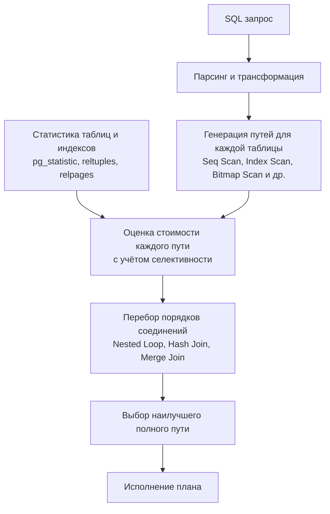

Оптимизатор запросов — мозг реляционной СУБД. Именно он превращает декларативный SQL в конкретный план выполнения, решая, какие индексы использовать, в каком порядке соединять таблицы и какой алгоритм соединения выбрать. Большинство современных систем — PostgreSQL, MySQL/InnoDB, Oracle, SQL Server — используют **Cost-Based Optimizer (CBO)** (оптимизатор на основе стоимости). Он генерирует множество возможных планов, оценивает стоимость каждого в условных единицах и выбирает самый дешёвый.

Знание того, как устроен CBO, не менее важно, чем умение читать `EXPLAIN` ([[10. План выполнения запроса. EXPLAIN]]). Это позволяет понять, *почему* выбран тот или иной план, предвидеть деградацию при изменении данных и настраивать систему так, чтобы оптимизатор принимал правильные решения.

### CBO vs RBO: почему стоимость, а не правила

Ранние СУБД использовали Rule-Based Optimizer (RBO): набор жёстких эвристик вроде «индекс всегда лучше полного сканирования» или «соединение по первичному ключу оптимально». RBO не учитывал реальные объёмы данных и их распределение. CBO же опирается на **статистику**, собранную о таблицах и индексах, и **модель стоимости**, которая переводит операции ввода-вывода и CPU в числовую меру.

Это фундаментально: CBO позволяет одному и тому же запросу на таблице в 1000 строк выбрать Seq Scan, а на таблице в 10 миллионов — Index Scan. Он адаптируется, и именно эта адаптивность делает современные базы данных такими мощными.

### Модель стоимости: от операций к условным единицам

PostgreSQL оперирует настраиваемыми константами стоимости, хранимыми в `postgresql.conf` или устанавливаемыми для сессии. Ключевые из них:

- **seq_page_cost** (по умолчанию 1.0) — стоимость чтения одной страницы с диска при последовательном сканировании. Считается базовой единицей.
- **random_page_cost** (по умолчанию 4.0) — стоимость чтения одной страницы при случайном доступе. На традиционных HDD случайный доступ в разы дороже из-за перемещения головок; на SSD разница меньше, рекомендуется 1.1–1.5.
- **cpu_tuple_cost** (по умолчанию 0.01) — стоимость обработки одной строки (сравнение, копирование).
- **cpu_index_tuple_cost** (по умолчанию 0.005) — стоимость обработки одной индексной записи.
- **cpu_operator_cost** (по умолчанию 0.0025) — стоимость выполнения одного оператора (например, `=`, `<`).
- **effective_cache_size** — не влияет на стоимость напрямую, но подсказывает оптимизатору, сколько памяти доступно для буферного кэша; это влияет на выбор между Index Scan и Bitmap Scan.

В MySQL/InnoDB похожие константы хранятся в таблице `mysql.server_cost` и `mysql.engine_cost` и могут корректироваться через `SET GLOBAL`.

Модель вычисляет общую стоимость как сумму:

```
Total Cost = (число страниц seq × seq_page_cost) +
             (число страниц random × random_page_cost) +
             (число обработанных строк × cpu_tuple_cost) +
             (число индексных записей × cpu_index_tuple_cost) +
             (число операторов × cpu_operator_cost)
```

Эта сумма и есть та самая условная единица (`cost`), которую мы видим в плане запроса. Это не время в миллисекундах, а абстрактная величина, позволяющая сравнивать планы *одного и того же запроса*.

> [!info] Под капотом
> В исходном коде PostgreSQL константы определяются в `src/backend/optimizer/path/costsize.c`. Функция `cost_seqscan()`, `cost_index()`, `cost_nestloop()` и т.д. вычисляют стоимость конкретных узлов, используя оценки селективности и кардинальности, полученные модулем `clausesel.c` и статистическими данными из `pg_statistic`.

### Статистика — топливо CBO

Чтобы оценить стоимость, оптимизатор должен знать, сколько строк вернёт каждая операция. Для этого он использует статистику, собранную командой `ANALYZE` (или автоматически через `autovacuum`). Основные метрики:

- **pg_class.reltuples** — оценка количества строк в таблице.
- **pg_class.relpages** — оценка количества страниц.
- **pg_statistic** — подробная статистика по столбцам: доля NULL, средняя ширина, число уникальных значений (`n_distinct`), наиболее частые значения (MCV — Most Common Values) и гистограммы распределения для остальных.

Используя эти данные, оптимизатор вычисляет **селективность** (selectivity) — долю строк, удовлетворяющих условию. Например, для `WHERE status = 'active'` выбирается значение из MCV-списка. Если значение там отсутствует, применяется упрощённая оценка `1 / n_distinct`. Затем селективность умножается на общее число строк, давая ожидаемое число строк (cardinality).

Детально статистика и её влияние на кардинальность будут рассмотрены в [[12. Cardinality и статистика]].

### Генерация и сравнение планов

Общий процесс оптимизации в PostgreSQL (упрощённо):

1. **Разбор и предварительная обработка:** запрос преобразуется в дерево выражений, подзапросы поднимаются, `IN` превращается в соединения.
2. **Генерация путей доступа:** для каждой таблицы создаются возможные пути: Seq Scan, Index Scan, Index Only Scan, Bitmap Scan. Каждый путь получает оценку стартовой и полной стоимости.
3. **Построение путей соединения:** начиная с двух таблиц, планировщик рекурсивно строит комбинации, применяя Nested Loop, Hash Join, Merge Join, оценивая их стоимость.
4. **Выбор наилучшего:** самый дешёвый полный путь выбирается как финальный план.

Для соединений используется динамическое программирование (алгоритм System R-style join enumeration). При большом числе таблиц (свыше `geqo_threshold = 12`) применяется генетический алгоритм (GEQO), чтобы избежать комбинаторного взрыва.



### Пример: почему на маленькой таблице Seq Scan

Рассмотрим таблицу `users` с 5 страницами (40 КБ) и индексом по `email`. Запрос `SELECT * FROM users WHERE email = 'alice@example.com'`. Оценка:

- Seq Scan: `5 страниц × seq_page_cost(1.0) = 5`.
- Index Scan: спуск по B-Tree (приблизительно 2 страницы индекса, random) + чтение leaf-страницы индекса (random) + чтение страницы таблицы (random) = `(2+1+1) × random_page_cost(4.0) = 16`. Кроме того, стоимость обработки ключей и строк.

Оптимизатор выбирает Seq Scan, потому что его стоимость ниже. Для таблицы в 100 000 страниц стоимость Seq Scan станет 100 000, а стоимость Index Scan около 16 + обработка нескольких строк (если селективность 1 строка), и оптимизатор переключится на Index Scan.

### Mechanical Sympathy: random_page_cost и железо

Традиционное значение `random_page_cost = 4.0` отражает реалии HDD, где случайный доступ требует перемещения головки (seek) и вращения, что в ~4 раза медленнее последовательного чтения. На SSD, где нет механических задержек, случайное чтение почти так же быстро, как последовательное (разница в микросекундах). Установка `random_page_cost` в 1.1–1.5 кардинально меняет поведение оптимизатора: он начинает смелее использовать индексы и Bitmap Scan, потому что случайный доступ больше не кажется ему дорогим.

В Go-приложении, подключающемся к базе данных, обычно эти параметры настраиваются на уровне сервера, но можно динамически задавать их для сессии:

```go
import "context"
import "github.com/jackc/pgx/v5"

func setSSDCosts(ctx context.Context, conn *pgx.Conn) error {
    _, err := conn.Exec(ctx, "SET random_page_cost = 1.1")
    return err
}
```

Однако лучшая практика — прописать настройки в конфигурации сервера, чтобы все сессии работали с правильными предпосылками.

> [!warning] Ловушка / Gotcha
> Не делайте `random_page_cost` ниже `seq_page_cost`, иначе оптимизатор будет считать случайный доступ дешевле последовательного, что разрушит все оценки. И не забывайте про `effective_cache_size`: если буферный кэш огромен и вмещает почти всю таблицу, даже Seq Scan может быть оценён как частично попадающий в кэш, снижая реальную стоимость. Планировщик учитывает это приблизительно.

### Параллельные запросы и стоимость

PostgreSQL с версии 9.6 поддерживает параллельное выполнение запросов. Для Seq Scan планировщик может рассмотреть **Parallel Seq Scan**, запуская несколько воркеров. Стоимость параллельного сканирования уменьшается пропорционально числу воркеров, но с накладными расходами на координацию. Параметры `min_parallel_table_scan_size` и `max_parallel_workers_per_gather` управляют этим. Аналогично, Index Scan может выполняться параллельно (начиная с PG 11).

### Статистика подводит: когда CBO ошибается

CBO хорош настолько, насколько хороша его статистика. Если `ANALYZE` не выполнялся после массовых изменений, `reltuples` и гистограммы не соответствуют реальности. Тогда оценки кардинальности становятся неверными, и выбирается ужасный план. Например, после вставки миллионов строк планировщик продолжает считать таблицу маленькой и выбирает Seq Scan там, где Index Scan был бы в тысячу раз быстрее.

Другая частая проблема — коррелированные столбцы. Если два столбца сильно коррелируют (скажем, `country` и `city`), планировщик предполагает их независимость и перемножает селективности, занижая итоговую кардинальность. Это ведёт к выбору Nested Loop там, где нужен Hash Join. Расширенные статистики (Extended Statistics, `CREATE STATISTICS`) решают эту проблему в PostgreSQL.

> [!tip] Собеседование
> **Вопрос:** Почему запрос иногда замедляется после `VACUUM FULL` или `ANALYZE`?
> **Ответ:** После `ANALYZE` обновляется статистика, и оптимизатор может перестроить план. Если новые данные существенно отличаются, план может смениться на менее эффективный для конкретного запроса. Это называется **plan regression**. Бороться можно заморозкой планов (в PostgreSQL — через `pg_hint_plan` или фиксацию параметров). Обычно же `ANALYZE` улучшает ситуацию.

### Инструменты для анализа работы CBO

- **auto_explain** — модуль, автоматически записывающий планы медленных запросов в логи.
- **pg_stat_statements** — собирает статистику выполнения запросов, позволяя находить часто выполняемые и дорогие.
- **EXPLAIN с подробностями** — `EXPLAIN (ANALYZE, BUFFERS, VERBOSE)` показывает фактические и ожидаемые строки; если разница велика — проблема в статистике.
- **pg_hint_plan** — расширение, позволяющее влиять на план через специальные комментарии, полезно для тестирования и обхода багов оптимизатора.

### Практика в Go: анализ и настройка

Go-разработчик может встроить в приложение мониторинг планов запросов. Например, периодически запускать диагностический запрос, сравнивающий оценки и факт:

```go
// Пример: получение расхождения ожидаемых и фактических строк
query := `
SELECT query, rows, shared_blks_hit, shared_blks_read
FROM pg_stat_statements
WHERE query ILIKE '%my_table%'
ORDER BY total_time DESC
LIMIT 5`
```

Или при логировании медленных запросов через middleware:

```go
func slowQueryLog(ctx context.Context, conn *pgx.Conn, duration time.Duration, sql string) {
    if duration > 100*time.Millisecond {
        var planJSON []byte
        _ = conn.QueryRow(ctx,
            "EXPLAIN (ANALYZE, BUFFERS, FORMAT JSON) "+sql).Scan(&planJSON)
        log.Warn("slow query", "duration", duration, "plan", string(planJSON))
    }
}
```

Знание модели стоимости помогает интерпретировать, почему план стал таким, и что изменить: добавить индекс, обновить статистику, подкорректировать `random_page_cost`.

### Итог

Cost-Based Optimizer превращает декларативный SQL в физический план, балансируя стоимость ввода-вывода и CPU на основе статистики. Понимание его работы закрывает разрыв между написанием запроса и реальным исполнением. Для Go-инженера, строящего высоконагруженные системы, этот навык так же необходим, как понимание планировщика горутин или сетевого стека.

В следующей статье мы углубимся в ту часть, которая напрямую питает CBO: [[12. Cardinality и статистика]] — как собираются гистограммы, MCV, и почему оценки кардинальности так важны.
