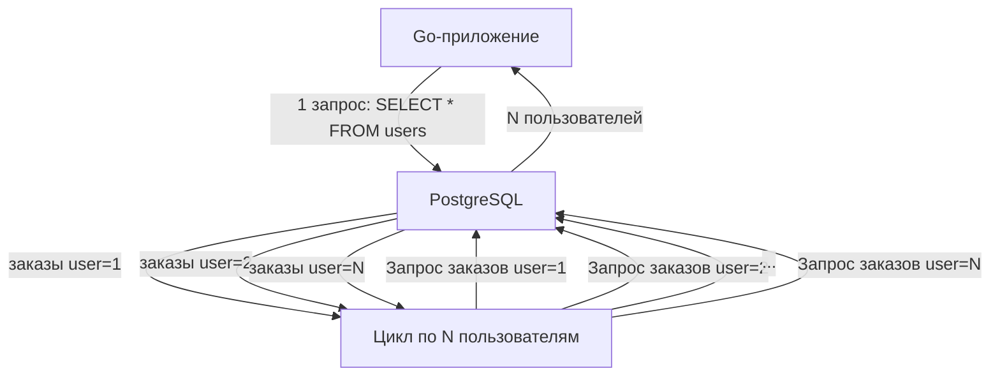

N+1 проблема — это классический антипаттерн взаимодействия с базой данных, при котором приложение выполняет один запрос для получения списка сущностей, а затем для каждой сущности — ещё по одному запросу для загрузки связанных данных. Если первый запрос вернул N строк, суммарно выполняется 1 + N запросов. Отсюда и название.

Эта проблема известна десятилетиями, но до сих пор остаётся одной из самых частых причин внезапной деградации производительности бэкендов, особенно при использовании ORM, которые скрывают факт дополнительных запросов за лаконичным API. Для Go-разработчика, ценящего контролируемость и прозрачность, понимание N+1 и способов её избежать — базовая гигиена кода.

### Как выглядит N+1

Предположим, у нас есть таблицы `users` и `orders`, связанные внешним ключом. Мы хотим вывести список пользователей и их заказы. Бездумный код на Go с использованием ORM или сырых запросов может выглядеть так:

```go
// 1 запрос: получаем всех пользователей
rows, _ := db.QueryContext(ctx, "SELECT id, name FROM users")
defer rows.Close()

var users []User
for rows.Next() {
    var u User
    rows.Scan(&u.ID, &u.Name)
    users = append(users, u)
}

// Для каждого пользователя — отдельный запрос заказов
for i, u := range users {
    orderRows, _ := db.QueryContext(ctx,
        "SELECT id, amount FROM orders WHERE user_id = $1", u.ID)
    defer orderRows.Close()
    for orderRows.Next() {
        var o Order
        orderRows.Scan(&o.ID, &o.Amount)
        users[i].Orders = append(users[i].Orders, o)
    }
}
```

Если `users` вернул 100 строк, приложение выполнит 1 + 100 = 101 запрос. На 10 000 пользователей — 10 001 запрос. Каждый из них проходит полный цикл: сетевой round-trip, парсинг SQL, планирование, выполнение, возврат результата. Задержка растёт линейно, а пропускная способность падает катастрофически.

### Почему N+1 убивает производительность

С точки зрения mechanical sympathy, каждый отдельный запрос — это не просто работа базы данных, но и:

- **Сетевой round-trip:** даже при расположении БД на том же хосте или в локальной сети, каждый запрос требует системных вызовов (`send`, `recv`), переключений контекста и копирования данных между kernel space и user space.
- **CPU-затраты на стороне БД:** каждый запрос, даже самый простой, проходит через парсинг (разбор SQL в синтаксическое дерево), планирование (оптимизатор выбирает план, см. [[11. Cost based optimizer]]) и инициализацию исполнителя. Для 10 000 запросов с одинаковым шаблоном, но разными параметрами, эти накладные расходы умножаются на 10 000.
- **Давление на кэш:** каждый запрос требует загрузки страниц индексов и таблицы в буферный кэш. Хотя для точечного запроса страницы, скорее всего, уже в кэше после первого обращения, множество запросов создают конкуренцию за кэш и вытесняют другие полезные данные.
- **Конкуренция за соединения:** если используется пул соединений ([[2. Connection pool]]), 10 000 последовательных запросов могут занять соединение на длительное время, в то время как другие горутины простаивают в ожидании.

Один запрос с `JOIN` или `WHERE id IN (...)` выполняет ту же работу за один round-trip и с минимальными накладными расходами.

### Пример в терминах SQL

Вместо двух запросов можно выполнить один с `JOIN`:

```sql
SELECT u.id, u.name, o.id, o.amount
FROM users u
LEFT JOIN orders o ON u.id = o.user_id
ORDER BY u.id;
```

База данных сама эффективно соединит таблицы, используя индексы (скорее всего, Nested Loop с индексом на `orders.user_id` или Hash Join). Получив плоский набор строк, приложение на Go должно сгруппировать их в структуры:

```go
usersMap := make(map[int64]*User)
for rows.Next() {
    var uID, oID int64
    var name string
    var amount sql.NullFloat64
    rows.Scan(&uID, &name, &oID, &amount)
    u, ok := usersMap[uID]
    if !ok {
        u = &User{ID: uID, Name: name}
        usersMap[uID] = u
    }
    if oID != 0 {
        u.Orders = append(u.Orders, Order{ID: oID, Amount: amount.Float64})
    }
}
```

Этот подход выполняет ровно 1 запрос, вне зависимости от N. Именно так решается N+1 на уровне сырого SQL.

### N+1 и ORM в Go

ORM (GORM, ent, bun) стремятся упростить работу со связанными сущностями, предлагая методы вроде `Preload`, `Eager`, `Include`. Но если разработчик забывает явно указать предзагрузку, ORM молча генерирует N+1 запросов. Например, в GORM:

```go
// без Preload — N+1
var users []User
db.Find(&users) // SELECT * FROM users
for _, u := range users {
    db.Model(&u).Association("Orders").Find(&u.Orders) // N запросов
}

// с Preload — один запрос с JOIN или два запроса с IN
db.Preload("Orders").Find(&users)
```

Даже при использовании `Preload` некоторые ORM реализуют его через два запроса: сначала загружают родительские сущности, затем собирают все идентификаторы и выполняют `SELECT * FROM orders WHERE user_id IN (1,2,3,...)`. Это лучше, чем N+1, но всё ещё не один запрос. Важно понимать, что генерирует ваша ORM, и проверять через логи.

### Альтернативы решения

1. **JOIN** — классика. Но может привести к дублированию данных родительских строк (одна родительская строка повторяется для каждой дочерней). При большом количестве дочерних записей объём передаваемых данных растёт, и приложение должно агрегировать строки. Подходит, когда дочерних записей немного и ширина родительской строки невелика.

2. **WHERE IN / Batch Loading** — два запроса: сначала загружаем родителей, собираем массив ID, затем загружаем детей одним запросом `WHERE parent_id IN ($1, $2, ...)`. Затем связываем в памяти. Этот подход предпочтительнее JOIN, когда родительская сущность широкая, чтобы не дублировать данные, и когда дочерних записей много. В Go легко реализуется с помощью `sqlx.In` или вручную.

```go
// пример batch loading с sqlx
var users []User
db.SelectContext(ctx, &users, "SELECT * FROM users")

userIDs := make([]int64, len(users))
for i, u := range users {
    userIDs[i] = u.ID
}

var orders []Order
query, args, _ := sqlx.In("SELECT * FROM orders WHERE user_id IN (?)", userIDs)
query = db.Rebind(query)
db.SelectContext(ctx, &orders, query, args...)

// построение мапа ordersByUserID и привязка
```

3. **Подзапросы / CTE / LATERAL** — позволяют выполнить всю логику на стороне СУБД, возвращая уже готовый результат, возможно, в виде JSON. Например, в PostgreSQL можно агрегировать дочерние записи в JSON-массив:

```sql
SELECT u.id, u.name,
       COALESCE(json_agg(json_build_object('id', o.id, 'amount', o.amount)) FILTER (WHERE o.id IS NOT NULL), '[]') AS orders
FROM users u
LEFT JOIN orders o ON u.id = o.user_id
GROUP BY u.id;
```

Тогда приложение получает одну строку на пользователя с уже готовым JSON-массивом заказов. Это минимизирует объём данных и исключает постобработку.

### Обнаружение N+1 в Go-приложении

- **Логирование запросов с трассировкой.** Включите логирование SQL-запросов в ORM или напишите обёртку над `database/sql`, которая логирует каждый запрос с идентификатором трейса. Повторяющиеся запросы с одинаковым шаблоном в одном трейсе — сигнал тревоги.
- **Трассировка (OpenTelemetry).** Каждый запрос к БД — это спан. В Jaeger вы увидите веер из множества одинаковых спанов после одного родительского. Легко идентифицировать визуально.
- **Мониторинг на стороне СУБД.** В PostgreSQL запросы с одинаковым fingerprint (нормализованным текстом) и большим числом вызовов видны в `pg_stat_statements`. Если запрос `SELECT * FROM orders WHERE user_id = $1` вызываетcя тысячи раз в секунду, это N+1.

> [!warning] Ловушка / Gotcha
> Иногда N+1 маскируется под нормальную работу, если кэш запросов на стороне БД (например, pgBouncer с `statement` pooling, Plan Cache) скрадывает накладные расходы на парсинг и планирование. Но сетевые round-trip и затраты на выборку остаются. Не полагайтесь на то, что «база справляется» — всегда предпочитайте пакетную обработку.

### Mechanical Sympathy: стоимость одного запроса

Каждый `db.QueryContext` в Go под капотом:

1. Берёт соединение из пула (может ожидать).
2. Сериализует параметры и отправляет запрос драйверу.
3. Драйвер через сокет отправляет байты БД (write syscall).
4. БД читает запрос (read syscall), парсит SQL, строит план (CPU, обращения к статистике в shared memory).
5. Выполняет план (чтение страниц из буфера или диска).
6. Формирует ответ, отправляет клиенту.
7. Клиент читает ответ (read syscall), драйвер десериализует.
8. Приложение обрабатывает `rows`.

Даже при самой быстрой сети и SSD каждый запрос занимает десятки микросекунд. 10 000 запросов — это сотни миллисекунд, которые превращаются в секунды под нагрузкой. Один пакетный запрос может выполнить ту же работу за единицы миллисекунд.



### Итог

N+1 — это не просто проблема ORM, а архитектурный изъян, возникающий, когда разработчик мыслит в терминах объектов, а не наборов данных. В мире Go, где контроль над каждым системным вызовом и аллокацией является нормой, такое расточительство недопустимо.

Решение всегда одно — уменьшить количество взаимодействий с базой данных: через JOIN, пакетную загрузку (`WHERE IN`), агрегацию на стороне СУБД. Анализ логов и планов запросов ([10. План выполнения запроса. EXPLAIN]]) помогает распознать проблему, а правильный выбор модели загрузки — избежать её на этапе проектирования.

В следующей статье мы перейдём от общей проблемы к частной технике: [[14. Оптимизация JOIN]] — как сделать соединения максимально эффективными, используя правильные индексы и алгоритмы.
