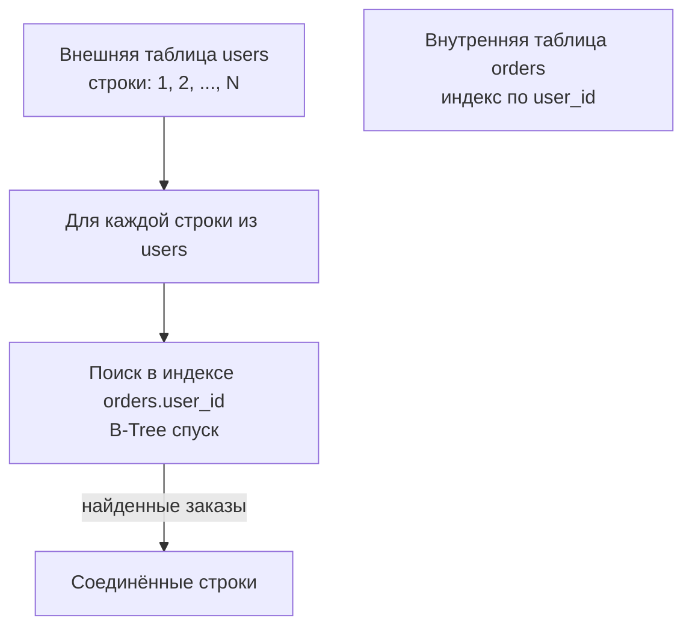
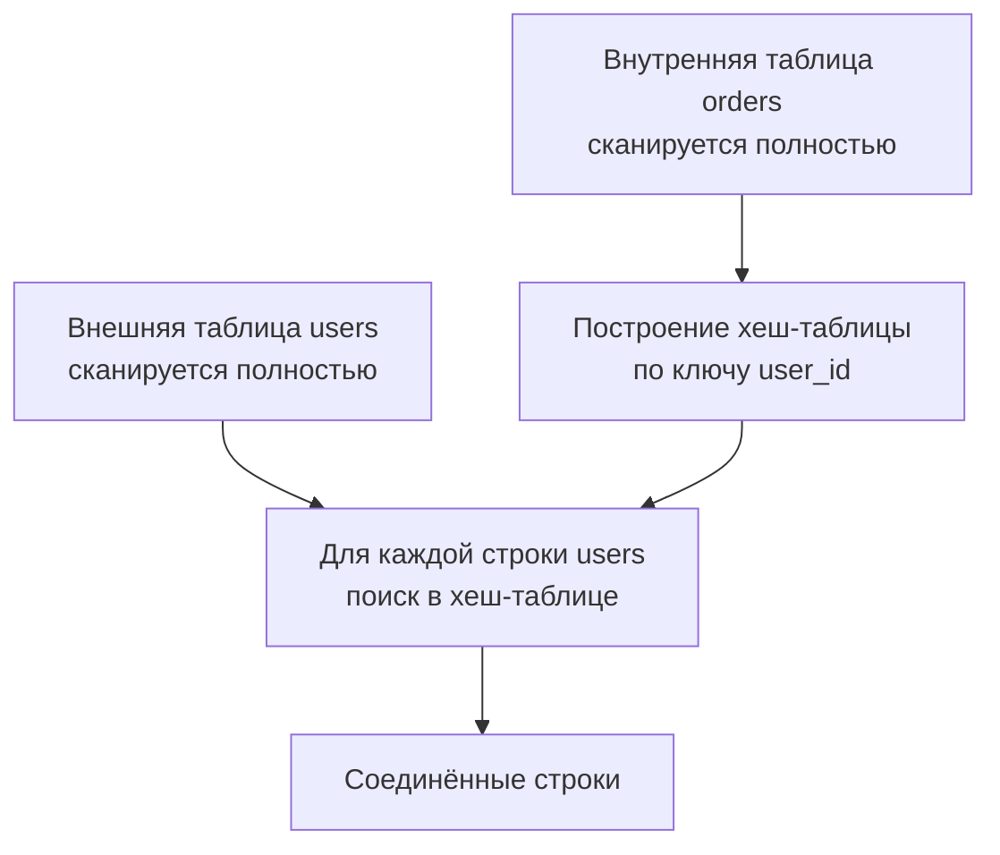
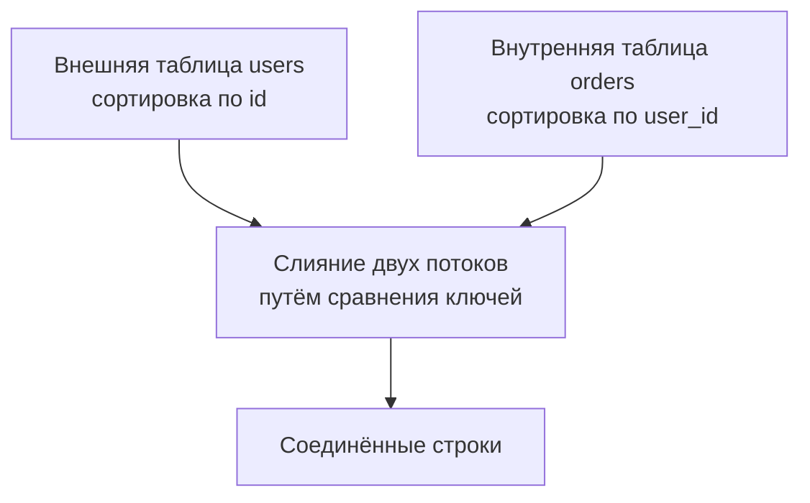

Операция соединения (`JOIN`) — одна из самых мощных и одновременно самых ресурсоёмких операций в SQL. Она объединяет строки из двух таблиц на основе условия, и если это условие не обеспечено правильными индексами или выбрано неоптимальное физическое соединение, запрос может превратиться в узкое горлышко, многократно превосходя по затратам простое сканирование.

В отличие от N+1 проблемы ([[13. N+1 проблема]]), где избыточность лежит на стороне приложения, медленный JOIN — это часто проблема планировщика и структуры данных. Понимание алгоритмов соединения и их связи с железом позволяет осознанно проектировать схему и запросы, а не просто надеяться, что "база как-нибудь сама".

### Три кита: Nested Loop, Hash Join, Merge Join

Современные СУБД (PostgreSQL, MySQL/InnoDB, Oracle) реализуют три основных алгоритма физического соединения. Выбор алгоритма определяется оптимизатором на основе стоимости ([[11. Cost based optimizer]]) и доступных индексов.

#### Nested Loop Join (соединение вложенными циклами)

Самый простой и интуитивный алгоритм. Для каждой строки из **внешней** таблицы (`outer`) выполняется поиск соответствующих строк во **внутренней** таблице (`inner`). Если для внутренней таблицы есть индекс по ключу соединения, поиск превращается в быстрый обход B-Tree ([[2. B Tree индекс под капотом]]); в противном случае внутренняя таблица сканируется последовательно для каждой строки внешней — катастрофа.



**Когда эффективен:**
- Внешняя таблица маленькая (единицы или сотни строк).
- На внутренней таблице есть индекс по ключу соединения, и условие высокоселективно.
- Возвращается лишь небольшое подмножество строк (например, `LIMIT`).

**Mechanical Sympathy:** Nested Loop без индекса на внутренней таблице — это гарантированный провал. Каждая внешняя строка вызывает полное сканирование внутренней, что порождает огромное количество последовательных или случайных чтений диска. При наличии индекса каждое обращение к внутренней таблице превращается в 2–3 случайных чтения страниц индекса плюс, возможно, чтение страницы данных. Если внешняя таблица содержит сотни тысяч строк, даже с индексом общая стоимость катастрофична из-за умножения случайных IOPS.

#### Hash Join (хеш-соединение)

Алгоритм: сначала из строк **внутренней** (обычно меньшей) таблицы строится хеш-таблица в памяти (work_mem). Затем строки **внешней** таблицы проходятся последовательно, и для каждой выполняется поиск в хеш-таблице. Подходит, когда нет подходящих индексов и соединение не коррелирует с физическим порядком.



**Когда эффективен:**
- Обе таблицы достаточно велики, и нет индексов по ключу соединения.
- Внутренняя таблица помещается целиком в выделенную память (`work_mem`; если не помещается, Hash Join использует дисковые временные файлы, что резко замедляет выполнение).

**Mechanical Sympathy:** Построение хеш-таблицы требует полного сканирования внутренней таблицы (последовательное чтение, отлично для SSD). Поиск по хешу — быстрая операция, но при большом количестве коллизий может снижаться скорость. Если памяти не хватает, PostgreSQL бьёт хеш-таблицу на батчи и записывает на диск, что добавляет случайный ввод-вывод и может на порядки увеличить время. Настройка `work_mem` критична для больших аналитических запросов.

#### Merge Join (соединение слиянием)

Обе таблицы предварительно сортируются по ключу соединения (или читаются из индексов, уже дающих сортированный порядок). Затем два отсортированных потока сливаются, как в merge sort: движемся двумя указателями, сравнивая ключи и выдавая совпадения.



**Когда эффективен:**
- Обе таблицы уже имеют индекс, обеспечивающий сортировку по ключу соединения (например, кластерный индекс в MySQL по первичному ключу, или BTREE индекс в PostgreSQL, который используется для Index Scan).
- Требуется сортировка результата по тому же ключу — Merge Join выдаёт результат уже отсортированным.
- Обе таблицы велики, и их доли соединения сопоставимы.

**Mechanical Sympathy:** Если таблицы уже отсортированы (благодаря индексам), Merge Join выполняет только последовательные чтения страниц индекса и таблицы, что идеально для дискового ввода-вывода. Если же требуется явная сортировка (Sort узлы), это добавляет потребление памяти и CPU. Характерно для запросов с `ORDER BY` по ключу соединения.

### Как планировщик выбирает алгоритм

Оптимизатор оценивает стоимость каждого алгоритма, опираясь на статистику ([[12. Cardinality и статистика]]):
- **Размеры таблиц** (`reltuples`).
- **Ожидаемое количество строк после фильтрации** (селективность).
- **Наличие индексов** и их стоимость (random_page_cost vs seq_page_cost).
- **Доступная память** (`work_mem`) для Hash Join.

Если есть индекс по ключу соединения, и внешняя таблица маленькая — победит Nested Loop. Если индекса нет, но одна из таблиц достаточно мала для хеш-таблицы — Hash Join. Если оба потока можно получить отсортированными без дополнительной сортировки — Merge Join.

В PostgreSQL можно временно отключать стратегии для отладки:
```sql
SET enable_nestloop = off;
SET enable_hashjoin = off;
SET enable_mergejoin = off;
```
Это помогает понять, какой алгоритм на самом деле быстрее для конкретного запроса.

### Оптимизация JOIN в Go-приложениях

Для Go-разработчика, работающего с `database/sql` или `pgx`, оптимизация JOIN сводится к следующим практикам:

1. **Индексы на внешние ключи.** Для любой таблицы, участвующей в соединении по внешнему ключу, должен быть индекс по этому ключу (если он не является первичным). Отсутствие индекса — самая частая причина превращения Nested Loop в Seq Scan внутри цикла.

2. **Фильтрация до JOIN.** Уменьшайте размеры входных таблиц с помощью `WHERE` перед соединением. Чем меньше строк подаётся на вход JOIN, тем меньше работы любому алгоритму. Используйте индексы для этих фильтров.

3. **Покрывающие индексы ([[6. Covering индекс]]).** Если запрос после соединения выбирает только несколько столбцов, покрывающий индекс на внутренней таблице может превратить Nested Loop в Index Only Scan без заходов в таблицу.

4. **Правильный порядок соединений.** Хотя оптимизатор сам выбирает порядок, он может ошибаться при некорректной статистике. Проверяйте планы. Иногда полезно разбить запрос на CTE и материализовать промежуточные результаты (`MATERIALIZED`), чтобы заставить определённый порядок.

5. **Настройка work_mem.** В высоконагруженных системах на Go, где выполняются аналитические запросы с Hash Join, может потребоваться увеличить `work_mem` для сессии, чтобы хеш-таблица поместилась в память и не уходила на диск.

```go
import "github.com/jackc/pgx/v5"

func setWorkMem(ctx context.Context, conn *pgx.Conn, mem string) error {
    _, err := conn.Exec(ctx, fmt.Sprintf("SET work_mem = '%s'", mem))
    return err
}
```

6. **Денормализация и предварительные агрегаты.** Иногда JOIN'ы можно вообще убрать, перенеся данные в одну таблицу или материализовав представление (materialized view). Это крайняя мера, но для очень горячих запросов оправдана.

### Пример анализа плана с JOIN

Возьмём запрос:

```sql
EXPLAIN (ANALYZE, BUFFERS)
SELECT u.name, o.amount
FROM users u
JOIN orders o ON u.id = o.user_id
WHERE u.created_at > '2024-01-01';
```

Возможный план:

```
Hash Join  (cost=12.50..45.67 rows=1000 width=36)
  Hash Cond: (o.user_id = u.id)
  ->  Seq Scan on orders o  (cost=0.00..28.00 rows=2000 width=16)
  ->  Hash  (cost=10.00..10.00 rows=200 width=20)
        ->  Index Scan using idx_users_created on users u
            Index Cond: (created_at > '2024-01-01')
```

Здесь Hash Join выбран, потому что orders сканируется полностью (нет фильтра), users фильтруется индексом и хешируется. Если бы у orders был индекс по `user_id` и `WHERE` давал бы мало строк, оптимизатор выбрал бы Nested Loop. Проверка через `EXPLAIN` позволяет убедиться в адекватности выбора.

### Типичные ошибки и ловушки

> [!warning] Ловушка / Gotcha
> - **Неявные преобразования типов:** если ключи соединения разных типов (например, `int` и `bigint`), индекс может не использоваться, и Nested Loop вырождается в Seq Scan. Всегда проверяйте типы в схеме.
> - **Планировщик недооценил кардинальность:** после JOIN может быть выдано гораздо больше строк, чем ожидалось, что приводит к неоптимальным последующим операциям (сортировка, агрегация). Extended Statistics помогают.
> - **Memory spill для Hash Join:** если `work_mem` недостаточен, на диске создаются временные файлы, что видно в `EXPLAIN (ANALYZE, BUFFERS)` как `Buckets: ... Batches: ...`. Это признак, что нужно увеличить память или переписать запрос.

> [!tip] Собеседование
> **Вопрос:** Может ли Nested Loop быть быстрее Hash Join на больших таблицах?
> **Ответ:** Да, если внешняя таблица очень мала (или есть LIMIT, и оптимизатор применяет ранний выход), а внутренняя имеет эффективный индекс. Например, при поиске 10 пользователей и их заказов среди миллионов Nested Loop с индексом по user_id будет быстрее, чем построение хеш-таблицы из миллионов заказов.

### Мониторинг и анализ в Go

Интеграция анализа JOIN'ов в Go-приложение:

```go
func debugJoinPlan(ctx context.Context, db *sql.DB, query string, args ...any) {
    // выполняем EXPLAIN и парсим JSON
    var planJSON map[string]interface{}
    explainQuery := "EXPLAIN (ANALYZE, BUFFERS, FORMAT JSON) " + query
    row := db.QueryRowContext(ctx, explainQuery, args...)
    row.Scan(&planJSON)
    // рекурсивно обходим план, логируя узлы с Join
    logJoinNodes(planJSON["Plan"], 0)
}
```

Это помогает выявить неожиданные Seq Scan внутри JOIN.

### Заключение

Оптимизация JOIN — это глубокая тема, находящаяся на стыке архитектуры схемы, статистики, индексов и понимания физических алгоритмов. Недостаточно просто написать `JOIN` и надеяться на ORM; профессиональный Go-разработчик должен уметь читать план, видеть Nested Loop или Hash Join и понимать, что стоит за каждой строкой `EXPLAIN`. Правильно подобранный составной индекс ([[5. Composite индексы]]), своевременный `ANALYZE` ([[12. Cardinality и статистика]]) и адекватная настройка памяти — залог быстрых соединений в высоконагруженном сервисе.

В следующей статье мы продолжим тему оптимизации и рассмотрим более общие методы ускорения выборок: [[15. Оптимизация SELECT]].
