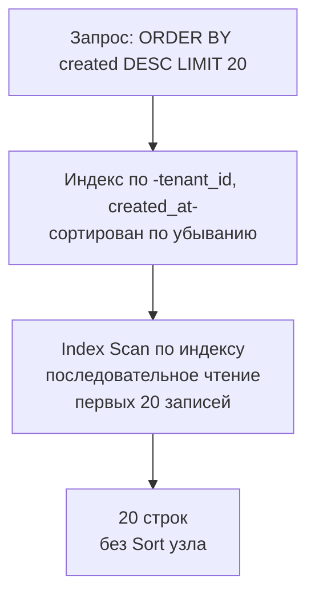

`SELECT` — самая частая операция чтения в базе данных, и именно она, как правило, определяет отзывчивость бэкенда. Несмотря на кажущуюся простоту, `SELECT` таит в себе множество нюансов, незнание которых приводит к медленным запросам, истощению ресурсов и деградации всего сервиса. Для Go-разработчика, строящего высоконагруженные системы, оптимизация `SELECT` — это не разовая акция, а постоянная инженерная дисциплина, тесно связанная с пониманием индексов, планировщика и mechanical sympathy.

В этой статье мы разберём ключевые приёмы оптимизации `SELECT` на уровне SQL и кода приложения, опираясь на знания из предыдущих статей раздела. От выбора столбцов до пагинации, от условий до агрегаций — каждый аспект будет рассмотрен с точки зрения производительности и влияния на железо.

### Не выбирайте звёздочку

`SELECT *` — самый распространённый антипаттерн. Он заставляет базу данных читать все столбцы строки, даже те, которые приложению не нужны. Это влечёт:

- **Лишний ввод-вывод:** Если нужные столбцы могли бы быть взяты из покрывающего индекса ([[6. Covering индекс]]), `SELECT *` гарантирует обращение к таблице (heap fetch), увеличивая число случайных чтений.
- **Увеличение объёма передаваемых данных:** Широкие столбцы (`text`, `jsonb`, `bytea`) передаются по сети и занимают память в Go-приложении, нагружая сборщик мусора.
- **Потеря возможности Index Only Scan:** Даже если индекс содержит все необходимые столбцы, `SELECT *` запрашивает столбцы, отсутствующие в индексе, вынуждая базу обращаться к heap.

Всегда перечисляйте только те столбцы, которые действительно нужны:

```sql
SELECT id, name, email FROM users WHERE active = true;
```

> [!info] Под капотом
> В PostgreSQL при `SELECT *` драйвер (`lib/pq`, `pgx`) получает кортежи с полным набором атрибутов. Если в Go-коде вы сканируете только часть из них, всё равно выделяется память под все поля, данные копируются в буфер драйвера. При `SELECT id, name` объём передачи и парсинга кратно меньше.

### Sargable условия: позвольте индексам работать

**Sargable** (Search ARGument ABLE) — условия, которые позволяют использовать индекс для поиска. Типичные sargable-операторы: `=`, `<`, `>`, `BETWEEN`, `LIKE 'prefix%'`, `IN` с константами, `IS NULL` (при определённых условиях).

Не-sargable конструкции мешают использованию индекса, заставляя базу данных вычислять значение для каждой строки:

- Применение функции к индексированному столбцу: `WHERE LOWER(email) = 'alice@example.com'`. Если индекс построен на `email`, он не будет использоваться. Решение — создать выраженный индекс: `CREATE INDEX ON users (LOWER(email))`.
- Арифметика: `WHERE salary * 1.2 > 100000` — индекс по `salary` не используется. Лучше выразить как `WHERE salary > 100000 / 1.2`.
- Неявные приведения типов: если столбец `created_at` имеет тип `timestamp with time zone`, а параметр передан как `date`, может произойти неявное преобразование, которое отключит индекс. В Go используйте точные типы времени: `time.Time`.

```go
// Правильно: передаём time.Time с явным часовым поясом
rows, err := db.QueryContext(ctx, 
    "SELECT id FROM events WHERE created_at >= $1", startTime)
```

### Индексы для сортировки и пределов

Запросы с `ORDER BY` и `LIMIT` — обычное дело для лент новостей, списков, лидербордов. Если индекс обеспечивает порядок сортировки, база данных может избежать дорогостоящей операции `Sort`. B-Tree индекс хранит ключи в отсортированном порядке, поэтому `ORDER BY` по индексированному столбцу (или по префиксу составного индекса, [[5. Composite индексы]]) часто обслуживается без дополнительной сортировки.

При наличии `LIMIT` и подходящего индекса планировщик может применить **top-N heapsort** или просто остановиться, прочитав первые N строк из индекса, что радикально снижает стоимость.

Пример: для запроса `SELECT * FROM events WHERE tenant_id = 5 ORDER BY created_at DESC LIMIT 20` индекс `(tenant_id, created_at DESC)` позволит быстро найти первую запись и обойти листья, остановившись после 20 строк.



### Пагинация: избегайте OFFSET

Традиционный `OFFSET` работает так: база данных сканирует индекс или таблицу, пропускает указанное число строк и только затем возвращает следующие. С ростом `OFFSET` эта операция становится всё дороже — представьте, что нужно пропустить 1 000 000 строк, чтобы взять следующие 20.

Альтернатива — **keyset pagination** (seek method). Вместо `OFFSET` запоминаем последнее значение сортируемого ключа и добавляем условие `WHERE key > last_value`. Для этого нужен индекс, поддерживающий сортировку.

```go
// Классический OFFSET (плохо)
const page = 1000
db.QueryContext(ctx, "SELECT id, name FROM users ORDER BY id LIMIT 20 OFFSET $1", page*20)

// Keyset пагинация (хорошо)
lastID := 12345 // ID последней записи с предыдущей страницы
db.QueryContext(ctx, "SELECT id, name FROM users WHERE id > $1 ORDER BY id LIMIT 20", lastID)
```

При использовании keyset пагинации индекс по `id` используется для точного позиционирования, и каждая страница берётся за O(log N + LIMIT). Это стабильно и предсказуемо.

> [!warning] Ловушка / Gotcha
> Keyset пагинация требует, чтобы ключ сортировки был уникальным и монотонно возрастающим. Если используется составной ключ, например `(created_at, id)`, условие должно быть `(created_at, id) > ($1, $2)` — PostgreSQL поддерживает сравнение кортежей.

### Агрегация и GROUP BY

`GROUP BY` и агрегатные функции (`COUNT`, `SUM`, `AVG`) часто требуют обработки большого числа строк. Оптимизация здесь включает:

- **Индексы, покрывающие группировку.** Если индекс включает столбцы `GROUP BY` в том же порядке, что и запрос, база данных может выполнить **Loose Index Scan** (или Index Skip Scan в MySQL): она прыгает по уникальным значениям группировки, минуя дубликаты.
- **Покрывающий индекс для агрегации.** Например, для `SELECT tenant_id, COUNT(*) FROM events GROUP BY tenant_id` индекс `(tenant_id)` позволит выполнить Index Only Scan, не читая таблицу.
- **Предварительно вычисленные агрегаты.** Для очень больших таблиц создавайте материализованные представления ([[12. Представления и materialized views]]).

### Подзапросы, CTE и LATERAL

Иногда один сложный `SELECT` с вложенными подзапросами проигрывает по производительности цепочке более простых запросов или, наоборот, выигрывает за счёт одного прохода.

- **CTE (`WITH`)** в PostgreSQL до версии 12 всегда выступали как оптимизационный барьер (материализовались), что могло как помочь, так и навредить. С версии 12 CTE по умолчанию не материализуются (`NOT MATERIALIZED`), позволяя планировщику встроить их в основной запрос. При необходимости можно принудительно материализовать: `WITH cte AS MATERIALIZED (...)`.
- **`LATERAL`** позволяет ссылаться на столбцы предыдущих таблиц в подзапросе, что полезно для вызова функций или эффективного `LIMIT` для каждой строки. Например, получить трёх последних заказа для каждого пользователя:

```sql
SELECT u.id, o.id, o.amount
FROM users u
JOIN LATERAL (
    SELECT id, amount FROM orders
    WHERE user_id = u.id
    ORDER BY created_at DESC
    LIMIT 3
) o ON true;
```

С правильным индексом `(user_id, created_at DESC)` это будет молниеносно, в отличие от оконных функций с `ROW_NUMBER()`.

### Параллельное выполнение

PostgreSQL может задействовать параллельные воркеры для ускорения `SELECT`, особенно при сканировании больших таблиц. Параметры `max_parallel_workers_per_gather` и `min_parallel_table_scan_size` управляют этим. Планировщик может выбрать `Gather` узел, объединяющий результаты от нескольких воркеров. Это эффективно для Seq Scan или Index Scan, но не для всех запросов. Для точечных поисков параллелизм не включается.

### Практические приёмы в Go

Go-разработчик может ускорить `SELECT`, грамотно используя драйвер и кэширование:

- **Prepared statements** (подготовленные запросы). Они кэшируют план запроса на стороне базы (в PostgreSQL — через `PREPARE`), экономя на парсинге и планировании при повторных вызовах. В `database/sql` при использовании `db.QueryContext` с параметрами драйвер сам может использовать prepared statements, если они поддерживаются (в `pgx` это настраивается через `PreferSimpleProtocol`).
- **Пакетирование запросов** (см. [[16. Batch запросы]]) — вместо множества отдельных `SELECT` объединяйте их через `UNION ALL` или `WHERE id IN (...)`.
- **Кэширование на уровне приложения.** Используйте in-memory кэш (например, `go-cache`, `ristretto`) для горячих данных, которые редко меняются. Это разгружает базу данных и уменьшает задержку.

> [!info] Под капотом
> В `pgx` можно использовать `SendBatch` для отправки нескольких запросов в одном сетевом пакете, что снижает задержки round-trip. Это актуально, когда нужно выполнить серию `SELECT` в ответ на один HTTP-запрос.

### Mechanical Sympathy: сеть и CPU

Каждый лишний байт, передаваемый из базы данных в приложение, проходит через сетевой стек (syscalls `send`/`recv`), копируется в буферы ядра, а затем в память процесса. Уменьшение выборки до действительно нужных столбцов снижает объём трафика, количество системных вызовов и время копирования. Аналогично, сокращение числа запросов (через keyset pagination вместо множественных `OFFSET`, через batch) уменьшает накладные расходы на TCP-рукопожатия и переключения контекста.

С точки зрения CPU, разбор большого количества столбцов, особенно `jsonb` (которые могут быть автоматически декодированы драйвером), загружает процессор и может вызывать аллокации, увеличивающие давление на GC в Go. Умный выбор столбцов и отказ от `SELECT *` прямо влияет на пропускную способность сервиса.

### Как убедиться, что оптимизация работает

Главный инструмент — `EXPLAIN (ANALYZE, BUFFERS)` ([[10. План выполнения запроса. EXPLAIN]]). После написания запроса проверяйте:

- Используется ли ожидаемый индекс (Index Scan / Index Only Scan)?
- Нет ли `Seq Scan` там, где должен быть индекс?
- Есть ли `Sort` узел, и можно ли его убрать с помощью индекса?
- Каково реальное количество строк (`actual rows`) в сравнении с ожидаемым? Сильное расхождение — сигнал устаревшей статистики ([[12. Cardinality и статистика]]).

В Go-коде можно написать тесты, которые выполняют `EXPLAIN` для критичных запросов и проверяют отсутствие `Seq Scan` на больших таблицах.

### Заключение

Оптимизация `SELECT` — это не отдельная техника, а интегральная инженерная практика, объединяющая:
- Правильный дизайн схемы и индексов ([[2. B Tree индекс под капотом]], [[5. Composite индексы]], [[6. Covering индекс]], [[7. Partial индекс]]);
- Саргабельные предикаты и избегание неявных преобразований;
- Выбор только необходимых столбцов;
- Современные подходы к пагинации;
- Использование возможностей планировщика (параллелизм, `LATERAL`, CTE);
- Понимание того, как данные движутся от диска до вашей Go-структуры.

Профессиональный Go-разработчик не просто пишет запросы — он анализирует их влияние на всю систему, опираясь на метрики и планы выполнения. В следующей статье мы рассмотрим, как ещё больше снизить накладные расходы, объединяя множество операций в один вызов: [[16. Batch запросы]].
