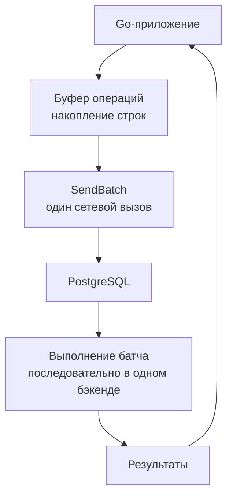

Batch запросы (пакетные запросы) — техника объединения множества однотипных операций с базой данных в один сетевой вызов. Вместо того чтобы отправлять сотни отдельных `SELECT`, `INSERT`, `UPDATE` или `DELETE`, приложение формирует один SQL-запрос с множеством параметров или несколько запросов в одном сообщении, радикально сокращая накладные расходы.

Для Go-разработчика, чей код общается с базой данных по сети, batch-запросы — это прямой путь к снижению задержек и увеличению пропускной способности. Особенно актуально это становится в микросервисной архитектуре, где каждый лишний round-trip может складываться в ощутимые десятки миллисекунд.

### Почему round-trip — враг

Каждый отдельный запрос к базе данных, даже самый простой, проходит полный путь:

1. **Go-приложение:** формирование SQL, сериализация параметров, системный вызов `sendto()`.
2. **Сетевой стек:** TCP/IP обработка, передача пакета, получение ответа.
3. **СУБД:** системный вызов `recvfrom()`, разбор SQL (парсинг), планирование запроса (оптимизатор), выполнение, формирование ответа, отправка.
4. **Обратно в приложение:** копирование данных в память процесса, десериализация.

Сам по себе этот цикл занимает от десятков микросекунд (на локальном сокете) до нескольких миллисекунд (по сети). Если нужно выполнить 1000 таких операций, суммарная задержка становится неприемлемой, даже если каждая операция физически выполняется мгновенно. Batch-запрос обрубает этот оверхед, заменяя 1000 циклов одним.

### Типы пакетных операций

**Пакетная вставка.** Классический пример — множественный `INSERT`:

```sql
INSERT INTO events (user_id, type, payload) VALUES
 ($1, $2, $3),
 ($4, $5, $6),
 ($7, $8, $9);
```

Вместо трёх отдельных вызовов — один запрос. СУБД парсит его единожды и вставляет все строки в рамках одной транзакции (или неявной). PostgreSQL также поддерживает `COPY`, который ещё быстрее для массовой загрузки, но работает через специальный протокол.

**Пакетная выборка по ключам.** Вместо `SELECT ... WHERE id = 1` для каждого идентификатора, используем `WHERE id IN (...)`:

```sql
SELECT id, name FROM users WHERE id IN ($1, $2, $3, ...);
```

Это радикально сокращает число запросов и, как бонус, позволяет оптимизатору применить Index Scan один раз по массиву ключей.

**Пакетное обновление.** Обновление разных строк разными значениями можно выполнить с помощью `CASE` или через `UPDATE ... FROM VALUES`:

```sql
UPDATE users u SET
    name = v.name,
    email = v.email
FROM (VALUES
    (1, 'Alice', 'alice@example.com'),
    (2, 'Bob', 'bob@example.com')
) AS v(id, name, email)
WHERE u.id = v.id;
```

Это один запрос вместо N отдельных `UPDATE`. Аналогично для удаления — `DELETE FROM table WHERE id IN (...)`.

**Multiple SQL в одном вызове.** Протокол PostgreSQL позволяет отправить несколько SQL-команд в одном сообщении (разделённых `;`). Драйвер `pgx` предоставляет метод `SendBatch`, который упаковывает несколько запросов в один сетевой пакет, экономя round-trip'ы. Это полезно, когда запросы разнородны и не могут быть объединены в один SQL.

### Реализация в Go: pgx.SendBatch

Драйвер `pgx` для Go предлагает прямой API для пакетной отправки:

```go
import (
    "context"
    "github.com/jackc/pgx/v5"
)

func insertEventsBatch(ctx context.Context, conn *pgx.Conn, events []Event) error {
    batch := &pgx.Batch{}
    for _, e := range events {
        batch.Queue(
            "INSERT INTO events(user_id, type, payload) VALUES($1, $2, $3)",
            e.UserID, e.Type, e.Payload,
        )
    }
    br := conn.SendBatch(ctx, batch)
    defer br.Close()
    // Проверяем результаты каждой команды
    for i := 0; i < len(events); i++ {
        _, err := br.Exec()
        if err != nil {
            return fmt.Errorf("batch insert %d: %w", i, err)
        }
    }
    return nil
}
```

Этот код отправляет все вставки одним сетевым вызовом (одна TCP-посылка), после чего читает ответы последовательно. По сравнению с последовательным `Exec`, выигрыш может быть многократным.

Для пакетной выборки `pgx` поддерживает `Query` внутри `Batch` с индивидуальными результатами или можно использовать `sqlx.In` для разворачивания `IN`-условий:

```go
import "github.com/jmoiron/sqlx"

func getUsersByIDs(ctx context.Context, db *sqlx.DB, ids []int64) ([]User, error) {
    query, args, err := sqlx.In(
        "SELECT id, name FROM users WHERE id IN (?);", ids,
    )
    if err != nil {
        return nil, err
    }
    query = db.Rebind(query)
    var users []User
    err = db.SelectContext(ctx, &users, query, args...)
    return users, err
}
```

`sqlx.In` генерирует корректное количество плейсхолдеров (`$1, $2, $3...`) на основе длины слайса и передаёт их одним запросом.

### COPY: максимальная скорость вставки

Для массового наполнения таблиц лучший выбор — протокол `COPY`, который PostgreSQL реализует через бинарный поток. В `pgx` есть метод `CopyFrom`, позволяющий загружать слайс структур напрямую в таблицу без построения SQL-строк:

```go
func copyEvents(ctx context.Context, conn *pgx.Conn, events []Event) (int64, error) {
    return conn.CopyFrom(
        ctx,
        pgx.Identifier{"events"},
        []string{"user_id", "type", "payload"},
        pgx.CopyFromSlice(len(events), func(i int) ([]interface{}, error) {
            e := events[i]
            return []interface{}{e.UserID, e.Type, e.Payload}, nil
        }),
    )
}
```

`COPY` обходит парсинг SQL и работает напрямую с таблицей, записывая данные в страницы с минимальными накладными расходами. Для миллионов строк это на порядки быстрее `INSERT`.

### Потенциальные проблемы и ловушки

> [!warning] Ловушка / Gotcha
> - **Слишком большой батч.** Огромный запрос с десятками тысяч параметров вызывает гигантское потребление памяти на стороне БД и клиента, длительную блокировку, а также может превысить лимиты (в PostgreSQL `max_stack_depth`, `max_prepared_transactions` и т.д.). Рекомендуется разбивать на батчи разумного размера (100–1000 строк) и тестировать.
> - **Ошибка в середине батча.** Если один из элементов батча вызывает ошибку (например, нарушение уникальности), поведение зависит от реализации. При `INSERT ... VALUES` нарушение откатит весь батч. В `pgx.Batch` каждая команда выполняется независимо в рамках одной транзакции (если не задана явная), и ошибка одной не отменяет другие по умолчанию — нужно проверять каждый результат и решать, что делать.
> - **Таймауты.** Очень большой батч может выполняться долго. Надо настраивать `statement_timeout` на стороне сервера или контекст с таймаутом в Go, чтобы избежать зависания.

### Mechanical Sympathy: что происходит под капотом

Когда вы вызываете `conn.SendBatch`, драйвер формирует одно сообщение в формате протокола PostgreSQL (тип `'Q'` для Query, или `'P'` для Parse+Describe+Execute при расширенном протоколе). Все запросы упаковываются в один TCP-сегмент. Ядро отправляет их через сетевой интерфейс за один или несколько системных вызовов `write`. Сервер PostgreSQL принимает сообщение через `recv`, разбирает и выполняет команды последовательно, не покидая контекста одного обслуживающего процесса (backend). Ответы буферизуются и отправляются обратно одним или несколькими TCP-сегментами.

Тем самым экономятся:
- **Количество системных вызовов** (send/recv).
- **Контекстные переключения** (переходы между пользовательским и ядерным пространством).
- **Парсинг SQL** (при `pgx.Batch` каждая команда парсится отдельно, но внутри одного бэкенда, без повторных инициализаций сессии).
- **Планирование** (при `PREPARE` + `EXECUTE` в рамках одного сообщения — план может быть закэширован).

При использовании `COPY` включается потоковый режим, где данные передаются без обрамления в SQL-команды, и сервер напрямую наполняет страницы, минимизируя взаимодействие с планировщиком и исполнителем.

### Когда batch не нужен

Не стоит увлекаться батчами для единичных операций. Если приложение в цикле проходит по списку и отправляет по одному запросу — это очевидный кандидат на батч. Но если приложение естественно обрабатывает элементы по одному (например, в асинхронном воркере), то батч потребует накопления, что может увеличить задержку отдельной операции. Здесь важен баланс: можно накапливать события во временном буфере и сливать пачкой с заданной периодичностью или по наполнению.

### Конкурентные batch-запросы и блокировки

При выполнении большого `UPDATE ... FROM (VALUES ...)` может быть захвачено множество блокировок строк. Если несколько горутин одновременно выполняют такие запросы, возможно взаимоблокирование ([[6. Deadlock и их предотвращение]]). Следите за порядком строк в батчах и используйте явную сортировку, чтобы избежать deadlock'ов.



### Итог

Batch-запросы — это фундаментальный приём оптимизации взаимодействия с базой данных, который напрямую эксплуатирует принцип сокращения round-trip'ов и минимизации накладных расходов. В экосистеме Go инструменты `pgx.Batch`, `sqlx.In` и `COPY` дают разработчику гибкие возможности для построения высокопроизводительных конвейеров данных.

На этом мы завершаем раздел **Индексы и производительность**. Мы изучили, как индексы устроены изнутри (B-Tree, Hash, Bitmap), как комбинировать их в составные, покрывающие и частичные, как распознавать вредные индексы, читать планы запросов, понимать логику оптимизатора, статистику и кардинальность, избегать N+1 проблемы и оптимизировать JOIN и SELECT. Batch-запросы логически завершают этот путь, позволяя применить полученные знания для минимизации накладных расходов на сетевом и серверном уровне.

Далее мы переходим к другому краеугольному камню работы с данными — надёжности и целостности. В следующем разделе мы начнём с фундаментальных принципов транзакций: [[1. ACID. Основы]].
