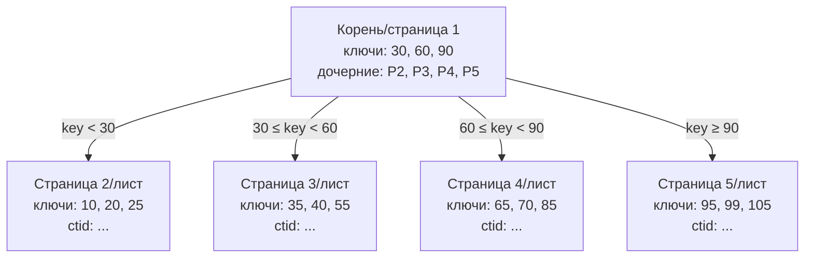

В предыдущей статье [[1. Что такое индекс и зачем он нужен]] мы выяснили, что индекс — это вспомогательная структура, позволяющая находить строки без полного сканирования таблицы. Теперь пришло время спуститься на уровень реализации и разобрать, как именно устроена самая распространённая индексная структура в реляционных базах данных — **B-Tree** и его разновидность **B+Tree**.

B-Tree используется в PostgreSQL (все типы индексов `btree`), MySQL/InnoDB (кластерный и вторичный индексы), Oracle, SQLite и многих других системах. Это боевой конь, отточенный десятилетиями эксплуатации на дисковых хранилищах.

### Почему не бинарное дерево

Бинарное дерево поиска (BST) отлично работает в оперативной памяти: время поиска O(log₂ N), мутация проста. Но когда данные живут на диске, каждая операция перехода по указателю означает чтение нового блока. Бинарное дерево имеет высоту порядка log₂ N, и каждый узел хранит один ключ и два указателя. При N = 10⁹ высота составит около 30 уровней. Если каждая операция требует чтения нового блока диска (латенция порядка 0.1–10 мс), поиск превратится в вечность.

B-Tree радикально снижает высоту, упаковывая в один узел сотни ключей и множество дочерних указателей. Узел занимает полную страницу диска (обычно 8 КБ), и за одно дисковое чтение мы получаем не один, а целую группу ключей. Высота B-Tree при N = 10⁹ и странице в 8 КБ будет равна всего 3–4. Таким образом, поиск по диску обходится в 3–4 физических чтения — вполне приемлемо.

### Механическая симпатия: страница — наш друг

Дисковые устройства (HDD, SSD) оперируют блоками. Жёсткий диск читает секторами по 512 байт или 4 КБ; SSD — страницами по 4–16 КБ. СУБД унифицирует это понятие в **страницу данных** (data page), обычно размером 4, 8 или 16 КБ. В PostgreSQL стандартный размер блока — 8 КБ, в InnoDB — 16 КБ (настраивается). Узел B-Tree физически хранится как страница на диске и при чтении загружается в буферный кэш СУБД в оперативной памяти.

Самый дорогой ресурс — случайный доступ к диску (random I/O). B-Tree минимизирует число случайных чтений за счёт высокой степени ветвления (fanout): с одной страницы мы переходим на одну из сотен дочерних страниц. Все чтения выполняются выровненными блоками, что соответствует естественной работе планировщика ввода-вывода ОС.

> [!info] Под капотом
> При чтении страницы СУБД делает системный вызов `pread()` с нужным смещением. ОС, если страница ещё не в page cache, порождает физическое чтение с диска. Дальнейшие чтения этой же страницы попадают в кэш ОС, а при умном управлении буферным кэшем СУБД (shared_buffers в PostgreSQL, buffer pool в InnoDB) — вовсе не выходят за пределы процесса.

### Внутреннее устройство B-Tree узла

Структура страницы B-Tree включает заголовок (номер страницы, флаги, количество ключей, указатели на соседей) и массив записей. Каждая запись состоит из:

- **Ключа** (key) — значения индексируемого столбца (плюс, возможно, дополнительные атрибуты для уникальности).
- **Указателя** (pointer) — в зависимости от типа узла:
  - Во **внутреннем узле** (branch) — номер дочерней страницы.
  - В **листовом узле** (leaf) — физический идентификатор строки таблицы (`ctid` в PostgreSQL) или первичный ключ в MySQL/InnoDB (при вторичном индексе).

Все ключи внутри страницы отсортированы по возрастанию. Внутренний узел с `k` ключами хранит `k` ключей и `k+1` дочерних указателей (левое поддерево — ключи меньше первого ключа, правее — по диапазонам).

В **B+Tree** (который фактически используется во всех современных реализациях) все значения (ссылки на строки) хранятся исключительно в листьях. Внутренние узлы содержат только ключи и указатели на дочерние страницы, но не на строки. Это максимизирует количество ключей во внутренних узлах, снижая высоту дерева, и упрощает сканирование диапазонов: листовые страницы часто связаны в двусвязный список, позволяя обходить ключи последовательно без возврата к родительским узлам.

В этом примере корень хранит ключи-разделители. Листовые страницы содержат все реальные ключи и физические идентификаторы строк (ctid). Для поиска ключа 40 мы идём по пути: корень → страница 3 → бинарный поиск внутри страницы 3 → получение ctid.

### Поиск по B-Tree: от корня к строке

1. **Начало в корне:** Корневая страница почти всегда находится в буферном кэше, поэтому чтение диска не требуется.
2. **Бинарный поиск внутри страницы:** Массив ключей отсортирован, поэтому применяется бинарный поиск. Время O(log₂ m), где m — количество ключей в странице (обычно сотни). Так как страница уже в памяти, это чисто процессорная операция, укладывающаяся в кэш-линии L1/L2.
3. **Переход к дочерней странице:** Найденный диапазон даёт номер дочерней страницы. Если этой страницы нет в буферном кэше, происходит чтение блока с диска (случайный доступ). К счастью, высота дерева мала, поэтому таких чтений будет единицы.
4. **Достижение листа:** В листе бинарный поиск находит точный ключ, и процедура возвращает `ctid` (в PostgreSQL) или первичный ключ (в MySQL/InnoDB).
5. **Доступ к строке таблицы:** Если нужны столбцы, не входящие в индекс, СУБД выполняет чтение страницы данных по `ctid` или первичному ключу (random access). В случае покрывающего индекса ([[6. Covering индекс]]) этот шаг пропускается.

### Вставка и расщепление (page split)

Добавление нового ключа в B-Tree начинается с поиска листовой страницы, куда он должен попасть. Если в странице достаточно свободного места (fillfactor — обычно 70–90%, см. [[4. Bitmap индекс]]), ключ и указатель просто вставляются с сохранением сортировки — быстрая операция, сводящаяся к модификации страницы в памяти и записи в WAL ([[8. WAL. Write Ahead Log]]).

Но если страница заполнена, происходит **расщепление** (page split):

- Выделяется новая страница (или несколько).
- Ключи и указатели текущей страницы плюс новый ключ распределяются между исходной и новой страницей так, чтобы обе были заполнены примерно наполовину.
- В родительский узел добавляется новый ключ-разделитель (обычно первый ключ правой страницы) и указатель на новую страницу.
- Родительский узел, в свою очередь, может переполниться и расщепиться — процесс каскадно может дойти до корня. Расщепление корня — единственный способ увеличить высоту дерева.

Расщепление — дорогая операция: несколько записей страниц, изменения в родительских узлах, запись WAL. С точки зрения mechanical sympathy, страницы оказываются записанными в новые физические области диска, нарушая последовательность и потенциально увеличивая фрагментацию индекса. В высоконагруженных системах page split может вызывать заметные скачки задержки. Именно поэтому администраторы мониторят метрики индексов и при необходимости проводят REINDEX или OPTIMIZE TABLE.

> [!tip] Собеседование
> **Вопрос:** Почему последовательные вставки в индекс по возрастающему ключу (например, autoincrement) эффективны, а вставки случайных UUID — нет?
> **Ответ:** При возрастающем ключе все новые записи попадают в крайний правый лист. Заполнение происходит последовательно, редко провоцируя расщепление ранее заполненных страниц. При случайном UUID значения распределены равномерно, вызывая расщепления по всему дереву, что приводит к высокой фрагментации и большему числу случайных записей.

### Удаление и слияние (merge)

При удалении ключа из листа процедура ищет ключ, удаляет его и помечает страницу как изменённую. Если заполненность страницы падает ниже некоторого порога (обычно 50%), СУБД может:

- **Слить** (merge) две соседние листовые страницы в одну, удалив разделитель из родительского узла (что, в свою очередь, может вызвать каскадное слияние выше).
- **Перераспределить** (rebalance) ключи с соседней страницей, если у неё ещё достаточно места.

На практике многие реализации (в частности, PostgreSQL) не выполняют автоматическое слияние при удалении, полагаясь на то, что страницы позже заполнятся новыми данными. Принудительно очистить сильно разреженные индексы можно командой `VACUUM` или `REINDEX`.

### Борьба за конкурентный доступ: latching

Пока один процесс выполняет вставку с расщеплением, другой может читать ту же страницу. Чтобы индекс не разрушился, страницы защищаются краткосрочными блокировками — **latch** (в PostgreSQL это `lightweight locks` на страницах, в InnoDB — блокировки на уровне индексных записей, интегрированные с MVCC). Поиск по B-Tree обычно блокирует страницы на чтение по мере спуска (read latch), а вставка — на запись. Современные алгоритмы (такие как Lehman-Yao B⁺-Tree с правыми указателями) позволяют частично избежать блокировок при поиске.

### Mechanical Sympathy: B-Tree и память

Рассмотрим конкретный пример. Пусть размер страницы 8 КБ, размер ключа (int64) — 8 байт, указателя на дочернюю страницу — 8 байт. Заголовок занимает ~100 байт. Тогда в листе (только ключи и ctid) можно разместить порядка (8192 - 100) / (8 + 8) ≈ 500 ключей. Внутренний узел хранит ключи и номера страниц, примерно столько же. Степень ветвления (fanout) около 500.

При N = 10⁹ (миллиард строк) высота дерева будет:
- log₅₀₀(10⁹) ≈ log₁₀(10⁹) / log₁₀(500) ≈ 9 / 2.7 ≈ 3.3 → 3-4 уровня.

Таким образом, для поиска потребуется от 1 (корень в кэше) до 3 случайных чтений. При SSD с задержкой случайного чтения ~100 мкс общее время — доли миллисекунды. С диском (HDD, ~10 мс за seek) — порядка 30 мс, что всё ещё терпимо для OLTP, но уже заметно.

В Go вы могли бы аналогично реализовать B-Tree в памяти, используя слайсы ключей и указателей на дочерние узлы. Однако для дисковой реализации критична гранулярность блоков, сериализация страниц в байтовые массивы и контроль над заполнением. Писать на чистом Go дисковый B-Tree (как в встраиваемых движках вроде `bbolt`) — поучительно, но в продакшене стоит использовать зрелые СУБД.

### Итог

B-Tree (и его фактическая реализация B+Tree) — это совершенный компромисс между скоростью поиска, эффективностью вставок и экономией дискового пространства. Высокая степень ветвления минимизирует количество дисковых операций, а сортированность ключей внутри страницы и связный список листьев обеспечивают быструю навигацию по диапазонам.

В следующей статье мы рассмотрим другую крайность — [[3. Hash индекс]]: структуру, основанную на хешировании, которая даёт мгновенный O(1) доступ по точному ключу, но теряет упорядоченность и диапазонные запросы.
