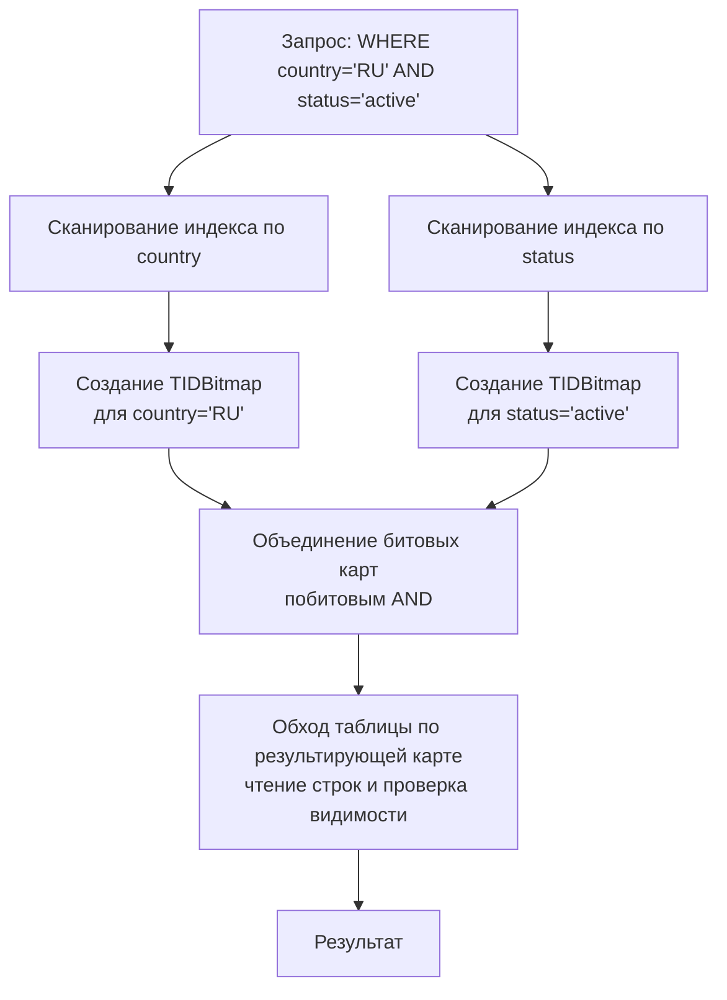

Bitmap индекс — это специализированная структура, применяемая в основном в аналитических базах данных (OLAP) и хранилищах данных для столбцов с низкой кардинальностью (числом уникальных значений). Если в таблице миллиарды строк, а столбец `пол` принимает всего два значения, B-Tree или Hash индекс будут неэффективны: придётся перебирать сотни миллионов записей. Bitmap индекс заменяет список указателей на строки компактным битовым вектором, где каждый бит соответствует одной строке и показывает, принадлежит ли она данному значению.

Битовые карты позволяют молниеносно комбинировать несколько условий фильтрации с помощью битовых операций AND, OR, NOT, которые выполняются процессором за считанные такты. Именно это делает их незаменимыми в сложных аналитических запросах с множеством предикатов.

### Внутреннее устройство: битовые карты

Предположим, у нас есть таблица `users` с колонкой `country`. Уникальные значения: `RU`, `US`, `DE`. Каждому значению соответствует битовый вектор длиной в количество строк таблицы, например 8 строк:

```
Строки:  1 2 3 4 5 6 7 8
RU:      1 0 0 1 0 1 0 1
US:      0 1 0 0 1 0 1 0
DE:      0 0 1 0 0 0 0 0
```

Бит 1 на позиции i означает, что i-я строка содержит это значение. Запрос `country = 'RU' OR country = 'US'` вычисляется как побитовое ИЛИ (`RU | US`), а `country = 'RU' AND status = 'active'` — как побитовое И двух карт (при наличии отдельного bitmap индекса по `status`). Результат — битовая карта строк, удовлетворяющих условию. Далее по этой карте извлекаются идентификаторы строк для чтения данных.

> [!info] Под капотом
> Прямолинейный битовый вектор длиной в миллиард строк занял бы 125 МБ на каждое значение (10^9 бит / 8 = 125 млн байт). При сотнях уникальных значений это гигантский объём. Поэтому на практике применяются техники сжатия: Run-Length Encoding (RLE), WAH (Word Aligned Hybrid), EWAH, Roaring Bitmap. Наиболее распространён **Roaring Bitmap**, который разбивает пространство идентификаторов на блоки по 2^16, и в каждом блоке использует либо плотный битовый массив, либо массив целых чисел — в зависимости от заполненности. Это даёт одновременно высокую скорость битовых операций и низкий расход памяти.

### Ключевые характеристики и механическая симпатия

- **Высокая скорость битовых операций.** Современные процессоры способны выполнять 256-битные или 512-битные SIMD-операции за один такт. Побитовые AND/OR над массивами размером с кэш-линию превращаются в потоковую операцию, утилизирующую всю ширину шины данных. Это радикально превосходит переходы по указателям и сравнения ключей, характерные для B-Tree и Hash индексов.
- **Компактность для низкокардинальных столбцов.** Сжатые битовые карты занимают значительно меньше места, чем B-Tree с повторяющимися ключами. Меньше данных — больше страниц помещается в буферный кэш, меньше дисковых чтений.
- **Плохая производительность при записи.** Добавление или удаление строки требует обновления всех битовых карт для каждого индексируемого столбца: необходимо расширить или сжать векторы, обновить структуры сжатия. В OLTP-системах с интенсивными вставками это неприемлемо.
- **Блокировочные накладные расходы.** При изменении одной строки обычно блокируется целая битовая карта (или её часть), что убивает параллелизм. Это одна из причин, почему bitmap индексы традиционно не используются в строчных OLTP-движках.

### Bitmap индекс в реляционных СУБД

**Oracle** — одна из немногих классических СУБД, предлагающих полноценный bitmap индекс как отдельный тип (`CREATE BITMAP INDEX`). Он оптимизирован для операций с многими условиями и широко применяется в хранилищах данных.

**PostgreSQL** не имеет встроенного типа bitmap индекса. Вместо этого существует **Bitmap Index Scan** — метод доступа, который комбинирует результаты нескольких обычных индексов (обычно B-Tree) в битовую карту в памяти.

Механизм работы Bitmap Scan в PostgreSQL:

1. Планировщик выбирает несколько подходящих индексов (например, по `country` и по `status`).
2. Каждый индекс сканируется независимо: для каждого условия строится битовая карта в памяти, где биты соответствуют номерам страниц (или строк) в таблице. Используется структура `TIDBitmap` из исходного кода PostgreSQL (`src/backend/nodes/tidbitmap.c`), которая является компактным множеством идентификаторов строк (TID) на основе compressed bitmap.
3. Полученные карты комбинируются операциями AND/OR согласно плану запроса.
4. Затем по результирующей битовой карте извлекаются страницы таблицы (последовательное или выборочное чтение), строки проверяются на видимость (MVCC, [[7. MVCC. Multi Version Concurrency Control]]).

Этот подход позволяет объединять несколько индексов в рамках одного запроса, получая эффект, близкий к классическому bitmap индексу, но без его недостатков при записи (сами B-Tree индексы остаются обычными, с эффективной мутацией). Однако Bitmap Scan вынужден материализовать карту в памяти, что при больших объёмах может быть затратно, и после построения карты всё равно требуется обход таблицы (heap scan), что даёт случайный доступ.



> [!tip] Собеседование
> **Вопрос:** Видите ли вы в плане выполнения `Bitmap Heap Scan`? Означает ли это, что используется bitmap индекс?
> **Ответ:** В PostgreSQL `Bitmap Heap Scan` означает, что планировщик построил битовую карту из одного или нескольких обычных индексов, а не то, что существует отдельный bitmap индекс. Это эффективный способ для условий с низкой селективностью, когда простая `Index Scan` вызвала бы слишком много случайных чтений.

Существуют сторонние расширения для PostgreSQL, реализующие полноценный bitmap индекс (например, `pg_bitmap`), но они не входят в стандартную поставку и применяются редко.

### Когда bitmap индекс оправдан

- **OLAP и Data Warehouse:** таблицы с миллиардами записей, много столбцов с низкой кардинальностью (категории, флаги, типы), сложные запросы с десятками условий. Bitmap индексы резко сокращают время ответа.
- **Системы отчётности:** предварительно агрегированные данные, где запись происходит пачками (ETL), а чтение доминирует.
- **Скалярные подзапросы на существование:** например, `WHERE country IN ('RU','US','DE') AND status = 'active'` — битовые операции сливаются в один проход по битовому массиву.

### Когда bitmap индекс вреден

> [!warning] Ловушка / Gotcha
> - **Высокая кардинальность:** если столбец принимает миллионы уникальных значений (например, `user_id`), битовая карта на каждое значение становится разреженной и огромной. Сжатие в этом случае неэффективно, и размер индекса может превысить объём самой таблицы.
> - **Интенсивная запись:** каждая вставка/обновление требуют обновления всех затронутых битовых карт. При конкурентной OLTP-нагрузке это приведёт к деградации.
> - **Частые изменения данных:** обновление битовых карт связано с блокировками на уровне страниц, что убивает пропускную способность.
> - **Низкая selectivity одного условия:** если фильтр возвращает 90% строк, планировщик сочтёт bitmap scan менее эффективным, чем seq scan, и не будет его использовать.

### Практический взгляд Go-разработчика

При разработке высоконагруженных систем на Go вы редко будете напрямую создавать bitmap индексы в PostgreSQL, но часто будете видеть `Bitmap Heap Scan` в `EXPLAIN ANALYZE` ([[10. План выполнения запроса. EXPLAIN]]). Понимание, что это не отдельный индекс, а комбинация существующих, помогает правильно интерпретировать производительность.

Кроме того, идеи битовых карт проникают и в прикладной код: для реализации быстрых фильтров в памяти Go-разработчики иногда используют `[]uint64` как битовые маски и побитовые операции. Библиотеки типа `github.com/RoaringBitmap/roaring` позволяют строить Roaring Bitmaps в Go и применяются в in-memory аналитике или при построении инвертированных индексов (например, в поисковых движках). Принципиально те же инженерные соображения: выбор между плотными и разреженными представлениями, CPU-дружественная работа с памятью.

### Итог

Bitmap индекс — мощный инструмент для узкого класса задач: аналитические запросы с комбинацией многих низкокардинальных предикатов. Он выжимает максимум из способности процессора выполнять побитовые операции, но дорого платит за это неспособностью эффективно обрабатывать запись и высокую кардинальность. В экосистеме PostgreSQL полноценный bitmap индекс отсутствует, но его дух живёт в Bitmap Index Scan — элегантном способе комбинирования B-Tree индексов на лету.

Теперь, когда мы изучили три фундаментальных типа индексов — B-Tree, Hash и Bitmap, — пора перейти к индексам, построенным на нескольких столбцах: [[5. Composite индексы]].
