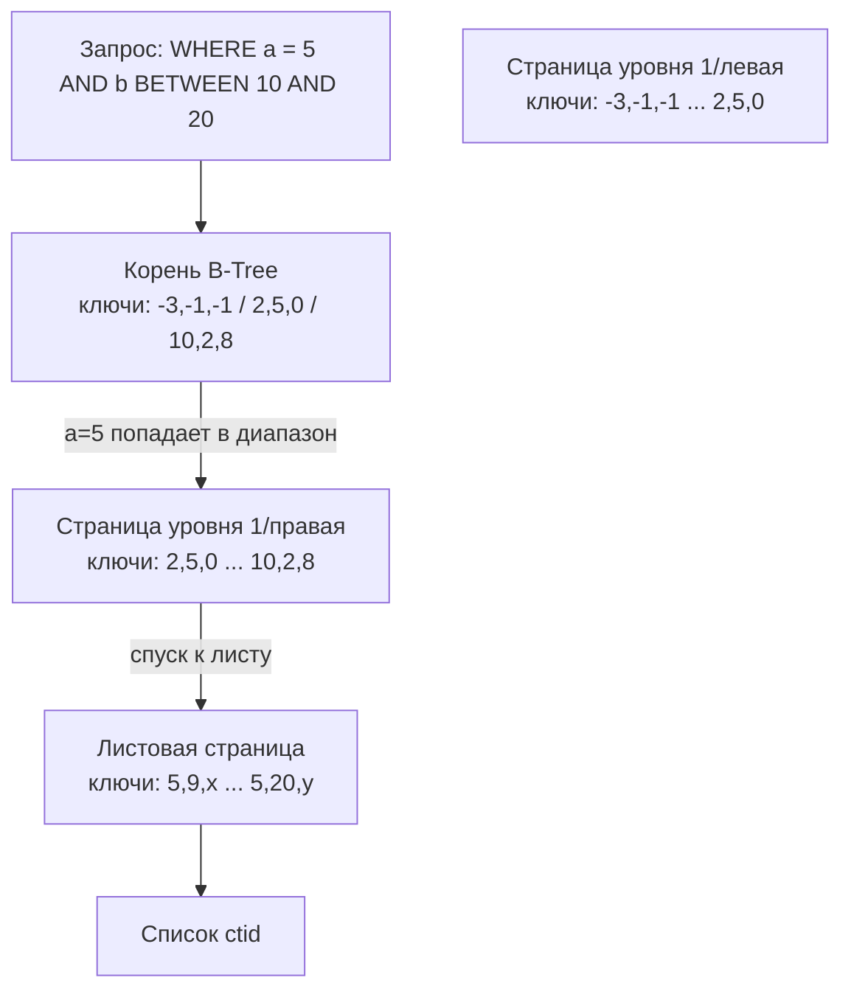
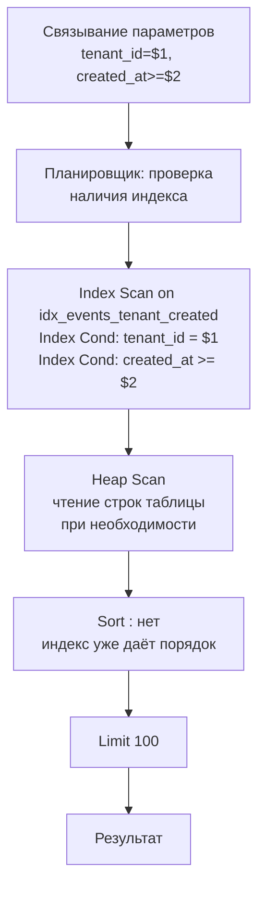

Composite индекс (составной, многоколоночный) — это индекс, построенный на двух и более столбцах таблицы. Он создаёт единую B-Tree структуру, где ключи отсортированы лексикографически по первому столбцу, а для одинаковых значений первого — по второму, и так далее. Эта простая идея позволяет одному индексу обслуживать множество разных запросов, если их условия соответствуют **правилу левого префикса**.

Без составных индексов мы были бы вынуждены либо создавать отдельные индексы на каждую комбинацию столбцов, либо довольствоваться сканированием одного индекса с последующей фильтрацией, что далеко не всегда эффективно.

### Аналогия: телефонный справочник

Классический бумажный справочник сортирован по фамилиям, а внутри одинаковых фамилий — по именам. Это двухколоночный индекс `(last_name, first_name)`. Поиск человека по фамилии и имени молниеносен: вы идёте на нужную букву фамилии, а внутри перебираете имена. Поиск только по фамилии тоже быстр — вы находите блок всех людей с этой фамилией. Но поиск только по имени — катастрофа: вам придётся листать весь справочник, потому что имена внутри него не упорядочены глобально, а только внутри каждой фамилии.

В точности так же работает составной индекс: первыми должны идти столбцы, по которым чаще всего фильтруют, а завершать цепочку — столбцы с диапазонными условиями или используемые только для сортировки.

### Устройство составного индекса в B-Tree

Как мы знаем из статьи [[2. B Tree индекс под капотом]], B-Tree хранит ключи в отсортированном порядке. Когда индекс определён на столбцах `(a, b, c)`, каждый ключ — это кортеж `(val_a, val_b, val_c)`, и сортировка выполняется лексикографически: сравниваем `a`, при равенстве — `b`, при равенстве — `c`. Физически это означает, что в листовых страницах индекса все записи упорядочены сначала по первому полю, затем по второму, затем по третьему.

Внутренние узлы B-Tree содержат ключи-разделители, которые тоже являются кортежами. При спуске по дереву для поиска конкретного ключа `(x, y, z)` сравнение на каждом уровне идёт по тем же правилам.



При поиске по `WHERE a = 5 AND b BETWEEN 10 AND 20` база данных спускается в лист, где начинаются ключи с `a = 5, b = 10`, а затем последовательно обходит листья вправо, пока `a = 5` и `b ≤ 20`. Это предельно эффективно. Если бы индекс был только на `a` или только на `b`, пришлось бы сканировать множество нерелевантных записей или использовать Bitmap Index Scan.

### Правило левого префикса

Составной индекс может использоваться для ускорения запросов, которые оперируют **префиксом** его столбцов, начиная с самого левого.

Для индекса `(a, b, c)`:

- `WHERE a = 1`                           — используется полностью (только по `a`).
- `WHERE a = 1 AND b = 2`                 — используется полностью (по `a` и `b`).
- `WHERE a = 1 AND b = 2 AND c = 3`       — используется полностью.
- `WHERE a = 1 AND c = 3`                 — используется только по `a`; по `c` фильтрация произойдёт после сканирования индекса (Filter).
- `WHERE b = 2`                           — индекс почти бесполезен: не может использоваться для прямого поиска, т.к. `b` не является ведущим столбцом. В лучшем случае возможно полное сканирование индекса (Index Full Scan) с фильтрацией, что часто хуже Seq Scan.
- `WHERE b = 2 AND c = 3`                 — аналогично, не используется эффективно.
- `WHERE a = 1 OR b = 2`                  — индекс не может эффективно обработать `OR` с разными ведущими столбцами. Может быть преобразован в два отдельных сканирования и объединение (Append или Bitmap OR в PostgreSQL).

> [!tip] Собеседование
> **Вопрос:** Может ли индекс `(a, b)` ускорить запрос `SELECT * FROM t ORDER BY b, a`?
> **Ответ:** Нет, потому что сортировка в индексе требует, чтобы порядок столбцов в `ORDER BY` был префиксом индекса в том же порядке. `ORDER BY a, b` — да, индекс отлично подходит. `ORDER BY b, a` или `ORDER BY b` — индекс не может предоставить отсортированные данные напрямую, потребуется явная сортировка (Sort).

### Range-столбец и его последствия

Если один из столбцов в префиксе используется с условием диапазона (`>`, `<`, `BETWEEN`, `LIKE 'prefix%'`), то дальнейшие столбцы индекса теряют возможность использоваться для поиска, но могут ещё помочь с фильтрацией или сортировкой? На самом деле, после первого range-условия последующие столбцы индекса уже не используются для прямого позиционирования в B-Tree; они могут только применяться как фильтр после чтения ключей. Это связано с тем, что после достижения точки начала диапазона индекс сканируется последовательно, и все дальнейшие сравнения выполняются над каждой записью, но не направляют движение по дереву.

Именно поэтому рекомендация по порядку столбцов в индексе:
- Столбцы с условиями **равенства** — в начало, в порядке убывания селективности или частоты использования.
- Затем **один** столбец с диапазонным условием (или `ORDER BY` / `GROUP BY`).
- Затем столбцы, которые нужны только для `ORDER BY` или `GROUP BY`, чтобы избежать отдельной сортировки.
- Столбцы, которые появляются только в `SELECT` и не фильтруются, лучше выносить в `INCLUDE` (в PostgreSQL 11+) для создания covering индекса ([[6. Covering индекс]]).

> [!warning] Ловушка / Gotcha
> Индекс `(status, created_at)` для запроса `WHERE status = 'active' ORDER BY created_at DESC` работает идеально: быстрый поиск по статусу, затем обход листьев в обратном порядке. Но если запрос изменится на `WHERE created_at > '2024-01-01' AND status = 'active'`, эффективность резко упадёт: `created_at` — range-условие и стоит первым, значит индекс не сможет сузить поиск по `status`. Поменяйте столбцы местами: `(status, created_at)` справится с обоими запросами.

### Индекс и соединения (JOIN)

Составные индексы часто создаются на столбцах, участвующих в соединениях, особенно на внешних ключах в дочерних таблицах. Если связь идёт по нескольким столбцам (композитный внешний ключ), составной индекс на дочерней таблице становится необходимым. Например, таблица `order_items` с `PRIMARY KEY (order_id, product_id)` автоматически создаёт составной индекс, который эффективно обслуживает `JOIN` по обоим столбцам.

### Покрывающие индексы

Составной индекс может включать дополнительные столбцы через `INCLUDE` (в PostgreSQL, SQL Server) или включением в сам индекс с возможным снижением селективности ключа. Если все столбцы, требуемые запросом, находятся в индексе, база данных выполняет **Index Only Scan**, вообще не обращаясь к таблице. Подробнее — в [[6. Covering индекс]].

### Mechanical Sympathy: что внутри страницы

Рассмотрим индекс на `(int8, int8, int8)` — три 8-байтовых целых. Ключ занимает 24 байта плюс накладные расходы на заголовок элемента индекса (порядка 8 байт для `ItemPointer` и 4 байта на размер). Итого около 36 байт на запись в листе. При размере страницы 8 КБ и fillfactor 90% мы можем разместить около `(8192 * 0.9) / 36 ≈ 204` записей в листе. Во внутреннем узле ключ и указатель (ещё 8 байт) около 32 байт, тогда число ключей ~230. Степень ветвления сокращается по сравнению с одноколоночным индексом (где было ~500), высота дерева для миллиарда строк может вырасти с 3 до 4, что увеличит количество случайных чтений на одно.

Сравнение кортежей фиксированной длины простое и быстрое: это последовательность инструкций CMP, хорошо предсказываемая и укладывающаяся в кэш-линии. Если же в индексе есть столбцы переменной длины (`text`, `varchar`), сравнение требует разыменования указателей и вызова `memcmp`, что медленнее и может вызывать промахи кэша. Планировщик учитывает ширину ключа при оценке стоимости.

### Практический пример в Go

Представим, что мы проектируем таблицу `events` для высоконагруженного сервиса аналитики:

```sql
CREATE TABLE events (
    id BIGSERIAL PRIMARY KEY,
    tenant_id INT NOT NULL,
    event_type VARCHAR(50) NOT NULL,
    created_at TIMESTAMPTZ NOT NULL DEFAULT now(),
    payload JSONB
);

-- Составной индекс для выборок конкретного tenant'a за период
CREATE INDEX idx_events_tenant_created 
    ON events (tenant_id, created_at DESC);
```

В Go-коде мы можем использовать этот индекс при выполнении запроса:

```go
// Получение событий определённого tenant'а за последние сутки
rows, err := db.QueryContext(ctx, `
    SELECT id, event_type, created_at, payload
    FROM events
    WHERE tenant_id = $1 AND created_at >= $2
    ORDER BY created_at DESC
    LIMIT 100
`, tenantID, time.Now().Add(-24*time.Hour))
```

Запрос идеально ложится на индекс: `tenant_id` — равенство, `created_at` — диапазон, и тут же сортировка по этому полю в том же порядке, что и в индексе. Планировщик выберет `Index Scan` или `Index Only Scan` (если добавить `INCLUDE` для payload и event_type, либо покрыть все нужные столбцы).

При анализе производительности мы можем выполнить `EXPLAIN ANALYZE` для этого запроса и убедиться, что используется наш индекс. В Go для отладки удобно логировать планы медленных запросов через middleware или обёртку над драйвером.

```go
// Пример отладочного вывода плана
func explainQuery(ctx context.Context, db *sql.DB, query string, args ...interface{}) {
    explainQuery := "EXPLAIN ANALYZE " + query
    rows, _ := db.QueryContext(ctx, explainQuery, args...)
    defer rows.Close()
    for rows.Next() {
        var line string
        rows.Scan(&line)
        log.Printf("PLAN: %s", line)
    }
}
```

### Выбор порядка столбцов: алгоритм принятия решения

1. Начните со столбцов, используемых в равенствах (`=`, `IN`). Среди них ранжируйте по селективности: наиболее селективный (дающий меньше всего строк) — первым, чтобы быстрее сужать пространство поиска.
2. Затем добавьте столбцы, используемые в диапазонных условиях (`>`, `<`, `BETWEEN`), `LIKE 'prefix%'` или `ORDER BY` / `GROUP BY`. Обычно только один такой столбец; если их несколько, выбирайте тот, который чаще фигурирует или даёт большее сужение.
3. Дополнительные столбцы для `ORDER BY` можно добавить после диапазонного, чтобы избежать сортировки, но помните, что после range-столбца они могут не использоваться для поиска.
4. Столбцы, нужные только для покрытия запроса (в `SELECT`), добавляйте через `INCLUDE`, а не в ключ, чтобы не увеличивать размер ключа (PostgreSQL 11+).

> [!tip] Собеседование
> **Вопрос:** У вас таблица с составным индексом `(country, city, created_at)`. Запрос: `SELECT * FROM events WHERE city = 'London' AND country = 'UK' ORDER BY created_at DESC`. Будет ли использоваться индекс? А если поменять местами условия в `WHERE`?
> **Ответ:** Да, индекс будет использоваться, и порядок условий в `WHERE` не важен — планировщик сам переставит их для сопоставления с индексом. Индекс может быть применён, потому что присутствуют оба ведущих столбца в равенствах, и `ORDER BY` по третьему столбцу соответствует порядку в индексе.

### Когда составной индекс вреден

- **Избыточность:** индекс `(a, b)` делает индекс только на `(a)` практически ненужным, так как первый может обслуживать запросы только по `a` (благодаря правилу префикса). Держать оба — трата места на диске и замедление записи.
- **Неправильный порядок:** может привести к тому, что индекс не используется, а вы об этом не узнаете до нагрузки на продуктиве.
- **Слишком широкий индекс:** много столбцов, особенно переменной длины, увеличивают размер индекса, снижают fanout и замедляют все операции. Также растёт вероятность page split'ов ([[2. B Tree индекс под капотом]]).
- **Частые обновления индексированных столбцов:** обновление любого из столбцов составного индекса приводит к модификации индекса, что может быть затратно.

### Диаграмма исполнения запроса с составным индексом

Покажем, как планировщик PostgreSQL использует индекс `(tenant_id, created_at)` для выполнения примера выше.



В плане запроса будет строка:
`->  Index Scan using idx_events_tenant_created on events  (cost=0.42..8.45 rows=10 width=...) Index Cond: ((tenant_id = 5) AND (created_at >= '2024-01-01'::timestamp with time zone))`

### Заключение

Составные индексы — один из самых мощных инструментов тонкой настройки производительности. Они позволяют одному индексу обслуживать целый класс запросов, избегая лишних сортировок и обращений к таблице. Но требуют аккуратности: порядок столбцов диктуется логикой запросов, а не произволом разработчика.

В следующей статье мы поговорим о следующей ступени эволюции — [[6. Covering индекс]]: как полностью избавиться от визитов в таблицу, упаковав все необходимые данные прямо в индекс.
