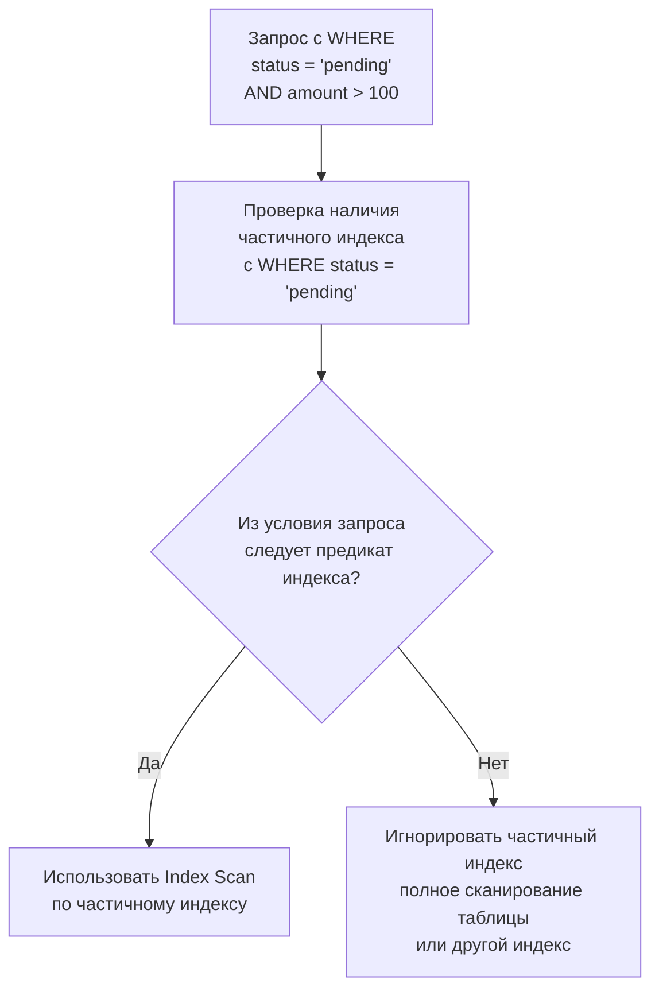

Partial индекс (частичный индекс) — это индекс, построенный не на всех строках таблицы, а только на тех, которые удовлетворяют заданному условию `WHERE`. В отличие от обычного индекса, который хранит записи для каждой строки, частичный индекс избирателен, и его содержимое — подмножество строк. Такой подход даёт тройную выгоду: экономия дискового пространства, уменьшение затрат на запись и ускорение запросов, оперирующих этим же подмножеством.

Большинство инженеров интуитивно создают индексы на всю таблицу, но в реальности многие запросы затрагивают лишь небольшой срез данных — активные пользователи, необработанные заказы, события за последние сутки. Частичный индекс позволяет направить ресурсы именно туда, где они нужны, не распыляясь на остальной объём.

> [!info] Под капотом
> В PostgreSQL информация о частичном индексе хранится в системном каталоге `pg_index`. Столбец `indpred` содержит дерево выражения (node tree), представляющее условие `WHERE` в нормализованной форме. При планировании запроса оптимизатор проверяет, можно ли использовать такой индекс: для этого он анализирует, является ли условие запроса логически более строгим, чем условие индекса (implication). Если из `WHERE` запроса *следует* условие индекса, частичный индекс может быть применён.

### Синтаксис создания

В диалекте SQL, поддерживаемом PostgreSQL, создание частичного индекса выглядит как добавление `WHERE` к `CREATE INDEX`:

```sql
CREATE INDEX idx_orders_pending ON orders (created_at)
    WHERE status = 'pending';
```

Этот индекс будет содержать ключи `created_at` только для строк, у которых `status = 'pending'`. Все остальные заказы в индекс не попадают.

### Когда частичный индекс полезен

- **Разреженные значения.** В таблице `users` столбец `deleted_at` часто `NULL` для живых пользователей и содержит временную метку для удалённых. Запросы обычно обращены к живым (`WHERE deleted_at IS NULL`). Индекс `CREATE INDEX idx_users_active ON users (email) WHERE deleted_at IS NULL` будет покрывать только активных пользователей.
- **Обработка очередей.** Таблица `tasks` с миллионами завершённых задач и небольшой долей активных (`status = 'new'`). Частичный индекс на `priority` и `created_at` ускорит выборку задач для воркеров.
- **Горячие временные диапазоны.** Индекс `WHERE event_date >= CURRENT_DATE - INTERVAL '7 days'` для быстрого доступа к свежим данным, в то время как архивные данные могут сканироваться полным перебором (или обслуживаться другим индексом).

### Как работает планировщик: логическая импликация

При поступлении запроса с условием `WHERE status = 'pending' AND created_at > '2025-01-01'` оптимизатор видит, что индекс имеет предикат `status = 'pending'`. Так как условие запроса явно содержит это равенство, импликация тривиальна — индекс применим. Планировщик добавляет `Index Cond` с `status = 'pending'` и `created_at > ...`.

Более сложный случай: запрос `WHERE status = 'pending' OR priority = 1`. Здесь из условия не следует, что `status = 'pending'` для всех строк, потому что часть строк может иметь `priority = 1` и другой статус. Поэтому индекс с предикатом `status = 'pending'` использоваться не будет. Планировщик может вовсе отказаться от него, даже если бы индекс мог быть отсканирован с последующей фильтрацией остатка.

> [!tip] Собеседование
> **Вопрос:** Может ли частичный индекс с условием `WHERE status = 'active'` ускорить запрос `SELECT * FROM users WHERE status IN ('active', 'suspended')`?
> **Ответ:** Нет. Условие запроса шире, чем условие индекса, и не гарантирует, что все строки из индекса покроют запрос, а также не все строки запроса содержатся в индексе. Планировщик не станет комбинировать частичный индекс с дополнительным сканированием таблицы. В итоге индекс будет проигнорирован.

### Mechanical Sympathy: экономия на всех уровнях

С точки зрения железа, частичный индекс радикально сокращает количество списанных и записанных страниц.

**Чтение:** Объём индекса меньше, поэтому больше страниц помещается в буферный кэш (shared_buffers в PostgreSQL, buffer pool в InnoDB). Для запроса, попадающего под частичный индекс, требуется меньшее количество логических и физических чтений. Меньше страниц — меньше промахов мимо кэша, меньше вытеснения (eviction) полезных данных.

**Запись:** При вставке, обновлении или удалении строки база данных проверяет условие частичного индекса. Если строка не удовлетворяет условию, индекс **не модифицируется**. Это уменьшает количество операций записи в страницы индекса, снижает нагрузку на WAL ([[8. WAL. Write Ahead Log]]) и уменьшает количество page split'ов ([[2. B Tree индекс под капотом]]). В высоконагруженной системе, где пишется много нерелевантных индексу строк, экономия может быть гигантской.

Представьте таблицу событий, где 95% записей имеют статус `processed`, и только 5% — `new`. Обычный индекс на `created_at` будет обновляться при каждой вставке, а значит, будет постоянно испытывать расщепления страниц (особенно на правой границе, если ключ возрастающий). Частичный индекс `WHERE status = 'new'` получит вставки только для 5% строк, что снизит фрагментацию и количество записей WAL, разгружая диск.

> [!warning] Ловушка / Gotcha
> При массовом обновлении статусов (например, обработка очереди) множество строк может одновременно стать удовлетворяющими условию индекса. Это вызовет каскадную вставку в индекс, способную породить пиковую нагрузку. Аналогично, при очистке (переводе строк в `processed`) множество ключей удалится из индекса, что может вызвать фрагментацию и потребность в `VACUUM` (см. [[10. VACUUM, ANALYZE]] в разделе PostgreSQL).

### Пример на практике: Go и частичный индекс

Рассмотрим типичный сценарий на Go-бэкенде. В приложении есть таблица пользователей, где мягкое удаление реализовано через столбец `deleted_at TIMESTAMPTZ`. Абсолютное большинство запросов обращаются только к активным пользователям. Мы создаём частичный уникальный индекс, чтобы гарантировать уникальность email только среди живых:

```sql
CREATE UNIQUE INDEX idx_users_email_active ON users (email)
    WHERE deleted_at IS NULL;
```

Этот индекс не мешает иметь несколько записей с одинаковым email, если они помечены как удалённые, и одновременно быстро находит активного пользователя по email. В Go-коде при аутентификации выполняется запрос:

```go
func getUserByEmail(ctx context.Context, db *sql.DB, email string) (*User, error) {
    query := `SELECT id, email, name, deleted_at
              FROM users
              WHERE email = $1 AND deleted_at IS NULL`
    row := db.QueryRowContext(ctx, query, email)
    // ...
}
```

Планировщик видит, что условие запроса `email = $1 AND deleted_at IS NULL` полностью включает предикат индекса `deleted_at IS NULL`, и может использовать `Index Scan` (или `Index Only Scan`, если индекс покрывает нужные столбцы — мы могли бы добавить `INCLUDE`).

Проверим через EXPLAIN:

```sql
EXPLAIN ANALYZE SELECT id, email, name FROM users
WHERE email = 'alice@example.com' AND deleted_at IS NULL;

-- Ожидаемый вывод:
-- Index Only Scan using idx_users_email_active on users (cost=...)
--   Index Cond: (email = 'alice@example.com'::citext)
--   Filter: (deleted_at IS NULL)   -- может отсутствовать, если покрыто индексом
```

### Ограничения и тонкости

- **Меняющиеся условия.** Если в индексе используется функция, возвращающая нестабильное значение (например, `CURRENT_DATE`), то планировщик может не решиться использовать индекс для параметризованного запроса, потому что не сможет доказать импликацию на этапе планирования. Однако для простых выражений с детерминированными функциями (вроде `date_column > '2020-01-01'`) проблем нет.
- **Несколько частичных индексов.** Можно создать несколько частичных индексов на разных подмножествах, и оптимизатор выберет подходящий для каждого запроса. Например, индексы на `status = 'active'` и `status = 'inactive'`, если запросы идут то к одним, то к другим.
- **UNIQUE с частичным индексом.** Уникальность гарантируется только среди строк, удовлетворяющих условию. Это идиоматический способ реализовать «условные уникальные ключи» (например, уникальный email только среди активных пользователей).
- **Не для всех СУБД.** Частичные индексы поддерживаются PostgreSQL, SQLite, SQL Server, но не поддерживаются MySQL (в MySQL можно эмулировать через функциональные индексы на `IF(status='active', column, NULL)` с последующей проверкой `WHERE column IS NOT NULL`, но это не то же самое).

### Диаграмма принятия решения планировщиком



### Рекомендации для Go-разработчика

- Анализируйте запросы приложения и выявляйте, на какие подмножества приходится 90% трафика. Для них создавайте частичные индексы, снижая общий размер индексов и нагрузку на запись.
- Мониторьте размер индексов с помощью `\di+` в psql или запросами к `pg_index` и `pg_relation_size`.
- При использовании ORM-библиотек (GORM, sqlc) всегда проверяйте планы запросов. Может оказаться, что ORM генерирует условие, не подходящее под предикат индекса, и частичный индекс не используется.

### Заключение

Частичный индекс — это эволюция идеи индекса: вместо того чтобы обслуживать всю таблицу, он фокусируется на релевантном подмножестве. Он сочетает в себе компактность, скорость и низкие накладные расходы, но требует точного совпадения логики запроса и предиката. В правильно спроектированной системе частичные индексы позволяют достичь максимума производительности с минимальными затратами.

В следующей статье мы рассмотрим индексы для нетрадиционных типов данных — [[8. Индексы для JSON и массивов]], которые становятся всё более востребованными в гибких схемах и аналитике.
