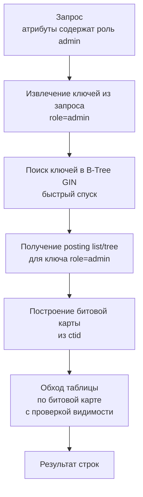

Современные бэкенды всё чаще используют столбцы с гибкой структурой: `JSONB` в PostgreSQL, `JSON` в MySQL, массивы примитивов. Эти типы данных позволяют хранить вложенные документы и списки прямо в строках таблицы, избегая жёсткой нормализации. Но за гибкость приходится платить: обычные B-Tree индексы, построенные на всём значении столбца, не помогут, когда нужно искать внутри документа или массива. Запросы вида `WHERE tags @> ARRAY['go','backend']` или `WHERE attributes->>'role' = 'admin'` требуют специализированных индексов, способных "заглядывать" внутрь.

В этой статье мы разберём, как устроены индексы для композитных и многозначных типов, сфокусировавшись на реализации в PostgreSQL (GIN и GiST), и как их правильно применять из Go-приложений.

### Почему B-Tree недостаточно

Классический B-Tree индекс ([[2. B Tree индекс под капотом]]) оперирует целым значением столбца как ключом. Для скалярных типов это идеально: мы сравниваем целиком `int`, `text`, `timestamp`. Но если столбец содержит JSON-документ или массив, B-Tree может лишь сравнить их целиком (лексикографически для `jsonb`, или поэлементно для массивов), что почти никогда не соответствует семантике поиска. Нам нужно найти строки, где JSON-документ содержит ключ `"role"` со значением `"admin"`, или где массив включает элемент `'go'`. Такие условия не являются простым равенством или диапазоном, и B-Tree пасует.

Для решения этой задачи были созданы **инвертированные индексы** (Inverted Index) и **обобщённые деревья поиска**, которые мы сейчас рассмотрим.

### GIN: Generalized Inverted Index

GIN (Generalized Inverted Index) — это обобщённый инвертированный индекс, встроенный в PostgreSQL. Он разработан для типов данных, где элемент может быть составным, и каждый элемент может встречаться во многих строках. Классические примеры: массивы (`integer[]`, `text[]`), `tsvector` (полнотекстовый поиск), `jsonb`.

Принцип работы GIN: для каждого уникального **ключа** (элемента массива, лексемы текста, ключа/значения JSON) сохраняется список идентификаторов строк (`ctid`), в которых этот ключ встречается. Это аналог индекса в конце книги: термин → номера страниц. Такой индекс позволяет молниеносно найти все строки, содержащие заданный ключ, и эффективно объединять результаты по нескольким ключам (операции `AND`, `OR`) через пересечение или объединение списков.

> [!info] Под капотом
> Внутренне GIN индекс в PostgreSQL состоит из следующих структур (описанных в `src/include/access/gin_private.h`):
> - **Мета-страница (GinMetaPageData):** содержит указатель на корень B-Tree ключей, статистику и флаги.
> - **B-Tree ключей:** отдельный B-Tree индекс, отображающий значение ключа во внутренний идентификатор (item pointer) для списка вхождений. Ключи хранятся в отсортированном виде.
> - **Posting List или Posting Tree:** для каждого ключа хранится либо сжатый список ctid (если вхождений мало — posting list, упорядоченный массив), либо древовидная структура (posting tree, если вхождений много — фактически B-Tree по ctid), чтобы быстрее выполнять операции пересечения и слияния.
> - Страницы списков могут содержать большое количество указателей, минимизируя число обращений к диску.

Поиск по GIN происходит в два этапа:
1. По B-Tree ключей находим ключ и получаем его posting list/tree.
2. Из posting list/tree извлекаем ctid нужных строк. Для комбинации нескольких ключей списки пересекаются (для `AND`) или объединяются (для `OR`), что может выполняться с использованием битовых операций (Bitmap Index Scan) для последующего обхода таблицы.

### GiST: Generalized Search Tree

GiST (Generalized Search Tree) — это инфраструктура для построения произвольных сбалансированных деревьев поиска. В отличие от GIN, который инвертирован, GiST похож на B-Tree, но допускает произвольные предикаты распределения. Для JSONB GiST позволяет индексировать документ как целое, организуя страницы на основе иерархической разбивки (например, сигнатур документа). GiST может обслуживать те же операции, что и GIN для `jsonb`, но с другим балансом производительности.

Для JSONB существуют два операторных класса GiST:
- `jsonb_ops` — поддерживает `@>`, `<@`, `?`, `?|`, `?&`.
- `jsonb_path_ops` — поддерживает только `@>`, но более компактный и быстрый.

### Операции и выбор индекса для JSONB

Основные операции над JSONB, которые можно ускорить индексами:

- **Проверка содержания:** `data @> '{"role":"admin"}'` — содержит ли документ указанный фрагмент.
- **Проверка вложенности:** `data <@ '{"role":"admin"}'` — содержится ли документ в указанном фрагменте.
- **Существование ключа:** `data ? 'key'` — есть ли ключ на верхнем уровне.
- **Существование любого/всех ключей:** `data ?| array['a','b']`, `data ?& array['a','b']`.

GIN с классом `jsonb_ops` поддерживает все эти операции. GiST с `jsonb_ops` также поддерживает все. GiST с `jsonb_path_ops` — только `@>`, но более эффективен.

```sql
-- GIN индекс для JSONB
CREATE INDEX idx_events_data ON events USING GIN (data jsonb_ops);

-- GiST индекс с path-оптимизацией
CREATE INDEX idx_events_data_path ON events USING GIST (data jsonb_path_ops);
```

> [!tip] Собеседование
> **Вопрос:** Чем отличается `jsonb_ops` от `jsonb_path_ops` и когда что выбирать?
> **Ответ:** `jsonb_ops` — универсальный, поддерживает все операции, но каждый ключ и значение индексируются, что делает индекс больше и медленнее при вставке. `jsonb_path_ops` индексирует только "пути" документа (комбинации ключей до значений), что уменьшает размер и ускоряет `@>`, но не поддерживает `?`, `?|`, `?&`. Для запросов исключительно на содержание (например, поиск документов, соответствующих фильтру) лучше `jsonb_path_ops`.

### Индексы для массивов

Массивы в PostgreSQL (`integer[]`, `text[]`) также могут использовать GIN. Основные операции:

- `&&` — пересекаются ли массивы? (есть ли общие элементы)
- `@>` — содержит ли массив другой массив?
- `<@` — содержится ли массив в другом?

Для массива `integer[]` стандартный GIN индекс:

```sql
CREATE INDEX idx_tags ON items USING GIN (tags);
```

Позволяет быстро выполнять запросы вроде `SELECT * FROM items WHERE tags @> ARRAY['go', 'backend']`.

Также существует расширение `intarray`, предоставляющее дополнительные операторные классы для целочисленных массивов (`gin__int_ops`), специализированные для быстрых операций над массивами целых чисел.

### Mechanical Sympathy: цена гибкости

Индексы для JSON и массивов дороже обычных B-Tree. GIN чувствителен к частоте обновлений. Вставка новой строки с JSONB документом требует выделения ключей из документа и вставки их в B-Tree ключей, а также добавления ctid в соответствующие posting lists/trees. Если документ содержит сотни ключей, одна вставка может породить десятки операций модификации страниц индекса, WAL-записей ([[8. WAL. Write Ahead Log]]) и page split'ов. Так же обновление JSONB (даже одного поля) вызывает удаление старых ключей и вставку новых, что по сути приводит к полному переиндексированию строки.

С точки зрения кэширования: GIN-индексы активно используют буферный кэш. Мета-страница и верхние уровни B-Tree ключей часто находятся в памяти. Posting lists для популярных ключей (например, `"status": "active"`) могут быть очень длинными; чтобы ускорить пересечения, PostgreSQL часто применяет bitmap scan, читая нужные страницы списков и собирая битовую карту результатов. Это может вызывать значительный random I/O, если данные не в памяти.

GiST для JSONB, с другой стороны, хранит документ в виде "сигнатуры" (набора хешей) в узлах. Поиск по такой структуре похож на обход B-Tree с проверкой сигнатур. Он может давать меньшее количество случайных чтений при сканировании, но фильтрация может быть менее точной, приводя к чтению лишних строк (false positives), которые затем отбрасываются при проверке самого документа. Это компромисс.

### Использование из Go

В реальном Go-приложении вы работаете с JSONB через драйверы `pgx` или `lib/pq`. При построении запросов с параметрами важно передавать правильные типы, чтобы индекс был использован.

Пример таблицы с JSONB и массивами:

```sql
CREATE TABLE products (
    id BIGSERIAL PRIMARY KEY,
    attributes JSONB,
    tags TEXT[]
);

-- GIN для JSONB
CREATE INDEX idx_products_attributes ON products USING GIN (attributes jsonb_path_ops);
-- GIN для массива
CREATE INDEX idx_products_tags ON products USING GIN (tags);
```

Go код для поиска:

```go
import (
    "context"
    "database/sql"
    "github.com/lib/pq"
)

func findProductsByTag(ctx context.Context, db *sql.DB, tag string) ([]Product, error) {
    query := `SELECT id, attributes, tags FROM products WHERE tags @> ARRAY[$1]`
    rows, err := db.QueryContext(ctx, query, tag)
    // ...
}

func findProductsByAttribute(ctx context.Context, db *sql.DB, filter map[string]interface{}) ([]Product, error) {
    // Передаём JSON как []byte
    jsonFilter, _ := json.Marshal(filter)
    query := `SELECT id, attributes, tags FROM products WHERE attributes @> $1`
    rows, err := db.QueryContext(ctx, query, string(jsonFilter))
    // ...
}
```

Для отладки производительности выполняем `EXPLAIN (ANALYZE, BUFFERS)` по сети или через логи медленных запросов ([[18. Slow query log]]). В Go можно обернуть вызовы в отладочную функцию, как показано в [[6. Covering индекс]].

```go
func explainJSONBQuery(ctx context.Context, db *sql.DB, filterJSON string) {
    query := "EXPLAIN (ANALYZE, BUFFERS) SELECT id FROM products WHERE attributes @> $1"
    // выполнить и залогировать план
}
```

План запроса с GIN будет выглядеть как-то так:
```
Bitmap Heap Scan on products  (cost=... rows=... width=...)
  Recheck Cond: (attributes @> '{"role":"admin"}'::jsonb)
  ->  Bitmap Index Scan on idx_products_attributes  (cost=... rows=... width=...)
        Index Cond: (attributes @> '{"role":"admin"}'::jsonb)
```

Если вы видите `Seq Scan`, индекс не используется — возможно, вы используете оператор, не поддерживаемый классом индекса, или функция не соответствует.

> [!warning] Ловушка / Gotcha
> - **Обновления JSONB:** При частом обновлении JSONB-поля GIN индекс будет перестраиваться, создавая высокую нагрузку. В таких случаях стоит рассмотреть вынесение часто обновляемых полей в отдельные столбцы с B-Tree индексами, оставив в JSONB только редко меняющиеся данные.
> - **Размер индекса:** GIN индекс на JSONB может многократно превышать размер таблицы. Мониторьте через `\di+`. Для очень объёмных документов с тысячами ключей индекс станет неадекватно большим.
> - **Оператор `->>'key'` и B-Tree:** Вы можете создать выраженный индекс: `CREATE INDEX idx_role ON events ((data->>'role'))`. Это B-Tree индекс по текстовому значению поля, эффективен для `WHERE data->>'role' = 'admin'`. Но он не ускорит `data @> '{"role":"admin"}'`, потому что это разные операторы.

> [!tip] Собеседование
> **Вопрос:** Чем плох индекс `USING GIN` для столбца, который всего лишь хранит набор тегов, а запросы — `WHERE tags @> ARRAY['one']`? Когда лучше использовать `intarray`?
> **Ответ:** Стандартный GIN уже хорош, но `intarray` с `gin__int_ops` использует специализированные алгоритмы для целочисленных массивов, что может быть быстрее и компактнее. Для текстовых массивов GIN универсален.

### Почему GiST может быть лучше для JSONB в некоторых случаях

- **Баланс чтения и записи:** GiST обычно быстрее обновляется, потому что может не требовать модификации десятков posting lists, а лишь перестроение сигнатур в нескольких узлах.
- **Поддержка range-подобных операторов:** GiST может поддерживать запросы на расстояние для геоданных, но для JSONB этот аспект маловажен.
- **Меньше места:** `jsonb_path_ops` GiST может занимать меньше места, чем GIN, так как индексирует не все ключи, а только пути.
- Однако GIN быстрее для `@>` при большом количестве повторяющихся ключей, так как напрямую ведёт к спискам ids.

### Индексы для JSON в MySQL

MySQL поддерживает `JSON` тип и позволяет создавать **функциональные индексы** на генерируемых столбцах:

```sql
ALTER TABLE events ADD role VARCHAR(50) GENERATED ALWAYS AS (data->>'$.role') STORED;
CREATE INDEX idx_role ON events(role);
```

Для прямых запросов к JSON (`JSON_CONTAINS`, `JSON_EXTRACT`) MySQL использует **Multi-Valued Indexes** (начиная с 8.0.17), которые фактически являются инвертированными индексами по массивам внутри JSON. Они создаются через `CREATE INDEX ... ON t ((CAST(data->'$.tags' AS UNSIGNED ARRAY)))`. Это похоже на GIN для массивов.

Тем не менее, PostgreSQL с его GIN/GiST остаётся самой продвинутой платформой для работы с полуструктурированными данными.

### Диаграмма поиска через GIN



### Заключение

Индексы для JSON и массивов — необходимая составляющая схемы при использовании гибких моделей данных. PostgreSQL даёт два мощных инструмента: GIN (инвертированный) и GiST (древовидный), каждый со своими сильными сторонами. Правильный выбор зависит от паттернов запросов и интенсивности обновлений. При разработке на Go важно явно задавать типы параметров и проверять планы выполнения, чтобы убедиться, что индексы действительно применяются.

Далее мы посмотрим на оборотную сторону медали: ситуации, когда индекс перестаёт помогать и начинает вредить — [[9. Когда индекс вреден]].
