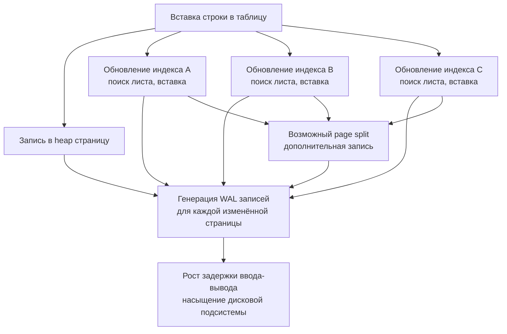

Индексы часто воспринимают как безусловное благо: добавил — запрос полетел. Но в реальной инженерии каждая структура имеет цену, и **переизбыток индексов** способен разрушить производительность системы не хуже, чем их отсутствие. Индекс — это не бесплатное ускорение, это компромисс между скоростью чтения и стоимостью записи, а также между занимаемым пространством и эффективностью кэша.

Цель этой статьи — показать ситуации, в которых индекс вреден, объяснить механизмы этого вреда с точки зрения mechanical sympathy, и дать инструменты для аудита и исправления ситуации в production-окружении Go-приложений.

### Цена записи: множитель стоимости

Всякий раз, когда вы вставляете, обновляете или удаляете строку, СУБД должна поддерживать в актуальном состоянии **все** индексы, определённые на таблице. Один `INSERT` превращается в:

- запись строки в heap (основную таблицу);
- модификацию каждого B-Tree индекса: поиск листовой страницы и вставку нового ключа/указателя;
- при необходимости — page split (расщепление страницы) и каскадные изменения в родительских узлах;
- запись всех изменённых страниц в WAL ([[8. WAL. Write Ahead Log]]).

Если на таблице пять индексов, один `INSERT` может породить десятки операций записи на диск. В интенсивных OLTP-системах это немедленно сказывается на throughput: растёт задержка, увеличивается объём WAL, снижается пропускная способность.

> [!info] Под капотом
> Каждый page split вызывает выделение новой страницы на диске, что приводит к обновлению карты свободного пространства и мета-страниц индекса. Это не только случайный ввод-вывод, но и блокировки на уровне страниц (latches), которые увеличивают contention и могут вызывать цепочки ожиданий при высокой конкурентности.

### Влияние на буферный кэш

Оперативная память, отведённая под буферный кэш (`shared_buffers` в PostgreSQL, `buffer pool` в InnoDB), конечна. Каждый активный индекс конкурирует за место в кэше с другими индексами и с самими данными таблиц. Неиспользуемый или редко используемый индекс **напрасно вытесняет** из памяти страницы, которые могли бы обслуживать горячие запросы. Это увеличивает количество промахов мимо кэша и физических чтений, прямо противоположно желаемому эффекту.

Механическая симпатия: каждое лишнее физическое чтение — это системный вызов `pread()`, переключение контекста и задержка в миллисекунды. Когда полезные данные вытеснены бесполезным индексом, процессор простаивает в ожидании ввода-вывода, а пропускная способность резко падает.

### Неиспользуемые индексы: балласт

Индексы могут оставаться в базе данных после того, как изменилась логика приложения: удалили старый функционал, переписали запросы, сменили структуру. Индексы, созданные «на всякий случай» или для единоразового аналитического запроса, потом забываются. Такой мёртвый груз продолжает поглощать ресурсы при каждой записи, не принося пользы при чтении.

PostgreSQL предоставляет системное представление `pg_stat_user_indexes`, в котором есть счётчики `idx_scan` и `idx_tup_read`. Если `idx_scan` равен нулю или растёт крайне медленно на фоне большого количества записей в таблице, индекс — кандидат на удаление.

```sql
SELECT schemaname, tablename, indexname, idx_scan, idx_tup_read, idx_tup_fetch
FROM pg_stat_user_indexes
WHERE idx_scan = 0
ORDER BY pg_relation_size(indexrelid) DESC;
```

> [!warning] Ловушка / Gotcha
> `idx_scan = 0` не всегда означает, что индекс не используется: планировщик мог применять его в уникальных проверках или в составе Bitmap Index Scan, что увеличивает счётчик. Но если индекс не фигурирует ни в одном плане выполнения, а статистика показывает нулевые сканирования — это явный сигнал к проверке.

### Низкая селективность: когда индекс не помогает

Столбец `gender` с двумя значениями, равномерно распределёнными, даёт селективность 50%. Индекс по такому столбцу почти никогда не будет использоваться планировщиком для `WHERE gender = 'M'`: дешевле последовательно прочитать всю таблицу, чем прыгать по индексу и затем обращаться к случайным страницам данных. Тем не менее такой индекс потребляет место и замедляет запись.

Аналогично, индексы на `boolean` столбцах со сбалансированным распределением истинных и ложных значений — классический пример вредного индекса. Они создаются «потому что в учебнике написано индексировать столбцы в WHERE», но на практике только ухудшают положение.

### Дублирующие и избыточные индексы

Составной индекс `(a, b)` делает избыточным отдельный индекс на `(a)`, потому что левый префикс может обслужить запросы только по `a`. Содержание обоих индексов приводит к двойной работе при записи и двойному расходу памяти без выгоды для чтения. Ещё хуже — несколько индексов с одинаковым набором столбцов в разном порядке: `(a, b)` и `(b, a)`. Если оба набора запросов реально востребованы, возможно, это оправдано; но часто один из них является мусором.

Обнаружить дубликаты можно запросами к `pg_index` с анализом столбцов. В экосистеме PostgreSQL есть готовые инструменты, например расширение `pg_duckdb` для аналитики.

### Индексы на часто обновляемых столбцах

Каждое обновление индексированного столбца — это удаление старого ключа и вставка нового, что равноценно двум операциям в индексе. Если столбец обновляется постоянно (например, `updated_at`, счётчик просмотров), индекс будет испытывать огромное количество изменений, быстро фрагментироваться, страдать от page split'ов и bloat (распухания). Такой индекс не только замедляет запись, но и быстрее деградирует, требуя регулярного `REINDEX` или `VACUUM FULL`.

### Влияние на VACUUM и Index Only Scan

Covering индекс ([[6. Covering индекс]]) позволяет избежать обращений к таблице, но требует, чтобы visibility map была актуальной (все строки на странице видимы всем). Если таблица часто обновляется, VACUUM не успевает вычищать мёртвые версии, и Index Only Scan фактически превращается в обычный Index Scan с `Heap Fetches`, но при этом индекс по-прежнему занимает место и замедляет запись. Если covering индекс не используется эффективно, он вреден вдвойне.

### Конкурентность и блокировки при создании

Создание индекса без `CONCURRENTLY` в PostgreSQL блокирует запись в таблицу на всё время построения, что может длиться часами на крупных массивах. С `CONCURRENTLY` создание не блокирует запись, но требует больше ресурсов (два прохода, дополнительные транзакции) и может упасть при нарушении уникальности. В высоконагруженном сервисе даже `CONCURRENTLY` создаёт дополнительную нагрузку, которая может стать критической в пиковые часы. Необдуманное добавление индекса на production может спровоцировать инцидент.

### Mechanical Sympathy: каскадный эффект на железо

Представим таблицу с шестью индексами, принимающую 10 000 вставок в секунду. Каждая вставка порождает в среднем:

- 1 heap page write;
- 6 index page writes (по одному на каждый индекс, в оптимистичном случае без splits);
- wAL-записи для всех изменённых страниц.

Итого 7+ страниц модифицируется, 7+ записей WAL. При размере страницы 8 КБ это ~56 КБ данных, записываемых на диск, на одну строку. За секунду получается 560 МБ WAL и данных, что близко к пределу пропускной способности SATA SSD. Добавьте к этому случайный характер записи в разные индексы (разные листовые страницы), и диск упирается в IOPS, а приложение встаёт.



### Как выявить вредные индексы в Go-окружении

1. **Мониторинг через pg_stat_statements:** отслеживайте запросы с большим временем выполнения и анализируйте планы. Если запрос использует Seq Scan, а вы ожидали Index Scan, — либо индекс вреден (не подходит), либо отсутствует.
2. **Системные каталоги:** регулярно опрашивайте `pg_stat_user_indexes` и `pg_statio_user_indexes` на предмет нулевых сканирований, числа чтений и размера индекса.
3. **Логи медленных запросов:** настройте `log_min_duration_statement` и агрегируйте логи в системе наблюдаемости. Ищите запросы, в которых индексы не используются, несмотря на наличие.
4. **Интеграция в Go-приложения:** добавьте health-check эндпоинт, который выполняет диагностический запрос к БД и предупреждает о неиспользуемых индексах. Например, раз в час запускайте функцию:

```go
func checkUnusedIndexes(ctx context.Context, db *sql.DB) ([]string, error) {
    query := `SELECT indexrelid::regclass::text
              FROM pg_stat_user_indexes
              WHERE idx_scan = 0
              AND schemaname = 'public'
              AND indexrelname NOT LIKE '%pkey'`
    rows, err := db.QueryContext(ctx, query)
    if err != nil {
        return nil, err
    }
    defer rows.Close()
    var indexes []string
    for rows.Next() {
        var name string
        if err := rows.Scan(&name); err != nil {
            return nil, err
        }
        indexes = append(indexes, name)
    }
    return indexes, rows.Err()
}
```

### Стратегия работы с вредными индексами

1. **Аудит:** соберите метрики использования индексов за неделю-месяц, исключив пиковые разовые нагрузки.
2. **Классификация:** разделите индексы на используемые активно, редко и никогда. Учтите уникальные индексы, обеспечивающие ограничения (их удалять нельзя без анализа).
3. **Удаление:** для ни разу не использованных — выполните `DROP INDEX CONCURRENTLY`, чтобы не блокировать приложение.
4. **Замена:** если индекс дублирует другой, удалите менее эффективный. Если индекс на низкоселективном столбце, но нужен для сортировки, возможно, замените на частичный ([[7. Partial индекс]]) или составной ([[5. Composite индексы]]).
5. **Мониторинг после изменений:** после удаления следите за производительностью запросов; внезапное замедление может означать, что индекс всё же использовался в редких, но важных сценариях.

> [!tip] Собеседование
> **Вопрос:** Можно ли полностью отказаться от индексов на таблице, которая только пишется (лог событий) и редко читается?
> **Ответ:** Да, если чтения либо отсутствуют, либо всегда выполняются по первичному ключу (автоинкремент) — первичный индекс уже есть. Дополнительные индексы будут только замедлять вставку. Если же чтения происходят по временным диапазонам, можно оставить один индекс на время, при необходимости.

### Инструменты для автоматизации

Расширение `pg_stat_statements` в сочетании с `pg_stat_user_indexes` даёт почти полную картину. В сложных проектах используйте `pg_qualstats` для отслеживания предикатов и рекомендаций по удалению/добавлению индексов. В экосистеме Go можно написать анализатор, работающий по расписанию и отправляющий отчёт в Slack.

### Заключение

Индекс — мощный инструмент, но он не бесплатен. Вредные индексы крадут пропускную способность диска, память, замедляют запись и усложняют сопровождение. Профессиональный разработчик на Go относится к индексам как к коду: регулярно проводит ревизию, избавляется от мёртвого груза и следит за метриками.

В следующей статье мы перейдём от статического анализа структур к динамическому инструменту оптимизации: [[10. План выполнения запроса. EXPLAIN]] — научимся читать планы запросов и понимать, что именно делает СУБД, чтобы ускорить ваши запросы.
