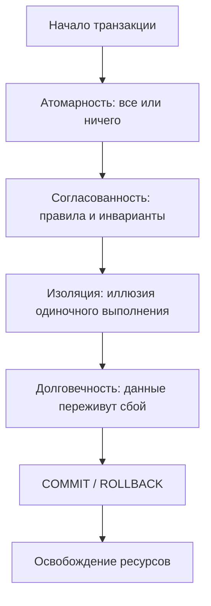

## Введение: Почему ACID — это не просто аббревиатура

Когда вы пишете сервис на Go, который обрабатывает платежи, обновляет инвентарь или управляет пользовательскими сессиями, вы неявно полагаетесь на гарантии, которые предоставляет база данных. Эти гарантии упакованы в аббревиатуру **ACID** — Atomicity, Consistency, Isolation, Durability.

Для бэкенд-инженера уровня Senior/Lead понимание ACID — это не просто знание определений из учебника. Это способность:
* Предсказывать поведение системы при сбоях питания, сетевых партициях или конкурентных запросах.
* Осознанно выбирать компромиссы между строгостью гарантий и производительностью.
* Писать код на Go, который корректно взаимодействует с транзакционной моделью СУБД, избегая утечек соединений, зависших транзакций и потерянных обновлений.

В этой статье мы разберём каждую букву ACID не на уровне маркетинговых слоганов, а с привязкой к тому, как это реализуется «под капотом» в современных реляционных СУБД (PostgreSQL, MySQL/InnoDB), и как это влияет на ваш Go-код.



## Atomicity (Атомарность): Всё или ничего

**Атомарность** гарантирует, что транзакция выполняется как единое целое: либо все её операции применяются, либо ни одна. Промежуточные состояния никогда не становятся видимыми для других транзакций.

### Как это работает под капотом

Реализация атомарности тесно связана с механизмом **Write-Ahead Log (WAL)**, который мы детально разберём в статье [[8. WAL. Write Ahead Log]]. Кратко:

1. Перед модификацией данных на диске СУБД записывает **лог изменений** в устойчивое хранилище.
2. Лог содержит как новые значения, так и информацию для отката (undo-лог).
3. При `COMMIT` записывается специальная метка в WAL — точка невозврата.
4. При `ROLLBACK` или сбое СУБД использует undo-лог для восстановления исходного состояния.

> [!info] Под капотом
> В PostgreSQL каждая страница данных (8 КБ) имеет заголовок с `lsn` (Log Sequence Number). При изменении строки сначала пишется WAL-запись с новым `lsn`, и только потом модифицируется страница в буферном пуле. Это гарантирует, что даже при крахе процесса можно восстановить согласованное состояние, «проиграв» лог с последней контрольной точки [[9. Checkpointing]].

### Пример на Go: корректная обработка транзакции

```go
func TransferFunds(ctx context.Context, db *sql.DB, from, to int64, amount decimal.Decimal) error {
    tx, err := db.BeginTx(ctx, nil)
    if err != nil {
        return fmt.Errorf("begin transaction: %w", err)
    }
    // Дефер с откатом: если функция завершится с ошибкой или паникой — транзакция отменится
    defer func() {
        if p := recover(); p != nil {
            _ = tx.Rollback()
            panic(p)
        } else if err != nil {
            _ = tx.Rollback()
        }
    }()

    // Списание средств
    res, err := tx.ExecContext(ctx, 
        "UPDATE accounts SET balance = balance - $1 WHERE id = $2 AND balance >= $1",
        amount, from,
    )
    if err != nil {
        return fmt.Errorf("debit failed: %w", err)
    }
    if rows, _ := res.RowsAffected(); rows == 0 {
        return fmt.Errorf("insufficient funds")
    }

    // Зачисление средств
    _, err = tx.ExecContext(ctx,
        "UPDATE accounts SET balance = balance + $1 WHERE id = $2",
        amount, to,
    )
    if err != nil {
        return fmt.Errorf("credit failed: %w", err)
    }

    // Фиксация: только здесь изменения становятся видимыми
    if err = tx.Commit(); err != nil {
        return fmt.Errorf("commit failed: %w", err)
    }
    return nil
}
```

> [!warning] Ловушка / Gotcha
> Забытый `defer tx.Rollback()` — одна из самых частых причин утечек транзакций в Go. Если после `BeginTx` произойдёт паника или ранний `return`, транзакция останется открытой, удерживая соединения и блокировки. Всегда оборачивайте бизнес-логику в конструкцию с `defer`-откатом.

## Consistency (Согласованность): Инварианты и ограничения

**Согласованность** означает, что транзакция переводит базу данных из одного корректного состояния в другое, соблюдая все объявленные правила: ограничения целостности (foreign keys, unique, check), триггеры, а также бизнес-инварианты, которые могут быть реализованы на уровне приложения.

Важно различать:
* **Согласованность на уровне СУБД**: обеспечивается декларативными ограничениями. Например, `FOREIGN KEY` не позволит удалить пользователя, на которого ссылаются заказы.
* **Согласованность на уровне приложения**: бизнес-правила, которые СУБД не знает. Например, «сумма всех счетов пользователя не должна превышать лимит». Такие инварианты вы проверяете в коде на Go.

### Механика проверок

При `INSERT`/`UPDATE` СУБД выполняет:
1. Проверку `NOT NULL`, типов данных, `CHECK`-ограничений.
2. Проверку уникальности индексов (B-Tree, Hash).
3. Проверку внешних ключей (поиск в индексированном столбце родительской таблицы).
4. Срабатывание триггеров `BEFORE`/`AFTER`.

Все эти операции требуют дополнительных чтений и блокировок. Например, проверка `FOREIGN KEY` в PostgreSQL при `REPEATABLE READ` может привести к конфликту сериализации, если родительская строка была изменена параллельной транзакцией.

> [!tip] Собеседование
> **Вопрос**: Может ли транзакция нарушить согласованность, если все ограничения СУБД соблюдены?
> **Ответ**: Да. Если бизнес-логика требует, чтобы «баланс счёта никогда не становился отрицательным», но вы не добавили `CHECK (balance >= 0)` в схему, а в коде на Go допустили гонку (например, прочитали баланс, посчитали новую сумму, записали — без блокировки), две параллельные транзакции могут одновременно списать средства, и баланс уйдёт в минус. Согласованность — ответственность и СУБД, и разработчика.

## Isolation (Изоляция): Иллюзия одиночного выполнения

**Изоляция** гарантирует, что параллельно выполняющиеся транзакции не влияют друг на друга так, как если бы они выполнялись последовательно. На практике полная изоляция (сериализуемость) дорога, поэтому СУБД предлагают уровни изоляции с разными компромиссами.

Ключевые аномалии, которые предотвращают уровни изоляции:
* **Dirty Read**: чтение незафиксированных данных другой транзакции.
* **Non-Repeatable Read**: повторное чтение той же строки даёт другой результат, потому что другая транзакция зафиксировала изменение.
* **Phantom Read**: повторный запрос с тем же условием `WHERE` возвращает новый набор строк из-за вставки/удаления другой транзакцией.

Уровни изоляции в SQL-стандарте и их реализация:

| Уровень | Dirty Read | Non-Repeatable | Phantom | Реализация в PostgreSQL | Реализация в InnoDB |
|---------|-----------|----------------|---------|-------------------------|---------------------|
| Read Uncommitted | Возможна | Возможна | Возможна | Как Read Committed | Как Read Committed |
| Read Committed | Нет | Возможна | Возможна | Снимок на начало каждого запроса | Снимок на начало каждого запроса |
| Repeatable Read | Нет | Нет | Возможна* | Снимок на начало транзакции + предикатные блокировки | Снимок на начало транзакции + next-key locking |
| Serializable | Нет | Нет | Нет | SSI (Serializable Snapshot Isolation) | Предикатные блокировки + проверка конфликтов |

\* В PostgreSQL с `REPEATABLE READ` phantom read невозможен благодаря механизму предикатных блокировок.

Детальный разбор уровней изоляции и аномалий — в статьях [[3. Read Committed, Repeatable Read, Serializable]] и [[4. Dirty Read, Phantom Read, Lost Update]].

### Как управлять изоляцией в Go

```go
// Установка уровня изоляции при начале транзакции
opts := &sql.TxOptions{
    Isolation: sql.LevelRepeatableRead,
    ReadOnly:  false,
}
tx, err := db.BeginTx(ctx, opts)
```

> [!warning] Ловушка / Gotcha
> Не все драйверы базы данных поддерживают все уровни изоляции. Например, драйвер `github.com/lib/pq` для PostgreSQL корректно мапит `sql.Level*` на `SET TRANSACTION ISOLATION LEVEL`, а вот некоторые драйверы для MySQL могут игнорировать `sql.LevelReadCommitted`, если не переданы специальные параметры в DSN. Всегда проверяйте документацию драйвера и тестируйте поведение.

## Durability (Долговечность): Данные переживут сбой

**Долговечность** означает, что после успешного `COMMIT` изменения сохранены навсегда и не будут потеряны даже при аварийном отключении питания, падении процесса СУБД или сбое диска.

### Механика: от буфера в памяти до устойчивого хранения

1. Изменения сначала попадают в **буферный пул** (shared buffers в PostgreSQL, buffer pool в InnoDB) в оперативной памяти.
2. Параллельно записывается **WAL-запись** в лог-файл.
3. При `COMMIT` СУБД вызывает `fsync()` (или аналог) для WAL-файла, гарантируя, что данные физически записаны на диск.
4. Только после успешного `fsync()` клиент получает подтверждение `COMMIT`.

> [!info] Под капотом
> Вызов `fsync()` — это системный вызов, который заставляет ядро ОС сбросить данные из своих буферов на физический носитель. Это дорогая операция (десятки микросекунд на SSD, миллисекунды на HDD), поэтому СУБД используют групповой коммит (group commit): несколько транзакций, завершающихся почти одновременно, сбрасывают свой WAL одним `fsync()`.

### Настройка durability в зависимости от требований

Не всем данным нужна максимальная долговечность. Например, кэш сессий или аналитические счётчики можно потерять без катастрофических последствий.

```sql
-- PostgreSQL: настройка синхронности репликации
ALTER SYSTEM SET synchronous_commit = remote_apply; -- ждать подтверждения от реплики
ALTER SYSTEM SET synchronous_commit = off;          -- не ждать fsync, выше производительность, риск потери данных
```

В Go вы можете адаптировать поведение под критичность операции:

```go
// Для критичных платежей — стандартная транзакция с подтверждением
err := db.BeginTx(ctx, nil) // synchronous_commit = on

// Для сбора метрик — можно ослабить гарантии
_, err = db.ExecContext(ctx, 
    "SET LOCAL synchronous_commit TO off; INSERT INTO metrics VALUES ($1, $2)", 
    name, value,
)
```

> [!tip] Собеседование
> **Вопрос**: Почему `fsync()` важен для durability, и что будет, если его пропустить?
> **Ответ**: Без `fsync()` данные могут остаться в кэше ядра ОС или контроллера диска. При отключении питания они будут потеряны, даже если СУБД вернула `COMMIT`. Это нарушает гарантию долговечности. Однако `fsync()` дорог, поэтому в сценариях, где допустима потеря последних секунд данных (например, логирование событий), его можно отключить для повышения пропускной способности.

## Механическая симпатия: Как ACID влияет на производительность

Понимание механики реализации ACID позволяет писать более эффективный код:

* **Атомарность через WAL** означает, что каждая транзакция генерирует дисковые записи. Чем больше изменений в транзакции — тем больше объем WAL. Минимизируйте размер транзакций, чтобы снизить нагрузку на IO.
* **Изоляция через блокировки или MVCC**:
  * Блокировки (pessimistic) могут приводить к ожиданиям и дедлокам. Используйте `SELECT ... FOR UPDATE` осознанно.
  * MVCC (optimistic, как в PostgreSQL) хранит несколько версий строк. Долгие транзакции «мешают» работе `VACUUM`, приводя к разрастанию таблиц (bloat). Завершайте транзакции быстро.
* **Долговечность через fsync**: групповой коммит снижает накладные расходы, но если ваша транзакция — единственная в моменте, вы платите полную цену `fsync`. Объединяйте логически связанные операции в одну транзакцию, чтобы «разделить» стоимость.

### Пример: оптимизация пакетной вставки

```go
// Неэффективно: одна транзакция на запись
for _, item := range items {
    _, err := db.ExecContext(ctx, "INSERT INTO logs VALUES ($1)", item)
    // Каждая запись — отдельная транзакция, отдельный fsync
}

// Эффективно: одна транзакция на пакет
tx, _ := db.BeginTx(ctx, nil)
stmt, _ := tx.PrepareContext(ctx, "INSERT INTO logs VALUES ($1)")
for _, item := range items {
    _, _ = stmt.ExecContext(ctx, item)
}
tx.Commit() // Один fsync на весь пакет
```

> [!warning] Ловушка / Gotcha
> Не держите транзакции открытыми дольше необходимого. В режиме `REPEATABLE READ` или `SERIALIZABLE` транзакция удерживает снимок данных, что мешает сборке мусора (VACUUM в PostgreSQL) и может привести к росту размера базы. Всегда вызывайте `Commit()` или `Rollback()` как можно раньше.

## ACID в распределённых системах: границы применимости

Классический ACID предполагает единую СУБД. В микросервисной архитектуре, где данные распределены между разными базами, обеспечить полный ACID невозможно без серьёзных компромиссов.

Здесь на помощь приходят паттерны:
* **Saga** — последовательность локальных транзакций с компенсирующими действиями при ошибке.
* **Two-Phase Commit (2PC)** — протокол атомарного коммита между несколькими ресурсами, но с высокой стоимостью блокировок и риском блокировок при сбоях.
* **Event Sourcing + CQRS** — разделение модели записи и чтения, где согласованность достигается асинхронно.

Эти темы мы детально разберём в разделе [[14. Распределенные системы на Go]] и в статьях [[8. Distributed transactions]] и [[9. Two Phase Commit]].

## Итог

1. **Atomicity** — обеспечивается через WAL и undo-логи; в коде на Go всегда используйте `defer tx.Rollback()` для безопасности.
2. **Consistency** — это комбинация ограничений СУБД и бизнес-правил в приложении; проверяйте инварианты на обоих уровнях.
3. **Isolation** — уровни изоляции предотвращают аномалии ценой производительности; выбирайте минимально достаточный уровень для вашей задачи.
4. **Durability** — гарантируется через `fsync()` WAL; настраивайте `synchronous_commit` в зависимости от критичности данных.

Понимание ACID — это фундамент для проектирования надёжных бэкенд-систем. Но теория оживает только в контексте конкретных уровней изоляции и механизмов реализации.

В следующей статье мы углубимся в детали: [[2. Транзакции и уровни изоляции]], где разберём, как именно `READ COMMITTED` отличается от `REPEATABLE READ` на уровне снимков данных, блокировок и видимости изменений.
