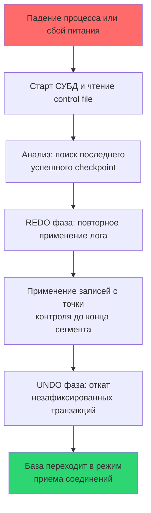

## Введение: Возвращение к консистентности после хаоса

Сбой неизбежен. Отключение питания, паника ядра, OOM-киллер, аппаратная ошибка контроллера или внезапное обесточивание виртуальной машины. В момент аварии содержимое `shared_buffers` (оперативной памяти СУБД) теряется, а страницы на диске могут оказаться в частично записанном состоянии.

Процесс восстановления (Crash Recovery) — это автоматическая процедура, которая возвращает базу данных в предсказуемое, согласованное состояние без вмешательства человека. Для архитектора и старшего инженера понимание этого процесса критично, потому что:
* Оно напрямую определяет RTO (Recovery Time Objective) и влияет на SLA сервиса.
* Поведение приложения в период восстановления часто приводит к `thundering herd` и каскадным отказам.
* Настройки, влияющие на скорость восстановления (`checkpoint_timeout`, `synchronous_commit`), находятся в прямом конфликте с пропускной способностью.

В этой статье мы разберём фазы восстановления, механику защиты от «рваных страниц», влияние процесса на дисковые очереди и кэш-линии CPU, а также покажем, как идиоматично обрабатывать состояние восстановления в Go-приложении.



## 1. Фазы восстановления: Анализ, REDO, UNDO

Алгоритм восстановления (базирующийся на концепции ARIES) состоит из трёх строго последовательных фаз.

### Фаза 1: Analysis
СУБД читает контрольный файл (в PostgreSQL `global/pg_control`, в InnoDB `ibdata1` header), находит `redo_lsn` последнего завершённого чекпоинта [[9. Checkpointing]]. Затем движок сканирует журнал упреждающей записи (WAL) от этой точки вперёд, чтобы:
* Восстановить список активных на момент аварии транзакций.
* Определить, какие из них успели записать `commit_lsn` в лог, а какие нет.
* Выявить границы сегментов и проверить контрольные суммы записей.

### Фаза 2: REDO (Повторное применение)
СУБД проходит по всем записям WAL начиная с `redo_lsn` и применяет их к страницам данных. Ключевой принцип: **записи применяются независимо от того, были ли они уже отражены на диске**. Это обеспечивает идемпотентность. Перед применением каждой записи сравнивается `pd_lsn` в заголовке страницы с `record_lsn`. Если `page_lsn >= record_lsn`, запись пропускается. В итоге база данных восстанавливается в точности до состояния на момент аварии.

### Фаза 3: UNDO (Откат)
Транзакции, которые не успели зафиксировать `commit` в WAL, считаются прерванными. СУБД использует механизм обратной прокрутки (undo-логи или маркеры `xmax` в MVCC), чтобы отменить их изменения. После завершения UNDO база переводится в состояние `ready` и открывает порт для подключения клиентов.

> [!info] Под капотом
> В PostgreSQL `REDO` выполняется однопоточно процессом `startup`. Это не баг, а осознанный выбор: последовательное чтение и применение лога лучше упирается в пропускную способность дискового контроллера, а многопоточное применение требует сложной координации порядка модификаций. В MySQL/InnoDB лог также применяется последовательно, но параллелизм достигается за счёт фоновой отмены (`purge`) после открытия базы.

## 2. Механическая симпатия: Аппаратные угрозы и защита

Теоретически `REDO` должен восстанавливать данные корректно. На практике сталкивается с физическими ограничениями дисковых подсистем.

### Проблема «рваных страниц» (Torn Page)
Размер страницы данных обычно 8 КБ или 16 КБ. Однако контроллеры дисков и ядро ОС пишут атомарно только блоками по 512 байт или 4 КБ. Если сбой произойдёт в момент записи половины страницы, на диске окажется «сшитый» блок: часть старых данных, часть новых. При восстановлении контрольная сумма страницы не сойдётся, и `REDO` не сможет её применить.

Решение в PostgreSQL: параметр `full_page_writes`. При первом изменении страницы после чекпоинта в WAL записывается **полная копия страницы** (8 КБ), а не дельта. При восстановлении движок заменяет повреждённую страницу целиком из лога, после чего применяет последующие дельты. Цена — удвоение объёма лога в моменты массовой записи, но гарантия корректности `REDO` того стоит.

### Влияние на кэш-линии CPU и предвыборку
Фаза `REDO` — это преимущественно последовательное чтение файлов и записи в буфер. Процессор эффективно использует аппаратный `prefetcher`, кэш `L2/L3` заполняется предсказуемо. Нагрузка на шину памяти минимальна по сравнению с фазой `checkpoint`, где происходит случайный сброс. Однако при повреждённых секторах диска контроллер будет многократно пытаться перечитать блок (`retry limit`), что вызовет блокировку треда `startup` и растянет время восстановления на часы.

> [!warning] Ловушка / Gotcha
> Если вы используете облачные SSD с burst-балансом IOPS, фаза `REDO` может исчерпать квоту. Облачный провайдер начнёт троттлить диск. Восстановление, которое на локальном NVMe занимает 2 минуты, в облаке может растянуться на 40 минут. Всегда закладывайте в RTO множитель 3-5 для burst-хранилищ и мониторьте `await` дисков.

## 3. Практика в Go: Обработка восстановления в приложении

Ваше Go-приложение не должно слепо пытаться подключиться к БД сразу после перезапуска пода или виртуальной машины. Фаза восстановления может занимать от секунд до десятков минут. Попытки открытия сотен соединений в это время создадут `thundering herd`, который дополнительно нагрузит диск `startup` процесса.

### Паттерн: Умный пул с проверкой готовности

```go
func ConnectWithRecoveryCheck(ctx context.Context, dsn string) (*sql.DB, error) {
    db, err := sql.Open("postgres", dsn)
    if err != nil {
        return nil, fmt.Errorf("open db: %w", err)
    }

    // Настройка пула для мягкого старта
    db.SetMaxOpenConns(5) // Начинаем с минимума
    db.SetConnMaxLifetime(15 * time.Minute)

    // Проверяем готовность СУБД с экспоненциальной задержкой
    backoff := 1 * time.Second
    maxBackoff := 30 * time.Second
    maxAttempts := 20

    for i := 0; i < maxAttempts; i++ {
        // Проверка штатной доступности
        if err := db.PingContext(ctx); err == nil {
            db.SetMaxOpenConns(50) // Расширяем пул до рабочих значений
            return db, nil
        }

        // Ждём экспоненциально, но не больше лимита
        select {
        case <-ctx.Done():
            return nil, fmt.Errorf("context cancelled during recovery wait: %w", ctx.Err())
        case <-time.After(backoff):
            // Увеличиваем задержку
            if backoff < maxBackoff {
                backoff *= 2
            }
        }
    }

    return nil, fmt.Errorf("database not ready after %d attempts", maxAttempts)
}
```

> [!tip] Собеседование
> **Вопрос:** Почему `db.Ping()` недостаточно для определения готовности во время восстановления?
> **Ответ:** В некоторых конфигурациях или версиях СУБД порт уже открыт, но база находится в режиме `recovery`. Запросы, кроме служебных, будут отклоняться с ошибкой `database is starting up`. В PostgreSQL драйвер `pq` или `pgx` корректно обрабатывает это, но лучше явно проверять `pg_is_in_recovery()` или использовать `startup_probe` в Kubernetes. В `pgx` можно настроить `AfterConnect` hook, который выполнит `SELECT 1` и проверит, что статус `idle`, а не `recovery`.

### Паттерн: Идемпотентный запуск и миграции
После восстановления СУБД может потребовать применения миграций или очистки очередей. Всегда делайте эти операции идемпотентными:
```go
func RunMigrationsSafe(ctx context.Context, db *sql.DB) error {
    // Использование сторонних библиотек (golang-migrate/goose) с блокировкой на уровне БД
    // или ручная проверка версии через advisory lock
    _, err := db.ExecContext(ctx, "SELECT pg_advisory_lock(123456789)")
    if err != nil {
        return fmt.Errorf("acquire lock: %w", err)
    }
    defer func() {
        _, _ = db.ExecContext(ctx, "SELECT pg_advisory_unlock(123456789)")
    }()

    // Логика миграций...
    return nil
}
```

## 4. Влияние настроек ACID на время восстановления

Выбор гарантий напрямую определяет, сколько данных СУБД проигрывает при старте.

| Настройка | Влияние на REDO | Влияние на UNDO | RTO |
|-----------|----------------|-----------------|-----|
| `checkpoint_timeout = 5min` | Короткий проигрыш лога | Быстрый откат | Низкий (секунды) |
| `checkpoint_timeout = 60min` | Длинный проигрыш, больше I/O | Больше незакоммиченных данных | Высокий (минуты) |
| `synchronous_commit = off` | Потеря последних записей при крахе | Меньше откатов, но возможна инконсистентность | Низкий, но с потерей данных (RPO > 0) |
| `full_page_writes = on` | Увеличивает объём WAL на 20-40% | Не влияет | Незначительно увеличивает фазу REDO |

> [!warning] Ловушка / Gotcha
> Никогда не отключайте `full_page_writes` в продакшене, даже если СУБД пишет на ZFS или Btrfs. Файловые системы с Copy-on-Write не гарантируют атомарность записи на уровне блока файловой системы так, как это ожидает движок БД. Вы рискуете получить повреждённые индексы после восстановления.

## 5. Итог

1. **Восстановление** состоит из фаз Analysis, REDO и UNDO. Оно полностью автоматическое и гарантирует возврат к последней консистентной точке.
2. **Защита от torn pages** реализуется через `full_page_writes`. Первая модификация после чекпоинта пишет полную страницу в WAL.
3. **Механика**: REDO последовательно читает лог, эффективно используя кэш CPU и prefetcher. UNDO откатывает незавершённые транзакции.
4. **В Go**: Не долбите БД при старте. Используйте `Ping` с экспоненциальным бэкоффом, расширяйте пул постепенно, проверяйте `pg_is_in_recovery`. Делайте миграции идемпотентными с `advisory lock`.
5. **Настройка**: Баланс между `checkpoint_timeout` и RTO. Для быстрого старта держите интервал 5-15 минут, но помните о цене частых чекпоинтов [[9. Checkpointing]].

Восстановление возвращает базу к рабочему состоянию, но оставляет после себя мёртвые версии строк и раздутые структуры индексов. Как СУБД очищает этот мусор в фоновом режиме, не блокируя основную работу, мы разберём в следующей статье: [[11. VACUUM и garbage collection]].
