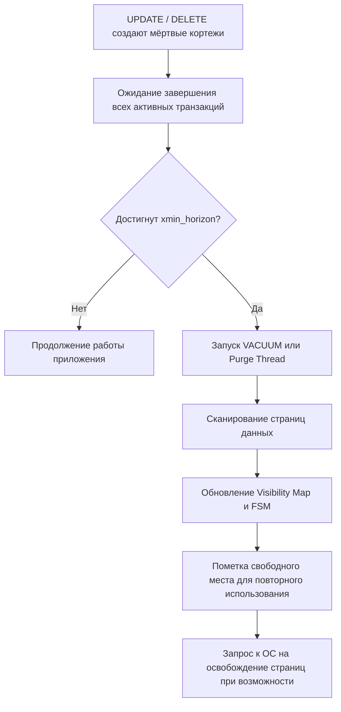

## Введение: Механизм уборки мусора в базах данных

В системах с многоверсионным управлением конкурентным доступом (MVCC) каждая операция `UPDATE` или `DELETE` не удаляет данные физически. Она лишь помечает старую версию строки как неактивную, оставляя её на диске до тех пор, пока ни одна активная транзакция не нуждается в её чтении. Без механизма очистки база данных превратилась бы в свалку «мёртвых» кортежей, быстро занимая всё доступное пространство и уничтожая производительность сканирований.

Процесс очистки мусора в реляционных СУБД аналогичен сборщику мусора (Garbage Collector) в языках программирования, но имеет принципиальные архитектурные отличия. Для инженера уровня Senior/Lead понимание этого механизма критично, потому что:
* «Раздутые» (bloated) таблицы и индексы — главная причина деградации `latency` под нагрузкой.
* Неправильная конфигурация `autovacuum` приводит к остановке кластера или экспоненциальному росту дискового пространства.
* Долгоживущие транзакции в Go-приложении блокируют горизонт очистки, вызывая каскадные проблемы.



## Архитектура MVCC и возникновение мёртвых данных

При изменении строки СУБД создаёт новую версию с новым `xmin`, а у старой версии проставляется `xmax`. Пока существует хотя бы одна транзакция, снимок которой (`snapshot`) включает `xmin` старой версии, эта версия остаётся «живой» для неё.

Момент, с которого все мёртвые строки гарантированно не нужны ни одной транзакции, называется **горизонтом очистки (cleanup horizon)**. В PostgreSQL это значение `xmin` минус количество активных транзакций на момент запуска `VACUUM`. Всё, что старше этого горизонта, можно безопасно удалять или помечать как свободное.

> [!warning] Ловушка / Gotcha
> Если в вашем Go-сервисе открыта транзакция `BEGIN` и выполняется тяжёлая аналитика или обработка внешних HTTP-запросов, она «прибивает» горизонт очистки. СУБД не может удалить ни одной мёртвой строки, созданной после старта этой транзакции. За несколько часов высоконагруженной работы таблица может раздуться в 10-50 раз. Всегда закрывайте транзакции как можно быстрее.

## Реализация под капотом: Два архитектурных лагеря

Подходы к сборке мусора в современных СУБД радикально различаются по внутренней механике.

### 1. PostgreSQL: Inline VACUUM
Процесс `autovacuum` (или ручной `VACUUM`) работает непосредственно с файлами данных таблицы:
* **Сканирование**: Фоновый процесс последовательно читает страницы данных.
* **Удаление кортежей**: Находит строки с `xmax < horizon`, стирает их заголовки.
* **Обновление структур**: Заполняет `Free Space Map (FSM)` информацией о свободных слотах на страницах. Обновляет `Visibility Map (VM)`, помечая страницы, где все строки видны всем, что ускоряет `Index Only Scan`.
* **Важно**: Пространство **не возвращается операционной системе**. Файл `.md` остаётся того же размера, но внутри появляются «дыры», которые переиспользуются для новых `INSERT`/`UPDATE`.

### 2. MySQL/InnoDB: Background Purge
InnoDB не делает `VACUUM` в классическом понимании. Вместо этого работает `purge thread`:
* **Undo Log**: При `UPDATE/DELETE` старая версия копируется в сегменты отката (undo tablespace).
* **Purge**: Фоновый поток сканирует историю отката, удаляет старые версии из undo-логов и сбрасывает информацию о «призраках» из кластерного и вторичных индексов.
* **Page Freeing**: Страницы, ставшие полностью пустыми, возвращаются в `Free List` табличного пространства.
* **Особенность**: InnoDB не выполняет компактизацию «на лету» внутри одной страницы так агрессивно, как PG. Дефрагментация требует `ALTER TABLE ... FORCE`.

> [!info] Под капотом
> В PostgreSQL структуры `FSM` и `VM` хранятся в отдельных файлах (`relname_fsm`, `relname_vm`). Каждый бит в `VM` соответствует одной странице данных. Если бит установлен, движок знает, что при `Index Only Scan` не нужно обращаться к куче для проверки видимости. Это сокращает логические чтения в 2 раза и минимизирует промахи кэша `L1/L2`.

## Механическая симпатия: Цена уборки для железа и ОС

Запуск `VACUUM` — это не бесплатная фоновая задача. Он создаёт серьёзную нагрузку на дисковую подсистему и память.

### Дисковый I/O и кэш страниц ОС
`VACUUM` выполняет последовательное чтение файлов данных. Это эффективно заполняет кэш страниц ОС (`page cache`). Однако при обновлении `FSM` и `VM` происходят случайные записи небольших блоков. Ядро ОС переводит эти записи в `dirty pages`, которые позже сбрасываются через `writeback` threads.
* **Влияние на latency**: Если `autovacuum` настроен слишком агрессивно, он конкурирует с пользовательскими запросами за `I/O queue`. В облачных средах с ограниченным `burst IOPS` это приводит к таймаутам `QueryContext` в Go.
* **syscalls**: Активно используются `posix_fadvise(POSIX_FADV_DONTNEED)` для очистки кэша ОС от страниц, которые уже обработаны, чтобы не вытеснять «горячие» данные рабочих процессов.

### CPU и предсказание ветвлений
Сканирование страниц на наличие мёртвых кортежей — это линейный обход памяти с проверкой флагов в заголовке каждой строки (`HeapTupleHeader`). Современные `autovacuum` реализации используют векторные инструкции и оптимизированные циклы, но высокая фрагментация таблиц приводит к промахам кэша `L3`. Проход по разряженным страницам увеличивает `IPC` (Instructions Per Cycle) и время ожидания памяти.

## VACUUM FULL и возврат пространства операционной системе

Обычный `VACUUM` не уменьшает размер файла на диске. Для возврата места ОС требуется `VACUUM FULL` (PostgreSQL) или `OPTIMIZE TABLE` / `ALTER TABLE ... FORCE` (MySQL).

Этот процесс:
1. Создаёт копию таблицы в новом файле, переписывая только живые строки.
2. Реорганизует индексы с нуля.
3. Заменяет оригинальный файл новым.
4. Вызывает `fallocate` или `truncate`, возвращая место ОС.

> [!warning] Ловушка / Gotcha
> `VACUUM FULL` требует блокировки `ACCESS EXCLUSIVE`. Это полностью останавливает `SELECT`, `INSERT`, `UPDATE` и `DELETE` для таблицы. В продакшене с репликами или пулами соединений это приводит к `connection pool exhaustion` и таймаутам на стороне Go. Никогда не запускайте его из кода приложения. Используйте `pg_repack` или `pg_squeeze` для онлайн-реорганизации.

## Практика в Go: Управление долгоживущими транзакциями

Ваша задача — не мешать `autovacuum` и отслеживать его прогресс.

### Паттерн: Мониторинг возраста транзакций
В PostgreSQL переполнение счётчика `txid` (32-бит) приводит к потере данных. `VACUUM` должен сбрасывать `frozenxid`. Отслеживайте `age(datfrozenxid)` в метриках.

```go
func GetDatabaseAgeMetrics(ctx context.Context, db *sql.DB) (map[string]int64, error) {
    rows, err := db.QueryContext(ctx, `
        SELECT datname, age(datfrozenxid) 
        FROM pg_database 
        WHERE datallowconn = true
    `)
    if err != nil {
        return nil, fmt.Errorf("query db ages: %w", err)
    }
    defer rows.Close()

    ages := make(map[string]int64)
    for rows.Next() {
        var name string
        var age int64
        if err := rows.Scan(&name, &age); err != nil {
            continue
        }
        ages[name] = age
    }
    return ages, nil
}
// Если age > 1.5 млрд, срочно запускайте ручное VACUUM, иначе база остановится!
```

### Паттерн: Избегание блокировок горизонта
Вместо удержания открытой транзакции для чтения данных, используйте моментальные снимки на уровне приложения или короткие транзакции с `REPEATABLE READ`.

```go
// ПЛОХО: Транзакция держится пока обрабатывается внешняя логика
func ProcessExternalData(ctx context.Context, db *sql.DB, data []byte) error {
    tx, err := db.BeginTx(ctx, nil)
    if err != nil {
        return err
    }
    defer func() { _ = tx.Rollback() }()

    // ... тяжёлые вычисления, HTTP вызовы, sleep ...
    // Горизонт очистки заблокирован на это время!

    _, err = tx.ExecContext(ctx, "UPDATE status SET processed = true WHERE id = $1", id)
    return tx.Commit()
}

// ХОРОШО: Чтение в одной транзакции, обработка вне, запись в другой
func ProcessDataSafe(ctx context.Context, db *sql.DB, data []byte) error {
    var record MyRecord
    err := db.QueryRowContext(ctx, "SELECT id, payload FROM tasks WHERE id = $1 FOR UPDATE SKIP LOCKED", id).Scan(&record.ID, &record.Payload)
    if err != nil {
        return err
    }

    // Обработка вне транзакции БД
    result, err := heavyComputation(record.Payload)
    if err != nil {
        return err
    }

    _, err = db.ExecContext(ctx, "UPDATE tasks SET result = $1, status = 'done' WHERE id = $2", result, record.ID)
    return err
}
```

> [!tip] Собеседование
> **Вопрос:** Почему `COUNT(*)` на таблице после массового `DELETE` всё ещё выполняется долго, даже если строк логически ноль?
> **Ответ:** `VACUUM` пометил строки как свободные в `FSM`, но не уменьшил количество страниц в файле. `COUNT(*)` требует полного сканирования всех страниц таблицы (или индекса), даже если они пустые. СУБД читает их с диска, проверяет заголовки и убеждается, что строки мёртвые. Чтобы ускорить `COUNT`, нужно выполнить `VACUUM FULL` или переписать таблицу.

## Параллель с Garbage Collector в Go

Понимание `VACUUM` через призму `runtime.GC` Go помогает лучше усвоить оба механизма:

| Параметр | Go GC (runtime) | DB VACUUM / Purge |
|----------|-----------------|-------------------|
| **Объекты** | Структуры в куче (heap) | Строки (tuples) в файлах данных |
| **Триггер** | Превышение порога выделения / таймер | Превышение % мёртвых строк / таймер / txid age |
| **Остановка мира** | Да (STW фазы, но короткая) | Нет (работает асинхронно), кроме `VACUUM FULL` |
| **Возврат памяти** | `madvise(MADV_DONTNEED)` ОС | Обычно нет (только `VACUUM FULL` возвращает ФС) |
| **Проблема «пиннинга»** | Живые корни удерживают граф | Открытая транзакция удерживает горизонт |
| **Фрагментация** | Вызывает аллокации новых объектов | Вызывает `bloat` страниц и замедление `seq scan` |

Обе системы жертвуют мгновенным возвратом ресурсов ради гарантии согласованности и минимизации влияния на основную работу. Главный враг и в Go, и в БД — долгоживущие ссылки на старые объекты.

## Итог

1. **Назначение**: `VACUUM` и `Purge` удаляют мёртвые версии строк, обновляют карты видимости и освобождают место для переиспользования.
2. **Архитектура**: PostgreSQL обновляет `FSM/VM` внутри файлов, InnoDB очищает `undo logs` и индексы фоновым потоком.
3. **Железо**: Последовательное чтение страниц эффективно, но случайные записи в метаданные конкурируют за `I/O queue` и кэш ОС.
4. **В Go**: Самая большая угроза — открытые транзакции во время тяжёлой обработки. Закрывайте `*sql.Tx` мгновенно, мониторьте `age(datfrozenxid)`, никогда не запускайте `VACUUM FULL` из кода.
5. **Сравнение с Go GC**: Оба механизма асинхронны и страдают от «задержки уборки» при наличии активных корней/транзакций.

Понимание того, как база данных управляет версиями строк и очищает их, подводит нас к следующему уровню изоляции, который обеспечивает абсолютную консистентность снимков без блокировок. В следующей статье мы детально разберём, как СУБД создаёт и использует эти снимки: [[12. Snapshot isolation]].
