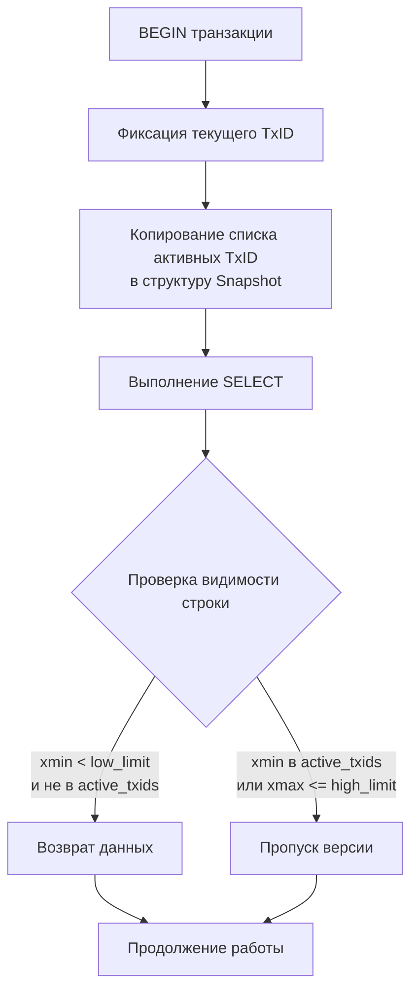

## Введение: Изоляция через снимки состояния

**Snapshot Isolation (SI)** — это механизм обеспечения согласованности, при котором каждая транзакция видит строго фиксированный снимок (состояние) базы данных на момент своего начала. Все операции чтения в рамках транзакции возвращают данные именно из этого снимка, а изменения, внесённые другими транзакциями после старта текущей, становятся видимыми только после `COMMIT`.

В отличие от классических блокировочных моделей, Snapshot Isolation не требует разделяющих блокировок (`Shared Lock`) для операций `SELECT`. Это позволяет читать данные без конфликтов с писателями, что является фундаментом высокой пропускной способности современных OLTP-систем.

Для инженера уровня Senior/Lead понимание SI — это не просто знание уровня `REPEATABLE READ`. Это способность:
* Предсказывать поведение аналитических и фоновых задач, которые работают с долгоживущими снимками.
* Осознанно выбирать между `Snapshot Isolation` и строгой сериализацией, избегая аномалии `Write Skew`.
* Проектировать Go-приложения так, чтобы не вызывать «буксировку» мёртвых версий и не блокировать `autovacuum`.



## Механика видимости: Как создаётся и применяется снимок

Когда транзакция запускается, СУБД не копирует таблицы в память. Вместо этого она создаёт компактную структуру — **снимок (Snapshot)**, содержащую границы идентификаторов транзакций.

Видимость строки определяется сравнением её системных атрибутов `xmin` (ID транзакции-создателя) и `xmax` (ID транзакции-удалителя) с параметрами снимка.

### Алгоритм проверки (упрощённо для PostgreSQL/InnoDB)
1. Если `xmin >= snapshot.high_limit` → строка создана после начала снимка. **Невидима**.
2. Если `xmin < snapshot.low_limit` и `xmin` отсутствует в списке активных транзакций → строка создана до снимка и уже зафиксирована. **Видима**.
3. Если `xmin` находится в списке активных транзакций → создающая транзакция ещё не завершилась. **Невидима**.
4. Если `xmax != 0` и `xmax <= snapshot.high_limit` и `xmax` зафиксирован → строка удалена после начала снимка. **Невидима**.

Этот алгоритм выполняется на уровне движка СУБД за несколько тактов CPU, без обращения к менеджеру блокировок и без дисковых операций.

> [!info] Под капотом
> В структуре `SnapshotData` (PostgreSQL) хранится массив `xip[]` (in-progress transactions). Для оптимизации поиска СУБД использует двоичный поиск или битовые маски. В InnoDB аналогичная структура называется `read_view_t` и содержит поля `up_limit_id` и `low_limit_id`, между которыми лежит «окно» активных транзакций. Проверка видимости сводится к сравнению 64-битных целых чисел, что идеально ложится на регистры современного CPU.

## Под капотом: Управление памятью и структура `ProcArray`

Создание снимка требует доступа к глобальному состоянию кластера. В PostgreSQL эта информация хранится в разделяемой памяти в структуре `ProcArray`, которая содержит массив записей о каждом активном бэкенд-процессе.

1. При `BEGIN` процесс берёт `ProcArrayLock` (в режиме `LW_SHARED`).
2. Копирует список активных `xid` в локальную память процесса.
3. Освобождает блокировку.
4. Создаёт `SnapshotData` в стеке или куче процесса.

В InnoDB (MySQL) аналогом выступает глобальная структура `trx_sys->rw_trx_list`, защищённая мьютексом. Создание снимка требует захвата этого мьютекса, что при тысячах параллельных `BEGIN` может создать точку сериализации. Для снижения конкуренции современные версии MySQL используют RCU-подобные оптимизации и атомарные счётчики.

> [!warning] Ловушка / Gotcha
> Долгоживущий снимок не освобождает память в СУБД, но **блокирует горизонт очистки**. Пока снимок активен, `VACUUM` (PostgreSQL) или `purge thread` (InnoDB) не может удалить старые версии строк, созданные после `low_limit_id` снимка. Это приводит к разрастанию таблиц (bloat), увеличению размера файлов на диске и падению эффективности кэша страниц ОС. В высоконагруженных системах одна «зависшая» аналитическая транзакция может снизить `INSERT`/`UPDATE` пропускную способность на 30-50%.

## Аномалия Write Skew: Граница изоляции снимков

`Snapshot Isolation` предотвращает `Dirty Read`, `Non-Repeatable Read` и `Phantom Read`, но **не гарантирует сериализуемость**. Классическая проблема — **Write Skew**.

### Сценарий
Представьте правило: «Врачи на дежурстве: минимум 1 человек». В таблице `doctors` две строки: Alice и Bob. Оба статусы `on_call = true`.

```sql
-- Транзакция 1: Alice уходит с дежурства
BEGIN; -- уровень REPEATABLE READ (Snapshot Isolation)
SELECT count(*) FROM doctors WHERE on_call = true; -- вернёт 2
UPDATE doctors SET on_call = false WHERE name = 'Alice';
COMMIT;

-- Транзакция 2: Bob уходит с дежурства (параллельно)
BEGIN; -- уровень REPEATABLE READ
SELECT count(*) FROM doctors WHERE on_call = true; -- вернёт 2 (снимок тот же)
UPDATE doctors SET on_call = false WHERE name = 'Bob';
COMMIT;
```

Обе транзакции увидели снимок, где врачей двое. Обе приняли решение, что могут уйти. После коммита в базе 0 врачей. Правило нарушено. `Snapshot Isolation` не видит конфликта, потому что транзакции изменяли разные строки и не пересекались по блокировкам.

Решение: использовать `SERIALIZABLE` (с SSI или предикатными блокировками) или явные `SELECT ... FOR UPDATE` на уровне приложения.

> [!tip] Собеседование
> **Вопрос:** В чём ключевое отличие `Snapshot Isolation` от `Serializable Snapshot Isolation (SSI)`?
> **Ответ:** `SI` допускает `Write Skew`, так как проверяет конфликты только на уровне перезаписи одной и той же строки. `SSI` (реализован в PostgreSQL при `ISOLATION LEVEL SERIALIZABLE`) дополнительно отслеживает предикатные зависимости (чтение диапазона → запись в диапазон) и при обнаружении цикла откатывает одну из транзакций с кодом `40001`. Это даёт строгую сериальную эквивалентность ценой более частых конфликтов.

## Механическая симпатия: Цена согласованности для железа

Изоляция через снимки напрямую влияет на утилизацию процессора, памяти и дисковой подсистемы.

### Кэш-линии CPU и локальность данных
При сканировании таблицы в рамках снимка СУБД последовательно читает страницы, но каждая строка требует проверки видимости. Это приводит к:
* Частым проверкам `xip[]` массива, который может не помещаться в кэш `L1`.
* Промахам кэша при переключении между активной строкой и её «мертвой» версией, лежащей на другой странице.
* Нагрузке на ветвление (`branch prediction`): результат проверки видимости непредсказуем при высокой фрагментации, что вызывает сброс конвейера (`pipeline flush`).

### Влияние на пул соединений в Go
Когда горутина выполняет длительный `SELECT` в рамках `REPEATABLE READ`:
1. Соединение остаётся активным (`state = active` в `pg_stat_activity`).
2. Память под структуру снимка удерживается в процессе СУБД.
3. Если в Go используется `context.WithTimeout`, но запрос блокируется на диске, соединение не возвращается в пул.
4. При достижении `SetMaxOpenConns` новые запросы будут ждать в очереди `db.connRequests`, увеличивая `p99` латентность сервиса.

### Дисковые операции и VACUUM
Чем дольше живёт снимок, тем медленнее работает `autovacuum`. Задержка очистки приводит к тому, что `Index Only Scan` вынужден обращаться к куче для проверки `Visibility Map`, которая не обновлена. Это превращает быструю операцию (чтение только из индекса) в медленную (чтение индекс + куча), увеличивая случайные чтения (`random I/O`) и задержки `await` на SSD.

## Практика в Go: Паттерны и антипаттерны

### Паттерн 1: Изолированное чтение для отчётов
Используйте `REPEATABLE READ` для формирования консистентных отчётов, но строго ограничивайте время жизни транзакции.

```go
func GenerateDailyReport(ctx context.Context, db *sql.DB, date time.Time) (Report, error) {
    // Явное указание уровня изоляции
    opts := &sql.TxOptions{
        Isolation: sql.LevelRepeatableRead,
        ReadOnly:  true, // Оптимизация для планировщика СУБД
    }
    tx, err := db.BeginTx(ctx, opts)
    if err != nil {
        return Report{}, fmt.Errorf("begin tx: %w", err)
    }
    defer func() { _ = tx.Rollback() }()

    var totalSales decimal.Decimal
    err = tx.QueryRowContext(ctx, `
        SELECT COALESCE(SUM(amount), 0) 
        FROM orders 
        WHERE created_at >= $1 AND created_at < $2
    `, date, date.Add(24*time.Hour)).Scan(&totalSales)
    if err != nil {
        return Report{}, fmt.Errorf("scan total: %w", err)
    }

    if err := tx.Commit(); err != nil {
        return Report{}, fmt.Errorf("commit report: %w", err)
    }
    return Report{Total: totalSales}, nil
}
```

### Паттерн 2: Разделение чтения и обработки
Никогда не держите транзакцию открытой во время тяжёлых вычислений или внешних вызовов.

```go
// НЕВЕРНО: Транзакция висит 2 секунды пока обрабатывается JSON
func BadProcessing(ctx context.Context, db *sql.DB) error {
    tx, _ := db.BeginTx(ctx, &sql.TxOptions{Isolation: sql.LevelRepeatableRead})
    defer func() { _ = tx.Rollback() }()

    var payload string
    _ = tx.QueryRowContext(ctx, "SELECT data FROM queue WHERE id = $1", 1).Scan(&payload)
    
    // Горизонт очистки заблокирован!
    time.Sleep(2 * time.Second) 
    
    _, _ = tx.ExecContext(ctx, "DELETE FROM queue WHERE id = $1", 1)
    return tx.Commit()
}

// ВЕРНО: Чтение -> Обработка -> Запись в новой короткой транзакции
func GoodProcessing(ctx context.Context, db *sql.DB) error {
    var payload string
    err := db.QueryRowContext(ctx, "SELECT data FROM queue WHERE id = $1 FOR UPDATE SKIP LOCKED", 1).Scan(&payload)
    if err != nil {
        return err
    }

    result := processPayload(payload) // Тяжёлая логика вне транзакции

    _, err = db.ExecContext(ctx, "UPDATE queue SET status = 'done', result = $1 WHERE id = $2", result, 1)
    return err
}
```

> [!warning] Ловушка / Gotcha
> В драйвере `lib/pq` или `pgx` вызов `tx.Commit()` не мгновенно освобождает снимок на стороне сервера. Сервер помечает транзакцию как `idle in transaction` до получения `COMMIT` пакета по сети. Если между `defer tx.Rollback()` и фактическим коммитом происходит паника или сетевой разрыв, снимок может остаться активным до таймаута соединения (`idle_in_transaction_session_timeout`). Всегда настраивайте этот параметр в `postgresql.conf` на уровне 5-10 минут.

## Итог

1. **Snapshot Isolation** обеспечивает консистентное чтение без блокировок, используя сравнение `xmin`/`xmax` с границами снимка.
2. **Под капотом**: Снимок создаётся копированием списка активных транзакций из `ProcArray` или `trx_sys`. Проверка видимости — это целочисленные операции на CPU.
3. **Write Skew**: Главное ограничение `SI`. Две транзакции могут принять конфликтующие решения на основе одинакового снимка, если изменяют разные строки. Требует `SERIALIZABLE` или явных локов.
4. **Механическая симпатия**: Долгие снимки увеличивают промахи кэша `L3`, замедляют `VACUUM`, раздувают таблицы и блокируют освобождение ресурсов в пуле соединений.
5. **В Go**: Используйте `sql.LevelRepeatableRead` только для коротких консистентных чтений. Разделяйте чтение и обработку, ограничивайте время жизни транзакции, используйте `SET idle_in_transaction_session_timeout`.

Эта статья завершает подраздел «05. Транзакции и внутренности». Мы прошли путь от базовых гарантий ACID до механизмов управления версиями, восстановления и очистки мусора. Понимание этих процессов позволяет проектировать бэкенд, который не просто «работает», а предсказуемо ведёт себя под экстремальной нагрузкой и частичными отказами инфраструктуры.

Следующим логическим шагом после освоения транзакционной механики является переход к оптимизации доступа к данным и архитектуре конкретной СУБД. В следующей статье мы разберём, как устроена система хранения, процессы и планировщик запросов на примере самой популярной открытой базы: [[1. Архитектура PostgreSQL]].
