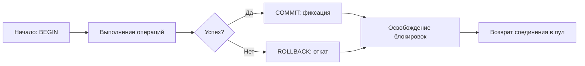
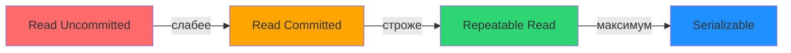

## Введение: Что такое транзакция и зачем нужна изоляция

Транзакция — это фундаментальная абстракция, позволяющая группировать несколько операций над базой данных в логическую единицу работы. Но за простым синтаксисом `BEGIN` / `COMMIT` скрывается сложный механизм координации параллельных потоков, управления памятью и гарантий устойчивости данных.

Для бэкенд-инженера на Go понимание транзакций — это не просто умение написать `db.Begin()`. Это способность:
* Предсказывать, как поведёт себя система под нагрузкой при сотнях параллельных запросов.
* Осознанно выбирать уровень изоляции, балансируя между консистентностью и пропускной способностью.
* Писать код, который корректно обрабатывает ошибки, таймауты и откаты, не оставляя «висячих» соединений.

В этой статье мы разберём жизненный цикл транзакции, механику уровней изоляции и то, как эти концепции реализованы «под капотом» в современных СУБД. Мы также покажем, как правильно работать с транзакциями в Go, учитывая особенности рантайма и сетевой модели.



## Жизненный цикл транзакции: от BEGIN до COMMIT

Транзакция проходит через несколько чётко определённых состояний:

1. **Active**: транзакция начата (`BEGIN`), выполняются запросы.
2. **Partially Committed**: последняя операция выполнена, но `COMMIT` ещё не подтверждён.
3. **Committed**: `COMMIT` успешно завершён, изменения зафиксированы и видны другим транзакциям (в зависимости от уровня изоляции).
4. **Failed**: произошла ошибка, транзакция не может быть завершена.
5. **Aborted**: выполнен `ROLLBACK`, все изменения отменены.

> [!info] Под капотом
> В PostgreSQL каждая транзакция получает уникальный `xmin` (transaction ID). При первом изменении данных в транзакции СУБД выделяет этот идентификатор и начинает отслеживать видимые строки через систему «снимков» (snapshots). В InnoDB аналогичную роль играет `trx_id`, который хранится в заголовке каждой версии строки.

### Состояния на уровне ядра СУБД

Когда вы вызываете `BEGIN` в Go-приложении:
1. Драйвер базы данных запрашивает соединение из пула.
2. СУБД выделяет структуру транзакции в памяти (в shared memory или process-local).
3. Устанавливается начальный «снимок» данных (для MVCC-систем) или приобретаются начальные блокировки (для lock-based систем).
4. Возвращается управление приложению.

При `COMMIT`:
1. Записывается `COMMIT record` в WAL (Write-Ahead Log).
2. Вызывается `fsync()` для гарантированной записи на диск (если `synchronous_commit = on`).
3. Освобождаются блокировки, удерживаемые транзакцией.
4. Снимок данных помечается как завершённый, позволяя `VACUUM` очистить старые версии строк.

> [!warning] Ловушка / Gotcha
> В Go соединение, выданное для транзакции, остаётся закреплённым за ней до момента `Commit()` или `Rollback()`. Если вы забудете вызвать один из этих методов, соединение никогда не вернётся в пул — это приведёт к исчерпанию пула соединений (`sql: database is closed` или `timeout waiting for connection`). Всегда используйте `defer` для гарантии отката:

```go
func ProcessOrder(ctx context.Context, db *sql.DB, orderID int64) (err error) {
    tx, err := db.BeginTx(ctx, nil)
    if err != nil {
        return fmt.Errorf("begin tx: %w", err)
    }
    defer func() {
        if err != nil {
            _ = tx.Rollback() // Игнорируем ошибку отката, если уже есть ошибка
        }
    }()

    // ... бизнес-логика ...

    return tx.Commit() // Если здесь ошибка, defer выполнит Rollback
}
```

## Уровни изоляции: спектр компромиссов

Уровень изоляции определяет, какие аномалии параллельного выполнения допустимы, а какие — запрещены. Стандарт SQL определяет четыре уровня, но их реализация различается между СУБД.



### Краткая характеристика уровней

| Уровень | Видит незафиксированное | Повторное чтение | Фантомы | Реальная стоимость |
|---------|------------------------|------------------|---------|-------------------|
| Read Uncommitted | Да | Да | Да | Минимальная |
| Read Committed | Нет | Да | Да | Низкая |
| Repeatable Read | Нет | Нет | Зависит от СУБД | Средняя |
| Serializable | Нет | Нет | Нет | Высокая |

Важно: в PostgreSQL `REPEATABLE READ` предотвращает и фантомные чтения благодаря механизму предикатных блокировок, тогда как в стандарте это не гарантируется.

> [!tip] Собеседование
> **Вопрос**: Почему `READ COMMITTED` не предотвращает non-repeatable read?
> **Ответ**: Потому что каждый запрос внутри транзакции видит новый снимок данных — тот, который был актуален на момент начала *этого запроса*, а не всей транзакции. Если между двумя `SELECT` в одной транзакции другая транзакция зафиксировала изменение, второй `SELECT` увидит новое значение.

## Механизмы реализации: блокировки против MVCC

Существует два фундаментальных подхода к обеспечению изоляции:

### 1. Пессимистическая блокировка (Lock-Based)

Транзакция явно блокирует строки/страницы/таблицы, которые читает или модифицирует. Другие транзакции ждут освобождения блокировок.

* **Преимущества**: предсказуемость, простота реализации.
* **Недостатки**: риск дедлоков, снижение параллелизма, накладные расходы на управление блокировками.

Пример в SQL:
```sql
BEGIN;
SELECT balance FROM accounts WHERE id = 1 FOR UPDATE; -- эксклюзивная блокировка
-- ... другие операции ...
COMMIT;
```

### 2. Оптимистический контроль через версии (MVCC)

Multi-Version Concurrency Control хранит несколько версий каждой строки. Читающие транзакции видят снимок данных на момент своего начала, не блокируя пишущие, и наоборот.

* **Преимущества**: высокая параллельность чтений, отсутствие блокировок на чтение.
* **Недостатки**: накладные расходы на хранение версий, необходимость сборки мусора (`VACUUM` в PostgreSQL).

> [!info] Под капотом
> В PostgreSQL каждая строка содержит системные колонки `xmin` и `xmax`:
> * `xmin` — ID транзакции, которая вставила строку.
> * `xmax` — ID транзакции, которая удалила/обновила строку (0, если строка активна).
> 
> При выполнении `SELECT` с уровнем `REPEATABLE READ` СУБД проверяет:
> ```
> видно строку, если:
>   (xmin <= snapshot_xmin AND (xmax = 0 OR xmax > snapshot_xmax))
> ```
> Это позволяет мгновенно отфильтровать невидимые версии без блокировок.

### Сравнение подходов в таблицах

| Критерий | Lock-Based (MySQL/InnoDB*) | MVCC (PostgreSQL) |
|----------|-----------------------------|-------------------|
| Чтение | Может блокироваться | Никогда не блокирует запись |
| Запись | Блокирует строку | Создаёт новую версию, старая остаётся |
| Фантомы | Next-key locking предотвращает | Предикатные блокировки в RR |
| Сборка мусора | Не требуется | Требуется VACUUM |
| Хранение | Одна версия строки | Несколько версий (до VACUUM) |

\* InnoDB использует гибрид: MVCC для чтений, блокировки для записей.

## Как выбрать уровень изоляции в продакшене

Выбор уровня изоляции — это инженерный компромисс. Вот практические рекомендации:

### Используйте `READ COMMITTED`, если:
* Ваша логика допускает, что данные могут измениться между запросами внутри одной транзакции.
* Вы явно обрабатываете конфликты на уровне приложения (optimistic locking через `version` колонку).
* Вам важна максимальная пропускная способность при умеренных требованиях к консистентности.

Пример: счётчик просмотров статьи.
```go
// Допустимо, что два запроса увидят разное значение
_, err := tx.ExecContext(ctx, 
    "UPDATE articles SET views = views + 1 WHERE id = $1", 
    articleID,
)
```

### Используйте `REPEATABLE READ`, если:
* Вы выполняете несколько зависимых запросов, и результат второго зависит от первого.
* Вам критично избежать lost update без явных блокировок.
* Вы работаете с финансовыми операциями, где важна согласованность снимка данных.

Пример: расчёт итога заказа по нескольким таблицам.
```go
// Гарантируем, что цены товаров не изменятся между запросами
var total decimal.Decimal
err := tx.QueryRowContext(ctx, 
    "SELECT SUM(price * quantity) FROM order_items WHERE order_id = $1",
    orderID,
).Scan(&total)
// ... используем total для дальнейших расчётов ...
```

### Используйте `SERIALIZABLE` только если:
* Вы не можете допустить ни одной аномалии параллелизма.
* Конфликты транзакций редки, и вы готовы обрабатывать ошибки сериализации повтором.
* Бизнес-логика слишком сложна для ручного управления блокировками.

> [!warning] Ловушка / Gotcha
> В PostgreSQL при `SERIALIZABLE` транзакция может завершиться с ошибкой `SQLSTATE 40001` (serialization_failure), даже если логически конфликта не было. Это цена за строгую гарантию. Всегда обрабатывайте эту ошибку повтором транзакции:

```go
func WithRetry(ctx context.Context, maxAttempts int, fn func(*sql.Tx) error) error {
    for attempt := 1; attempt <= maxAttempts; attempt++ {
        tx, err := db.BeginTx(ctx, &sql.TxOptions{Isolation: sql.LevelSerializable})
        if err != nil {
            return err
        }
        if err := fn(tx); err != nil {
            _ = tx.Rollback()
            // Проверяем, можно ли повторить
            if pgErr, ok := err.(*pq.Error); ok && pgErr.Code == "40001" {
                continue // retry
            }
            return err
        }
        return tx.Commit()
    }
    return fmt.Errorf("max retry attempts exceeded")
}
```

## Транзакции в Go: практические паттерны

### Паттерн 1: Транзакция с контекстом и таймаутом

```go
func UpdateUserBalance(ctx context.Context, db *sql.DB, userID int64, delta decimal.Decimal) error {
    // Ограничиваем общее время транзакции
    ctx, cancel := context.WithTimeout(ctx, 5*time.Second)
    defer cancel()

    tx, err := db.BeginTx(ctx, &sql.TxOptions{
        Isolation: sql.LevelReadCommitted,
    })
    if err != nil {
        return fmt.Errorf("begin tx: %w", err)
    }
    defer func() { _ = tx.Rollback() }()

    var balance decimal.Decimal
    err = tx.QueryRowContext(ctx, 
        "SELECT balance FROM users WHERE id = $1 FOR UPDATE", 
        userID,
    ).Scan(&balance)
    if err != nil {
        return fmt.Errorf("select balance: %w", err)
    }

    newBalance := balance.Add(delta)
    if newBalance.LessThan(decimal.Zero) {
        return fmt.Errorf("insufficient funds")
    }

    _, err = tx.ExecContext(ctx,
        "UPDATE users SET balance = $1, updated_at = NOW() WHERE id = $2",
        newBalance, userID,
    )
    if err != nil {
        return fmt.Errorf("update balance: %w", err)
    }

    return tx.Commit()
}
```

### Паттерн 2: Вложенные транзакции (savepoints)

Go стандартно не поддерживает savepoints, но их можно эмулировать через raw SQL:

```go
func WithSavepoint(ctx context.Context, tx *sql.Tx, name string, fn func() error) error {
    _, err := tx.ExecContext(ctx, fmt.Sprintf("SAVEPOINT %s", name))
    if err != nil {
        return err
    }
    if err := fn(); err != nil {
        _, _ = tx.ExecContext(ctx, fmt.Sprintf("ROLLBACK TO SAVEPOINT %s", name))
        return err
    }
    _, err = tx.ExecContext(ctx, fmt.Sprintf("RELEASE SAVEPOINT %s", name))
    return err
}

// Использование
err := WithSavepoint(ctx, tx, "sp1", func() error {
    // операции, которые можно откатить независимо
    return nil
})
```

> [!tip] Собеседование
> **Вопрос**: Почему в Go нельзя просто передать `*sql.Tx` в несколько функций и ожидать, что они используют одну транзакцию?
> **Ответ**: Можно, и это правильный подход. Но важно помнить: `*sql.Tx` привязана к одному соединению из пула. Если вы случайно вызовете `db.Query()` вместо `tx.Query()` внутри той же логической операции, вы выполните запрос вне транзакции — это частая ошибка. Всегда явно передавайте `*sql.Tx` и используйте только её методы.

## Механическая симпатия: цена изоляции на уровне железа

Выбор уровня изоляции влияет не только на логику, но и на утилизацию ресурсов:

### Память и кэш-линии
* В MVCC-системах старые версии строк занимают место в буферном пуле и могут вытеснять «горячие» данные из кэша L3 CPU.
* Долгие транзакции в `REPEATABLE READ` удерживают снимок, предотвращая очистку старых версий — это приводит к росту размера базы на диске и в памяти.

### Дисковые операции
* Каждый `COMMIT` при `synchronous_commit=on` вызывает `fsync()` — это сбрасывает кэш ядра ОС на диск, что может занимать 1-10 мс на SSD.
* Групповой коммит (group commit) позволяет нескольким транзакциям «разделить» стоимость одного `fsync()`, но только если они завершаются почти одновременно.

### CPU и планировщик
* Управление блокировками требует атомарных операций (CAS — Compare-And-Swap), которые могут вызывать инвалидацию кэш-линий между ядрами CPU (cache coherency traffic).
* В Go, когда горутина ждёт ответа от БД, она паркуется, и тред ОС может выполнять другие горутины. Но если транзакция держит соединение и блокировки в БД, это не помогает параллелизму на стороне СУБД.

> [!info] Под капотом
> При `SELECT ... FOR UPDATE` в PostgreSQL:
> 1. Находится строка по индексу (B-Tree lookup).
> 2. Проверяется, не заблокирована ли она другой транзакцией (через `pg_locks`).
> 3. Если заблокирована — горутина в Go переходит в режим ожидания (park), а на стороне СУБД процесс переходит в состояние `waiting for lock`.
> 4. При освобождении блокировки ядро ОС будит процесс через `futex` (fast userspace mutex), и планировщик Go возвращает горутину в работу.
> 
> Это означает, что даже «ожидание» в базе данных потребляет ресурсы: память под структуру процесса, дескриптор сокета, место в очереди планировщика.

## Итог

1. **Транзакция** — это конечный автомат с состояниями: Active → (Committed | Aborted). Управляйте её жизненным циклом явно через `Commit`/`Rollback`.
2. **Уровни изоляции** — это спектр: от высокой производительности (`READ COMMITTED`) до строгой консистентности (`SERIALIZABLE`). Выбирайте минимально достаточный уровень.
3. **Механизмы**: блокировки (пессимистичные) против MVCC (оптимистичные). Понимание разницы помогает предсказывать поведение под нагрузкой.
4. **В Go**: всегда используйте `defer` для отката, передавайте `*sql.Tx` явно, обрабатывайте ошибки сериализации повтором.
5. **Производительность**: изоляция имеет цену — память, диск, CPU. Измеряйте и профилируйте, а не гадайте.

Теория уровней изоляции оживает только в контексте конкретных аномалий и сценариев. В следующей статье мы детально разберём, как именно работают `READ COMMITTED`, `REPEATABLE READ` и `SERIALIZABLE`, и какие аномалии они предотвращают: [[3. Read Committed, Repeatable Read, Serializable]].
