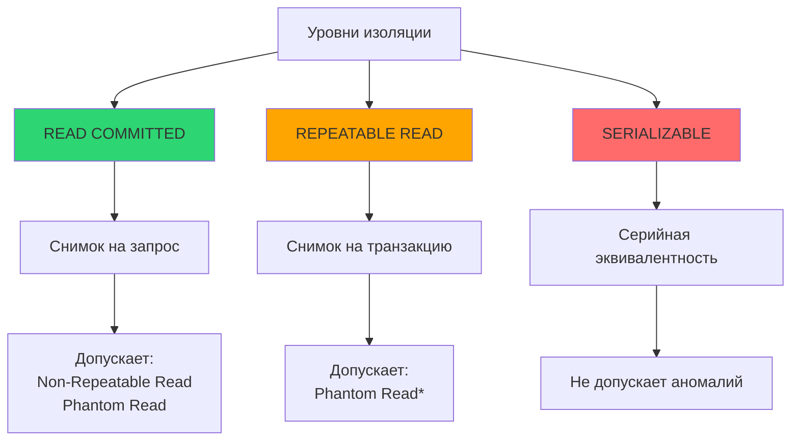

## Введение: Три кита изоляции транзакций

Уровни изоляции `READ COMMITTED`, `REPEATABLE READ` и `SERIALIZABLE` — это не просто пункты в документации СУБД. Это инструменты управления компромиссом между консистентностью данных и пропускной способностью системы.

Для инженера уровня Senior/Lead понимание различий между этими уровнями критично, потому что:
* Неправильный выбор уровня изоляции — частая причина тонких багов в продакшене (потерянные обновления, инконсистентные отчёты, фантомные чтения).
* Каждый уровень имеет разную «цену» в ресурсах: память, блокировки, конфликты сериализации.
* В Go вы должны явно управлять транзакциями, и знание механики изоляции помогает писать корректный код с обработкой ошибок и повторами.

В этой статье мы разберём каждый уровень изоляции не на уровне определений, а с привязкой к реализации в PostgreSQL и InnoDB, покажем примеры на Go и объясним, как выбор уровня влияет на производительность с точки зрения «механической симпатии».



\* В PostgreSQL `REPEATABLE READ` предотвращает и фантомные чтения благодаря предикатным блокировкам.

## READ COMMITTED: Снимок на каждый запрос

**READ COMMITTED** — уровень изоляции по умолчанию в большинстве СУБД (PostgreSQL, MySQL, Oracle). Он гарантирует, что транзакция видит только зафиксированные данные, но каждый запрос внутри транзакции может видеть новый снимок.

### Механика в PostgreSQL (MVCC)

1. При начале запроса (`SELECT`, `UPDATE`) СУБД создаёт «снимок» (snapshot) — набор активных на этот момент транзакций.
2. Видимость строки определяется по правилу:
   ```
   строка видима, если:
     (xmin < snapshot_xmin AND (xmax = 0 OR xmax >= snapshot_xmin))
   ```
   где `xmin` — ID транзакции, вставившей строку, `xmax` — удалившей.
3. Следующий запрос в той же транзакции создаёт новый снимок — и может увидеть изменения, зафиксированные другими транзакциями после предыдущего запроса.

> [!info] Под капотом
> В PostgreSQL снимок хранит три списка:
> * `xmin` — минимальный ID активной транзакции.
> * `xmax` — максимальный ID активной транзакции.
> * `xip[]` — массив ID активных транзакций в момент снимка.
> 
> Проверка видимости строки — это быстрая операция сравнения целых чисел, выполняемая без блокировок. Именно поэтому `READ COMMITTED` обеспечивает высокую параллельность чтений.

### Пример аномалии: Non-Repeatable Read

```sql
-- Транзакция 1
BEGIN; -- уровень READ COMMITTED
SELECT balance FROM accounts WHERE id = 1; -- вернёт 100

-- Транзакция 2 (параллельно)
BEGIN;
UPDATE accounts SET balance = 200 WHERE id = 1;
COMMIT;

-- Транзакция 1 (продолжение)
SELECT balance FROM accounts WHERE id = 1; -- вернёт 200! (изменение зафиксировано)
COMMIT;
```

### Пример в Go: когда READ COMMITTED достаточно

```go
// Сценарий: инкремент счётчика, где точная консистентность между чтениями не критична
func IncrementViewCount(ctx context.Context, db *sql.DB, articleID int64) error {
    _, err := db.ExecContext(ctx,
        "UPDATE articles SET views = views + 1 WHERE id = $1",
        articleID,
    )
    // При READ COMMITTED (уровень по умолчанию) это безопасно:
    // каждая операция атомарна на уровне строки, потерянные обновления маловероятны
    // благодаря атомарному UPDATE на стороне СУБД
    return err
}
```

> [!warning] Ловушка / Gotcha
> Если вы читаете значение, вычисляете новое на стороне Go и записываете обратно — `READ COMMITTED` не спасёт от потерянного обновления:

```go
// ОШИБОЧНО: гонка при любом уровне изоляции ниже SERIALIZABLE
var views int
err := db.QueryRowContext(ctx, "SELECT views FROM articles WHERE id = $1", id).Scan(&views)
// ... между SELECT и UPDATE другая транзакция может изменить views ...
_, err = db.ExecContext(ctx, "UPDATE articles SET views = $1 WHERE id = $2", views+1, id)
// Результат: одно из обновлений будет потеряно
```

Решение: использовать атомарные операции в SQL (`views = views + 1`) или явные блокировки (`FOR UPDATE`).

## REPEATABLE READ: Снимок на всю транзакцию

**REPEATABLE READ** гарантирует, что все запросы внутри одной транзакции видят один и тот же снимок данных — тот, который был актуален на момент первого запроса транзакции.

### Механика в PostgreSQL

1. При первом запросе в транзакции создаётся снимок (как в `READ COMMITTED`).
2. Все последующие запросы в этой транзакции используют тот же снимок — даже если другие транзакции зафиксировали изменения.
3. При попытке обновить строку, которая была изменена другой транзакцией после создания снимка, СУБД выбрасывает ошибку `serialization_failure` (в `SERIALIZABLE`) или блокирует до завершения конфликтующей транзакции (в `REPEATABLE READ`).

> [!info] Под капотом
> В PostgreSQL `REPEATABLE READ` предотвращает не только non-repeatable read, но и phantom read — благодаря механизму **предикатных блокировок** (predicate locking). Когда выполняется запрос с `WHERE`, СУБД запоминает предикат и при попытке другой транзакции вставить строку, удовлетворяющую этому предикату, возникает конфликт. Это реализовано через расширение системы снимков и не требует явных блокировок строк.

### Пример: консистентный отчёт в одной транзакции

```sql
-- Транзакция 1: формирование отчёта
BEGIN TRANSACTION ISOLATION LEVEL REPEATABLE READ;

-- Запрос 1: общая сумма заказов
SELECT SUM(total) FROM orders WHERE status = 'completed'; -- 10000

-- Транзакция 2 (параллельно)
BEGIN;
INSERT INTO orders (total, status) VALUES (500, 'completed');
COMMIT; -- новая запись зафиксирована

-- Транзакция 1: повторный запрос
SELECT SUM(total) FROM orders WHERE status = 'completed'; -- всё ещё 10000!
-- Новый заказ не виден, потому что снимок создан в начале транзакции

COMMIT;
```

### Пример в Go: расчёт с зависимыми запросами

```go
func CalculateOrderTotal(ctx context.Context, tx *sql.Tx, orderID int64) (decimal.Decimal, error) {
    // Гарантируем, что цены товаров не изменятся между запросами
    var subtotal decimal.Decimal
    err := tx.QueryRowContext(ctx, `
        SELECT SUM(price * quantity)
        FROM order_items
        WHERE order_id = $1
    `, orderID).Scan(&subtotal)
    if err != nil {
        return decimal.Zero, fmt.Errorf("calc subtotal: %w", err)
    }

    var discount decimal.Decimal
    err = tx.QueryRowContext(ctx, `
        SELECT COALESCE(SUM(amount), 0)
        FROM order_discounts
        WHERE order_id = $1 AND applied = true
    `, orderID).Scan(&discount)
    if err != nil {
        return decimal.Zero, fmt.Errorf("calc discount: %w", err)
    }

    return subtotal.Sub(discount), nil
}

// Использование
func ProcessOrder(ctx context.Context, db *sql.DB, orderID int64) error {
    tx, err := db.BeginTx(ctx, &sql.TxOptions{
        Isolation: sql.LevelRepeatableRead,
    })
    if err != nil {
        return err
    }
    defer func() { _ = tx.Rollback() }()

    total, err := CalculateOrderTotal(ctx, tx, orderID)
    if err != nil {
        return err
    }

    // ... дальнейшая логика с использованием total ...

    return tx.Commit()
}
```

> [!tip] Собеседование
> **Вопрос**: Может ли `REPEATABLE READ` в PostgreSQL привести к ошибке при обновлении строки?
> **Ответ**: Да. Если вы пытаетесь обновить строку, которая была изменена и зафиксирована другой транзакцией после создания вашего снимка, PostgreSQL выбросит ошибку `ERROR: could not serialize access due to concurrent update`. Это цена за строгую изоляцию: вы должны обработать эту ошибку повтором транзакции.

## SERIALIZABLE: Строгая серийная эквивалентность

**SERIALIZABLE** — самый строгий уровень изоляции. Он гарантирует, что результат параллельного выполнения транзакций эквивалентен некоторому последовательному выполнению этих же транзакций.

### Реализация в PostgreSQL: Serializable Snapshot Isolation (SSI)

PostgreSQL не использует пессимистические блокировки для `SERIALIZABLE`. Вместо этого применяется алгоритм **SSI**:

1. Транзакции выполняются как в `REPEATABLE READ` (со снимком).
2. СУБД отслеживает зависимости между транзакциями:
   * **Read-Write conflict**: транзакция T1 прочитала строку, которую позже изменила T2.
   * **Write-Read conflict**: T1 изменила строку, которую позже прочитала T2.
3. Если обнаруживается цикл зависимостей (T1 → T2 → T1), одна из транзакций откатывается с ошибкой `serialization_failure`.

> [!info] Под капотом
> SSI в PostgreSQL использует структуры в shared memory для отслеживания предикатов и конфликтов:
> * `PredicateLockTable` — хранит предикаты запросов.
> * `SerializableXact` — структура транзакции с полями `outConflict`, `inConflict` для графа зависимостей.
> 
> Проверка на циклы выполняется при `COMMIT` и имеет сложность O(n) по числу активных транзакций. Это накладывает ограничения на масштабируемость при высокой конкуренции.

### Пример: предотвращение lost update

```sql
-- Транзакция 1
BEGIN TRANSACTION ISOLATION LEVEL SERIALIZABLE;
SELECT balance FROM accounts WHERE id = 1; -- 100

-- Транзакция 2 (параллельно)
BEGIN TRANSACTION ISOLATION LEVEL SERIALIZABLE;
SELECT balance FROM accounts WHERE id = 1; -- 100 (снимок той же эпохи)

-- Транзакция 1
UPDATE accounts SET balance = 90 WHERE id = 1;
COMMIT; -- успешно

-- Транзакция 2
UPDATE accounts SET balance = 80 WHERE id = 1;
COMMIT; -- ERROR: could not serialize access due to read/write dependencies among transactions
```

Транзакция 2 откатывается, потому что она прочитала данные, которые были изменены уже зафиксированной транзакцией 1 — это создало бы аномалию при серийном выполнении.

### Паттерн ретрая в Go для SERIALIZABLE

```go
func RunWithRetry(ctx context.Context, db *sql.DB, maxAttempts int, 
    fn func(*sql.Tx) error) error {
    
    for attempt := 1; attempt <= maxAttempts; attempt++ {
        tx, err := db.BeginTx(ctx, &sql.TxOptions{
            Isolation: sql.LevelSerializable,
        })
        if err != nil {
            return fmt.Errorf("begin tx: %w", err)
        }
        
        if err := fn(tx); err != nil {
            _ = tx.Rollback()
            // Проверяем ошибку сериализации для PostgreSQL
            if pgErr, ok := err.(*pq.Error); ok && pgErr.Code == "40001" {
                // Экспоненциальная задержка перед повтором
                delay := time.Duration(1<<uint(attempt-1)) * 10 * time.Millisecond
                select {
                case <-time.After(delay):
                    continue
                case <-ctx.Done():
                    return ctx.Err()
                }
            }
            return err
        }
        
        if err := tx.Commit(); err != nil {
            if pgErr, ok := err.(*pq.Error); ok && pgErr.Code == "40001" && attempt < maxAttempts {
                delay := time.Duration(1<<uint(attempt-1)) * 10 * time.Millisecond
                time.Sleep(delay)
                continue
            }
            return fmt.Errorf("commit: %w", err)
        }
        return nil
    }
    return fmt.Errorf("max retry attempts exceeded")
}
```

> [!warning] Ловушка / Gotcha
> Не используйте `SERIALIZABLE` «на всякий случай». При высокой конкуренции частота ошибок `40001` может достигать 30-50%, что потребует множества ретраев и снизит пропускную способность. Начинайте с `READ COMMITTED`, добавляйте явные блокировки (`FOR UPDATE`) или оптимистический контроль версий (`version` колонка), и только если это невозможно — переходите к `SERIALIZABLE`.

## Сравнительная таблица: что предотвращает каждый уровень

| Аномалия | READ COMMITTED | REPEATABLE READ (PG) | SERIALIZABLE |
|----------|---------------|---------------------|--------------|
| Dirty Read | ✅ Предотвращает | ✅ Предотвращает | ✅ Предотвращает |
| Non-Repeatable Read | ❌ Допускает | ✅ Предотвращает | ✅ Предотвращает |
| Phantom Read | ❌ Допускает | ✅ Предотвращает* | ✅ Предотвращает |
| Lost Update | ❌ Допускает** | ✅ Предотвращает | ✅ Предотвращает |
| Write Skew | ❌ Допускает | ❌ Допускает | ✅ Предотвращает |

\* В стандартном SQL `REPEATABLE READ` не гарантирует защиту от фантомов, но PostgreSQL реализует это через предикатные блокировки.
\*\* В `READ COMMITTED` lost update предотвращается только если вы используете атомарные `UPDATE ... = ... + 1` или явные блокировки `FOR UPDATE`.

> [!tip] Собеседование
> **Вопрос**: Что такое Write Skew и почему `REPEATABLE READ` его не предотвращает?
> **Ответ**: Write Skew — аномалия, когда две транзакции читают пересекающийся набор данных, принимают решение на основе прочитанного и изменяют непересекающиеся подмножества. Пример: два врача дежурят, правило «хотя бы один должен быть на месте». Оба читают, что коллега на месте, оба уходят — правило нарушено. В `REPEATABLE READ` каждая транзакция видит свой снимок и не видит изменений другой, поэтому конфликт не детектируется. Только `SERIALIZABLE` с SSI обнаружит зависимость и откатит одну транзакцию.

## Механическая симпатия: цена изоляции на уровне железа

Выбор уровня изоляции влияет на утилизацию ресурсов не только в СУБД, но и в вашем Go-приложении.

### Память и кэш-линии
* В MVCC-системах старые версии строк занимают место в буферном пуле. Долгие транзакции в `REPEATABLE READ` удерживают снимок, предотвращая очистку версий — это приводит к:
  * Росту размера базы на диске (bloat).
  * Вытеснению «горячих» страниц из кэша L3 CPU.
  * Увеличению времени поиска по индексу (больше версий → больше страниц → больше промахов кэша).

### Дисковые операции и syscalls
* Каждый `COMMIT` при `synchronous_commit=on` вызывает `fsync()` — системный вызов, который сбрасывает кэш ядра ОС на диск.
* В `SERIALIZABLE` частые откаты из-за конфликтов означают, что вы платите стоимость `fsync()` за работу, которая не была зафиксирована.

### CPU и планировщик
* Проверка видимости строк в MVCC — это сравнение целых чисел (`xmin`, `xmax`), выполняемое за несколько тактов CPU. Но при высокой конкуренции:
  * Атомарные операции для управления блокировками (CAS) вызывают инвалидацию кэш-линий между ядрами (cache coherency traffic).
  * В Go, когда горутина ждёт ответа от БД, она паркуется, но соединение и блокировки в СУБД остаются занятыми — это ограничивает параллелизм на стороне базы.

> [!info] Под капотом
> При выполнении `SELECT ... FOR UPDATE` в `READ COMMITTED`:
> 1. PostgreSQL находит строку по индексу (B-Tree lookup, O(log n)).
> 2. Проверяет, не заблокирована ли она другой транзакцией (через `LockAcquire` в `procarray.c`).
> 3. Если заблокирована — процесс СУБД переходит в состояние `waiting`, а горутина в Go паркуется через `runtime.park`.
> 4. При освобождении блокировки ядро ОС будит процесс через `futex_wake`, и планировщик Go возвращает горутину в очередь runnable.
> 
> Это означает, что даже «ожидание» потребляет ресурсы: память под структуру `PGPROC`, дескриптор сокета, место в очереди планировщика Go. При тысячах параллельных запросов это становится узким местом.

## Практические рекомендации: как выбрать уровень

### Используйте `READ COMMITTED`, если:
* Ваша логика допускает, что данные могут измениться между запросами.
* Вы используете атомарные операции в SQL (`UPDATE ... = ... + 1`).
* Вам важна максимальная пропускная способность.
* Вы явно обрабатываете конфликты через оптимистический контроль версий.

```go
// Оптимистический контроль версий: альтернатива строгой изоляции
func UpdateWithVersion(ctx context.Context, db *sql.DB, id int64, newValue string, version int) error {
    res, err := db.ExecContext(ctx,
        "UPDATE items SET value = $1, version = version + 1 WHERE id = $2 AND version = $3",
        newValue, id, version,
    )
    if err != nil {
        return err
    }
    if rows, _ := res.RowsAffected(); rows == 0 {
        return fmt.Errorf("optimistic lock failed: version mismatch")
    }
    return nil
}
```

### Используйте `REPEATABLE READ`, если:
* Вы выполняете несколько зависимых запросов, и результат второго зависит от первого.
* Вам критично избежать lost update без явных блокировок.
* Вы работаете с финансовыми операциями, где важна согласованность снимка данных.

### Используйте `SERIALIZABLE`, если:
* Вы не можете допустить ни одной аномалии параллелизма.
* Конфликты транзакций редки (<5% запросов).
* Вы готовы реализовать логику ретрая с экспоненциальной задержкой.

## Итог

1. **READ COMMITTED**: снимок на запрос, высокая производительность, допускает non-repeatable read и phantom read. Подходит для большинства OLTP-сценариев с атомарными операциями.
2. **REPEATABLE READ**: снимок на транзакцию, предотвращает non-repeatable read и (в PostgreSQL) phantom read. Требует обработки ошибок при обновлении «устаревших» строк.
3. **SERIALIZABLE**: строгая серийная эквивалентность через SSI, предотвращает все аномалии, но может часто откатывать транзакции при конкуренции. Требует паттерна ретрая.
4. **В Go**: всегда обрабатывайте ошибки сериализации, используйте `defer` для отката, явно передавайте `*sql.Tx`, избегайте чтения-вычисления-записи без блокировок.
5. **Производительность**: каждый уровень имеет цену в памяти, диске и CPU. Профилируйте с `pprof` и `EXPLAIN ANALYZE`, а не выбирайте уровень «на глаз».

Понимание уровней изоляции — это только половина картины. Чтобы писать надёжный код, нужно также знать, какие именно аномалии они предотвращают и как они проявляются в реальных сценариях.

В следующей статье мы детально разберём конкретные аномалии параллельного выполнения: [[4. Dirty Read, Phantom Read, Lost Update]], и покажем, как воспроизвести их в тестах и защитить своё приложение.
