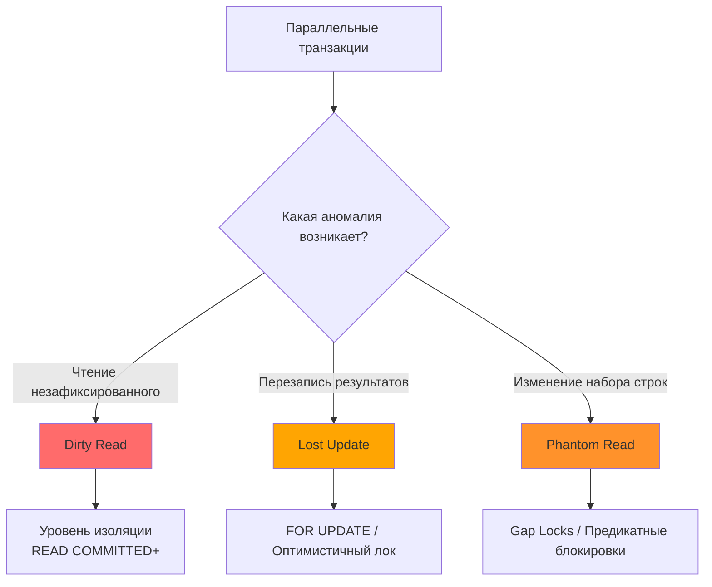

## Введение: Аномалии конкурентного доступа к данным

Когда несколько горутин одновременно работают с одной и той же базой данных, СУБД должна обеспечить предсказуемое поведение. Если уровень изоляции выбран неверно или блокировки не расставлены, возникают аномалии параллелизма. Они редко проявляются в локе, но регулярно приводят к тихой коррупции данных, финансовым расхождениям и сложным гонкам в продакшене.

Для инженера уровня Senior/Lead умение распознавать и предотвращать эти аномалии — обязательный навык. В этой статье мы разберём три классические проблемы: `Dirty Read`, `Lost Update` и `Phantom Read`. Мы покажем, как они возникают на уровне страниц данных и версий строк, как их воспроизвести в тестах, и какие идиоматичные паттерны в Go гарантируют безопасность.



## 1. Dirty Read: Чтение «грязных» данных

**Определение:** Транзакция читает данные, которые были изменены другой транзакцией, но ещё не зафиксированы. Если вторая транзакция выполнит `ROLLBACK`, первая транзакция окажется с данными, которых официально никогда не существовало.

### Механика возникновения

В системах, основанных на блокировках, `Dirty Read` возможен, если читатель не запрашивает разделяющую блокировку (`Shared Lock`), а писатель не ожидает её освобождения. В MVCC-системах это означало бы чтение «черновика» версии строки до того, как транзакция-автор получила `commit lsn`.

> [!warning] Ловушка / Gotcha
> Современные СУБД практически не позволяют `Dirty Read` в продакшене. 
> * В PostgreSQL `READ UNCOMMITTED` явно отображается на `READ COMMITTED`. Грязное чтение невозможно архитектурно.
> * В MySQL/InnoDB `READ UNCOMMITTED` технически существует, но используется крайне редко, так как ломает консистентность бинлогов и усложняет репликацию.
> **Практический вывод:** Не тратьте время на защиту от `Dirty Read`. Уровень `READ COMMITTED` (по умолчанию) уже его предотвращает.

### Как это выглядит в запросах

```sql
-- Транзакция 1
BEGIN;
UPDATE accounts SET balance = 500 WHERE id = 1; -- было 1000
-- Коммит ещё не выполнен!

-- Транзакция 2 (в режиме READ UNCOMMITTED, если бы он работал)
SELECT balance FROM accounts WHERE id = 1; -- вернёт 500

-- Транзакция 1
ROLLBACK; -- баланс вернулся к 1000

-- Транзакция 2 приняла решение на основе 500, которое больше не валидно.
```

## 2. Lost Update: Потерянное обновление

**Определение:** Две транзакции читают одно и то же значение, независимо вычисляют новое и записывают его. Результат второй транзакции полностью перезаписывает изменения первой. Первая транзакция «не замечает», что её работа была утеряна.

### Механика на уровне версий строк

Это самая коварная аномалия, потому что она **не нарушает стандарт SQL для `READ COMMITTED` или `REPEATABLE READ`**, если разработчик явно не просит защиту.

1. Транзакция A читает строку `X` (версия `v1`, значение `100`).
2. Транзакция B читает строку `X` (версия `v1`, значение `100`).
3. Транзакция A вычисляет `100 + 10 = 110`, создаёт версию `v2`, фиксирует.
4. Транзакция B вычисляет `100 - 20 = 80`, создаёт версию `v3`, фиксирует.
5. Строка `X` теперь содержит `80`. Обновление `+10` от транзакции A безвозвратно потеряно.

СУБД не видит конфликта, потому что обе транзакции работали с валидными снимками и применяли изменения к разным версиям. Это классическая проблема логики приложения, а не бага СУБД.

> [!info] Под капотом
> В PostgreSQL при создании новой версии строки (`heap_insert` в `heapam.c`) проверяется только то, что строка не была удалена другой транзакцией. Проверки «а меняло ли это поле кто-то ещё после моего чтения» по умолчанию нет. Отсюда необходимость явного контроля.

### Идиоматичное предотвращение в Go

Существует два промышленно принятых подхода:

#### 1. Пессимистическая блокировка (`SELECT ... FOR UPDATE`)

```go
func IncrementBalance(ctx context.Context, db *sql.DB, accountID int64, delta int) error {
    tx, err := db.BeginTx(ctx, &sql.TxOptions{Isolation: sql.LevelReadCommitted})
    if err != nil {
        return fmt.Errorf("begin tx: %w", err)
    }
    defer func() { _ = tx.Rollback() }()

    var currentBalance int
    // Блокировка строки на запись до конца транзакции
    err = tx.QueryRowContext(ctx, 
        "SELECT balance FROM accounts WHERE id = $1 FOR UPDATE", accountID,
    ).Scan(&currentBalance)
    if err != nil {
        return fmt.Errorf("select for update: %w", err)
    }

    _, err = tx.ExecContext(ctx,
        "UPDATE accounts SET balance = $1 WHERE id = $2",
        currentBalance + delta, accountID,
    )
    if err != nil {
        return fmt.Errorf("update balance: %w", err)
    }

    return tx.Commit()
}
```
`FOR UPDATE` устанавливает эксклюзивную блокировку строки. Любая вторая транзакция, пытающаяся выполнить `SELECT ... FOR UPDATE` или `UPDATE` на эту строку, будет поставлена в очередь ядра ОС до `COMMIT`/`ROLLBACK` первой.

#### 2. Оптимистическая блокировка (Версионирование)

Идеально для сценариев с высокой читаемостью и редкими конфликтами записи.

```go
type Account struct {
    ID      int64
    Balance int
    Version int
}

func UpdateBalanceOptimistic(ctx context.Context, db *sql.DB, acc Account, newBalance int) error {
    res, err := db.ExecContext(ctx, `
        UPDATE accounts 
        SET balance = $1, version = version + 1 
        WHERE id = $2 AND version = $3
    `, newBalance, acc.ID, acc.Version)
    if err != nil {
        return fmt.Errorf("update: %w", err)
    }
    
    rows, err := res.RowsAffected()
    if err != nil {
        return err
    }
    if rows == 0 {
        return fmt.Errorf("optimistic lock conflict: version mismatch")
    }
    return nil
}
```
СУБД проверяет условие `WHERE version = $3`. Если строка уже обновлена, `RowsAffected()` вернёт `0`. Приложение обрабатывает это как конфликт и решает: повторить транзакцию, вернуть ошибку клиенту или применить стратегию «последний победитель».

> [!tip] Собеседование
> **Вопрос:** Почему `UPDATE accounts SET balance = balance + $1 WHERE id = $2` в `READ COMMITTED` не приводит к `Lost Update`?
> **Ответ:** Потому что это атомарная операция на стороне СУБД. Движок баз данных сам считывает текущую версию строки внутри исполняемого плана, применяет `+ $1` и записывает результат. Нет этапа «чтение в приложение -> вычисление -> запись», который создаёт окно гонки. Используйте SQL-арифметику, где это возможно.

## 3. Phantom Read: Фантомное чтение

**Определение:** Транзакция дважды выполняет запрос с одним и тем же предикатом `WHERE`, но получает разный набор строк, потому что другая параллельная транзакция вставила или удалила строки, удовлетворяющие условию.

### Механика: Почему блокировки строк не помогают

Блокировка строк (`FOR UPDATE`) защищает только **существующие** строки. Она не блокирует вставку новых строк в диапазон, который покрывает ваш `WHERE`.

```sql
-- Транзакция 1: подсчёт активных заказов
BEGIN ISOLATION LEVEL READ COMMITTED;
SELECT COUNT(*) FROM orders WHERE status = 'new'; -- вернёт 10

-- Транзакция 2 (параллельно)
INSERT INTO orders (status, amount) VALUES ('new', 5000);
COMMIT;

-- Транзакция 1: повторный подсчёт
SELECT COUNT(*) FROM orders WHERE status = 'new'; -- вернёт 11!
-- Строка "появилась из ниоткуда" — фантом.
```

### Как СУБД предотвращают фантомов

| СУБД | Механизм в REPEATABLE READ | Механизм в SERIALIZABLE |
|------|---------------------------|-------------------------|
| **PostgreSQL** | Snapshot Isolation: новые строки имеют `xmin > snapshot_xmin`, поэтому невидимы. Фантомы невозможны. | Predicate Locks: СУБД запоминает предикат запроса. Если другая транзакция вставляет строку, удовлетворяющую предикату, возникает конфликт сериализации. |
| **MySQL/InnoDB** | Next-Key Locking: блокировка записи + блокировка промежутка (Gap Lock) между индексами. Вставка в заблокированный диапазон ставится в очередь. | Аналогично Next-Key, но с более строгими проверками конфликтов. |

> [!info] Под капотом
> **Gap Lock в InnoDB:** Если индекс содержит значения `[10, 20, 30]`, запрос `WHERE id > 15` заблокирует не только строку `20` и `30`, но и «промежуток» между `10` и `20`, а также после `30`. Любая попытка вставить `15` или `25` будет ждать. Это предотвращает фантомов, но может резко снизить пропускную способность вставки в нагруженных системах.

### Практика в Go: Отчёты и агрегации

Если вы формируете отчёт в несколько шагов, `READ COMMITTED` даст несогласованные цифры. Используйте `REPEATABLE READ`:

```go
func GenerateFinancialReport(ctx context.Context, db *sql.DB, date time.Time) (Report, error) {
    // Гарантируем неизменность снимка на время всего отчёта
    tx, err := db.BeginTx(ctx, &sql.TxOptions{Isolation: sql.LevelRepeatableRead})
    if err != nil {
        return Report{}, fmt.Errorf("begin tx: %w", err)
    }
    defer func() { _ = tx.Rollback() }()

    var income, expenses decimal.Decimal
    _ = tx.QueryRowContext(ctx, "SELECT SUM(amount) FROM transactions WHERE type='in' AND date=$1", date).Scan(&income)
    _ = tx.QueryRowContext(ctx, "SELECT SUM(amount) FROM transactions WHERE type='out' AND date=$1", date).Scan(&expenses)
    
    if err := tx.Commit(); err != nil {
        return Report{}, fmt.Errorf("commit report: %w", err)
    }
    return Report{Income: income, Expenses: expenses}, nil
}
```

## 4. Механическая симпатия: Цена блокировок и версий на уровне железа

Понимание аномалий бесполезно без оценки их стоимости для инфраструктуры.

### Кэш-линии CPU и False Sharing
При использовании `FOR UPDATE` СУБд часто хранит состояния блокировок в общих структурах памяти. Если два ядра CPU одновременно пытаются захватить или проверить блокировки для строк, находящихся на одной странице данных, происходит **invalidation cache lines** через протокол MESI. Это приводит к «шторму» когерентности шины, и ядра простаивают в ожидании обновления кэша.

### Влияние на пул соединений в Go
Когда горутина выполняет `SELECT ... FOR UPDATE` и попадает в очередь блокировки:
1. Драйвер `database/sql` блокирует вызов в тред ОС.
2. Планировщик Go переводит горутину в состояние `waiting`.
3. Соединение из пула **остаётся занятым**. Оно не возвращается в `idle` пул.
4. Если у вас `SetMaxOpenConns(20)`, и 20 горутин ждут блокировки в БД, любые новые запросы к этой БД получат `sql: connection pool timeout`, даже если CPU базы простаивает.

**Решение:** Ограничивайте время ожидания блокировки на уровне драйвера или приложения, используйте таймауты контекста:
```go
ctx, cancel := context.WithTimeout(ctx, 2*time.Second)
defer cancel()
// ... QueryRowContext(ctx, "... FOR UPDATE")
```

### MVCC и локальность данных
В системах с MVCC `Lost Update` предотвращается хранением множества версий строк. Это размазывает логически связанные данные по разным страницам в `shared_buffers`. При чтении «горячей» строки СУБД может загрузить в кэш L3 CPU страницу, содержащую 5 старых версий и 1 новую. Это снижает эффективность предвыборки (prefetching) и увеличивает `cache miss rate` при сканировании диапазонов.

> [!tip] Собеседование
> **Вопрос:** Как `Gap Lock` влияет на параллелизм вставок?
> **Ответ:** Он сериализует вставки в определённый диапазон индексов. Если у вас высокая частота вставок с монотонно растущим `AUTO_INCREMENT` или `UUID`, и одновременно идут запросы с `WHERE id > X`, возникнет очередь на вставку. В высоконагруженных системах это решается шардированием или использованием `SKIP LOCKED` для фоновой обработки.

## 5. Итог и стратегия выбора

1. **Dirty Read** — решается автоматически переходом на `READ COMMITTED`. Не требует внимания в современных СУБД.
2. **Lost Update** — самая опасная аномалия для бизнес-логики. Решается:
   * Атомарными `UPDATE col = col + val` (предпочтительно).
   * `SELECT ... FOR UPDATE` (для сложных вычислений в Go).
   * Оптимистическим версионированием (`version` столбец).
3. **Phantom Read** — критичен для отчётов и агрегаций. Решается `REPEATABLE READ` (snapshot isolation) или `SERIALIZABLE` (predicate locks).
4. **Архитектурный совет:** Начинайте с `READ COMMITTED`. Добавляйте явные блокировки только там, где доказана гонка. Избегайте `SERIALIZABLE` в высоконагруженных OLTP-путях, используйте его для критичных финансовых расчётов с редкими транзакциями.

Понимание того, как блокировки реализованы внутри СУБД, — следующий шаг к проектированию стабильных систем. В следующей статье мы детально разберём типы блокировок, их гранулярность и алгоритмы обнаружения взаимных блокировок: [[5. Блокировки. Locking]].
