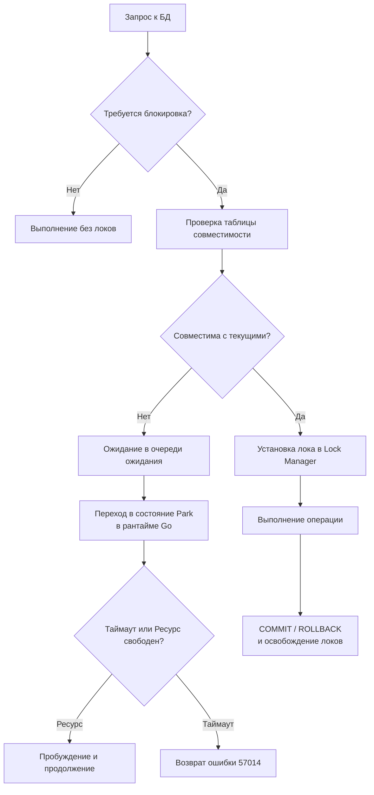

## Введение: Блокировки как фундамент координации в БД

Блокировки (Locks) — это примитивы синхронизации на уровне СУБД, которые гарантируют корректность данных при конкурентном доступе. Если в предыдущих статьях мы рассматривали уровни изоляции как абстрактные гарантии, то блокировки — это их физическая реализация в памяти движка базы данных.

Для архитектора и старшего инженера понимание механики блокировок критично, потому что:
* Они определяют реальную пропускную способность системы под нагрузкой, а не на синтетических тестах.
* Неверное расставление или эскалация блокировок — главная причина каскадных таймаутов и отказа микросервисов.
* В Go вы управляете транзакциями явно, и знание того, как драйвер и СУБД взаимодействуют через сокеты и пул соединений, позволяет избежать скрытых дедлоков и истощения ресурсов.

В этой статье мы разберём классификацию блокировок, их внутреннее представление в памяти движков, влияние на кэш-линии CPU и системные вызовы ОС, а также покажем идиоматичные паттерны работы с локами в Go.



## 1. Классификация блокировок: Режимы и гранулярность

Блокировки в реляционных СУБД характеризуются двумя параметрами: **режимом доступа** и **гранулярностью**.

### Режимы блокировок
* **Shared (S)**: Разделяющая блокировка. Ставится при `SELECT`. Несколько транзакций могут одновременно держать `S`-лок на одном ресурсе. Запрещает `X`-локи.
* **Exclusive (X)**: Исключительная блокировка. Ставится при `INSERT`, `UPDATE`, `DELETE` или `SELECT ... FOR UPDATE`. Только одна транзакция может держать `X`-лок. Запрещает любые другие локи.
* **Intent (IS, IX, SIX)**: Интенциональные блокировки. Это «флаги» на уровнях таблицы или страницы, которые сообщают менеджеру блокировок: «Я планирую взять более детальный лок внутри этой структуры». Они предотвращают конфликты между разными гранулярностями (например, блокировкой всей таблицы и блокировкой отдельной строки внутри неё).

### Гранулярность
| Уровень | Когда применяется | Стоимость удержания |
|---------|-------------------|---------------------|
| **Строка** | `UPDATE ... WHERE id=1`, `FOR UPDATE` | Минимальная. Максимальный параллелизм. |
| **Страница** | При обновлении множества строк на одной 8КБ странице | Средняя. В PostgreSQL не используется явно, в InnoDB — как промежуточный этап. |
| **Таблица** | `ALTER TABLE`, массовые операции без индексов, DDL | Высокая. Полная сериализация доступа к объекту. |
| **Gap / Next-Key** | `WHERE range`, индексы в InnoDB | Защищает диапазоны от фантомов. Замедляет `INSERT` в соседние диапазоны. |

> [!info] Под капотом
> В PostgreSQL менеджер блокировок (`LockManager`) использует хэш-таблицы в разделяемой памяти (`shmem`). Ключом хэша является идентификатор объекта (`relfilenode`, `blockno`, `offset`), а значением — структура `LOCK`, содержащая массив счётчиков для каждого режима (`sharedLocks[]`, `exclusiveLocks[]`). При проверке совместимости выполняется побитовое И (`&`) матрицы совместимости, что занимает считанные такты CPU.

## 2. Механика: Эскалация и управление памятью

Эскалация блокировок — это автоматическое преобразование множества мелких блокировок (например, строк) в одну крупную (таблицы). Это происходит, когда СУБД превышает лимит памяти, выделенный под таблицы блокировок, или когда число удерживаемых локов превышает порог (обычно ~5000 на одну транзакцию в SQL Server, в PostgreSQL/MySQL эскалация ручная или происходит через `VACUUM`/`autovacuum` косвенно).

**Почему эскалация опасна:**
* Она блокирует весь объект, убивая параллелизм.
* В Go это мгновенно приводит к таймаутам в пуле соединений, так как остальные горутины ждут освобождения таблицы, а не строки.

> [!warning] Ловушка / Gotcha
> В PostgreSQL явной автоматической эскалации нет по архитектурным причинам (используется MVCC, а не чистые локи на чтение). Но в MySQL/InnoDB при очень длинных транзакциях или массовых `UPDATE` без индексов может произойти блокировка таблицы или индекса, что выглядит как зависание. Всегда добавляйте `LIMIT` и используйте индексированные поля в `WHERE` для массовых изменений.

## 3. Механическая симпатия: Цена блокировок для железа и ОС

Блокировки в СУБД — это не абстракция. Они материально влияют на производительность процессора, памяти и операционной системы.

### Кэш-линии CPU и False Sharing
Менеджер блокировок хранит счётчики удерживаемых локов в общих структурах памяти. Когда два ядра CPU одновременно пытаются проверить или изменить статус блокировки для разных строк, но находящихся в одной кэш-линии (64 байта), срабатывает протокол когерентности `MESI`. Кэш-линия постоянно переключается между состояниями `Modified` и `Invalid` на разных ядрах. Это называется **False Sharing** и может снизить пропускнуюжность транзакций на 30-50%, даже если сами строки не конфликтуют.

### Системные вызовы и парковка тредов
Когда транзакция в БД не может получить лок, она не «крутится» в цикле. Она ставится в очередь ожидания (`Lock Wait Queue`) и переходит в состояние сна.
1. На стороне СУБД: процесс/поток вызывает `epoll_wait` или `futex` для засыпания.
2. На стороне Go-драйвера: вызов блокируется на уровне сетевого `read()`. Тред ОС паркуется.
3. Рантайм Go переводит горутину в статус `waiting`.
4. При снятии блокировки СУБД пишет в сокет, ядро ОС будит тред через прерывание сетевого контроллера, и планировщик Go переносит горутину обратно в `runnable`.

Каждое такое пробуждение стоит тысячи тактов. При тысячах одновременных блокировок переключение контекста становится основным потребителем ресурсов.

## 4. Практика в Go: Идиоматичные паттерны работы с локами

В промышленном коде `SELECT ... FOR UPDATE` используется редко и только там, где это оправдано. Чаще применяются его оптимизированные вариации.

### Паттерн 1: SKIP LOCKED для фоновых воркеров
Идеально для очередей задач, отложенных писем или обработки чанков данных. Горутина берёт только те строки, которые сейчас никем не заблокированы, и не ждёт.

```go
func ProcessNextTask(ctx context.Context, db *sql.DB) error {
    tx, err := db.BeginTx(ctx, nil)
    if err != nil {
        return fmt.Errorf("begin tx: %w", err)
    }
    defer func() { _ = tx.Rollback() }()

    var taskID int64
    var payload string
    // Берём первую доступную задачу, пропуская уже обрабатываемые другими воркерами
    err = tx.QueryRowContext(ctx, `
        SELECT id, data FROM tasks 
        WHERE status = 'pending' 
        ORDER BY created_at ASC 
        LIMIT 1 FOR UPDATE SKIP LOCKED
    `).Scan(&taskID, &payload)
    
    if err == sql.ErrNoRows {
        return nil // Нет доступных задач
    }
    if err != nil {
        return fmt.Errorf("query task: %w", err)
    }

    _, err = tx.ExecContext(ctx, "UPDATE tasks SET status = 'processing' WHERE id = $1", taskID)
    if err != nil {
        return err
    }
    
    return tx.Commit()
}
```

### Паттерн 2: NOWAIT для быстрой реакции
Если лок занят, не ждать, а сразу вернуть управление приложению для повторной попытки или возврата ошибки клиенту.

```go
func ReserveItem(ctx context.Context, db *sql.DB, itemID int64) error {
    // В PostgreSQL
    _, err := db.ExecContext(ctx, 
        "SELECT 1 FROM inventory WHERE id = $1 FOR UPDATE NOWAIT", itemID)
    if err != nil {
        if pgErr, ok := err.(*pq.Error); ok && pgErr.Code == "55P03" {
            return fmt.Errorf("item currently locked by another process: %w", err)
        }
        return fmt.Errorf("reserve check: %w", err)
    }
    // Логика резервирования...
    return nil
}
```

> [!tip] Собеседование
> **Вопрос:** В чём разница между `NOWAIT` и таймаутом контекста `context.WithTimeout`?
> **Ответ:** `NOWAIT` проверяет доступность лока мгновенно на стороне СУБД и сразу возвращает ошибку `lock not available`. Контекстный таймаут работает на уровне клиента/драйвера: горутина ждёт ответа от сети, пока не истечёт таймер, и только потом разрывает соединение. `NOWAIT` экономит ресурсы пула соединений и ядра ОС, так как не создаёт ожидание. Для высоконагруженных систем предпочтительнее `NOWAIT` + повтор на уровне приложения.

## 5. Разница между блокировками в БД и sync.Mutex в Go

Многие разработчики проводят прямую параллель между `FOR UPDATE` и `sync.Mutex`. Это опасно.

| Характеристика | `sync.Mutex` (Go) | `FOR UPDATE` (PostgreSQL/MySQL) |
|----------------|-------------------|---------------------------------|
| Область видимости | Один процесс, одна память | Кластер, несколько процессов, реплики |
| При падении процесса | Мьютекс остаётся залоченным (паника/дедлок) | СУБД автоматически снимает лок при закрытии соединения |
| Стоимость захвата | Атомарная инструкция CPU (CAS) | Сетевой запрос, хэш-таблица локов, возможен `futex` |
| Приоритеты | FIFO / Spinlock | Зависит от реализации (часто FIFO, но может быть starvation) |

> [!info] Под капотом
> Если ваше Go-приложение упаёт с `SIGKILL`, `sync.Mutex` потеряется, и следующая горутина зависнет навсегда. Если сетевое соединение оборвётся, СУБД увидит `TCP RST` или `TCP FIN`, отметит транзакцию как `aborted` и мгновенно освободит все локи в `LockManager`. Это гарантирует **автоматическую очистку ресурсов**, что невозможно в pure-Go без дополнительных демонов-наблюдателей.

## Итог

1. **Режимы локов** (`S`, `X`, `Intent`) образуют матрицу совместимости. Понимание матрицы помогает предсказывать конфликты.
2. **Гранулярность** определяет параллелизм. Стремитесь к строковым локам, избегайте блокировок целых таблиц.
3. **Железо и ОС**: Локи вызывают `False Sharing` кэш-линий, используют `futex` для ожидания и паркут горутины в рантайме Go. Это дорого при массовых ожиданиях.
4. **Идиомы в Go**: Используйте `SKIP LOCKED` для конкурентной обработки очередей, `NOWAIT` для отказов от ожидания, и всегда контролируйте время жизни транзакции через контекст.
5. **Отличие от мьютексов**: Локи БД устойчивы к краху процессов и работают на уровне кластера, но имеют сетевую и дисковую цену захвата.

Блокировки неизбежно приводят к ситуациям, когда две транзакции ждут друг друга бесконечно. В следующей статье мы разберём механизм обнаружения, алгоритмы разрешения этих ситуаций и стратегии проектирования систем, устойчивых к взаимным блокировкам: [[6. Deadlock и их предотвращение]].
