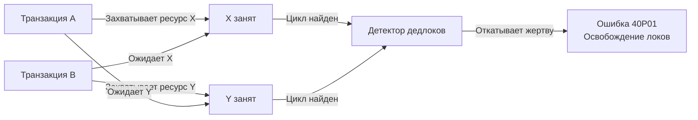

## Введение: Циклическая зависимость как неизбежность

Дедлок (взаимная блокировка) — это состояние, при котором две или более транзакции бесконечно ожидают ресурсы, удерживаемые друг другом. В отличие от таймаутов или ошибок соединения, дедлок не разрешается самостоятельно. Если СУБД не вмешается, система окажется в состоянии ливлока или полного зависания пула соединений.

Для инженера уровня Senior/Lead дедлоки — это не «баги базы», а симптом архитектурных или логических ошибок в коде приложения. Понимание механики их возникновения, алгоритмов обнаружения и стратегий предотвращения позволяет:
* Проектировать транзакционные контуры, устойчивые к высокой конкуренции.
* Писать отказоустойчивый код на Go с детерминированным поведением при конфликтах.
* Избегать каскадных отказов микросервисов, когда один зависший запрос блокирует весь пул.

## Механика возникновения: Граф ожидания

Классический сценарий дедлока требует четырёх условий (условия Коффмана):
1. **Взаимное исключение**: ресурс может удерживаться только одной транзакцией.
2. **Удержание и ожидание**: транзакция держит один ресурс и ждёт другой.
3. **Отсутствие вытеснения**: ресурс нельзя принудительно отобрать.
4. **Циклическое ожидание**: образуется замкнутая цепочка зависимостей.



В СУБД эти зависимости моделируются как **ориентированный граф ожидания (Wait-For Graph)**. Вершины — транзакции, рёбра — зависимости «ждёт». Появление цикла в графе = дедлок.

## Детектор дедлоков: Как СУБД «видит» круги

Проверка на циклы — дорогая операция. Если запускать её при каждой постановке транзакции в очередь ожидания, накладные расходы съедят всю производительность. Поэтому СУБД используют таймаутный или гибридный подход.

> [!info] Под капотом
> **PostgreSQL**: Фоновый процесс проверяет граф ожидания с интервалом `deadlock_timeout` (по умолчанию 1 секунда). При обнаружении цикла выбирается «жертва» — транзакция, откат которой требует наименьших затрат (обычно та, что выполнила меньше изменений, или находится в конце цепочки). Процесс завершается кодом `40001` (в `SERIALIZABLE`) или `40P01` (в стандартных режимах).
> 
> **MySQL/InnoDB**: Детектор запускается автоматически, как только транзакция ожидает блокировку дольше определённого порога. InnoDB анализирует `innodb_lock_waits` и выбирает жертву по объёму отката (меньший `UNDO` log wins).

### Выбор жертвы
СУБД не использует случайность. Алгоритм минимизирует:
* Объём `UNDO`-лога, который нужно применить.
* Время, потраченное транзакцией на выполнение.
* Вероятность повторного дедлока при ретрае (иногда выбирается транзакция, удерживающая более «горячие» ресурсы, чтобы разорвать узкий место).

## Механическая симпатия: Цена обнаружения для ОС и рантайма Go

Дедлок влияет не только на базу, но и на ваше Go-приложение на системном уровне.

### Память пула соединений
Когда горутина попадает в ожидание лока, соединение `database/sql` **не возвращается в пул**. Оно остаётся в состоянии `idle in transaction` или `active` на стороне СУБД. Если `SetMaxOpenConns(20)` и 20 горутин ждут разблокировки, пул исчерпается. Следующие запросы получат `sql: connection pool exhausted`, даже если CPU и диск сервера БД простаивают.

### Системные вызовы и парковка
Ожидание лока реализовано через `futex` (Linux) или `WaitForSingleObject` (Windows). Тред ОС, обслуживающий горутину, переходит в состояние `TASK_INTERRUPTIBLE` и выходит из планировщика. Когда детектор откатывает транзакцию-жертву:
1. СУБД закрывает соединение или отправляет `TCP RST` / ошибку в сокет.
2. Ядро ОС будит ждущий тред.
3. Рантайм Go переводит горутину из `waiting` в `runnable`.
4. Планировщик выделяет тред ОС для выполнения откатанной ветки.

Этот путь контекстных переключений стоит ~5-10 мкс на переход, но при сотнях дедлоков в секунду накладные расходы на пробуждение тредов и очистку структур `PGPROC` становятся заметными.

### Кэш-линии CPU
Обход графа ожидания детектором требует чтения множества указателей в `shmem`. При высокой конкуренции это вызывает промахи кэша (`cache misses`) и загрязнение `L3`, так как данные о локах разбросаны по разделяемой памяти и редко попадают в предвыборку.

## Предотвращение и стратегии в Go

Дедлоки нельзя устранить полностью в распределённой системе, но можно свести вероятность к минимуму и сделать реакцию детерминированной.

1. **Канонический порядок блокировок**
   Всегда запрашивайте ресурсы в одинаковой последовательности. Если транзакции `A` и `B` всегда лочат строки в порядке возрастания `ID`, цикл невозможен.
   ```go
   // Всегда сортируем входные данные перед блокировкой
   sort.Slice(ids, func(i, j int) bool { return ids[i] < ids[j] })
   for _, id := range ids {
       // FOR UPDATE в отсортированном порядке
   }
   ```

2. **Минимизация времени удержания**
   Не выполняйте внешние вызовы (HTTP, RPC, тяжелые вычисления) внутри транзакции. Чем короче окно между `BEGIN` и `COMMIT`, тем меньше шанс пересечения с другой транзакцией.

3. **Явные таймауты и NOWAIT**
   Не позволяйте транзакциям ждать бесконечно. Используйте `lock_timeout` на стороне СУБД или контекстные таймауты в Go.
   ```go
   // Установка таймаута ожидания лока на уровне сессии
   _, err := tx.ExecContext(ctx, "SET LOCAL lock_timeout = '200ms'")
   ```

4. **Паттерн ретрая с экспоненциальной задержкой**
   ```go
   func ExecuteWithDeadlockRetry(ctx context.Context, db *sql.DB, maxRetries int, 
       fn func(context.Context, *sql.Tx) error) error {
       
       for attempt := 0; attempt <= maxRetries; attempt++ {
           tx, err := db.BeginTx(ctx, nil)
           if err != nil {
               return fmt.Errorf("begin tx: %w", err)
           }
           
           if err := fn(ctx, tx); err != nil {
               _ = tx.Rollback()
               // Проверяем код дедлока PostgreSQL
               if pgErr, ok := err.(*pq.Error); ok && pgErr.Code == "40P01" {
                   delay := time.Duration(1<<uint(attempt)) * 50 * time.Millisecond
                   select {
                   case <-time.After(delay):
                       continue
                   case <-ctx.Done():
                       return ctx.Err()
                   }
               }
               return err
           }
           return tx.Commit()
       }
       return fmt.Errorf("max retries exceeded after deadlocks")
   }
   ```

> [!warning] Ловушка / Gotcha
> Ретрай дедлока безопасен только если транзакция **идемпотентна**. Если внутри транзакции вы вызываете внешний сервис (например, отправку письма), повторное выполнение приведёт к дублированию. Всегда выносите сайд-эффекты за пределы транзакции или используйте паттерн `Outbox`.

> [!tip] Собеседование
> **Вопрос:** В чём разница между `deadlock_timeout` и `statement_timeout`?
> **Ответ:** `statement_timeout` ограничивает общее время выполнения запроса. Если запрос выполняется дольше, он принудительно завершается с ошибкой, даже если дедлока нет. `deadlock_timeout` — это задержка перед запуском детектора циклов. Он не убивает запрос, а лишь инициирует проверку на взаимную блокировку. Установка `deadlock_timeout` в 0 отключает детектор, что приведёт к вечному ожиданию в случае реального дедлока.

## Итог

1. **Дедлок** — это циклическая зависимость в графе ожидания ресурсов. СУБД разрешает его, принудительно откатывая одну из транзакций.
2. **Обнаружение** происходит фоновым процессом с интервалом `deadlock_timeout`. Проверка графа имеет накладные расходы на память и кэш-линии.
3. **Влияние на Go**: Ожидающие транзакции удерживают соединения из пула, что ведёт к `connection pool exhausted` при массовых конфликтах.
4. **Стратегии**: Сортировка блокировок, минимизация транзакций, `NOWAIT`/таймауты, идемпотентный ретрай.
5. **Архитектура**: Дедлоки — индикатор проблем с гранулярностью транзакций или порядком доступа к данным. Логируйте `40P01` в Sentry/Prometheus и отслеживайте частоту.

Понимание блокировок и дедлоков подводит нас к альтернативному подходу, который лежит в основе современных высоконагруженных СУБД: вместо ожидания и отката хранить несколько версий данных и обслуживать читателей без конфликтов.

В следующей статье мы детально разберём механизм, который делает это возможным: [[7. MVCC. Multi Version Concurrency Control]].
