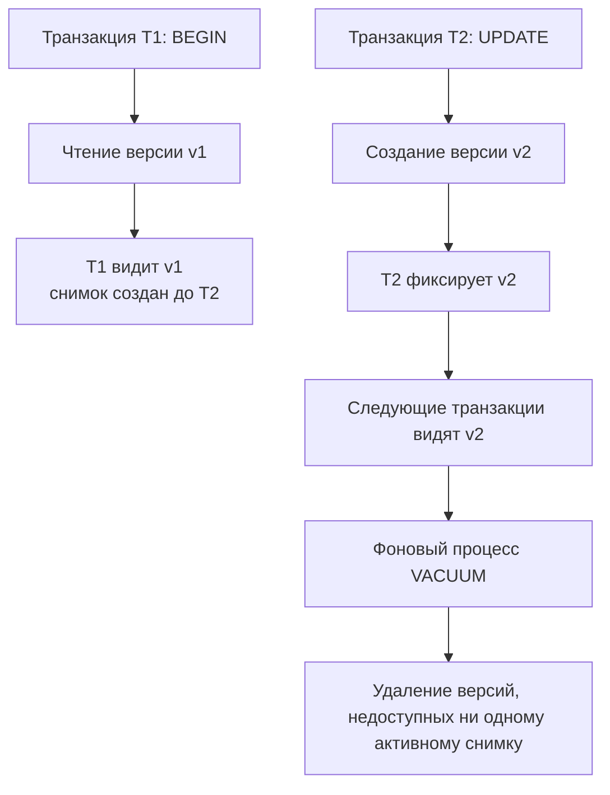

## Введение: Почему блокировки — не единственный путь

Классическая модель конкурентного доступа, основанная на блокировках, имеет фундаментальный предел масштабируемости: читатели блокируют писателей, писатели блокируют читателей. В высоконагруженном OLTP-сценарии это превращает базу данных в бутылочное горлышко, где 80% времени процессора тратится не на вычисления, а на ожидание семафоров и переключение контекста.

**Multi-Version Concurrency Control (MVCC)** решает эту проблему радикально. Вместо того чтобы запрещать доступ к изменяемым данным, СУБД хранит несколько версий одной и той же строки. Каждая транзакция видит согласованный снимок (snapshot) состояния базы на момент своего начала. Читатели не ждут писателей, писатели не ждут читателей.

Для инженера уровня Senior/Lead MVCC — это не просто «магия базы данных». Это архитектурный паттерн, который диктует:
* Как планировать долгоживущие транзакции, чтобы не «убить» сборку мусора в СУБД.
* Почему `COUNT(*)` или полное сканирование таблицы могут работать в десятки раз медленнее ожидаемого.
* Как проектировать Go-приложения, чтобы не накапливать невидимые версии строк и не раздувать диски.



## Фундамент MVCC: Версии строк и идентификаторы транзакций

В основе MVCC лежат два системных атрибута, которые СУБД неявно добавляет к каждой строке:
* `xmin` — идентификатор транзакции, которая **вставила** эту версию строки.
* `xmax` — идентификатор транзакции, которая **удалила или перезаписала** эту версию. Если строка активна, `xmax = 0`.

Когда транзакция начинает выполняться, ей назначается уникальный `txid` и создаётся **снимок (snapshot)**. Снимок фиксирует список активных на этот момент транзакций. При каждом чтении СУБД не возвращает «последнюю» версию строки, а проверяет её видимость для текущего снимка.

### Алгоритм видимости (упрощённо)
Строка видима транзакции с `snapshot_txid`, если:
1. `xmin < snapshot_txmin` (строка создана до начала снимка) И `xmin` зафиксирована.
2. `xmax = 0` ИЛИ `xmax > snapshot_txmax` ИЛИ `xmax` ещё не зафиксирована.
3. `xmin` не находится в списке активных транзакций снимка.

Это правило проверяется за несколько тактов CPU с помощью целочисленных сравнений и битовых масок, без обращения к менеджеру блокировок.

> [!info] Под капотом
> В системном каталоге `clog` (commit log) хранится статус каждой транзакции: `IN_PROGRESS`, `COMMITTED` или `ABORTED`. При проверке видимости СУБД сначала смотрит на `xmin`/`xmax`, а при необходимости обращается к `clog`, чтобы понять, завершилась ли транзакция-автор. Страницы `clog` кэшируются в памяти, поэтому доступ к ним занимает наносекунды.

## Реализация под капотом: Два архитектурных лагеря

Существует два принципиально разных подхода к хранению версий, и понимание разницы критично для тюнинга производительности.

### 1. PostgreSQL: Версии в куче (Heap-Storage)
PostgreSQL хранит все версии строк **прямо в основной таблице** (в файлах данных). При `UPDATE`:
1. Старая версия помечается как удалённая (`xmax` устанавливается в новый `txid`).
2. В конец таблицы (или в свободное место на той же странице) записывается новая версия.
3. Индекс указывает на все версии. `Visibility Map` помогает ускорить сканирование.

**Плюсы:** Простота, быстрое чтение (нет дополнительных переходов по памяти), поддержка `HOT`-обновлений.
**Минусы:** Таблица быстро разрастается (bloat), `VACUUM` требует постоянного фонового обслуживания.

### 2. MySQL/InnoDB: Отдельные Undo-логи
InnoDB хранит **только последнюю версию** в кластерном индексе. Старые версии выносятся в отдельные сегменты отката (`UNDO tablespace`). В заголовке строки хранится указатель (`DB_ROLL_PTR`) на предыдущую версию в undo-логе.

**Плюсы:** Основная таблица остаётся компактной, запись быстрее, меньше фрагментации данных.
**Минусы:** Чтение старой версии требует дополнительных переходов по памяти (pointer chasing), что убивает предвыборку CPU.

> [!tip] Собеседование
> **Вопрос:** Почему в PostgreSQL `UPDATE` физически вставляет новую строку, а не перезаписывает на месте?
> **Ответ:** Это обеспечивает безопасность параллельных транзакций. Если транзакция A обновляет строку, а транзакция B одновременно читает её, `B` должна увидеть согласованную старую версию. Перезапись на месте уничтожила бы эту версию. Кроме того, физическая структура строк в MVCC неизменна после создания, что упрощает атомарность операций на уровне страниц.

## Mechanical Sympathy: Влияние на CPU, кэш и диски

MVCC меняет паттерн доступа к памяти, что напрямую влияет на утилизацию железа.

### Кэш-линии CPU и предвыборка
В InnoDB цепочка версий разбросана по разным страницам `UNDO tablespace`. При чтении «истории» строки процессор совершает случайные переходы по памяти (`random memory access`). Это приводит к:
* Промахам кэша `L3` (`cache miss`).
* Загрузке конвейера ожидания памяти (`memory stall`), где ядро CPU простаивает сотни тактов.
* Неэффективности аппаратного предсказателя переходов и `prefetcher`, который оптимизирован для линейного доступа.

В PostgreSQL версии часто находятся на одной странице данных. Это улучшает локальность данных, но при высоком `bloat` страница становится разреженной, и полезная нагрузка на кэш-линию падает.

### Дисковые операции и `VACUUM`
`VACUUM` — это аналог Garbage Collector в мире СУБД. Он:
1. Сканирует страницы, проверяя `xmin`/`xmax` против глобального минимального активного `txid`.
2. Помечает мёртвые версии (dead tuples) как свободное пространство.
3. Обновляет `Visibility Map` и статистику.
4. **(Опционально)** Выполняет `VACUUM FULL`, который перезаписывает всю таблицу в новый файл, освобождая место на диске (но требует эксклюзивной блокировки).

В отличие от `Stop-the-World` GC в Go, `VACUUM` работает инкрементально и асинхронно. Но если его запустить слишком поздно, `autovacuum` не будет успевать, и таблица начнёт занимать в 5-10 раз больше места, чем логически необходимо.

## Обратная сторона медали: Разрастание таблиц и длинные транзакции

Самая опасная ловушка MVCC — **длительные транзакции**. Если одна транзакция удерживает снимок (например, открытый курсор, отладочный `BEGIN` в консоли или забытый `tx` в Go), СУБД не может удалить **ни одну** версию, созданную после начала этого снимка.

```sql
-- Транзакция A началась 3 часа назад и ничего не делает
BEGIN;
SELECT * FROM users; -- Снимок зафиксирован

-- За 3 часа в системе произошло 10 миллионов UPDATE
-- PostgreSQL хранит 10 миллионов "мёртвых" версий, потому что Транзакция A всё ещё активна
```

> [!warning] Ловушка / Gotcha
> В Go это часто происходит при использовании `sql.Tx` без `defer tx.Rollback()` или при длительной обработке внутри транзакции. Если вы держите транзакцию открытой дольше, чем нужно, вы блокируете очистку мёртвых кортежей во всей базе. Результат: рост дискового пространства, замедление `seq scan`, промахи кэша и в итоге `disk full`. Всегда минимизируйте время жизни `*sql.Tx`.

### HOT Updates: Оптимизация в PostgreSQL
Если `UPDATE` не изменяет столбцы, участвующие в индексах, и в странице есть место, PostgreSQL выполняет **Heap-Only Tuple (HOT)** обновление:
* Новая версия записывается на ту же страницу.
* Индекс не обновляется.
* Создаётся цепочка указателей между версиями на странице.
Это снижает дисковый IO и нагрузку на индексы на 40-60% при частых апдейтах флагов или статусов.

## Практика в Go: Как не выстрелить себе в ногу

### 1. Мониторинг длинных транзакций
Всегда отслеживайте `max(tx_age)` и `pg_stat_activity`. В коде можно добавить хуки для пула:

```go
// Пример проверки пула на предмет заблокированных транзакций
func CheckLongTransactions(ctx context.Context, db *sql.DB) error {
    rows, err := db.QueryContext(ctx, `
        SELECT pid, now() - xact_start AS duration, query 
        FROM pg_stat_activity 
        WHERE state = 'idle in transaction' AND xact_start < now() - interval '5 min'
    `)
    if err != nil {
        return fmt.Errorf("query long tx: %w", err)
    }
    defer rows.Close()

    for rows.Next() {
        var pid int
        var dur string
        var query string
        if err := rows.Scan(&pid, &dur, &query); err != nil {
            continue
        }
        // Логирование или автоматическое завершение проблемных сессий
        fmt.Printf("Long tx: pid=%s duration=%s query=%s\n", pid, dur, query)
    }
    return nil
}
```

### 2. Избегайте `SELECT *` при сканировании таблиц
При полном сканировании `MVCC` фильтрует невидимые строки на лету. Если таблица раздута в 5 раз, движку придётся прочитать в 5 раз больше страниц с диска, чтобы вернуть тот же логический объём данных. Это напрямую бьёт по `IOps` и латентности ответа в Go-сервисе.

### 3. Паттерн для пакетных вставок/обновлений
Используйте `COPY` или `unnest` вместо тысяч отдельных `INSERT`. Это уменьшает количество версий, создаваемых в куче, и снижает нагрузку на `WAL` и `autovacuum`.

## Итог

1. **MVCC** заменяет блокировки чтением версий, обеспечивая истинный параллелизм читателей и писателей.
2. **Видимость** определяется через `xmin`/`xmax` и снимок транзакции. Проверка происходит на уровне CPU инструкций, без блокировок.
3. **Архитектура**: PostgreSQL хранит версии в куче (простота чтения, риск `bloat`), InnoDB — в undo-логах (компактность, риск `pointer chasing`).
4. **Mechanical Sympathy**: MVCC меняет паттерн доступа к памяти. Длинные транзакции убивают `VACUUM`, вызывают разрастание таблиц и промахи кэша `L3`.
5. **В Go**: Минимизируйте время жизни `*sql.Tx`, мониторьте `idle in transaction`, избегайте `SELECT *` на раздутых таблицах, используйте `HOT`-дружественные схемы.

Понимание того, как СУБД хранит версии данных, подводит нас к следующему критическому механизму: как эти версии надёжно записываются на диск и гарантируют сохранность при сбоях. В следующей статье мы разберём журнал упреждающей записи: [[8. WAL. Write Ahead Log]].
