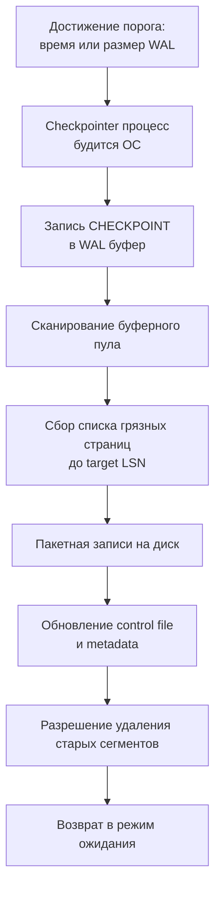

## Введение: Мост между памятью и диском

Журнал упреждающей записи (WAL) гарантирует атомарность и долговечность, но он не предназначен для бесконечного хранения. Если бы СУБД только писала в лог и никогда не сбрасывала изменённые страницы из памяти на диск, пространство на диске иссякло бы за часы, а время восстановления после сбоя измерялось бы сутками.

**Контрольная точка (Checkpoint)** — это механизм синхронизации, который:
1. Записывает маркер согласованности в WAL.
2. Принудительно сбрасывает «грязные» (изменённые) страницы из буферного пула в основное хранилище.
3. Позволяет СУБД безопасно удалять или переиспользовать старые сегменты лога.

Для инженера уровня Senior/Lead понимание чекпоинтов критично, потому что они напрямую влияют на предсказуемость латентности, износ SSD и время восстановления сервиса (RTO). В этой статье мы разберём механику создания контрольных точек, их влияние на дисковый ввод-вывод и кэш-линии CPU, а также покажем, как мониторить и оптимизировать этот процесс в Go-приложениях.



## Механика: Как создаётся контрольная точка

Процесс создания чекпоинта строго детерминирован и состоит из нескольких фаз:

1. **Триггер**: Срабатывает по таймеру (`checkpoint_timeout`), по объему записанного WAL (`max_wal_size`) или по явным командам администратора (`CHECKPOINT`).
2. **Фиксация LSN**: В WAL записывается специальная запись `XLOG_CHECKPOINT_ONLINE`, содержащая текущий `redo_lsn` — точку, с которой нужно начать восстановление в случае сбоя.
3. **Сканирование буфера**: Фоновый процесс (`checkpointer` в PostgreSQL или основной тред пула в InnoDB) проходит по разделяемой памяти, находит все страницы с `LSN > checkpoint_lsn` и ставит их в очередь на запись.
4. **Пакетный сброс**: Грязные страницы записываются на диск. Чтобы не создавать I/O шторм, СУБД использует асинхронную запись с приоритетом, размазывая записи по времени (`checkpoint_completion_target`).
5. **Завершение**: После физического сброса всех страниц до `redo_lsn` в WAL пишется `XLOG_CHECKPOINT_DONE`. Контрольный файл на диске обновляется, указывая на новую точку согласованности.

> [!info] Под капотом
> В PostgreSQL за это отвечает выделенный процесс `checkpointer`, который общается с ядром ОС через сигналы и разделяемую память. В MySQL/InnoDB процесс встроен в главный тред (`srv_master_thread`), который циклически вызывает `flush_buffer_pool()`. Разница в архитектуре влияет на детерминизм: в PG вы можете точно настроить расписание, в InnoDB оно более эвристическое и привязано к активности пула.

## Механическая симпатия: Влияние на диск, кэш и латентность

Чекпоинты — это один из самых ресурсоёмких фоновых процессов СУБД. Их неправильная настройка превращает предсказуемую систему в «качели» с переменной латентностью.

### Дисковый I/O и выравнивание износа
При сбросе тысяч страниц СУБД генерирует случайные записи (`random write`). На HDD это приводит к движению головок, на SSD — к активации алгоритмов трансляции адресов (FTL) и выравнивания износа (wear leveling). Если чекпоинт запускается слишком часто, контроллер диска находится в постоянном состоянии высокой загрузки, что увеличивает задержки (`tail latency`) для пользовательских запросов.

### Кэш-линии CPU и предвыборка
Сканирование буферного пула для поиска грязных страниц — операция с высоким уровнем `cache miss`. Структура `BufferDesc` в PG или `buf_block_t` в InnoDB разбросана по памяти. Проход по ним вызывает:
* Загрязнение `L3` кэша метаданными буферов.
* Снижение эффективности `prefetcher`, так как доступ неравномерный.
* Конкуренцию за шину памяти с основными процессами `backend`, что может увеличить время выполнения `SELECT/UPDATE` на 10-20% в момент чекпоинта.

### Влияние на latency Go-сервиса
Когда СУБД сбрасывает страницы на диск, она конкурирует за дисковые очереди (`I/O scheduler`). Если вы используете `direct I/O` или высоконагруженную базу с ограниченным `iops` (например, облачные тома), пользовательские транзакции начинают стоять в очереди `blkio`. В Go это проявляется как резкий рост времени `QueryRowContext` или `ExecContext`, даже если CPU базы свободен.

## Стратегии сглаживания: От шторма к потоку

Современные СУБД избегают одномоментного шторма записи через два механизма:

1. **Фоновая запись (`bgwriter`)**: Отдельный процесс постоянно выгружает небольшое количество грязных страниц, уменьшая работу для `checkpointer` в момент срабатывания таймера.
2. **Целевое время завершения (`checkpoint_completion_target`)**: СУБД не пишет страницы сразу. Она рассчитывает доступное время (например, 90% от `checkpoint_timeout`) и равномерно распределяет записи. Это превращает всплеск `random write` в плавный поток.

> [!warning] Ловушка / Gotcha
> Установка `checkpoint_timeout` слишком большим (например, 24 часа) кажется полезной для снижения I/O, но это ловушка. При сбое СУБД придётся проигрывать гигантский объём WAL с последней точки. Время восстановления (RTO) может превысить допустимые 5-10 минут, что приведёт к длительному простою сервиса. Оптимальный баланс: 10-15 минут или объём 1-2 ГБ лога.

## Практика в Go: Мониторинг и влияние приложения

Разработчик на Go не настраивает чекпоинты напрямую, но поведение приложения сильно влияет на частоту и тяжесть этого процесса.

### 1. Пакетные операции и `dirty ratio`
Массовые `INSERT` или `COPY` быстро заполняют буферный пул грязными страницами. Это ускоряет срабатывание чекпоинтов по объему (`max_wal_size`).

```go
// Оптимизация: явное ограничение размера пакета
// вместо бесконечного цикла, который может спровоцировать чекпоинтный шторм
const batchSize = 1000
for i := 0; i < len(records); i += batchSize {
    end := i + batchSize
    if end > len(records) {
        end = len(records)
    }
    batch := records[i:end]
    
    tx, err := db.BeginTx(ctx, nil)
    if err != nil {
        return fmt.Errorf("begin batch tx: %w", err)
    }
    if _, err := tx.ExecContext(ctx, "COPY logs FROM STDIN"); err != nil {
        _ = tx.Rollback()
        return fmt.Errorf("copy batch: %w", err)
    }
    if err := tx.Commit(); err != nil {
        return fmt.Errorf("commit batch: %w", err)
    }
}
```

### 2. Мониторинг через `pg_stat_bgwriter`
В продакшене критично отслеживать, сколько чекпоинтов вызвано по таймеру, а сколько — по превышению размера WAL. Преобладание `checkpoints_req` указывает на слишком агрессивную запись лога.

```go
type CheckpointStats struct {
    Timed     int64 `db:"checkpoints_timed"`
    Req       int64 `db:"checkpoints_req"`
    Buffers   int64 `db:"buffers_checkpoint"`
}

func GetCheckpointMetrics(ctx context.Context, db *sql.DB) (CheckpointStats, error) {
    var stats CheckpointStats
    err := db.QueryRowContext(ctx, `
        SELECT checkpoints_timed, checkpoints_req, buffers_checkpoint 
        FROM pg_stat_bgwriter
    `).Scan(&stats.Timed, &stats.Req, &stats.Buffers)
    if err != nil {
        return CheckpointStats{}, fmt.Errorf("query bgwriter stats: %w", err)
    }
    return stats, nil
}
```
Анализируйте соотношение: если `Req / (Timed + Req) > 30%`, увеличьте `max_wal_size` или оптимизируйте объём записываемых данных в приложении.

> [!tip] Собеседование
> **Вопрос:** Чем `checkpoint` отличается от `fsync()` при коммите транзакции?
> **Ответ:** `fsync()` при коммите гарантирует сохранность только конкретной транзакции (её записей в WAL). Чекпоинт гарантирует сохранность самих изменённых страниц данных на диске и позволяет отрезать старые сегменты лога. Коммит может происходить тысячи раз в секунду, чекпоинт — раз в 5-15 минут. Без чекпоинтов база не смогла бы ограничить время восстановления после сбоя.

## Архитектурные компромиссы в облачных средах

В современных инфраструктурах (AWS RDS, GCP Cloud SQL, managed PostgreSQL) доступ к файловой системе и параметрам `checkpoint_timeout` часто ограничен провайдером.

1. **IOPS-лимиты**: Если база упирается в квоту `burst balance` или `max IOPS`, чекпоинт будет выполняться крайне медленно, блокируя очистку лога. Это может привести к остановке кластера (`PANIC: could not write to WAL because of disk space`).
2. **Решение на уровне Go**: Реализуйте «обратное давление» (backpressure). Если метрики показывают рост очереди записи (`pending_writes`), временно снижайте частоту пакетных вставок или включайте кэширование на уровне приложения, чтобы дать базе «перевести дыхание».

## Итог

1. **Назначение**: Чекпоинт синхронизирует буферный пул с диском, ограничивает размер WAL и сокращает время восстановления после сбоя.
2. **Механика**: Запись маркера в лог → сканирование пула → пакетный сброс грязных страниц → обновление контрольного файла.
3. **Железо**: Вызывает случайные записи, конкурирует за шину памяти и дисковые очереди. Сглаживание через `completion_target` и `bgwriter` критично для стабильной латентности.
4. **В Go**: Пакетные вставки ускоряют срабатывание чекпоинтов. Мониторьте `checkpoints_req` через `pg_stat_bgwriter`, балансируйте размер пакетов и учитывайте квоты IOPS в облаках.
5. **Настройка**: Не гонитесь за редкими чекпоинтами. 10-15 минут или 1-2 ГБ WAL — золотая середина между производительностью и временем восстановления.

Понимание того, как СУБД согласовывает память и диск, подводит нас к финальной части цикла жизненного транзакции: что происходит, когда питание пропадает, а диск остаётся в неизвестном состоянии. В следующей статье мы детально разберём механизмы автоматического восстановления данных: [[10. Recovery после сбоя]].
