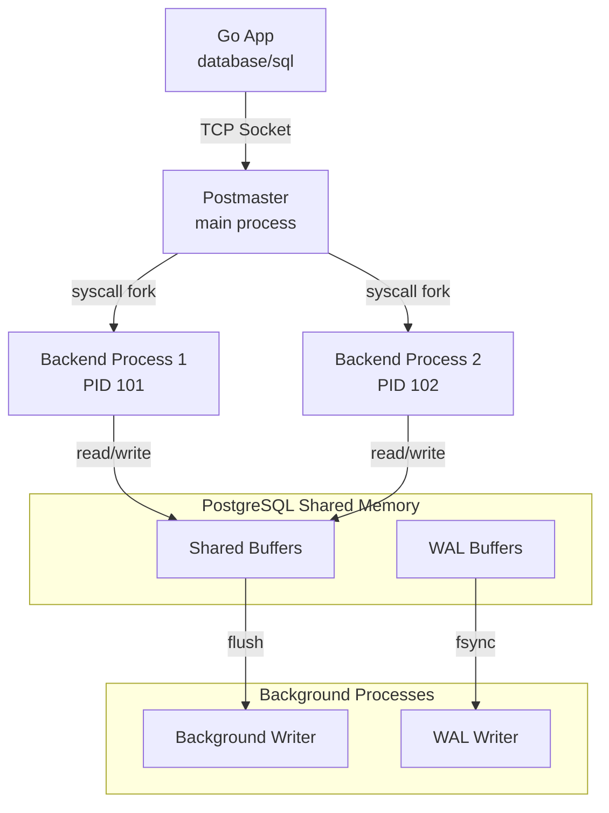
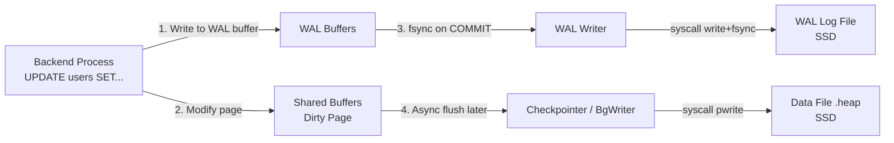

В отличие от вашего приложения на Go, где сотни тысяч горутин легковесно мультиплексируются на несколько потоков ОС (G-M-P планировщик), или от MySQL, где используется многопоточная архитектура (thread-per-connection), PostgreSQL исторически пошел по пути **Process-Per-Connection (процесс на соединение)**. 

Для бэкенд-разработчика это фундаментальное отличие диктует правила работы с БД: то, как мы настраиваем пулинг соединений, как база утилизирует память и почему тысячи коннектов убивают производительность быстрее, чем тяжелые запросы.

## Process-Per-Connection: Анатомия запуска

PostgreSQL не использует потоки (threads). Вся его архитектура построена на классических Unix-процессах и разделяемой памяти (Shared Memory). 

Когда вы запускаете Postgres, стартует главный процесс — **Postmaster** (или просто `postgres`). Он слушает заданный порт (обычно 5432) и ждет входящих соединений.

Когда ваше Go-приложение делает `db.Query()` и драйвер (например, `pgx`) открывает новое TCP-соединение, происходит следующее:
1. Postmaster получает TCP-запрос на соединение.
2. Postmaster делает системный вызов `fork()`, клонируя себя.
3. Создается новый **Backend Process** (рабочий процесс), который перехватывает этот сокет и начинает обрабатывать команды от конкретного клиента.
4. Этот процесс живет до тех пор, пока TCP-соединение не будет закрыто.

> [!info] Под капотом: Почему процессы, а не потоки?
> Главная причина — **надежность и изоляция памяти**. В C/C++ баг с некорректным указателем (segfault) в одном потоке убивает весь процесс. В PostgreSQL, если один Backend Process падает из-за критической ошибки в C-коде расширения, падает *только этот процесс*. Соединение обрывается, но сама база и остальные клиенты продолжают работать. Операционная система сама очистит память упавшего процесса.

Но за эту надежность мы платим цену:
* Системный вызов `fork()` — тяжелая операция. ОС нужно скопировать таблицы страниц памяти (Page Tables) для нового процесса, даже с учетом механизма Copy-On-Write (CoW).
* Контекст-свичинг (Context Switch) между процессами на уровне ядра ОС обходится дороже, чем между потоками, и несоизмеримо дороже, чем переключение горутин в User Space.
* Каждый процесс съедает базовый overhead по памяти (несколько мегабайт просто за факт своего существования).

> [!tip] Собеседование
> **Вопрос:** Почему при нагрузке в 10 000 RPS нельзя просто открыть 10 000 соединений к PostgreSQL из Go?
> **Ответ:** 10 000 активных соединений означают 10 000 процессов ОС. Планировщик ядра Linux сойдет с ума, пытаясь распределить кванты времени CPU между ними (CPU Thrashing). Большая часть процессорного времени уйдет на переключение контекста, а не на выполнение запросов. Кроме того, база может просто упасть по OOM (Out Of Memory). Именно поэтому перед PostgreSQL всегда ставят PgBouncer или строго лимитируют размер [[2. Connection pool]] в приложении (обычно не более `2 * Core_Count + Эффективная глубина шпинделя`).

---

## Архитектура памяти PostgreSQL

Память в PostgreSQL жестко разделена на две категории: Локальная (для каждого процесса) и Разделяемая (Shared, для всей инсталляции).

### 1. Локальная память (Local Memory)
Выделяется внутри каждого Backend Process для обработки текущего запроса. Высвобождается (free) по завершении запроса или сессии.

* **`work_mem`**: Важнейший параметр для бэкендера. Это память для операций сортировки (`ORDER BY`), агрегации (`GROUP BY`) и хеш-джоинов (`Hash JOIN`). 
    * *Mechanical Sympathy*: Если данных больше, чем `work_mem`, Postgres не падает с OOM. Он начинает **сбрасывать данные на диск (spill to disk)** во временные файлы. Запрос резко деградирует по скорости из-за дискового IO. Если ваш сложный [[15. Оптимизация SELECT]] тормозит, проверьте в `EXPLAIN ANALYZE` наличие слов `external merge disk`.
* **`maintenance_work_mem`**: Память для сервисных задач: создания индексов, команд `ALTER TABLE` и операций сборки мусора (о ней подробнее в [[10. VACUUM, ANALYZE]]).

### 2. Разделяемая память (Shared Memory)
Выделяется Postmaster-ом при старте (через `shmget` или `mmap`) и доступна всем дочерним процессам.

* **`shared_buffers`**: Сердце базы данных. Это кэш страниц с данными (обычно по 8 КБ). PostgreSQL не читает данные напрямую с диска при запросе. Он просит ОС прочитать блок с диска в `shared_buffers`, и только оттуда отдает данные клиенту. Обычно устанавливается в размере 25% от всей RAM сервера.
* **`wal_buffers`**: Буфер для записей журнала транзакций ([[8. WAL. Write Ahead Log]]). Жизненно важен для обеспечения свойства Durability (буква D в ACID). Данные сначала пишутся сюда, а потом сбрасываются на диск.

> [!warning] Ловушка / Gotcha: Двойное буферизирование (Double Buffering)
> Выделять под `shared_buffers` 90% памяти сервера (как это делают в MySQL для `InnoDB Buffer Pool`) — **ошибка**. 
> В отличие от многих других СУБД, PostgreSQL не использует `O_DIRECT` (прямой ввод/вывод в обход кэша ОС). Он полностью полагается на **Linux Page Cache**. 
> То есть данные, прочитанные с диска, ложатся сначала в кэш файловой системы Linux, а оттуда копируются в `shared_buffers`. Это называется двойным буферизированием. Остаток RAM (те самые 70-75%) нужен операционной системе, чтобы кэшировать файлы базы данных!

---

## Фоновые процессы (Background Worker Processes)

Если бы Backend-процессы сами сбрасывали измененные страницы памяти на диск, запросы клиентов блокировались бы на долгий срок из-за IO-операций. Поэтому в PostgreSQL работают фоновые демоны:

1. **Background Writer (BgWriter)**: Постепенно и аккуратно ищет "грязные" (измененные) страницы в `shared_buffers` и записывает их на диск. Его цель — чтобы Backend-процесс, которому нужно подгрузить новые данные с диска, всегда находил свободное место в `shared_buffers` и не ждал очистки.
2. **WAL Writer**: Сбрасывает данные из `wal_buffers` на диск в файлы WAL. Выполняет системный вызов `fsync()`, гарантируя, что даже при выключении питания транзакция не потеряется. Вызов синхронный и дорогой, поэтому WAL Writer группирует коммиты.
3. **Checkpointer**: Раз в определенное время (или по достижении лимита WAL-файлов) сбрасывает *все* грязные страницы на диск и делает отметку в логе. Это гарантирует, что при сбое нам не придется проигрывать лог WAL с самого начала времен. Подробнее разберем в [[9. Checkpointing]].
4. **Autovacuum Launcher / Workers**: Демоны, которые в фоновом режиме сканируют таблицы на наличие "мертвых" строк (оставшихся после `UPDATE` или `DELETE`) и возвращают место системе. Это фундаментальная часть архитектуры [[3. MVCC в PostgreSQL]].

---

## Жизненный цикл запроса

Когда вы отправляете строку `"SELECT * FROM users WHERE id = 1"` в открытое соединение из Go, внутри Backend-процесса запрос проходит конвейер:

1. **Parser (Парсер)**: Проверяет синтаксис SQL и строит абстрактное синтаксическое дерево (Parse Tree).
2. **Analyzer & Rewriter (Анализатор и Перезаписыватель)**: Проверяет, существуют ли таблицы `users` и колонка `id`. Применяет правила (например, подменяет обращения к View на реальные таблицы).
3. **Planner / Optimizer (Планировщик)**: *Самый умный компонент базы*. Использует статистику о данных (сколько всего строк в `users`, есть ли индексы), чтобы построить самый быстрый план выполнения. Перебирает стратегии: сделать Sequential Scan или использовать Index Scan? (подробнее в [[11. Cost based optimizer]]).
4. **Executor (Исполнитель)**: Берет план и начинает выкачивать данные, запрашивая страницы из `shared_buffers`.

## Итог для Go-разработчика

Понимание процессной архитектуры PostgreSQL заставляет нас придерживаться строгих правил:
1. **Жестко ограничиваем `SetMaxOpenConns`** в Go, чтобы не устроить шторм `fork()` на сервере БД.
2. При микросервисной архитектуре, когда каждый из 50 инстансов вашего Go-сервиса держит пул из 20 соединений к БД (в сумме 1000), необходимо ставить транзакционный пулер вроде **PgBouncer** или **Odyssey** между приложением и базой.
3. **Тщательно работаем с памятью**: если видим долгие запросы при джоинах, возможно дело не в нехватке индексов, а в маленьком `work_mem` и сбросе данных на жесткий диск.

Теперь, когда мы понимаем, как процессы PostgreSQL живут в операционной системе и как они делят память, мы можем заглянуть глубже и посмотреть, как именно хранятся данные на жестком диске. Об этом — в следующей статье: [[2. Storage engine PostgreSQL]].