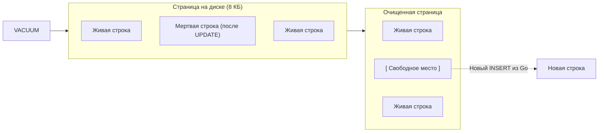

В статье про [[3. MVCC в PostgreSQL]] мы выяснили, что PostgreSQL никогда не удаляет данные "на месте" и не обновляет их физически. Вместо этого он плодит версии строк. Без специального механизма очистки любая база данных на Postgres со временем превратилась бы в раздутый кусок мусора, где 99% места занимают "мертвые" кортежи (dead tuples).

За поддержание чистоты и актуальности данных отвечают две фундаментальные операции: **VACUUM** и **ANALYZE**. Для Go-разработчика понимание их работы — это разница между стабильным бэкендом и внезапным "торможением" всей системы в три часа ночи.

---

## 1. VACUUM: Мусорщик в мире MVCC

**VACUUM** — это процесс, который сканирует таблицы и помечает место, занятое мертвыми строками, как свободное. 

Важно понимать: обычный `VACUUM` **не возвращает место операционной системе**. Он просто говорит PostgreSQL: *"Эти байты внутри 8-килобайтной страницы больше не нужны, сюда можно записать новый INSERT"*.

### Как работает VACUUM (пошагово)
1. **Сканирование Heap**: Процесс читает страницы таблицы.
2. **Проверка видимости**: Используя текущий список транзакций, он определяет, какие строки не видны ни одной активной транзакции.
3. **Очистка индексов**: Сначала удаляются ссылки на мертвые строки из всех индексов (B-Tree, GIN и т.д.).
4. **Очистка Heap**: Мертвые строки помечаются как свободное пространство (Free Space).
5. **Обновление Free Space Map (FSM)**: База записывает в специальный файл информацию о том, что в этой странице появилось место.

### VACUUM FULL: Когда всё очень плохо
Существует команда `VACUUM FULL`. В отличие от обычного вакуума, она:
1. Создает **полную новую копию** файла таблицы на диске.
2. Переносит туда только живые строки, упаковывая их максимально плотно.
3. Удаляет старый файл.

> [!danger] Внимание
> `VACUUM FULL` берет **Exclusive Lock** на таблицу. Пока он идет, ваше Go-приложение не сможет даже сделать `SELECT`. В production эта команда используется только в экстренных случаях.

---

## 2. Autovacuum: Твой невидимый помощник

В современных версиях PostgreSQL вам редко нужно запускать `VACUUM` вручную. Этим занимается **Autovacuum Daemon**.

Он просыпается раз в минуту (настраивается через `autovacuum_naptime`) и проверяет статистику: сколько строк было изменено или удалено в каждой таблице с момента последней очистки.

> [!tip] Собеседование
> **Вопрос:** Какие основные параметры влияют на запуск Autovacuum?
> **Ответ:** > 1. `autovacuum_vacuum_threshold`: Минимальное количество мертвых строк (дефолт 50).
> 2. `autovacuum_vacuum_scale_factor`: Процент мертвых строк от общего объема таблицы (дефолт 0.2 или 20%).
> Формула: `threshold + scale_factor * number_of_tuples`.

**Mechanical Sympathy для Highload:**
Для таблицы в 100 млн строк дефолтные 20% означают, что Autovacuum придет только тогда, когда накопится 20 млн мертвых строк. Это огромный Bloat (раздувание). В высоконагруженных системах `scale_factor` для больших таблиц снижают до 0.01 (1%) или даже 0.005.

---

## 3. ANALYZE: Глаза планировщика

Если `VACUUM` заботится о месте на диске, то **ANALYZE** заботится о производительности ваших запросов.

Как мы знаем из [[9. Оптимизация PostgreSQL]], планировщик строит план выполнения на основе статистики. **ANALYZE** — это процесс сбора этой статистики. Он выбирает случайную выборку строк из таблицы и вычисляет:
* Сколько строк в таблице.
* Насколько уникальны значения в каждой колонке (**Selection Cardinality**).
* Гистограммы распределения значений (какие данные встречаются часто, а какие редко).

### Почему это важно для Go-разработчика?
Представьте, что у вас есть таблица `tasks` с колонкой `status`.
99% задач имеют статус `COMPLETED` и 1% — `IN_PROGRESS`.
* Если планировщик знает об этом (статистика актуальна), для поиска `IN_PROGRESS` он выберет **Index Scan**.
* Если статистика устарела и база думает, что статусы распределены 50/50, она может выбрать **Sequential Scan**, что убьет производительность.

---

## 4. Visibility Map и Frozen XID

У Autovacuum есть две важные побочные задачи, о которых часто забывают на Middle-уровне.

### Visibility Map (Карта видимости)
`VACUUM` обновляет файл карты видимости. Как мы обсуждали в [[4. Индексы в PostgreSQL]], это позволяет базе делать **Index-Only Scans**. Если `VACUUM` давно не заходил на страницу, база не "уверена" в её чистоте и будет вынуждена лезть в Heap даже при наличии индекса.

### Frozen XID (Защита от Wraparound)
Идентификаторы транзакций в Postgres — 32-битные. Если счетчик перевалит за 2 млрд, база "сломается" (Wraparound). `VACUUM` выполняет "заморозку" (Freezing) старых транзакций, помечая их как бесконечно старые. Если Autovacuum не будет успевать это делать, Postgres в какой-то момент просто выключится и уйдет в Read-Only режим для спасения данных.

---

## 5. Практические советы по тюнингу

Если вы видите в логах или через мониторинг, что база начинает тормозить, проверьте следующие настройки:

1. **`maintenance_work_mem`**: Количество памяти, которое может использовать один воркер вакуума. Если памяти мало, вакуум будет делать много проходов по индексам, что замедлит процесс. Ставьте от 512 МБ до 2 ГБ на мощных серверах.
2. **`autovacuum_max_workers`**: По умолчанию 3. Если у вас сотни таблиц, 3 воркера могут не успевать обходить их все. Увеличьте до 5-8.
3. **`autovacuum_vacuum_cost_limit`**: Ограничитель нагрузки на IO. Если вакуум работает слишком медленно и не успевает за потоком `UPDATE` из вашего Go-сервиса, увеличьте этот лимит.

> [!warning] Ловушка / Gotcha: Long Running Transactions
> Ни `VACUUM`, ни `ANALYZE` не смогут нормально работать, если в вашей системе есть "зависшая" транзакция. Пока она открыта, Postgres обязан хранить все версии строк, созданные после её старта. **Одна забытая транзакция в Go-коде может заблокировать очистку всей базы.**

## Итог

1. **VACUUM** очищает место внутри страниц, но не уменьшает размер файла (кроме хвоста).
2. **ANALYZE** собирает статистику, без которой планировщик будет выбирать ужасные планы запросов.
3. **Autovacuum** должен быть включен и агрессивно настроен для больших, часто обновляемых таблиц.
4. **Visibility Map**, обновляемая вакуумом — ключ к быстрым Index-Only запросам.

Мы закончили глубокое погружение в устройство PostgreSQL. Теперь вы понимаете всё: от байтов на диске до планирования запросов. В завершение раздела по PostgreSQL мы разберем тему, критичную для надежности любого бэкенда: [[11. Репликация в PostgreSQL]], чтобы понять, как обеспечить отказоустойчивость и масштабировать чтение.