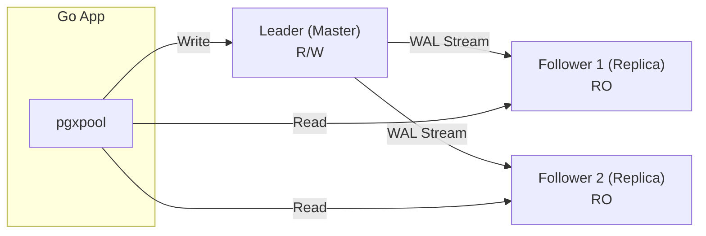

Завершая глубокое погружение в PostgreSQL, мы переходим от устройства одиночного узла к архитектуре распределенных данных. В современном бэкенде на Go одиночный сервер БД — это Single Point of Failure (SPOF). Если диск выйдет из строя или процесс упадет, ваш бизнес остановится.

Репликация решает две задачи:
1. **High Availability (HA):** Наличие актуальной копии данных для быстрого переключения (Failover).
2. **Масштабирование чтения (Read Scaling):** Возможность распределять `SELECT` запросы между несколькими узлами.

---

## WAL: Фундамент репликации

Как мы знаем из статьи [[8. WAL. Write Ahead Log]], PostgreSQL записывает все изменения сначала в журнал (Write Ahead Log), а только потом в файлы таблиц. Этот поток байтов — идеальный источник правды для репликации.

Репликация в Postgres работает по принципу **Leader-Follower** (ранее Master-Slave). Лидер принимает запись и чтение, Фолловеры — только чтение.

### 1. Физическая (Потоковая) репликация
Это самый распространенный вид. Лидер просто транслирует поток WAL-логов на фолловеры. Фолловер берет эти байты и применяет их к своим файлам данных.

* **Плюсы:** Невероятно надежно, низкая нагрузка на CPU Лидера. Копируется всё: схемы, индексы, новые таблицы.
* **Минусы:** Нельзя реплицировать только одну таблицу (только весь инстанс целиком). Версии PostgreSQL на Лидере и Фолловере должны совпадать (или быть очень близкими).



---

## Синхронность vs Асинхронность

Это ключевой выбор для System Design.

### Асинхронная репликация (Default)
Лидер подтверждает коммит вашему Go-приложению сразу после того, как записал WAL на свой диск. Отправка данных на реплики происходит в фоне.
* **Риск:** При падении Лидера данные, которые еще не долетели до реплики, могут быть потеряны.
* **Производительность:** Максимальная.

### Синхронная репликация
Лидер ждет подтверждения от реплики: "Я получила и записала этот WAL". Только после этого Go-приложение получает `nil` в ответ на `tx.Commit()`.
* **Надежность:** Нулевая потеря данных (RPO=0).
* **Риск:** Если реплика или сеть между узлами "моргнет", **запись на Лидере заблокируется**. База встанет колом.

> [!tip] Собеседование
> **Вопрос:** Как реализовать баланс между надежностью и скоростью в кластере Postgres?
> **Ответ:** Использовать синхронную репликацию с параметром `synchronous_standby_names` и списком из нескольких реплик. Лидер будет ждать подтверждения хотя бы от одной (или $N$) живой реплики. Это защищает от потери данных при падении Лидера, но не дает кластеру встать, если упадет одна из реплик.

---

## Логическая репликация

Появилась в 10-й версии и изменила правила игры. Вместо пересылки физических байтов WAL, Лидер декодирует изменения в высокоуровневый формат: "В таблицу `users` вставлена строка с такими-то данными".

Это работает через механизм **Публикаций (Publications)** и **Подписок (Subscriptions)**.

**Уникальные возможности:**
1. Репликация между разными мажорными версиями (например, с PG 12 на PG 16).
2. Репликация отдельных таблиц (Selective replication).
3. Сбор данных из нескольких БД в одну (Data aggregation).
4. Возможность писать в ту же базу на реплике (хотя данные в реплицируемых таблицах могут конфликтовать).

---

## Проблемы эксплуатации

### Репликационная задержка (Replication Lag)
В Go-приложении это выглядит так: вы создали пользователя, получили `success`, тут же делаете `SELECT` с реплики, а пользователя там еще нет.
* **Решение:** Для критичных операций (свой профиль, оплата) всегда читать с Лидера. Для аналитики и списков — с реплик.

### Конфликты запросов (Query Conflicts)
Представьте: на реплике идет долгий тяжелый `SELECT` (аналитика). В это время на Лидере пришел `VACUUM` и удалил мертвые строки. Эта информация прилетает на реплику. Реплика должна удалить строки, но их читает ваш `SELECT`! 
Если реплика не сможет применить WAL в течение `max_standby_streaming_delay`, она **принудительно убьет ваш SELECT** с ошибкой `canceling statement due to conflict with recovery`.

---

## Использование в Go: Масштабирование

Для работы с репликами в Go рекомендуется использовать библиотеки-обертки или настраивать несколько пулов. Популярный драйвер `pgx` поддерживает передачу нескольких хостов в строке подключения, но для полноценного Read/Write splitting лучше управлять этим явно.

**Идиоматичный подход:**
```go
type DBCluster struct {
    Master *pgxpool.Pool
    ReadOnly []*pgxpool.Pool
}

func (c *DBCluster) GetReader() *pgxpool.Pool {
    // Простая балансировка Round-robin или случайный выбор
    return c.ReadOnly[rand.Intn(len(c.ReadOnly))]
}
```

> [!warning] Ловушка / Gotcha: Replication Slots
> Чтобы Лидер не удалял файлы WAL, которые реплика еще не успела вычитать (например, если реплика упала на час), используются **Replication Slots**. 
> Лидер будет копить WAL на диске до победного конца. Если реплика уйдет в глубокий офлайн, Лидер может забить себе весь диск логами и упасть сам. Мониторинг размера слотов репликации — критическая задача.

## Итог раздела PostgreSQL

Мы прошли путь от транзисторов и системных вызовов до распределенных кластеров.
1. **Архитектура:** Postgres — это надежный процессный подход.
2. **Storage:** Heap-страницы и MVCC обеспечивают конкурентность, но требуют VACUUM.
3. **Индексы:** B-Tree для классики, GIN для JSON и Поиска, GiST для геоданных.
4. **Масштабирование:** Потоковая репликация для HA, логическая для гибкости.

PostgreSQL — это "швейцарский нож" бэкенд-разработчика. Но мир баз данных не ограничивается только им. В следующем подразделе мы разберем его главного конкурента, который доминирует в веб-разработке благодаря своей скорости и простоте: [[1. Архитектура MySQL]].