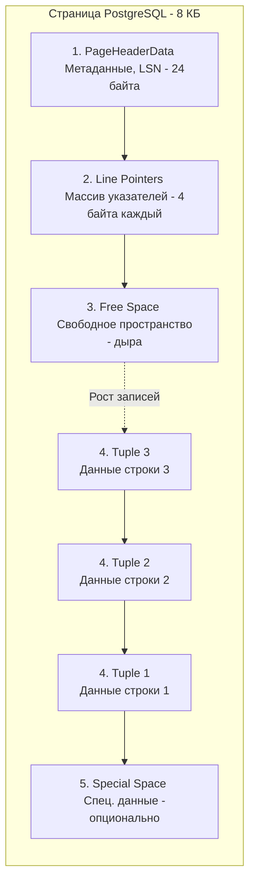

Если в вашем Go-коде данные живут в оперативной памяти в виде аккуратно выровненных структур, массивов и слайсов, управляемых Garbage Collector-ом, то база данных — это сложнейшая система управления байтами на жестком диске. 

В отличие от MySQL, где исторически был зоопарк подключаемых движков (MyISAM, Memory и доминирующий ныне `InnoDB`), PostgreSQL изначально проектировался вокруг единого, монолитного и невероятно надежного механизма хранения — **Heap** (Куча). Начиная с 12-й версии, в Postgres появилось API `tableam` (Table Access Method), позволяющее разрабатывать альтернативные движки (например, `zheap` для решения проблем с раздуванием таблиц), но стандартом де-факто и основой для 99% инсталляций остается классический Heap.

Понимание того, как PostgreSQL укладывает байты на SSD, критически важно для бэкенд-разработчика. Это объясняет, почему порядок колонок в миграциях влияет на размер базы, почему `SELECT *` убивает производительность и как индексы на самом деле находят нужную строку.

## Анатомия файлов: От базы к гигабайтам

Если вы зайдете на сервер с PostgreSQL и откроете директорию с данными (обычно `/var/lib/postgresql/data/base/`), вы не увидите там файлов с названиями ваших таблиц. Вы увидите директории, названные числами, внутри которых лежат файлы, также названные числами.

В PostgreSQL всё есть **Relation** (Отношение) — таблица, индекс, материализованное представление. Каждому Relation присваивается уникальный идентификатор — **OID** (Object Identifier) или **RelFileNode**.

Каждая таблица хранится в виде отдельного файла, имя которого равно её OID.
Но операционные системы (особенно исторически) плохо работали с файлами гигантских размеров. Поэтому Postgres жестко нарезает файлы таблиц на сегменты ровно по **1 ГБ**.

Если таблица с OID `16384` вырастает больше гигабайта, Postgres создает файл `16384.1`, затем `16384.2` и так далее. 

> [!info] Под капотом: Mechanical Sympathy
> Почему именно 1 ГБ? Это компромисс между количеством файловых дескрипторов и удобством работы ОС. Файлы по 1 ГБ легко копировать, бэкапить, они не вызывают проблем с лимитами файловых систем, а системный вызов `fsync()`, гарантирующий сброс данных на диск при записи в [[8. WAL. Write Ahead Log]], работает предсказуемо и не блокирует I/O подсистему намертво, как это могло бы быть с монолитным файлом на 500 ГБ.

---

## Страница (Page): Базовая единица ввода-вывода

Сегмент на 1 ГБ — это лишь контейнер. Внутри него файл строго разбит на блоки фиксированного размера — **Страницы (Pages)**. По умолчанию размер страницы в PostgreSQL равен **8 КБ**.

Это важнейшее правило: **PostgreSQL никогда не читает и не пишет на диск отдельные строки**. Минимальная единица обмена данными между RAM и диском — 8 КБ. Если вам нужно прочитать 1 байт из таблицы, база прочитает 8192 байта в разделяемую память (`shared_buffers`, о которой мы говорили в [[1. Архитектура PostgreSQL]]).

### Устройство страницы (Page Layout)

Структура 8-килобайтной страницы гениальна в своей простоте и эффективности. Она устроена так, чтобы минимизировать фрагментацию и быстро находить данные переменной длины.



1. **PageHeaderData (Заголовок)**: Хранит служебную информацию. Самое важное здесь — **LSN (Log Sequence Number)**, указатель на последнюю запись в WAL, изменившую эту страницу. Это нужно для восстановления после сбоев.
2. **Line Pointers (Указатели строк)**: Массив 32-битных чисел. Каждый указатель содержит смещение (офсет) в байтах от начала страницы, где физически лежат данные конкретной строки, и длину этой строки. Массив растет *сверху вниз*.
3. **Tuples (Строки / Кортежи)**: Сами данные строк. В отличие от указателей, строки пишутся *снизу вверх* (от конца страницы к началу).
4. **Free Space (Свободное место)**: Дыра между массивом указателей и строками. Когда они встречаются — страница заполнена.
5. **Special Space**: Зарезервированное место в самом конце страницы, используется в основном индексами для хранения ссылок на соседние страницы дерева (например, в B-Tree).

> [!tip] Собеседование
> **Вопрос:** Зачем нужны Line Pointers? Почему бы индексам не ссылаться сразу на физическое смещение байтов строки внутри файла?
> **Ответ:** Строки имеют переменную длину (например, из-за типа `VARCHAR`). Если мы обновим строку и она станет короче, образуется пустое место. Postgres периодически выполняет дефрагментацию внутри страницы. При этом физическое положение строки (`Tuple`) сдвигается, но её индекс в массиве `Line Pointers` остается неизменным! 
> Индексы в базе ссылаются не на байты, а на **CTID (ItemPointer)** — пару `Номер_страницы + Индекс_Line_Pointer`. Благодаря этому уровню косвенности, перемещение строки внутри страницы не требует перестроения всех индексов таблицы.

---

## Строка под капотом (Tuple)

Что представляет собой сама строка (Tuple)? Она состоит из заголовка (`HeapTupleHeaderData`) и самих полезных данных пользователя.

Заголовок строки занимает минимум 23 байта (обычно больше из-за выравнивания) и содержит важнейшие системные поля:
* `t_xmin`: ID транзакции, которая создала (INSERT) эту версию строки.
* `t_xmax`: ID транзакции, которая удалила или обновила (DELETE/UPDATE) эту версию строки.
* `t_ctid`: Указатель на актуальную версию этой строки (если она была обновлена).

Именно эти поля, хранящиеся прямо на диске вместе с вашими данными, являются фундаментом работы конкурентного доступа в PostgreSQL. Но мы не будем останавливаться на них сейчас — они станут главными героями в следующей статье про [[3. MVCC в PostgreSQL]].

### Оптимизация памяти: Выравнивание структур (Padding)

Здесь опыт Go-разработчика придется как нельзя кстати. Вы знаете, что в Go порядок полей в `struct` влияет на размер структуры в памяти из-за выравнивания (Memory Alignment) под машинное слово процессора (обычно 8 байт для 64-битных систем).

В PostgreSQL **абсолютно та же ситуация на диске**. Типы данных имеют требования к выравниванию. `INT8` (8 байт) должен начинаться с адреса, кратного 8. `INT4` — кратного 4. 

> [!warning] Ловушка / Gotcha: Порядок колонок
> Если вы создаете таблицу через миграцию в неудачном порядке:
> ```sql
> CREATE TABLE bad_padding (
>     id INT8,          -- 8 bytes
>     is_active BOOLEAN,-- 1 byte
>                       -- [7 BYTES PADDING WASTED]
>     user_id INT8,     -- 8 bytes
>     is_banned BOOLEAN -- 1 byte
>                       -- [7 BYTES PADDING WASTED]
> );
> ```
> Из-за выравнивания каждая строка "съест" 14 лишних байт на пустые нули. При миллионах строк это гигабайты потерянного места на SSD и в драгоценном кэше `shared_buffers`!
> **Правило:** При проектировании схемы располагайте колонки по убыванию их размера (от больших `INT8`/`TIMESTAMP` к мелким `INT4`, `INT2`, `BOOLEAN`).

---

## TOAST: Хранение больших объектов

Мы выяснили, что размер страницы — 8 КБ. А строки не могут пересекать границы страниц. 
Что произойдет, если мы попытаемся вставить в таблицу JSON-документ (о котором мы будем говорить в [[5. JSONB и работа с JSON]]) или строку текста размером 10 мегабайт? 

Здесь вступает в игру механизм **TOAST** (The Oversized-Attribute Storage Technique). 

Если размер строки (Tuple) превышает примерно 2 КБ, Postgres запускает следующий алгоритм:
1. **Сжатие (Compression)**: Пытается сжать большое поле встроенным алгоритмом pglz (или LZ4 в новых версиях). Если после сжатия строка помещается в страницу — отлично.
2. **Out-of-line storage**: Если даже после сжатия данные огромны, Postgres "отрезает" это поле от основной строки.
3. Он нарезает эти данные на чанки (обычно по 2 КБ).
4. Сохраняет эти чанки в специальную, скрытую системную таблицу (TOAST-таблицу).
5. В основной таблице, в вашей строке, вместо мегабайта текста остается лишь небольшой **TOAST Pointer** (указатель), содержащий OID нужной TOAST-таблицы и идентификатор чанков.

### Mechanical Sympathy: Почему `SELECT *` — это зло

Теперь, зная про TOAST, вы должны понимать, почему написание `SELECT * FROM users` (если вам нужны только `id` и `email`) — это грубейшая архитектурная ошибка.

Если у пользователя есть колонка `bio` с огромным текстом или `avatar_bytes` (что само по себе антипаттерн), которые ушли в TOAST, то при `SELECT *` происходит следующее:
1. Executor читает 8 КБ страницу из основной таблицы.
2. Видит TOAST-указатель.
3. Вынужденно делает **дополнительные случайные чтения (Random I/O)** с диска, чтобы найти скрытую TOAST-таблицу.
4. Вычитывает все чанки.
5. Распаковывает их (тратя CPU-циклы на декомпрессию LZ4/pglz).
6. Аллоцирует огромный кусок памяти, чтобы склеить чанки, и отправляет их по сети в ваше Go-приложение.

Если вы напишете `SELECT id, email FROM users`, Postgres прочитает только основную страницу (8 КБ), проигнорирует TOAST-указатели и мгновенно вернет результат, сэкономив I/O, CPU и сеть.

## Итог

Архитектура Heap движка PostgreSQL строится вокруг неизменных 8-килобайтных страниц и строк с заголовками, описывающими их жизненный цикл транзакций. База работает максимально эффективно, когда данные плотно упакованы (без лишнего padding), а тяжелые колонки вынесены в TOAST и не запрашиваются без нужды. 

Но мы упомянули, что в заголовке каждой строки хранятся какие-то ID транзакций (`xmin` и `xmax`). Зачем базе хранить метаданные транзакций в каждой строке пользовательских данных? Это ключ к решению проблемы чтения и записи без блокировок. Об этом фундаментальном механизме мы поговорим в следующей статье: [[3. MVCC в PostgreSQL]].