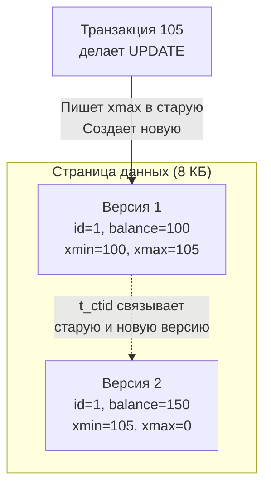

Когда вы пишете многопоточный код на Go и вам нужно защитить разделяемое состояние (например, `map` в памяти), вы, скорее всего, используете `sync.RWMutex`. Это классический подход: множество горутин могут читать данные одновременно, но как только одна горутина хочет записать данные, она берет эксклюзивную блокировку (`Lock()`), и **все читатели ждут**.

В контексте высоконагруженных баз данных такой подход означал бы смерть производительности. Если бы каждая транзакция, обновляющая баланс пользователя, блокировала чтение этого баланса для всех остальных, мы бы никогда не достигли тысяч RPS. 

Чтобы решить эту проблему, современные реляционные БД используют **MVCC (Multi-Version Concurrency Control — Управление конкурентным доступом с помощью многоверсионности)**. Главное правило MVCC: **Читатели не блокируют писателей, а писатели не блокируют читателей.**

В разделе по теории транзакций мы уже касались общих принципов в статье [[7. MVCC. Multi Version Concurrency Control]], но реализация этого механизма в PostgreSQL кардинально отличается от MySQL или Oracle. И это отличие имеет прямые последствия для того, как вы должны писать код и проектировать таблицы.

## Философия PostgreSQL: Версии прямо в куче

В MySQL (InnoDB) или Oracle новые версии строк при обновлении пишутся на место старых, а старые данные уезжают в специальный сегмент отката (Undo Log). 

PostgreSQL пошел другим путем: **никаких Undo Logs нет**. Все версии одной и той же строки (прошлая, текущая, будущая незакоммиченная) физически лежат в одном и том же файле таблицы (Heap, Куча), который мы разбирали в статье [[2. Storage engine PostgreSQL]].

> [!info] Под капотом: Метаданные транзакций
> Чтобы база понимала, какая транзакция какую версию строки должна видеть, в заголовке *каждой* строки (Tuple Header) хранятся специальные скрытые системные колонки.
> Главные из них — это 32-битные идентификаторы транзакций (Transaction ID или `xid`):
> * **`t_xmin`**: ID транзакции, которая создала (INSERT) эту версию строки.
> * **`t_xmax`**: ID транзакции, которая удалила (DELETE) эту версию строки. Значение `0` означает, что строка жива.

### Анатомия UPDATE: Почему обновление — это удаление + вставка

В PostgreSQL **не существует операции `UPDATE` на физическом уровне**. 

Когда вы выполняете `UPDATE users SET balance = 150 WHERE id = 1`, под капотом происходит следующее:
1. База находит текущую активную строку (`t_xmax` = 0).
2. Она помечает эту строку как удаленную, записывая в её `t_xmax` ID текущей транзакции (например, 105).
3. Она создает **совершенно новую физическую строку** с новыми данными (баланс 150).
4. У новой строки `t_xmin` устанавливается в 105, а `t_xmax` = 0.
5. Старая строка получает ссылку на новую через скрытое поле `t_ctid`.

Обе строки физически находятся на диске (в рамках 8-килобайтной страницы). Транзакции, стартовавшие *до* коммита 105, будут читать старую строку (Версию 1). Транзакции, стартовавшие *после* коммита, увидят Версию 2.

## Снимки данных (Snapshots) и правила видимости

Откуда запрос `SELECT` знает, на какую версию строки смотреть? 

В момент начала выполнения запроса (или начала транзакции, в зависимости от уровня изоляции, см. [[3. Read Committed, Repeatable Read, Serializable]]), PostgreSQL делает **Снимок (Snapshot)**. 
Снимок — это не физическое копирование данных! Это просто небольшая структура в оперативной памяти (в рантайме C), которая содержит:
* `xmin` снимка: минимальный активный `xid` в системе на данный момент.
* `xmax` снимка: максимальный `xid` + 1.
* `xip_list`: массив `xid` всех транзакций, которые активны прямо сейчас.

Когда исполнитель запроса (Executor) сканирует 8-килобайтную страницу и натыкается на строку, он применяет к ней **Правила видимости (Visibility Rules)**. Это сложная логика, но упрощенно она звучит так:

1. Если `t_xmin` строки больше нашего снимка или находится в `xip_list` (то есть транзакция-создатель еще не завершилась) — **строку не видим**.
2. Если `t_xmax` строки (тот, кто удалил) еще активен (есть в `xip_list`) — мы видим старую версию, игнорируем удаление.
3. Если `t_xmin` закоммичен в прошлом, а `t_xmax` равен `0` или закоммичен в будущем — **строку видим**.

Это происходит на лету в RAM (или кэшах L1/L2 процессора), без всяких системных вызовов к ОС. Это невероятно быстро.

---

## Mechanical Sympathy: Раздувание таблиц (Table Bloat)

Решение хранить все версии в Куче имеет колоссальное влияние на производительность.

Поскольку `UPDATE` порождает новые строки, таблица постоянно растет в физических размерах. Если вы часто обновляете одни и те же 10 000 строк (например, счетчики просмотров или координаты курьеров), со временем таблица может занять гигабайты, хотя актуальных строк в ней по-прежнему 10 000. 

Это называется **Bloat (Раздувание)**.
Чем больше раздута таблица, тем больше 8-килобайтных страниц базе приходится считывать с SSD в память (увеличивается IO-нагрузка), чтобы найти среди тысяч "мертвых" строк несколько живых. Снижается эффективность `shared_buffers`, растет задержка (Latency) приложения.

Для борьбы с этим в Go есть свой Garbage Collector, а в PostgreSQL — **Autovacuum**. Он в фоновом режиме сканирует страницы, находит строки, которые больше не нужны ни одной транзакции (их `t_xmax` находится в далеком прошлом), и помечает их место как свободное (Free Space). О тюнинге этого процесса мы подробно поговорим в [[10. VACUUM, ANALYZE]].

> [!warning] Ловушка / Gotcha: Долгие транзакции убивают базу
> Представьте, что в вашем Go-приложении есть баг: вы открыли транзакцию `tx, err := db.Begin()`, сделали `SELECT`, а затем ушли в долгий сетевой вызов к стороннему API, забыв сделать `tx.Commit()` или `tx.Rollback()`. 
> Пока эта транзакция висит, её `xid` остается активным. Значит, Vacuum **не имеет права** физически удалять старые версии строк в *любых* таблицах базы данных (вдруг ваша транзакция решит их прочитать?). База начинает катастрофически раздуваться, деградирует IO, и в конечном итоге может закончиться место на диске. 
> **Никогда не держите открытые транзакции во время сетевых или долгих CPU-bound операций.**

---

## HOT Updates (Heap-Only Tuples)

Чтобы смягчить проблему раздувания и обновления индексов, в PostgreSQL есть гениальная оптимизация — **HOT (Heap-Only Tuples)**.

Если `UPDATE` изменяет колонку, которая **не участвует ни в одном индексе**, и на текущей странице (8 КБ) еще есть свободное место, Postgres делает HOT-обновление.

**Почему это важно?**
Обычно, когда вставляется новая физическая строка, СУБД должна обойти *все* индексы таблицы (B-Tree) и вставить в них новые указатели на новую строку. Это огромная I/O нагрузка. 
При HOT-обновлении база не трогает индексы вообще! Внутри самой 8-килобайтной страницы старая строка просто получает `HOT-link` на новую. Когда индекс указывает на старую строку, механизм чтения понимает: "Ага, тут HOT-цепочка, надо просто пройти по ней внутри страницы".

> [!tip] Собеседование
> **Вопрос:** Что такое Transaction ID Wraparound (Переполнение счетчика транзакций)?
> **Ответ:** Поля `xmin` и `xmax` имеют размер 32 бита, что дает около 4 миллиардов значений (в реальности база делит их пополам: 2 млрд "в прошлом" и 2 млрд "в будущем" из-за кольцевой природы). Если высоконагруженная система сделает 2 миллиарда транзакций, счетчик пойдет по кругу и сбросится в ноль. Внезапно все "старые" строки окажутся для базы "в будущем" и станут невидимыми (база просто "исчезнет"). 
> Чтобы этого не произошло, Vacuum выполняет процесс **Freezing (Заморозка)** — он меняет старые `xmin` на специальный флаг `FrozenTransactionId` (равен 2), который всегда считается прошлым. Если база не успевает делать Freeze (например, из-за долгих транзакций или неверной настройки), при достижении критического лимита PostgreSQL жестко останавливается в режиме read-only (отключается), требуя ручного обслуживания.

## Итог

1.  **MVCC в PostgreSQL** реализован через хранение множества версий строк в самой таблице (Heap).
2.  **`UPDATE` = `DELETE` + `INSERT`**, что неизбежно ведет к появлению мертвых строк и раздуванию (Bloat) таблиц.
3.  **Снимки (Snapshots)** позволяют `SELECT`-ам читать консистентные данные без блокировок, используя `xmin` и `xmax`.
4.  **HOT Updates** экономят ресурсы на обновление индексов, если мы не меняем индексируемые поля.

Теперь мы знаем, как данные лежат на диске и как они версионируются для безопасного конкурентного доступа. Но чтобы находить нужные строки за миллисекунды среди миллионов записей, нам не обойтись без деревьев поиска. В следующей статье мы разберем: [[4. Индексы в PostgreSQL]].