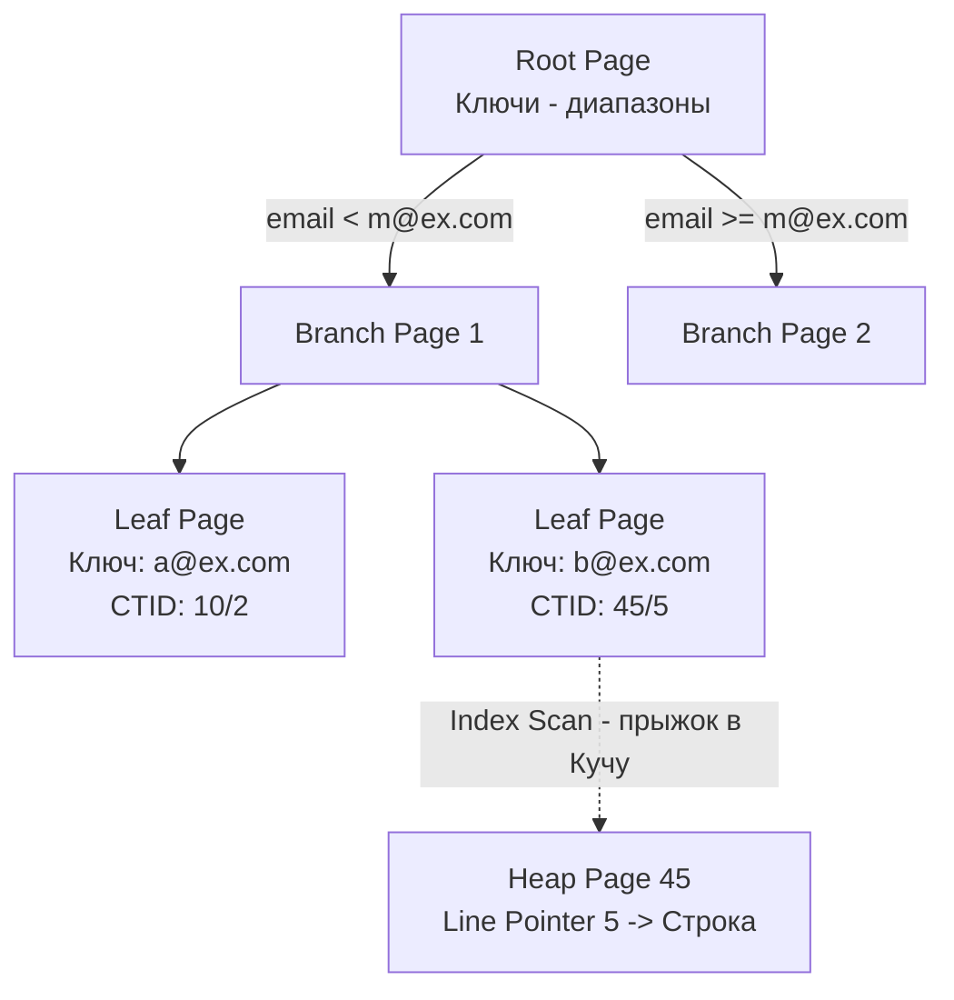

В предыдущих статьях мы разобрали, что данные физически хранятся в 8-килобайтных страницах ([[2. Storage engine PostgreSQL]]), а из-за механизма [[3. MVCC в PostgreSQL]] в этих страницах копятся разные версии одних и тех же строк.

Когда ваше Go-приложение выполняет `SELECT * FROM users WHERE email = 'test@example.com'`, исполнитель (Executor) по умолчанию запускает **Sequential Scan (Последовательное сканирование)**. Он читает с диска в память *каждую* 8-килобайтную страницу таблицы (Heap), просматривает каждую строку и проверяет её `t_xmin` / `t_xmax`, чтобы понять, видна ли она текущей транзакции. 

Для таблицы в 10 гигабайт это означает вычитывание 10 гигабайт с SSD ради одной строчки. Чтобы избежать этого линейного поиска $O(N)$, используются индексы.

## Что такое индекс физически?

В PostgreSQL индекс — это **совершенно отдельная структура данных**, которая хранится в собственных файлах (со своими OID), независимо от основной Кучи (Heap). Индексы также разбиты на страницы по 8 КБ.

Если Куча — это огромный склад коробок с записями в случайном порядке, то индекс — это отсортированный каталог, в котором написано: *"Запись с email 'test@example.com' лежит в коробке №45, на позиции 3"*.

Эта "коробка и позиция" называется **CTID (ItemPointer)**.
Как мы помним, `CTID` состоит из двух чисел: `Номер_страницы` и `Индекс_Line_Pointer`. 

Абсолютно любой индекс в PostgreSQL (B-Tree, Hash, GIN) в конечном итоге возвращает массив `CTID`, по которым база лезет в Кучу (Heap) за самими данными.

---

## B-Tree: Индекс по умолчанию

Если вы пишете `CREATE INDEX idx_email ON users(email)`, Postgres создает индекс типа **B-Tree (B-дерево)**. Это самобалансирующееся дерево поиска, оптимизированное для работы с блочными устройствами (жесткими дисками и SSD).

> [!info] Под капотом: Дерево в страницах
> В классическом бинарном дереве у каждого узла 2 потомка. В B-Tree узел — это целая 8-килобайтная страница, которая может вмещать сотни указателей (ветвлений). Это делает дерево очень "широким" и "неглубоким". Для таблицы в миллиард строк глубина B-Tree в Postgres обычно не превышает 3–4 уровней. Это значит, что для поиска любой записи нужно прочитать с диска всего 3-4 страницы (24-32 КБ).

Структура B-Tree индекса:
1. **Root Page (Корень)**: Верхняя страница.
2. **Branch Pages (Ветви)**: Промежуточные страницы, содержащие диапазоны значений ключей и ссылки на дочерние страницы.
3. **Leaf Pages (Листья)**: Самый нижний уровень. Именно здесь хранятся сами значения ключа (`test@example.com`) и целевой `CTID` (ссылка на Heap).

### Механика Index Scan

1. Запрос приходит в базу.
2. Планировщик решает использовать индекс (Index Scan).
3. Postgres читает Root страницу, сравнивает искомое значение с диапазонами, спускается к Branch, затем к Leaf.
4. Находит в Leaf-странице нужный ключ и забирает `CTID` (например, 45/5).
5. Postgres идет в Heap, читает страницу 45, берет строку под номером 5.
6. **Критический момент:** Postgres проверяет заголовки MVCC (`t_xmin`, `t_xmax`) этой строки. Если строка удалена или создана в будущем, база её игнорирует и продолжает поиск.

---

## Mechanical Sympathy: Index-Only Scan и Visibility Map

Здесь кроется фундаментальное отличие PostgreSQL от MySQL (InnoDB). 
В InnoDB индексы хранят информацию о версионности, а кластерный индекс (Primary Key) содержит сами данные.
В PostgreSQL индексы **не содержат данных MVCC**. В индексе лежат только ключи и CTID. 

Это порождает проблему: когда мы находим ключ в индексе, мы *не знаем*, жива ли физическая строка в Куче для нашей транзакции. Нам **приходится** делать системный вызов, читать Heap-страницу и проверять `xmin`/`xmax`.

Если вы делаете запрос `SELECT email FROM users WHERE email = 'test@example.com'`, по логике, все данные уже есть в самом индексе (там же хранится сам email!). Зачем лезть в Кучу?

Чтобы избежать лишнего I/O, разработчики PostgreSQL придумали **Visibility Map (Карту видимости)**.
Это крошечный файл, где на каждую 8-килобайтную Heap-страницу выделено всего 2 бита. Если бит `all_visible` установлен в 1, это значит: *"Все строки на этой странице старые и закоммиченные, они видны абсолютно всем транзакциям"*.

Если планировщик запускает **Index-Only Scan**, он:
1. Находит `email` и `CTID` в индексе.
2. Смотрит в Visibility Map (которая кэшируется в памяти и работает мгновенно).
3. Если для Heap-страницы стоит флаг `all_visible`, Postgres **не читает Кучу вообще**, а сразу отдает `email` из индекса вашему Go-приложению. Это дает колоссальный буст производительности для аналитических и агрегирующих [[15. Оптимизация SELECT]] запросов.

---

## Штраф за запись (Write Penalty) и раздувание индексов

Индексы ускоряют чтение, но замедляют запись. В PostgreSQL этот штраф особенно высок из-за архитектуры MVCC.

> [!tip] Собеседование
> **Вопрос:** Вы добавили 5 индексов на разные колонки в таблицу. Как изменится скорость выполнения `UPDATE`, который меняет только *одну* неиндексируемую колонку?
> **Ответ:** Зависит от того, произойдет ли HOT-update. Если на странице нет свободного места, Postgres создаст новую версию строки (новый CTID). А значит, ему придется обойти **все 5 индексов** и вставить туда новые указатели на этот новый CTID. Это называется Write Amplification (Усиление записи). Поэтому в Postgres лишние индексы убивают базу быстрее, чем в других СУБД.

Более того, индексы тоже страдают от **Bloat (Раздувания)**. Когда старые версии строк удаляются процессом Vacuum, в Leaf-страницах B-Tree остаются пустые дыры. Со временем индекс может стать в два раза больше реального объема данных, увеличивая нагрузку на память (`shared_buffers`). Лечится это командой `REINDEX CONCURRENTLY`.

---

## Другие типы индексов

PostgreSQL славится своей расширяемостью, в том числе в алгоритмах поиска:

1. **Hash**: Используется только для проверок на равенство (`=`). Исторически был нестабильным, но с 10-й версии стал write-ahead logged (устойчивым к сбоям). Работает чуть быстрее B-Tree при точечном поиске, но не поддерживает диапазоны (`>`, `<`).
2. **GiST (Generalized Search Tree)**: Фреймворк для сложных геометрических и полнотекстовых данных. Позволяет индексировать координаты (например, поиск "кто находится в радиусе 5 км" через расширение PostGIS).
3. **BRIN (Block Range Index)**: Идеален для логов и time-series данных, которые вставляются последовательно. Вместо хранения каждого ключа, он хранит минимальное и максимальное значение для блоков страниц. Занимает в 100 раз меньше места в RAM, чем B-Tree.
4. **GIN (Generalized Inverted Index)**: Инвертированный индекс. Король для работы с массивами, полнотекстовым поиском и JSON.

Мы разобрали, как классические индексы B-Tree помогают находить реляционные данные. Но современный бэкенд редко ограничивается строгими колонками. Часто нам нужно хранить схемы произвольной вложенности (динамические конфиги, payload от внешних API) и эффективно по ним искать. 

Для этого в Postgres есть уникальный механизм, который делает его гибридом SQL и NoSQL баз данных. О том, как хранить и индексировать документы (с помощью GIN индексов), мы поговорим в следующей статье: [[5. JSONB и работа с JSON]].