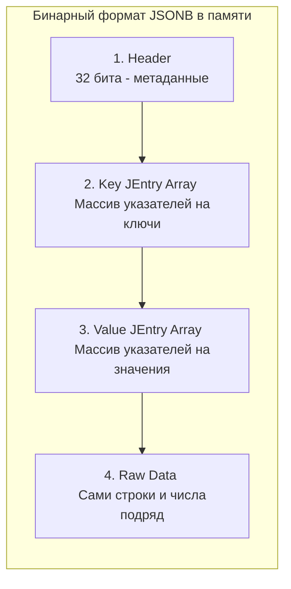

## Гибрид двух миров: SQL и NoSQL

В классической реляционной модели каждое поле имеет строгий тип данных и заранее определено в схеме (DDL). Но в бэкенд-разработке мы постоянно сталкиваемся с динамическими данными:
* Произвольные `payload` от сторонних API (webhooks).
* Динамические настройки и конфигурации пользователей, где ключи могут добавляться каждую неделю.
* Аналитические события (events), чья структура зависит от типа события.

Исторически для таких задач использовали NoSQL решения (подробнее об этом подходе в [[7. Document базы. MongoDB]]). Однако поддержка двух разных баз данных (реляционной и документоориентированной) усложняет инфраструктуру, бэкапы и транзакционную целостность.

PostgreSQL решил эту проблему элегантно, добавив нативную поддержку JSON. Но настоящая революция произошла в версии 9.4 с появлением бинарного формата **JSONB**.

---

## JSON vs JSONB: Почему вы должны забыть про тип JSON

В PostgreSQL существует два типа для работы с JSON: `json` и `jsonb`.

> [!tip] Собеседование
> **Вопрос:** В чем разница между типами `json` и `jsonb` в PostgreSQL, и какой из них следует использовать по умолчанию?
> **Ответ:** Тип `json` сохраняет точную копию входного текста (включая пробелы, табуляции и дубликаты ключей). При каждом `SELECT` или поиске база данных вынуждена заново парсить этот текст. 
> Тип `jsonb` (B означает Binary) при `INSERT` тратит процессорное время на парсинг и валидацию, удаляет пробелы, сортирует ключи и оставляет только последнее значение при дубликатах ключей. Зато он сохраняется в бинарном древовидном формате, который поддерживает индексы и позволяет извлекать данные без повторного парсинга. **В 99% случаев нужно использовать `jsonb`.**

### Mechanical Sympathy: JSONB под капотом

Как именно `jsonb` хранится на диске внутри 8-килобайтной страницы ([[2. Storage engine PostgreSQL]])? 

Вместо плоского текста PostgreSQL использует структуру **JEntry (JSON Entry)**. Это плоский массив смещений (offsets) до конкретных ключей и значений. 

Когда вы делаете `SELECT data->'user'->>'email' FROM events`, PostgreSQL не читает весь документ целиком. Благодаря массиву `JEntry` база данных использует бинарный поиск ($O(\log N)$), мгновенно вычисляет байтовое смещение нужного ключа в памяти и читает только его значение.



Если размер `jsonb` превышает 2 КБ, он автоматически отправляется в системную таблицу **TOAST**, где сжимается (LZ4 или pglz) и нарезается на чанки.

---

## Основные операторы извлечения и поиска

Вместо классического SQL, для `jsonb` применяется свой синтаксис операторов (многие из них похожи на синтаксис языка C):

1. `->` — возвращает объект `jsonb`. Полезно для цепочек вызовов.
2. `->>` — возвращает текст (`text`). Используется в конце цепочки, чтобы получить финальное значение.
3. `#>` и `#>>` — извлечение по пути (массиву ключей). Удобно, если путь глубокий.
4. `@>` — оператор "содержит" (contains). **Самый важный оператор для индексации.** Проверяет, содержит ли левый JSONB правый JSONB.

Пример запроса:
```sql
-- Извлечение текста
SELECT payload->'user'->>'email' AS email 
FROM events 
WHERE id = 1;

-- Поиск через оператор "содержит" (очень быстро при наличии индекса)
SELECT id 
FROM events 
WHERE payload @> '{"user": {"role": "admin"}}';
```

---

## Истинная сила: Индексация через GIN

Обычный B-Tree индекс ([[4. Индексы в PostgreSQL]]) отлично работает для сортировки и точного совпадения. Но если мы хотим искать *внутри* JSONB документа по ключам и значениям, B-Tree бесполезен (он может индексировать только весь JSON целиком).

Для этого используется **GIN (Generalized Inverted Index — Обобщенный инвертированный индекс)**.
GIN разбирает документ на составляющие (ключи и значения) и создает карту: *какое значение в каких строках таблицы встречается*.

Есть два способа создать GIN индекс для `jsonb`:

### 1. Дефолтный GIN (jsonb_ops)
```sql
CREATE INDEX idx_payload ON events USING gin (payload);
```
Индексирует каждый ключ и каждое значение по отдельности. Поддерживает множество операторов (`@>`, `?`, `?&`, `?|`), но занимает очень много места на диске и замедляет `INSERT`.

### 2. GIN для путей (jsonb_path_ops)
```sql
CREATE INDEX idx_payload_path ON events USING gin (payload jsonb_path_ops);
```
Индексирует только хэши полных путей до значений (например, хэш от `user.role.admin`). 
Он поддерживает **только** оператор `@>`. Но этот индекс значительно меньше в размерах и строится/обновляется гораздо быстрее. Если вы ищете только по структуре (содержит ли JSON подструктуру), всегда выбирайте `jsonb_path_ops`.

---

## Интеграция с Go

Для работы с `jsonb` в Go не требуется никаких магий или сторонних ORM, стандартный пакет `database/sql` и драйвер (например, `pgx`) отлично с этим справляются. 

У нас есть два подхода:

### Подход 1: Использование `json.RawMessage`
Полезно, если вы просто хотите прочитать JSON из базы и отдать его наружу по HTTP без парсинга в структуры Go.
```go
import "encoding/json"

type Event struct {
    ID      int
    Payload json.RawMessage // Это просто алиас для []byte
}

// db.QueryRow("SELECT id, payload FROM events...").Scan(&e.ID, &e.Payload)
```

### Подход 2: Scanner и Valuer (Идиоматичный)
Если данные JSON имеют строгую форму (например, конфигурация), лучше мапить их прямо в `struct`. Для этого ваша структура должна реализовывать интерфейсы `sql.Scanner` (для чтения) и `driver.Valuer` (для записи).

```go
import (
    "database/sql/driver"
    "encoding/json"
    "errors"
)

type Config struct {
    Theme string `json:"theme"`
    Limit int    `json:"limit"`
}

// Реализация driver.Valuer (Go -> PostgreSQL)
func (c Config) Value() (driver.Value, error) {
    return json.Marshal(c)
}

// Реализация sql.Scanner (PostgreSQL -> Go)
func (c *Config) Scan(value interface{}) error {
    b, ok := value.([]byte)
    if !ok {
        return errors.New("type assertion to []byte failed")
    }
    return json.Unmarshal(b, &c)
}
```

---

## Ловушки и Антипаттерны

> [!warning] Ловушка / Gotcha: Мутация JSONB убивает базу
> Главная архитектурная ошибка при использовании `jsonb` — это попытка обновлять конкретные ключи внутри огромного документа.
> Например, у вас есть `jsonb` колонка размером 1 МБ. Вы выполняете запрос:
> `UPDATE users SET data = jsonb_set(data, '{last_login}', '"2026-04-24"')`
> 
> Вспоминаем [[3. MVCC в PostgreSQL]]: PostgreSQL **не умеет** изменять данные "по месту" (in-place). Даже если вы обновили 10 байт, база создаст **полностью новую копию** всего мегабайтного документа, положит её в новый чанк TOAST, обновит индексы, а старый мегабайт пометит как мусор для Vacuum.
> 
> **Правило:** Если поле обновляется часто (счетчики, статусы, даты логина) — вынесите его в классическую колонку (например, `INT` или `TIMESTAMP`). Оставьте в `jsonb` только то, что читается целиком и обновляется редко.

**Другие антипаттерны:**
1. **Массивы объектов:** Хранение огромных массивов `[{"id": 1}, {"id": 2}]` внутри `jsonb`. Если вам нужно джоинить эти элементы или искать элементы внутри массива для апдейта — вам нужна обычная реляционная таблица 1-ко-многим.
2. **Схемы, которые можно нормализовать:** Если все ваши документы имеют структуру `{"name": "...", "age": ...}`, то `jsonb` вам не нужен. Вы просто теряете строгую типизацию и получаете оверхед на парсинг в Go-приложении.

## Итог

1. Используйте `jsonb`, а не `json`.
2. Бинарный формат обеспечивает $O(1)$ или логарифмический доступ к полям без парсинга всей строки.
3. Оператор `@>` в связке с индексом `GIN (jsonb_path_ops)` дает молниеносный поиск по вложенным структурам.
4. Избегайте точечных `UPDATE` огромных JSONB документов, так как MVCC перепишет документ целиком, вызвав раздувание таблиц.

Индексы GIN прекрасно подходят не только для JSON, но и для другой задачи, с которой часто сталкиваются бэкендеры: поиск по тексту (поиск постов в блоге, товаров в каталоге). Чтобы не тянуть в проект тяжеловесный ElasticSearch, мы можем использовать встроенные возможности базы. Как это работает, мы разберем в следующей статье: [[6. Full Text Search]].