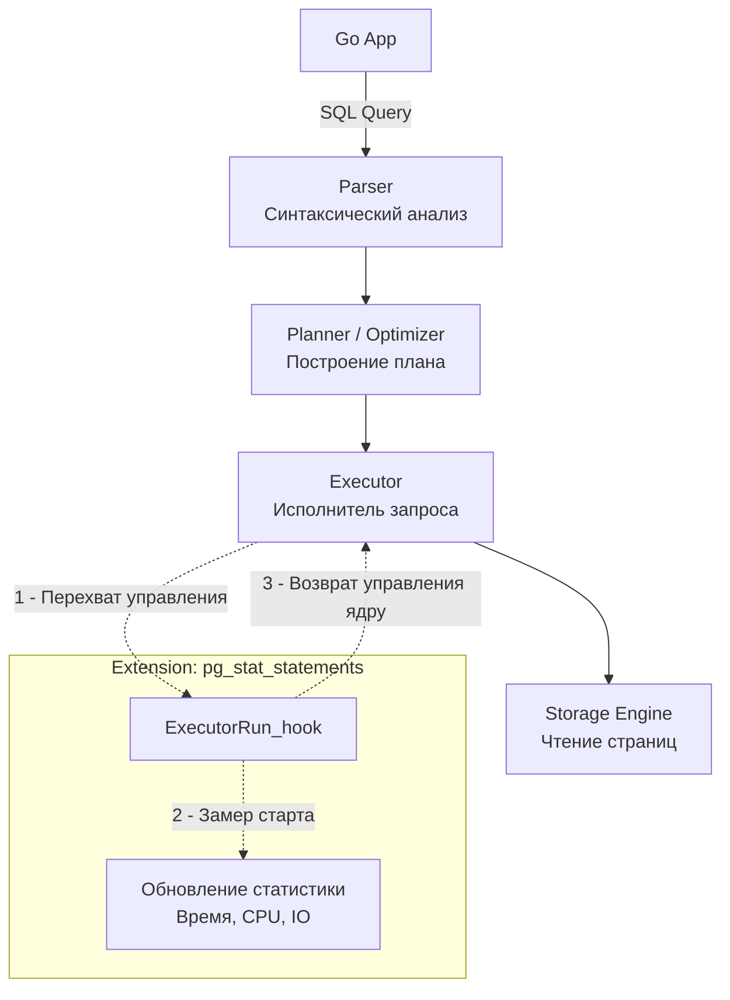

В предыдущей статье мы увидели, как PostgreSQL реализует [[6. Full Text Search]] своими силами. Однако истинная мощь этой базы данных заключается не в том, сколько фич разработчики успели «зашить» в ядро, а в том, что PostgreSQL — это скорее **фреймворк для создания баз данных**.

Если вам не хватает стандартных индексов, типов данных или даже парадигмы хранения (например, вам нужна колоночная или time-series база), вам не обязательно менять СУБД. Вы можете изменить сам PostgreSQL, загрузив в него **Расширение (Extension)**.

Для бэкенд-разработчика понимание архитектуры расширений критически важно, так как именно они превращают "просто реляционную базу" в мощнейший инструмент, способный заменить Redis, ElasticSearch или InfluxDB в рамках одного проекта.

## Под капотом: Как работают расширения?

PostgreSQL написан на языке C. Архитектурно он спроектирован так, чтобы позволять динамическую загрузку скомпилированных C-библиотек (файлов `.so` в Linux или `.dll` в Windows) прямо в адресное пространство рабочих процессов (Backend Processes) или даже главного процесса Postmaster (см. [[1. Архитектура PostgreSQL]]).

Когда вы загружаете библиотеку, она получает доступ к внутреннему C-API базы данных. 

Главный механизм, позволяющий расширениям менять поведение базы — это **Система Хуков (Hook System)**.
Во всем исходном коде PostgreSQL (в парсере, планировщике, исполнителе) разбросаны глобальные указатели на функции. 

Если расширение загружено, оно подменяет этот глобальный указатель на свою собственную функцию. База вызывает хук расширения, расширение делает свою логику (например, замеряет время или меняет план запроса), а затем вызывает оригинальную функцию ядра.



> [!info] Под капотом: Опасность C-кода
> Поскольку расширения работают в том же адресном пространстве (Ring 3), что и сам рабочий процесс (Backend Process), они имеют полный доступ к памяти базы. 
> С одной стороны, это дает невероятную производительность: расширения читают страницы прямо из `shared_buffers` без системных вызовов.
> С другой стороны, если в C-коде стороннего расширения есть утечка памяти или ошибка сегментации (Segfault), упадет весь процесс, обслуживающий ваше TCP-соединение. ОС убьет процесс, клиент (Go-приложение) получит ошибку `connection reset by peer`, а базе, возможно, придется делать микро-рестарт для восстановления консистентности разделяемой памяти.

---

## Два этапа жизни расширения

Частая ловушка для новичков — путаница между установкой библиотеки и её активацией. В PostgreSQL это два разных шага.

### 1. Загрузка библиотеки (`shared_preload_libraries`)
Некоторые расширения требуют выделения разделяемой памяти (Shared Memory) для всех процессов БД, либо им нужно запустить свои собственные фоновые процессы (Background Workers). 
Сделать это можно **только при старте главного процесса Postmaster**.

Для таких расширений необходимо прописать их в конфигурационном файле `postgresql.conf`:
```ini
shared_preload_libraries = 'pg_stat_statements, timescaledb'
```
*После изменения этого параметра требуется полный перезапуск сервера БД.*

### 2. Создание объектов в базе (`CREATE EXTENSION`)
Даже если библиотека загружена в память, база данных о ней не знает на уровне SQL (нет новых функций, типов данных или таблиц). Чтобы они появились, вы должны выполнить команду в конкретной логической БД:
```sql
CREATE EXTENSION IF NOT EXISTS pg_stat_statements;
```
Эта команда читает специальный SQL-скрипт расширения (control-файл) и создает нужные `VIEW`, функции и операторы.

> [!tip] Собеседование
> **Вопрос:** Вы добавили расширение `pg_stat_statements`, выполнили `CREATE EXTENSION`, но при попытке сделать `SELECT` из его вьюхи получаете ошибку, что расширение должно быть загружено через `shared_preload_libraries`. Почему?
> **Ответ:** Команда `CREATE EXTENSION` лишь создает метаданные (сигнатуры функций) в системных каталогах PostgreSQL. Но само расширение `pg_stat_statements` собирает метрики со *всех* процессов БД. Для этого ему нужен кусок разделяемой памяти (Shared Memory), чтобы процессы могли безопасно писать туда статистику (через атомарные операции или спинлоки). Эту память может выделить только Postmaster при старте ядра ОС, поэтому требуется изменение конфига и рестарт.

---

## Must-have расширения для бэкенд-разработчика

В экосистеме Postgres тысячи расширений, но следующие вы встретите практически в любом production-проекте.

### 1. pg_stat_statements (Наблюдаемость)
Абсолютный король расширений. Без него профилирование базы в production невозможно.
Оно перехватывает этап Executor и записывает статистику по каждому уникальному SQL-запросу (параметры `$1, $2` игнорируются, запросы нормализуются).

Позволяет ответить на вопросы:
* Какой запрос потребляет больше всего процессорного времени (`total_exec_time`)?
* Какой запрос вымывает данные из кэша, заставляя базу читать с жесткого диска (`shared_blks_read` vs `shared_blks_hit`)?
О том, как использовать эти данные для ускорения БД, мы поговорим в разделе [[19. Observability БД]].

### 2. pg_trgm (Поиск по подстроке)
В прошлой статье мы говорили, что `LIKE '%query%'` — это зло, так как он вызывает Sequential Scan. 
Расширение `pg_trgm` решает эту проблему. Оно добавляет поддержку триграмм (разбиение слова на группы по 3 буквы: `foo` -> `  f`, ` fo`, `foo`, `oo `). 
Оно добавляет возможность использовать GIN-индексы для операторов `LIKE` и `ILIKE`.
```sql
CREATE EXTENSION pg_trgm;
CREATE INDEX idx_users_email_trgm ON users USING GIN (email gin_trgm_ops);
-- Теперь этот запрос будет использовать индекс и отработает за миллисекунды:
SELECT * FROM users WHERE email ILIKE '%@gmail.com%';
```

### 3. pgcrypto (Шифрование и хеширование)
Позволяет выполнять криптографические операции прямо в базе данных, не гоняя чувствительные данные (например, пароли или токены) через сеть в Go-приложение.
Раньше активно использовалось для генерации UUIDv4 (`gen_random_uuid()`), но с 13-й версии PostgreSQL эта функция встроена в ядро (хотя расширение `uuid-ossp` все еще существует для старых версий и других форматов UUID).

---

## Архитектурные расширения (Меняющие парадигму)

Существуют расширения-монстры, которые превращают PostgreSQL в совершенно другие базы данных.

1. **TimescaleDB**: Превращает Postgres в мощнейшую Time-Series Database (TSDB) для хранения метрик, IoT-данных и логов. Автоматически партицирует таблицы по времени (создает "чанки"), добавляет аналитические SQL-функции для работы с временными рядами и сжимает старые данные колоночным методом (Columnar Storage), уменьшая их размер в 10-20 раз.
2. **Citus**: Превращает одиночный PostgreSQL в распределенную (Distributed) базу данных. Позволяет делать шардирование ([[4. Sharding]]) таблиц по кластеру из десятков машин, при этом для Go-приложения кластер выглядит как один обычный инстанс Postgres. Citus сам переписывает SQL-запросы, отправляет их на нужные шарды и агрегирует результаты (MapReduce под капотом).

## Итог

1. PostgreSQL — это расширяемая платформа благодаря загружаемым C-библиотекам и архитектуре хуков.
2. Подключение тяжелых расширений требует перезапуска (через `shared_preload_libraries`) для аллокации разделяемой памяти.
3. Расширения исполняются в памяти рабочих процессов. Они невероятно быстры, но критические ошибки в их коде могут "уронить" соединение.
4. `pg_stat_statements` — обязательный инструмент для любого бэкендера, который хочет понимать, что происходит с базой под нагрузкой.

Возможность расширять типы данных и алгоритмы поиска сделала PostgreSQL стандартом де-факто в еще одной сложнейшей инженерной области — работе с геоданными и картами. В следующей статье мы разберем расширение, которое стало настолько успешным, что фактически превратилось в отдельный продукт: [[8. PostGIS]].