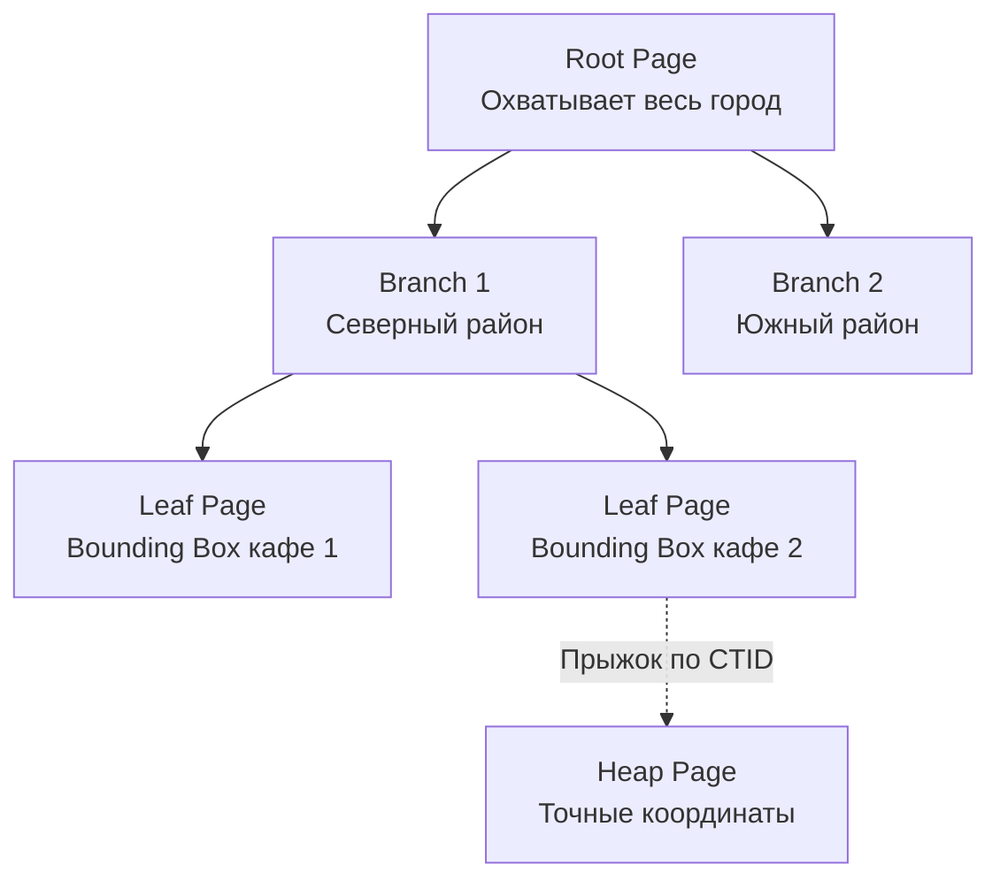

В прошлой статье мы выяснили, что архитектура базы позволяет менять её поведение через [[7. Расширения PostgreSQL]]. Одним из самых ярких примеров того, как C-библиотека может превратить реляционную БД в узкоспециализированный инструмент, является **PostGIS**.

Если вы разрабатываете бэкенд для доставки еды, такси, дейтинга или IoT-трекинга, вам придется работать с координатами. 
Исторически многие разработчики пытались хранить широту и долготу в обычных колонках `FLOAT8` и считать расстояние между ними по теореме Пифагора. Но Земля — не плоская. Чтобы посчитать реальное расстояние по поверхности сферы, нужна формула гаверсинуса (Haversine formula). Вычисления "на лету" для миллионов строк мгновенно убьют CPU вашего сервера, а B-Tree индексы ([[4. Индексы в PostgreSQL]]) абсолютно бесполезны при поиске в двумерном пространстве.

PostGIS решает эту проблему, добавляя в PostgreSQL поддержку пространственных типов данных, специализированных индексов и сотен функций для геометрии.

## Geometry vs Geography: Фундаментальный выбор

Первое, с чем вы столкнетесь при проектировании схемы с PostGIS — это выбор типа данных для хранения координат. Их два: `geometry` и `geography`. Ошибка в выборе на старте будет стоить вам гигабайтов RAM и десятков миллисекунд latency.

### 1. Тип Geometry (Плоскость)
Считает, что ваши данные лежат на плоской декартовой сетке (как на листе бумаги). 
* **Плюсы**: Математика на плоскости невероятно быстрая. Поддерживает все функции PostGIS (пересечения сложных полигонов, объединения и т.д.).
* **Минусы**: Если вы используете классические координаты (широту/долготу), расстояния будут измеряться в *градусах*, а не метрах. Чтобы получить метры, вам придется постоянно проецировать данные "на лету", используя **SRID** (Spatial Reference System Identifier). 
Самый популярный SRID для GPS координат — **4326 (WGS 84)**.

### 2. Тип Geography (Сфера)
Считает, что ваши данные лежат на круглой Земле (сфероиде).
* **Плюсы**: Идеально для работы с координатами GPS по всему миру. Функция расстояния `ST_Distance` сразу вернет вам результат в **метрах**.
* **Минусы**: Математика на сфероиде требует вычисления сложных тригонометрических функций. Операции с типом `geography` в 3-5 раз медленнее, чем с `geometry`. Также этот тип поддерживает меньше функций (например, сложно сделать пересечение сложных полигонов).

> [!tip] Собеседование
> **Вопрос:** В каком типе лучше хранить точки курьеров и адреса клиентов для приложения доставки?
> **Ответ:** Если приложение работает в рамках одного небольшого города (где кривизной Земли можно пренебречь), лучше использовать `geometry` с локальной метрической проекцией (например, подходящей зоной UTM). Это даст максимальную производительность. Но если это глобальный сервис (поиск водителя от Москвы до Владивостока) и нужна простота разработки без ручного управления проекциями, надежнее выбрать `geography`, пожертвовав частью CPU-ресурсов.

---

## Mechanical Sympathy: Индексы GiST и R-Tree

Как база находит "5 ближайших ресторанов в радиусе 3 километров" среди 10 миллионов точек за 2 миллисекунды? B-Tree индекс тут не поможет, так как он может отсортировать данные только в одном измерении. Нам нужен пространственный индекс.

PostGIS использует **GiST (Generalized Search Tree)**, реализуя под капотом структуру **R-Tree (Region Tree)**.

Идея R-Tree состоит в разбиении пространства на иерархию вложенных прямоугольников — **Bounding Boxes (Ограничивающие рамки)**.



Когда вы ищете что-то в радиусе, база делает следующее:
1. Строит виртуальный квадрат (Bounding Box) вокруг вашей точки поиска.
2. Спускается по дереву GiST, отбрасывая те "ветки" (районы), чьи Bounding Box-ы физически не пересекаются с вашим квадратом.
3. Дойдя до листьев (конкретных точек), берет их CTID.
4. Лезет в Кучу (описанную в [[2. Storage engine PostgreSQL]]), достает точные координаты и вычисляет математически точное расстояние, чтобы отбросить ложные срабатывания (ведь радиус — это круг, а искали мы по квадрату).

### Оператор `&&` vs Точные функции

Самая важная часть гео-инженерии в PostgreSQL — это понимание того, когда база использует индекс, а когда делает Sequential Scan.

> [!warning] Ловушка / Gotcha: `ST_Distance`
> **ПЛОХО:**
> ```sql
> SELECT id FROM couriers 
> WHERE ST_Distance(location, 'POINT(37.6 55.7)') < 3000;
> ```
> Этот запрос **проигнорирует** индекс. База возьмет каждую строку из таблицы `couriers`, вычислит тяжелую тригонометрическую функцию `ST_Distance` до вашей точки, и только потом отфильтрует те, что меньше 3000. Это смерть для производительности.
> 
> **ХОРОШО:**
> ```sql
> SELECT id FROM couriers 
> WHERE ST_DWithin(location, 'POINT(37.6 55.7)', 3000);
> ```
> Функция `ST_DWithin` (Distance Within) — магическая. Под капотом она сначала прозрачно вызывает оператор `&&` (поиск пересечения Bounding Box через GiST индекс), что мгновенно отсекает 99% таблицы без тригонометрии, и только для оставшегося 1% точек считает точное расстояние.

---

## Интеграция с Go

PostGIS физически хранит геометрию в 8-килобайтных страницах в бинарном формате **EWKB** (Extended Well-Known Binary — бинарный формат с добавлением информации об SRID). Если размер полигона большой, он уходит в механизм TOAST.

Когда вы делаете `SELECT location FROM couriers`, база по умолчанию вернет вам этот нечитаемый бинарник. 

У нас есть два пути работы с пространственными данными в Go-приложении.

### Путь 1: Конвертация в JSONB на стороне БД (Самый популярный)
Мы можем заставить PostgreSQL отдавать геометрию в формате стандартного GeoJSON. Это удобно, если вы пишете REST API и вам нужно просто проксировать координаты на фронтенд.

```go
// SQL-запрос
query := `
    SELECT id, ST_AsGeoJSON(location) 
    FROM couriers 
    WHERE id = $1
`

var courierID int
var locationGeoJSON string // Или json.RawMessage
err := db.QueryRow(query, id).Scan(&courierID, &locationGeoJSON)
```

Для вставки мы используем `ST_GeomFromGeoJSON`:
```go
insertQuery := `
    INSERT INTO couriers (location) 
    VALUES (ST_SetSRID(ST_GeomFromGeoJSON($1), 4326))
`
```

### Путь 2: Нативная бинарная работа (Highload)
Конвертация в JSON занимает CPU-время базы данных и увеличивает объем данных, передаваемых по сети (текст объемнее бинарника). В Highload-проектах используют бинарный протокол.

В экосистеме Go для этого есть стандарт де-факто — библиотека `github.com/twpayne/go-geom`.
Она реализует интерфейсы `sql.Scanner` и `driver.Valuer`, позволяя мапить типы EWKB из PostgreSQL напрямую в структуры Go:

```go
import (
    "[github.com/twpayne/go-geom](https://github.com/twpayne/go-geom)"
    "[github.com/twpayne/go-geom/encoding/ewkb](https://github.com/twpayne/go-geom/encoding/ewkb)"
)

type Courier struct {
    ID       int
    Location *geom.Point
}

// Извлекаем напрямую в geom.Point через ewkb декодер
var p ewkb.Point
err := db.QueryRow("SELECT location FROM couriers WHERE id = 1").Scan(&p)
if err == nil {
    courier.Location = p.Point
}
```
Этот метод минимизирует аллокации (Escape Analysis скажет вам спасибо) и снимает нагрузку с CPU сервера БД.

## Итог

1. **PostGIS** — это production-ready стандарт для работы с пространственными данными.
2. Тип **`geometry`** — быстрее, но требует управления проекциями (плоскость). Тип **`geography`** — удобнее для координат по всему миру (сфера), но забирает больше CPU.
3. Пространственный поиск работает за миллисекунды благодаря **GiST-индексу** и принципу Bounding Boxes (R-Tree).
4. Никогда не используйте фильтрацию через `ST_Distance`. Всегда используйте **`ST_DWithin`**, чтобы база применила индекс.
5. Для общения с Go используйте либо `ST_AsGeoJSON` для простоты, либо бинарный EWKB (`go-geom`) для максимальной производительности.

Мы рассмотрели внутреннее устройство движка хранения, MVCC, индексы и работу с расширениями. Но в реальном production база данных редко работает идеально "из коробки". Знать, как всё устроено — это фундамент, а уметь настраивать базу под конкретную Highload-нагрузку — это следующий уровень инженерии. Об этом мы поговорим в следующей статье: [[9. Оптимизация PostgreSQL]].