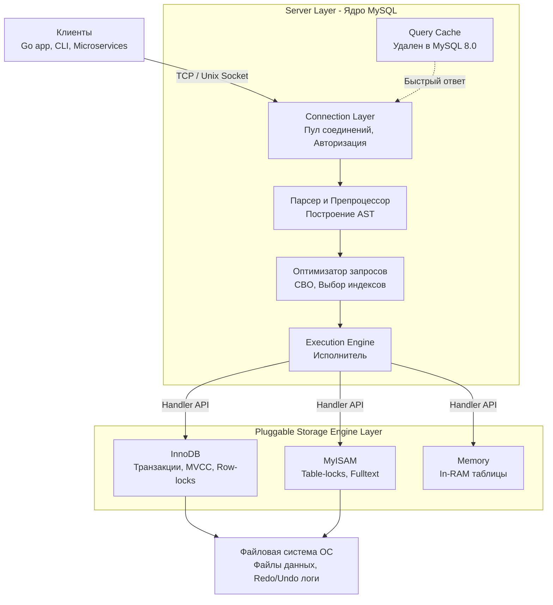

## Анатомия MySQL: Разделяй и властвуй

MySQL — одна из самых популярных реляционных баз данных в мире, и её успех во многом обусловлен её уникальной архитектурой. В отличие от монолитных систем (например, PostgreSQL), MySQL построена вокруг концепции **Pluggable Storage Engine Architecture** (подключаемой архитектуры подсистем хранения). 

Это означает, что задачи парсинга SQL, оптимизации запроса и проверки прав отделены от задач непосредственного сохранения байтов на диск, управления транзакциями и блокировками. 

Для бэкенд-инженера понимание этой границы — ключ к пониманию того, почему один запрос работает молниеносно, а другой кладет базу, несмотря на наличие индексов.

### Глобальная архитектура (Трехуровневая модель)

Архитектуру MySQL можно разделить на три логических слоя.

---

## Уровень 1. Сетевой уровень и обработка соединений (Connection Layer)

Когда ваше Go-приложение вызывает `sql.Open("mysql", dsn)` и делает первый запрос, оно устанавливает TCP-соединение с сервером MySQL.

Здесь MySQL исторически использует модель **Thread-per-Connection** (один поток ОС на каждое клиентское соединение). Когда приходит новое соединение, MySQL либо берет готовый поток из кэша потоков (Thread Cache), либо запрашивает у операционной системы создание нового треда (`clone` в Linux).

> [!info] Под капотом: Потоки против Горутин
> В Go создание горутины стоит копейки (начальный стек ~2KB, переключение контекста в User Space). В MySQL создание потока ОС — это аллокация мегабайтов памяти под стек треда и дорогой системный вызов. 
> Переключение между тысячами активных потоков ОС приводит к **Thread Thrashing** — процессор тратит всё время на смену контекста (сохранение регистров в Ring 0, сброс TLB кэшей), а не на полезную работу.

> [!warning] Ловушка / Gotcha: Connection Storm
> Если ваш бэкенд на Go при всплеске трафика попытается открыть 10000 соединений к MySQL (потому что вы забыли настроить пул), база данных просто "ляжет" из-за исчерпания памяти на стеки потоков и оверхеда на контекст-свитчинг. В отличие от Go, дефолтный MySQL плохо мультиплексирует запросы. 
> *Решение:* Строго настраивайте `SetMaxOpenConns` и `SetMaxIdleConns` в Go (подробнее в [[2. Connection pool]]), либо используйте прокси-балансировщики вроде ProxySQL. Коммерческие версии MySQL и форки вроде Percona Server имеют фичу **Thread Pool**, которая ограничивает число тредов ОС, подобно планировщику Go.

---

## Уровень 2. Ядро СУБД (Server Layer / SQL Layer)

Это "мозг" базы данных. Он не знает, как данные лежат на диске, но он отлично понимает синтаксис SQL.

### 1. Парсер и Препроцессор
Текст запроса (набор байт) превращается во внутреннее дерево разбора (AST — Abstract Syntax Tree). Препроцессор проверяет семантику: существуют ли указанные таблицы и колонки, есть ли у пользователя права на их чтение.

### 2. Оптимизатор запросов (Query Optimizer)
Один из самых сложных компонентов СУБД. Оптимизатор в MySQL — **Cost-Based (CBO)** (подробнее в [[11. Cost based optimizer]]). Он оценивает различные варианты выполнения запроса (порядок JOIN-ов, выбор индексов) и вычисляет их "стоимость" в терминах процессорного времени и операций ввода-вывода (I/O). Оптимизатор выбирает план с наименьшей стоимостью.

> [!tip] Собеседование: Ошибка выбора индекса
> **Вопрос:** Почему MySQL иногда игнорирует индекс (делает Full Table Scan), хотя индекс есть и указан в WHERE?
> **Ответ:** Оптимизатор основывается на статистике распределения данных (Cardinality). Если он видит, что ваш `WHERE status = 'active'` охватывает 80% строк в таблице, он посчитает, что сделать последовательное чтение всей таблицы (Sequential Read) с диска в память будет дешевле и быстрее (за счет упреждающего чтения ОС), чем дергать каждую строку через B-Tree индекс (Random I/O).

### 3. Исполнитель (Execution Engine)
Оптимизатор создает план выполнения (то, что вы видите при вызове `EXPLAIN`, см. [[10. План выполнения запроса. EXPLAIN]]), а Исполнитель пошагово его выполняет. Исполнитель не читает файлы напрямую. Он обращается к Storage Engine через стандартизированный интерфейс.

> [!warning] Ловушка / Gotcha: Смерть Query Cache
> Если вы читаете старые туториалы, там часто советуют тюнить `query_cache_size`. **Забудьте.** > В MySQL 8.0 Query Cache был полностью удален. Причина — Mechanical Sympathy. Кэш инвалидировался при *любом* изменении таблицы, что требовало захвата глобального мьютекса (Global Mutex). На многоядерных процессорах (32+ ядер) гонка за этот лок становилась главным бутылочным горлышком при высокой конкурентности.

---

## Уровень 3. Подсистемы хранения (Storage Engine Layer)

Это киллер-фича MySQL. Архитектура построена через интерфейс абстракции **Handler API**. 

В коде MySQL (C++) есть абстрактный класс `handler`, в котором описаны методы вроде `rnd_next()` (дай следующую строку), `index_read()` (найди по ключу), `write_row()` (запиши строку). Любой разработчик может написать свой Storage Engine, реализовав эти методы.

Самые известные движки:
1. **InnoDB**: Движок по умолчанию (начиная с MySQL 5.5). Поддерживает ACID-транзакции, MVCC, внешние ключи, блокировки на уровне строк (Row-level locking) и recovery после сбоев. Это то, с чем вы работаете в 99% случаев на бэкенде.
2. **MyISAM**: Старый движок. Не поддерживает транзакции. Блокирует *всю таблицу* при записи (Table-level lock). Сейчас используется редко, в основном для read-only аналитики или специфичного полнотекстового поиска (хотя InnoDB уже умеет это делать лучше).
3. **Memory**: Хранит все данные в RAM (теряет при рестарте). Быстрый, но использует хеш-индексы и Table-level локи. Часто MySQL сама неявно использует этот движок для создания временных таблиц при сложных `GROUP BY` или сортировках.

### Как ядро общается с движком?
Когда вы делаете `SELECT * FROM users WHERE age > 18`, Исполнитель вызывает метод Handler API: `index_read` (ищи в индексе "age" первое значение > 18). Затем в цикле вызывает `index_next`, пока не закончатся подходящие строки. 
*Ядро не знает, что под капотом InnoDB данные лежат в B+ Tree дереве, сгруппированные по страницам 16KB. Это полная инкапсуляция.*

---

## Распределение памяти в MySQL (Memory Architecture)

Понимание того, как MySQL аллоцирует память, критично для настройки производительности сервера базы данных. Память делится на две большие категории:

1. **Глобальные буферы (Global Buffers)**
   Выделяются один раз при старте сервера и разделяются между всеми потоками.
   * **InnoDB Buffer Pool:** Самая важная структура памяти. InnoDB кэширует здесь страницы данных и индексов с диска. В production базах под него отдают 60-80% всей RAM сервера.
   * **Redo Log Buffer:** Буфер для транзакционного лога (WAL).

2. **Буферы потоков (Thread Buffers)**
   Выделяются *на каждое соединение* (тред ОС) при необходимости выполнения определенных операций.
   * `sort_buffer_size`: Память для сортировки (`ORDER BY`), если нет подходящего индекса.
   * `join_buffer_size`: Память для `JOIN` без использования индексов.
   * `read_buffer_size`: Буфер для последовательного сканирования таблиц.

> [!warning] Ловушка / Gotcha: OOM (Out of Memory)
> Если у вас 1000 открытых соединений (goroutines holding connections in pool), и вы сделаете `SELECT ... ORDER BY ...` на огромной таблице без индекса, MySQL аллоцирует `sort_buffer_size` для *каждого* потока. Если размер буфера велик, база данных съест всю RAM и будет убита OOM Killer'ом операционной системы. 
> Если `sort_buffer_size` не хватает для сортировки в памяти, MySQL сбросит промежуточные данные во временные файлы на диск (Filesort), что приведет к катастрофическому падению IOPS.

---

## Специфика работы с Go: `database/sql`

Когда мы пишем на Go, архитектура MySQL диктует нам определенные паттерны работы:

1. **Prepared Statements (Подготовленные выражения)**
   При использовании `db.Query("SELECT * FROM users WHERE id = ?", id)`, драйвер `go-sql-driver/mysql` (по умолчанию) делает два сетевых вызова к базе:
   * `PREPARE`: MySQL парсит SQL, строит AST, оптимизирует план и сохраняет его в памяти Server Layer, возвращая Go идентификатор statement'а.
   * `EXECUTE`: Go отправляет только параметры (id).
   
   Это спасает от SQL-инъекций и ускоряет повторные запросы. Однако, если вы создаете Prepared Statements динамически в цикле и не закрываете их (`stmt.Close()`), память на сервере MySQL быстро утечет. 
   *(Примечание: драйвер Go умеет кэшировать подготовленные запросы под капотом, но всегда используйте пулинг с умом, см. [[1. Работа с БД в Go. database_sql]]).*

2. **Драйвер и параметры соединения (DSN)**
   MySQL по умолчанию возвращает время как строковые байты в сыром виде. Чтобы в Go корректно мапить поля в тип `time.Time`, в DSN соединения обязательно нужно передавать параметр `parseTime=true` и правильно указывать `loc` (таймзону), иначе вы получите ошибки конвертации типов на уровне драйвера.

## Итог

Архитектура MySQL — это компромисс между гибкостью и сложностью. Разделение на Server Layer и Storage Engine Layer позволяет подбирать движок под конкретную задачу. Понимание потоковой модели (Thread-per-Connection) заставляет нас бережно относиться к пулу соединений в Go, а знание механизма работы оптимизатора и памяти позволяет писать предсказуемые и производительные запросы.

Поскольку в 99% современных бэкендов на MySQL используется подсистема InnoDB, следующий шаг — спуститься на уровень ниже и разобрать, как именно она хранит данные на диске и обеспечивает транзакционность: [[2. InnoDB storage engine]].